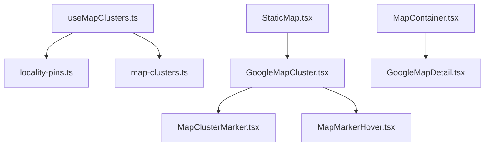
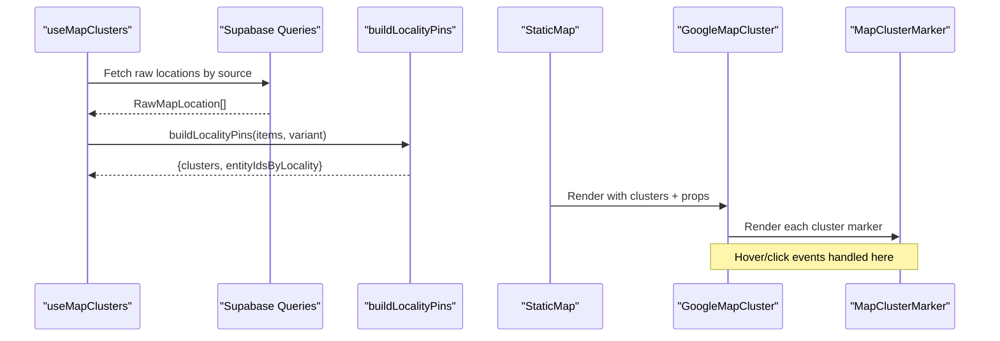
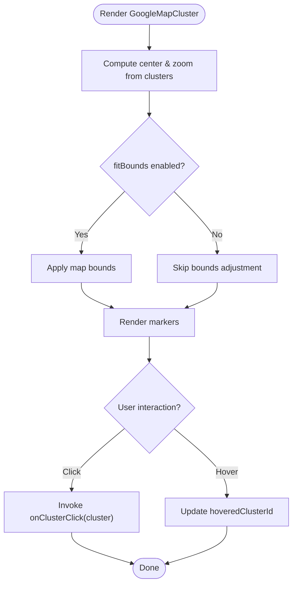
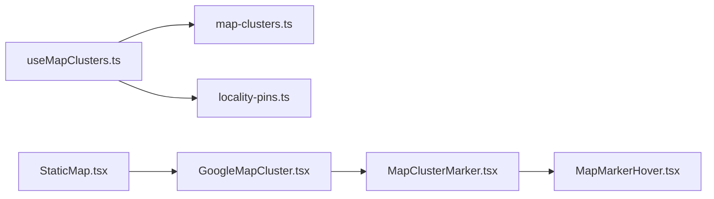

# Location Clustering System

<cite>
**Referenced Files in This Document**
- [GoogleMapCluster.tsx](file://src/components/ui/map/GoogleMapCluster.tsx)
- [useMapClusters.ts](file://src/hooks/useMapClusters.ts)
- [MapClusterMarker.tsx](file://src/components/ui/map/MapClusterMarker.tsx)
- [StaticMap.tsx](file://src/components/ui/map/StaticMap.tsx)
- [MapContainer.tsx](file://src/components/ui/map/MapContainer.tsx)
- [locality-pins.ts](file://src/lib/maps/locality-pins.ts)
- [map-clusters.ts](file://src/lib/supabase/queries/map-clusters.ts)
- [MapMarkerHover.tsx](file://src/components/ui/map/MapMarkerHover.tsx)
</cite>

## Table of Contents
1. [Introduction](#introduction)
2. [Project Structure](#project-structure)
3. [Core Components](#core-components)
4. [Architecture Overview](#architecture-overview)
5. [Detailed Component Analysis](#detailed-component-analysis)
6. [Dependency Analysis](#dependency-analysis)
7. [Performance Considerations](#performance-considerations)
8. [Troubleshooting Guide](#troubleshooting-guide)
9. [Conclusion](#conclusion)
10. [Appendices](#appendices)

## Introduction
This document explains the location clustering system used to optimize performance when displaying large datasets of map markers. It covers the GoogleMapCluster component, the data preparation and grouping logic that forms clusters, the useMapClusters hook for fetching and caching cluster data, marker customization, click handling, hover behavior, and dynamic view management based on dataset size. It also provides guidance on configuring thresholds, styling markers, handling events, and optimizing performance for map-heavy applications.

## Project Structure
The clustering system is implemented across UI components, hooks, and library utilities:
- UI layer renders clustered markers and manages interaction (hover, click, zoom controls).
- The hook fetches raw locations and transforms them into clusters.
- Library functions group locations by locality and compute cluster positions.

**Diagram sources**
- [useMapClusters.ts:1-61](file://src/hooks/useMapClusters.ts#L1-L61)
- [locality-pins.ts:1-78](file://src/lib/maps/locality-pins.ts#L1-L78)
- [map-clusters.ts:1-96](file://src/lib/supabase/queries/map-clusters.ts#L1-L96)
- [StaticMap.tsx:1-103](file://src/components/ui/map/StaticMap.tsx#L1-L103)
- [GoogleMapCluster.tsx:1-181](file://src/components/ui/map/GoogleMapCluster.tsx#L1-L181)
- [MapClusterMarker.tsx:1-115](file://src/components/ui/map/MapClusterMarker.tsx#L1-L115)
- [MapMarkerHover.tsx:1-78](file://src/components/ui/map/MapMarkerHover.tsx#L1-L78)
- [MapContainer.tsx:1-99](file://src/components/ui/map/MapContainer.tsx#L1-L99)

**Section sources**
- [useMapClusters.ts:1-61](file://src/hooks/useMapClusters.ts#L1-L61)
- [StaticMap.tsx:1-103](file://src/components/ui/map/StaticMap.tsx#L1-L103)
- [GoogleMapCluster.tsx:1-181](file://src/components/ui/map/GoogleMapCluster.tsx#L1-L181)

## Core Components
- GoogleMapCluster: Renders a Google Map with clustered markers, computes initial view, fits bounds, and wires hover/click interactions.
- StaticMap: Lazy-loads the interactive map only when visible and manages hover state for markers.
- MapClusterMarker: Custom marker UI with hover popups and variant-based styling.
- useMapClusters: Fetches raw locations from Supabase per source, groups them into clusters, and caches results.
- locality-pins: Groups raw locations by region/country and computes centroid coordinates for each cluster.
- map-clusters: Data accessors for collections, content, itineraries, and dashboard views.

Key responsibilities:
- Data preparation: transform raw locations into clusters with counts, labels, and centroids.
- Rendering: render markers efficiently using AdvancedMarker and manage map viewport.
- Interaction: handle clicks to expand or navigate, hover to show details or compact info.

**Section sources**
- [GoogleMapCluster.tsx:13-135](file://src/components/ui/map/GoogleMapCluster.tsx#L13-L135)
- [StaticMap.tsx:9-99](file://src/components/ui/map/StaticMap.tsx#L9-L99)
- [MapClusterMarker.tsx:8-115](file://src/components/ui/map/MapClusterMarker.tsx#L8-L115)
- [useMapClusters.ts:16-61](file://src/hooks/useMapClusters.ts#L16-L61)
- [locality-pins.ts:4-78](file://src/lib/maps/locality-pins.ts#L4-L78)
- [map-clusters.ts:19-96](file://src/lib/supabase/queries/map-clusters.ts#L19-L96)

## Architecture Overview
The system separates concerns between data retrieval, transformation, and rendering:
- useMapClusters queries Supabase via map-clusters functions and builds clusters using locality-pins.
- StaticMap lazily loads GoogleMapCluster and tracks visibility to defer heavy work.
- GoogleMapCluster renders markers and manages map bounds and interactions.
- MapClusterMarker and MapMarkerHover provide consistent UI for cluster markers and hover states.

**Diagram sources**
- [useMapClusters.ts:35-61](file://src/hooks/useMapClusters.ts#L35-L61)
- [map-clusters.ts:19-96](file://src/lib/supabase/queries/map-clusters.ts#L19-L96)
- [locality-pins.ts:28-78](file://src/lib/maps/locality-pins.ts#L28-L78)
- [StaticMap.tsx:39-99](file://src/components/ui/map/StaticMap.tsx#L39-L99)
- [GoogleMapCluster.tsx:80-135](file://src/components/ui/map/GoogleMapCluster.tsx#L80-L135)
- [MapClusterMarker.tsx:51-115](file://src/components/ui/map/MapClusterMarker.tsx#L51-L115)

## Detailed Component Analysis

### GoogleMapCluster
Responsibilities:
- Wraps the map with API provider and theme-aware map IDs.
- Computes initial center and zoom based on cluster spread.
- Fits map bounds to include all clusters unless disabled.
- Renders AdvancedMarker for each cluster and passes props to MapClusterMarker.
- Provides optional zoom controls and hover tracking.

Key behaviors:
- calculateMapView determines center and zoom based on geographic spread.
- MapBoundsController uses fitBounds to ensure all clusters are visible.
- Interactive mode enables gesture handling and detail hover; otherwise compact hover.

Configuration options:
- clusters: array of cluster data
- center/zoom: override auto-calculated view
- onClusterClick: handler invoked when a cluster is clicked
- interactive: enable gestures and detail hover
- fitBounds: automatically adjust viewport to show all clusters
- renderDetailContent: custom detail UI for hover
- showZoomControls: toggle zoom buttons
- hoveredClusterId/onHoverChange: coordinate hover state

**Diagram sources**
- [GoogleMapCluster.tsx:13-67](file://src/components/ui/map/GoogleMapCluster.tsx#L13-L67)
- [GoogleMapCluster.tsx:80-135](file://src/components/ui/map/GoogleMapCluster.tsx#L80-L135)

**Section sources**
- [GoogleMapCluster.tsx:13-135](file://src/components/ui/map/GoogleMapCluster.tsx#L13-L135)

### useMapClusters
Responsibilities:
- Selects query function based on source (dashboard, collections, content, itineraries).
- Fetches raw locations from Supabase.
- Builds clusters using buildLocalityPins with a variant tied to the source.
- Caches results with React Query and returns clusters plus mapping of entity IDs by locality.

Data flow:
- Enabled only when userId is present.
- Stale time set to reduce frequent refetches.
- Placeholder data prevents layout shifts during loading.

Usage pattern:
- Pass userId and source to get clusters and metadata for filtering or further processing.

**Section sources**
- [useMapClusters.ts:16-61](file://src/hooks/useMapClusters.ts#L16-L61)

### StaticMap
Responsibilities:
- Lazily loads GoogleMapCluster when the container enters the viewport.
- Tracks map load events for analytics.
- Manages hover state for markers and passes it down.

Props:
- clusters, center, zoom, height, className
- onClusterClick, interactive, fitBounds
- renderDetailContent, showZoomControls

Behavior:
- Uses intersection observer to defer rendering until visible.
- Delegates to DynamicGoogleMapCluster to avoid SSR issues.

**Section sources**
- [StaticMap.tsx:9-99](file://src/components/ui/map/StaticMap.tsx#L9-L99)

### MapClusterMarker
Responsibilities:
- Renders a stylized marker icon with count and label.
- Supports compact and detail hover modes.
- Applies variants and sizes via class-variance-authority.

Customization:
- variant: "by Country", "by Collection", "by Location"
- size: "Small", "Medium"
- state: "Default", "Hover", "Active"
- hoverMode: "compact" shows badge and label; "detail" shows provided detailContent
- isHovered: toggles emphasis and popup visibility

**Section sources**
- [MapClusterMarker.tsx:8-115](file://src/components/ui/map/MapClusterMarker.tsx#L8-L115)

### MapMarkerHover
Responsibilities:
- Displays count badge and label text above the marker.
- Styles vary by variant and size.

Usage:
- Used within MapClusterMarker for compact hover mode.

**Section sources**
- [MapMarkerHover.tsx:7-78](file://src/components/ui/map/MapMarkerHover.tsx#L7-L78)

### locality-pins
Responsibilities:
- Groups raw locations by "{region}, {country}" or country-only if region is missing.
- Computes centroid latitude/longitude for each group.
- Returns clusters and a mapping of locality keys to entity IDs.

Algorithm complexity:
- Single pass over items to group and aggregate: O(n) time, O(k) space where k is number of unique localities.

Notes:
- This is presentation-level grouping, not geographic clustering algorithm.
- Distinct from planner’s k-means clustering for day assignment.

**Section sources**
- [locality-pins.ts:4-78](file://src/lib/maps/locality-pins.ts#L4-L78)

### map-clusters
Responsibilities:
- Provides functions to fetch raw locations for different sources:
  - Collections
  - Content
  - Itineraries
  - Dashboard (aggregates multiple sources)
- Normalizes rows to RawMapLocation shape.

Error handling:
- Returns empty arrays on errors or missing data.

**Section sources**
- [map-clusters.ts:1-96](file://src/lib/supabase/queries/map-clusters.ts#L1-L96)

### MapContainer
Responsibilities:
- Lazy-loads GoogleMapDetail for non-clustered maps.
- Tracks map load events and handles intersection observer for deferred rendering.

Note:
- While not part of the clustering pipeline, it demonstrates similar lazy-loading patterns used elsewhere in the app.

**Section sources**
- [MapContainer.tsx:1-99](file://src/components/ui/map/MapContainer.tsx#L1-L99)

## Dependency Analysis
High-level dependencies:
- useMapClusters depends on map-clusters and locality-pins.
- StaticMap depends on GoogleMapCluster and manages hover state.
- GoogleMapCluster depends on MapClusterMarker and MapMarkerHover for rendering.
- All components rely on environment variables for Google Maps configuration.

**Diagram sources**
- [useMapClusters.ts:1-61](file://src/hooks/useMapClusters.ts#L1-L61)
- [map-clusters.ts:1-96](file://src/lib/supabase/queries/map-clusters.ts#L1-L96)
- [locality-pins.ts:1-78](file://src/lib/maps/locality-pins.ts#L1-L78)
- [StaticMap.tsx:1-103](file://src/components/ui/map/StaticMap.tsx#L1-L103)
- [GoogleMapCluster.tsx:1-181](file://src/components/ui/map/GoogleMapCluster.tsx#L1-L181)
- [MapClusterMarker.tsx:1-115](file://src/components/ui/map/MapClusterMarker.tsx#L1-L115)
- [MapMarkerHover.tsx:1-78](file://src/components/ui/map/MapMarkerHover.tsx#L1-L78)

**Section sources**
- [useMapClusters.ts:1-61](file://src/hooks/useMapClusters.ts#L1-L61)
- [StaticMap.tsx:1-103](file://src/components/ui/map/StaticMap.tsx#L1-L103)
- [GoogleMapCluster.tsx:1-181](file://src/components/ui/map/GoogleMapCluster.tsx#L1-L181)

## Performance Considerations
- Lazy rendering: StaticMap defers loading GoogleMapCluster until the container is visible, reducing initial bundle and runtime cost.
- View computation: calculateMapView avoids unnecessary re-renders by computing center and zoom once per clusters change.
- Bounds fitting: fitBounds ensures efficient viewport setup without manual calculations in consumers.
- Caching: useMapClusters uses React Query with staleTime to minimize network requests and improve responsiveness.
- Marker rendering: Using AdvancedMarker with minimal DOM overhead and controlled hover state reduces reflows.
- Intersection observation: Both StaticMap and MapContainer track visibility to avoid expensive operations off-screen.

Best practices:
- Keep clusters small and stable; avoid frequent mutations that trigger full re-renders.
- Use fitBounds judiciously; disable for very large datasets if you prefer programmatic control.
- Prefer compact hover mode for dense datasets; switch to detail mode only when necessary.
- Ensure environment variables for Google Maps are configured to prevent runtime errors.

[No sources needed since this section provides general guidance]

## Troubleshooting Guide
Common issues and resolutions:
- Map does not appear: Verify NEXT_PUBLIC_GOOGLE_MAPS_API_KEY and map IDs are set correctly. Check that the container has a defined height.
- No clusters shown: Ensure userId is provided to useMapClusters and that data exists for the selected source. Confirm that raw locations have valid latitude/longitude and country values.
- Incorrect initial view: Adjust calculateMapView thresholds or override center/zoom props. Disable fitBounds if automatic bounds cause unexpected zoom levels.
- Hover not working: Ensure interactive is true for detail hover; verify hoveredClusterId and onHoverChange are wired correctly in parent components.
- Click handlers not firing: Confirm onClusterClick is passed to GoogleMapCluster and that markers receive the event.

**Section sources**
- [GoogleMapCluster.tsx:9-12](file://src/components/ui/map/GoogleMapCluster.tsx#L9-L12)
- [GoogleMapCluster.tsx:80-135](file://src/components/ui/map/GoogleMapCluster.tsx#L80-L135)
- [useMapClusters.ts:35-61](file://src/hooks/useMapClusters.ts#L35-L61)
- [locality-pins.ts:28-78](file://src/lib/maps/locality-pins.ts#L28-L78)

## Conclusion
The location clustering system efficiently displays large datasets by grouping locations into meaningful clusters, computing optimal views, and rendering lightweight markers with customizable hover and click behaviors. The separation of data fetching, transformation, and rendering promotes maintainability and performance. By leveraging lazy loading, caching, and controlled interactions, the system scales well for map-heavy applications.

[No sources needed since this section summarizes without analyzing specific files]

## Appendices

### Configuration Examples
- Cluster thresholds: Adjust calculateMapView thresholds to tune zoom levels based on geographic spread.
- Styling cluster markers: Use variant, size, and state props on MapClusterMarker to match design tokens.
- Handling cluster events: Implement onClusterClick to navigate or expand cluster details; use renderDetailContent for rich hover panels.

[No sources needed since this section provides general guidance]