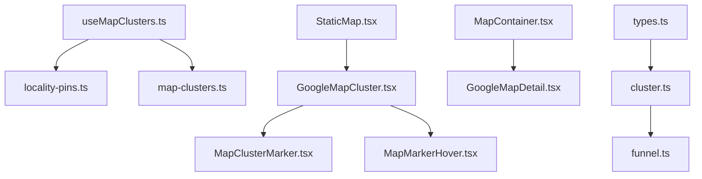
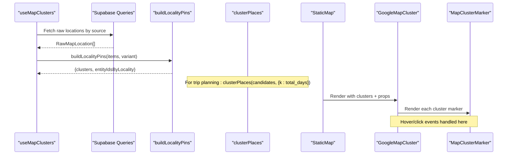
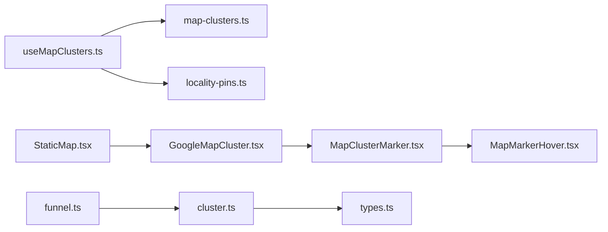

# Location Clustering System

<cite>
**Referenced Files in This Document**
- [GoogleMapCluster.tsx](file://src/components/ui/map/GoogleMapCluster.tsx)
- [useMapClusters.ts](file://src/hooks/useMapClusters.ts)
- [MapClusterMarker.tsx](file://src/components/ui/map/MapClusterMarker.tsx)
- [StaticMap.tsx](file://src/components/ui/map/StaticMap.tsx)
- [MapContainer.tsx](file://src/components/ui/map/MapContainer.tsx)
- [locality-pins.ts](file://src/lib/maps/locality-pins.ts)
- [map-clusters.ts](file://src/lib/supabase/queries/map-clusters.ts)
- [cluster.ts](file://src/lib/planner/cluster.ts)
- [types.ts](file://src/lib/planner/types.ts)
- [funnel.ts](file://src/lib/planner/funnel.ts)
- [MapMarkerHover.tsx](file://src/components/ui/map/MapMarkerHover.tsx)
</cite>

## Update Summary
**Changes Made**
- Updated Geographic Clustering section to document k-means++ algorithm implementation
- Added new Planner Clustering section for trip day-based clustering
- Enhanced Edge Cases Handling section with comprehensive coverage of unlocated places, duplicate coordinates, and empty cluster reseeding
- Updated Configuration section to reflect trip total days configuration
- Added detailed algorithm complexity and performance analysis
- Enhanced troubleshooting guide with clustering-specific issues

## Table of Contents
1. [Introduction](#introduction)
2. [Project Structure](#project-structure)
3. [Core Components](#core-components)
4. [Architecture Overview](#architecture-overview)
5. [Geographic Clustering Algorithm](#geographic-clustering-algorithm)
6. [Planner Clustering for Trip Days](#planner-clustering-for-trip-days)
7. [Edge Cases and Robustness](#edge-cases-and-robustness)
8. [Detailed Component Analysis](#detailed-component-analysis)
9. [Dependency Analysis](#dependency-analysis)
10. [Performance Considerations](#performance-considerations)
11. [Troubleshooting Guide](#troubleshooting-guide)
12. [Conclusion](#conclusion)
13. [Appendices](#appendices)

## Introduction
This document explains the location clustering system used to optimize performance when displaying large datasets of map markers and plan trips across multiple days. The system implements two distinct clustering approaches: a presentation-level grouping for static maps using locality-based aggregation, and a sophisticated k-means++ algorithm for planning trips across multiple days. It covers the GoogleMapCluster component, data preparation and grouping logic, the useMapClusters hook for fetching and caching cluster data, marker customization, click handling, hover behavior, and dynamic view management based on dataset size.

## Project Structure
The clustering system is implemented across UI components, hooks, planner algorithms, and library utilities:
- UI layer renders clustered markers and manages interaction (hover, click, zoom controls).
- The hook fetches raw locations and transforms them into clusters for display.
- Planner algorithms implement k-means++ clustering for trip day assignment.
- Library functions group locations by locality and compute cluster positions.

**Diagram sources**
- [useMapClusters.ts:1-61](file://src/hooks/useMapClusters.ts#L1-L61)
- [locality-pins.ts:1-78](file://src/lib/maps/locality-pins.ts#L1-L78)
- [map-clusters.ts:1-96](file://src/lib/supabase/queries/map-clusters.ts#L1-L96)
- [StaticMap.tsx:1-103](file://src/components/ui/map/StaticMap.tsx#L1-L103)
- [GoogleMapCluster.tsx:1-181](file://src/components/ui/map/GoogleMapCluster.tsx#L1-L181)
- [MapClusterMarker.tsx:1-115](file://src/components/ui/map/MapClusterMarker.tsx#L1-L115)
- [MapMarkerHover.tsx:1-78](file://src/components/ui/map/MapMarkerHover.tsx#L1-L78)
- [MapContainer.tsx:1-99](file://src/components/ui/map/MapContainer.tsx#L1-L99)
- [cluster.ts:1-166](file://src/lib/planner/cluster.ts#L1-L166)
- [funnel.ts:1-448](file://src/lib/planner/funnel.ts#L1-L448)
- [types.ts:1-93](file://src/lib/planner/types.ts#L1-L93)

**Section sources**
- [useMapClusters.ts:1-61](file://src/hooks/useMapClusters.ts#L1-L61)
- [StaticMap.tsx:1-103](file://src/components/ui/map/StaticMap.tsx#L1-L103)
- [GoogleMapCluster.tsx:1-181](file://src/components/ui/map/GoogleMapCluster.tsx#L1-L181)

## Core Components
- GoogleMapCluster: Renders a Google Map with clustered markers, computes initial view, fits bounds, and wires hover/click interactions.
- StaticMap: Lazy-loads the interactive map only when visible and manages hover state for markers.
- MapClusterMarker: Custom marker UI with hover popups and variant-based styling.
- useMapClusters: Fetches raw locations from Supabase per source, groups them into clusters, and caches results.
- locality-pins: Groups raw locations by region/country and computes centroid coordinates for each cluster.
- cluster: Implements k-means++ algorithm for geographic clustering with trip day configuration.
- funnel: Processes clustered candidates through filtering and scoring stages.

Key responsibilities:
- Data preparation: transform raw locations into clusters with counts, labels, and centroids.
- Rendering: render markers efficiently using AdvancedMarker and manage map viewport.
- Interaction: handle clicks to expand or navigate, hover to show details or compact info.
- Planning: cluster locations geographically for multi-day trip planning.

**Section sources**
- [GoogleMapCluster.tsx:13-135](file://src/components/ui/map/GoogleMapCluster.tsx#L13-L135)
- [StaticMap.tsx:9-99](file://src/components/ui/map/StaticMap.tsx#L9-L99)
- [MapClusterMarker.tsx:8-115](file://src/components/ui/map/MapClusterMarker.tsx#L8-L115)
- [useMapClusters.ts:16-61](file://src/hooks/useMapClusters.ts#L16-L61)
- [locality-pins.ts:4-78](file://src/lib/maps/locality-pins.ts#L4-L78)
- [cluster.ts:1-166](file://src/lib/planner/cluster.ts#L1-L166)
- [funnel.ts:1-448](file://src/lib/planner/funnel.ts#L1-L448)

## Architecture Overview
The system separates concerns between data retrieval, transformation, rendering, and planning:
- useMapClusters queries Supabase via map-clusters functions and builds clusters using locality-pins for display.
- StaticMap lazily loads GoogleMapCluster and tracks visibility to defer heavy work.
- GoogleMapCluster renders markers and manages map bounds and interactions.
- cluster.ts implements k-means++ algorithm for trip day-based geographic clustering.
- funnel processes clustered candidates through filtering and scoring stages.
- MapClusterMarker and MapMarkerHover provide consistent UI for cluster markers and hover states.

**Diagram sources**
- [useMapClusters.ts:35-61](file://src/hooks/useMapClusters.ts#L35-L61)
- [map-clusters.ts:19-96](file://src/lib/supabase/queries/map-clusters.ts#L19-L96)
- [locality-pins.ts:28-78](file://src/lib/maps/locality-pins.ts#L28-L78)
- [StaticMap.tsx:39-99](file://src/components/ui/map/StaticMap.tsx#L39-L99)
- [GoogleMapCluster.tsx:80-135](file://src/components/ui/map/GoogleMapCluster.tsx#L80-L135)
- [MapClusterMarker.tsx:51-115](file://src/components/ui/map/MapClusterMarker.tsx#L51-L115)
- [cluster.ts:84-166](file://src/lib/planner/cluster.ts#L84-L166)

## Geographic Clustering Algorithm

**Updated** The system now implements a sophisticated k-means++ algorithm for geographic clustering that handles edge cases robustly and is configured based on trip duration.

### K-Means++ Implementation
The `clusterPlaces` function implements k-means++ seeding with the following key features:

- **Deterministic Randomness**: Uses an injected `rng` parameter instead of ambient `Math.random()` for reproducible results
- **Smart Seeding**: First centroid chosen uniformly, subsequent centroids sampled proportionally to squared distance from nearest chosen centroid
- **Trip Day Configuration**: `k` parameter equals the trip's total days, ensuring one coherent neighborhood per day
- **Convergence Detection**: Stops early when assignments stabilize, respecting `maxIterations` limit

### Algorithm Complexity
- **Time Complexity**: O(n × k × i) where n = number of located places, k = target clusters, i = iterations
- **Space Complexity**: O(n + k) for point storage and centroid tracking
- **Optimization**: Early convergence detection prevents unnecessary iterations

### Key Features
- **Coordinate Filtering**: Places without valid coordinates are excluded to prevent phantom locations at (0, 0)
- **Duplicate Handling**: Handles duplicate coordinates gracefully during centroid selection
- **Empty Cluster Prevention**: Reseeding mechanism ensures no cluster remains empty
- **Clamping**: Effective k is clamped between 1 and number of located candidates

**Section sources**
- [cluster.ts:44-76](file://src/lib/planner/cluster.ts#L44-L76)
- [cluster.ts:84-166](file://src/lib/planner/cluster.ts#L84-L166)

## Planner Clustering for Trip Days

**New Section** The planner uses geographic clustering to organize activities into coherent neighborhoods for each day of a trip.

### Configuration and Usage
- **Input**: Candidate places with coordinates and metadata
- **Output**: PlaceCluster objects containing centroid, member places, and optional labels
- **Configuration**: `k` parameter set to trip's total days for balanced distribution
- **Integration**: Results feed into the funnel for further processing and scheduling

### Processing Pipeline
1. **Filtering**: Remove places without valid coordinates
2. **Clustering**: Apply k-means++ with trip day count as target
3. **Centroid Calculation**: Compute mean coordinates for each cluster
4. **Materialization**: Convert final assignments to PlaceCluster format

### Integration with Funnel
The clustered results are processed through the funnel which:
- Applies hard filters (closed venues, budget constraints)
- Scores places based on user preferences
- Caps per-cluster and global candidate counts
- Maintains cluster membership for Pass B scheduling

**Section sources**
- [cluster.ts:1-166](file://src/lib/planner/cluster.ts#L1-L166)
- [funnel.ts:179-312](file://src/lib/planner/funnel.ts#L179-L312)
- [types.ts:25-32](file://src/lib/planner/types.ts#L25-L32)

## Edge Cases and Robustness

**Updated** The clustering system includes comprehensive handling of various edge cases to ensure reliability.

### Unlocated Places
- **Detection**: Places without latitude/longitude are filtered out before clustering
- **Prevention**: Never creates phantom locations at (0, 0) coordinates
- **Logging**: Unlocated places are tracked separately for debugging and reporting

### Duplicate Coordinates
- **Handling**: When all remaining points coincide with existing centroids, selects first available unchosen point
- **Impact**: Prevents infinite loops and ensures progress in centroid selection
- **Testing**: Verified through deterministic tests with fixed random seeds

### Empty Cluster Prevention
- **Reseeding Mechanism**: When a centroid becomes empty, it's reseeded to the point farthest from its assigned centroid
- **Guarantee**: No cluster remains empty after clustering completes
- **Fallback**: If maxIterations is too low, empty clusters may be dropped in final materialization

### Boundary Conditions
- **Single Point**: Returns single cluster containing all points when k=1
- **More Clusters Than Points**: Degrades gracefully to one cluster per point
- **Empty Input**: Returns empty array without throwing errors
- **Low Iterations**: Still assigns every place even with minimal iterations

**Section sources**
- [cluster.ts:57-63](file://src/lib/planner/cluster.ts#L57-L63)
- [cluster.ts:122-139](file://src/lib/planner/cluster.ts#L122-L139)
- [cluster.test.ts:74-135](file://src/lib/planner/cluster.test.ts#L74-L135)

## Detailed Component Analysis

### GoogleMapCluster
Responsibilities:
- Wraps the map with API provider and theme-aware map IDs.
- Computes initial center and zoom based on cluster spread.
- Fits map bounds to include all clusters unless disabled.
- Renders AdvancedMarker for each cluster and passes props to MapClusterMarker.
- Provides optional zoom controls and hover tracking.

Key behaviors:
- calculateMapView determines center and zoom based on geographic spread.
- MapBoundsController uses fitBounds to ensure all clusters are visible.
- Interactive mode enables gesture handling and detail hover; otherwise compact hover.

Configuration options:
- clusters: array of cluster data
- center/zoom: override auto-calculated view
- onClusterClick: handler invoked when a cluster is clicked
- interactive: enable gestures and detail hover
- fitBounds: automatically adjust viewport to show all clusters
- renderDetailContent: custom detail UI for hover
- showZoomControls: toggle zoom buttons
- hoveredClusterId/onHoverChange: coordinate hover state

**Diagram sources**
- [GoogleMapCluster.tsx:13-67](file://src/components/ui/map/GoogleMapCluster.tsx#L13-L67)
- [GoogleMapCluster.tsx:80-135](file://src/components/ui/map/GoogleMapCluster.tsx#L80-L135)

**Section sources**
- [GoogleMapCluster.tsx:13-135](file://src/components/ui/map/GoogleMapCluster.tsx#L13-L135)

### useMapClusters
Responsibilities:
- Selects query function based on source (dashboard, collections, content, itineraries).
- Fetches raw locations from Supabase.
- Builds clusters using buildLocalityPins with a variant tied to the source.
- Caches results with React Query and returns clusters plus mapping of entity IDs by locality.

Data flow:
- Enabled only when userId is present.
- Stale time set to reduce frequent refetches.
- Placeholder data prevents layout shifts during loading.

Usage pattern:
- Pass userId and source to get clusters and metadata for filtering or further processing.

**Section sources**
- [useMapClusters.ts:16-61](file://src/hooks/useMapClusters.ts#L16-L61)

### StaticMap
Responsibilities:
- Lazily loads GoogleMapCluster when the container enters the viewport.
- Tracks map load events for analytics.
- Manages hover state for markers and passes it down.

Props:
- clusters, center, zoom, height, className
- onClusterClick, interactive, fitBounds
- renderDetailContent, showZoomControls

Behavior:
- Uses intersection observer to defer rendering until visible.
- Delegates to DynamicGoogleMapCluster to avoid SSR issues.

**Section sources**
- [StaticMap.tsx:9-99](file://src/components/ui/map/StaticMap.tsx#L9-L99)

### MapClusterMarker
Responsibilities:
- Renders a stylized marker icon with count and label.
- Supports compact and detail hover modes.
- Applies variants and sizes via class-variance-authority.

Customization:
- variant: "by Country", "by Collection", "by Location"
- size: "Small", "Medium"
- state: "Default", "Hover", "Active"
- hoverMode: "compact" shows badge and label; "detail" shows provided detailContent
- isHovered: toggles emphasis and popup visibility

**Section sources**
- [MapClusterMarker.tsx:8-115](file://src/components/ui/map/MapClusterMarker.tsx#L8-L115)

### MapMarkerHover
Responsibilities:
- Displays count badge and label text above the marker.
- Styles vary by variant and size.

Usage:
- Used within MapClusterMarker for compact hover mode.

**Section sources**
- [MapMarkerHover.tsx:7-78](file://src/components/ui/map/MapMarkerHover.tsx#L7-L78)

### locality-pins
Responsibilities:
- Groups raw locations by "{region}, {country}" or country-only if region is missing.
- Computes centroid latitude/longitude for each group.
- Returns clusters and a mapping of locality keys to entity IDs.

Algorithm complexity:
- Single pass over items to group and aggregate: O(n) time, O(k) space where k is number of unique localities.

Notes:
- This is presentation-level grouping, not geographic clustering algorithm.
- Distinct from planner's k-means clustering for day assignment.

**Section sources**
- [locality-pins.ts:4-78](file://src/lib/maps/locality-pins.ts#L4-L78)

### map-clusters
Responsibilities:
- Provides functions to fetch raw locations for different sources:
  - Collections
  - Content
  - Itineraries
  - Dashboard (aggregates multiple sources)
- Normalizes rows to RawMapLocation shape.

Error handling:
- Returns empty arrays on errors or missing data.

**Section sources**
- [map-clusters.ts:1-96](file://src/lib/supabase/queries/map-clusters.ts#L1-L96)

### MapContainer
Responsibilities:
- Lazy-loads GoogleMapDetail for non-clustered maps.
- Tracks map load events and handles intersection observer for deferred rendering.

Note:
- While not part of the clustering pipeline, it demonstrates similar lazy-loading patterns used elsewhere in the app.

**Section sources**
- [MapContainer.tsx:1-99](file://src/components/ui/map/MapContainer.tsx#L1-L99)

## Dependency Analysis
High-level dependencies:
- useMapClusters depends on map-clusters and locality-pins.
- StaticMap depends on GoogleMapCluster and manages hover state.
- GoogleMapCluster depends on MapClusterMarker and MapMarkerHover for rendering.
- cluster.ts depends on types.ts for shared interfaces.
- funnel.ts depends on cluster.ts for processing clustered candidates.
- All components rely on environment variables for Google Maps configuration.

**Diagram sources**
- [useMapClusters.ts:1-61](file://src/hooks/useMapClusters.ts#L1-L61)
- [map-clusters.ts:1-96](file://src/lib/supabase/queries/map-clusters.ts#L1-L96)
- [locality-pins.ts:1-78](file://src/lib/maps/locality-pins.ts#L1-L78)
- [StaticMap.tsx:1-103](file://src/components/ui/map/StaticMap.tsx#L1-L103)
- [GoogleMapCluster.tsx:1-181](file://src/components/ui/map/GoogleMapCluster.tsx#L1-L181)
- [MapClusterMarker.tsx:1-115](file://src/components/ui/map/MapClusterMarker.tsx#L1-L115)
- [MapMarkerHover.tsx:1-78](file://src/components/ui/map/MapMarkerHover.tsx#L1-L78)
- [cluster.ts:1-166](file://src/lib/planner/cluster.ts#L1-L166)
- [types.ts:1-93](file://src/lib/planner/types.ts#L1-L93)
- [funnel.ts:1-448](file://src/lib/planner/funnel.ts#L1-L448)

**Section sources**
- [useMapClusters.ts:1-61](file://src/hooks/useMapClusters.ts#L1-L61)
- [StaticMap.tsx:1-103](file://src/components/ui/map/StaticMap.tsx#L1-L103)
- [GoogleMapCluster.tsx:1-181](file://src/components/ui/map/GoogleMapCluster.tsx#L1-L181)

## Performance Considerations
- **Lazy rendering**: StaticMap defers loading GoogleMapCluster until the container is visible, reducing initial bundle and runtime cost.
- **View computation**: calculateMapView avoids unnecessary re-renders by computing center and zoom once per clusters change.
- **Bounds fitting**: fitBounds ensures efficient viewport setup without manual calculations in consumers.
- **Caching**: useMapClusters uses React Query with staleTime to minimize network requests and improve responsiveness.
- **Marker rendering**: Using AdvancedMarker with minimal DOM overhead and controlled hover state reduces reflows.
- **Intersection observation**: Both StaticMap and MapContainer track visibility to avoid expensive operations off-screen.
- **Algorithm efficiency**: k-means++ clustering uses early convergence detection and optimized distance calculations.
- **Memory management**: Efficient data structures (Maps, Sets) minimize memory usage during clustering operations.

Best practices:
- Keep clusters small and stable; avoid frequent mutations that trigger full re-renders.
- Use fitBounds judiciously; disable for very large datasets if you prefer programmatic control.
- Prefer compact hover mode for dense datasets; switch to detail mode only when necessary.
- Ensure environment variables for Google Maps are configured to prevent runtime errors.
- Configure appropriate maxIterations for clustering to balance quality and performance.
- Use deterministic random seeds for testing and debugging clustering behavior.

## Troubleshooting Guide
Common issues and resolutions:
- **Map does not appear**: Verify NEXT_PUBLIC_GOOGLE_MAPS_API_KEY and map IDs are set correctly. Check that the container has a defined height.
- **No clusters shown**: Ensure userId is provided to useMapClusters and that data exists for the selected source. Confirm that raw locations have valid latitude/longitude and country values.
- **Incorrect initial view**: Adjust calculateMapView thresholds or override center/zoom props. Disable fitBounds if automatic bounds cause unexpected zoom levels.
- **Hover not working**: Ensure interactive is true for detail hover; verify hoveredClusterId and onHoverChange are wired correctly in parent components.
- **Click handlers not firing**: Confirm onClusterClick is passed to GoogleMapCluster and that markers receive the event.
- **Clustering performance issues**: Reduce maxIterations for faster but less accurate clustering; consider pre-filtering candidate places.
- **Unstable clustering results**: Use deterministic random seeds for testing; verify rng injection is working correctly.
- **Empty clusters appearing**: Check that effective k calculation is correct; verify that places have valid coordinates.
- **Trip day clustering problems**: Ensure total_days value is properly passed to clustering function; verify candidate places have sufficient geographic diversity.

**Section sources**
- [GoogleMapCluster.tsx:9-12](file://src/components/ui/map/GoogleMapCluster.tsx#L9-L12)
- [GoogleMapCluster.tsx:80-135](file://src/components/ui/map/GoogleMapCluster.tsx#L80-L135)
- [useMapClusters.ts:35-61](file://src/hooks/useMapClusters.ts#L35-L61)
- [locality-pins.ts:28-78](file://src/lib/maps/locality-pins.ts#L28-L78)
- [cluster.ts:84-166](file://src/lib/planner/cluster.ts#L84-L166)

## Conclusion
The location clustering system efficiently displays large datasets by implementing both presentation-level grouping for static maps and sophisticated k-means++ clustering for trip planning. The system groups locations into meaningful clusters, computes optimal views, and renders lightweight markers with customizable hover and click behaviors. The separation of data fetching, transformation, rendering, and planning promotes maintainability and performance. By leveraging lazy loading, caching, controlled interactions, and robust edge case handling, the system scales well for map-heavy applications and multi-day trip planning scenarios.

## Appendices

### Configuration Examples
- **Cluster thresholds**: Adjust calculateMapView thresholds to tune zoom levels based on geographic spread.
- **Styling cluster markers**: Use variant, size, and state props on MapClusterMarker to match design tokens.
- **Handling cluster events**: Implement onClusterClick to navigate or expand cluster details; use renderDetailContent for rich hover panels.
- **Trip day clustering**: Configure k parameter equal to trip's total days for balanced geographic distribution.
- **Performance tuning**: Set appropriate maxIterations values based on dataset size and required accuracy.

### Algorithm Parameters
- **k-means++ seeding**: Deterministic initialization with proportional distance sampling
- **Convergence criteria**: Early stopping when assignments stabilize
- **Edge case handling**: Comprehensive coverage of unlocated places, duplicates, and empty clusters
- **Memory optimization**: Efficient data structures and early termination strategies

[No sources needed since this section provides general guidance]