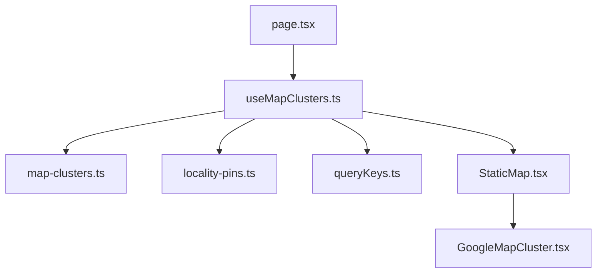
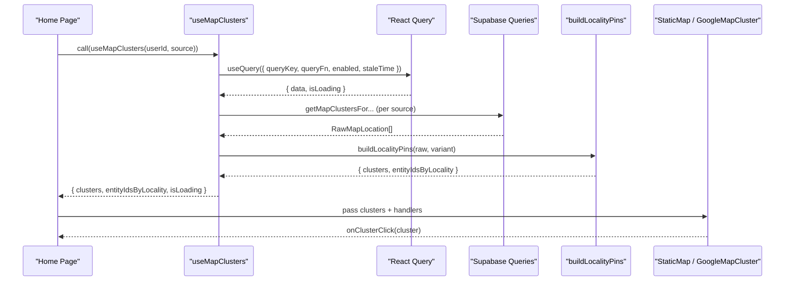
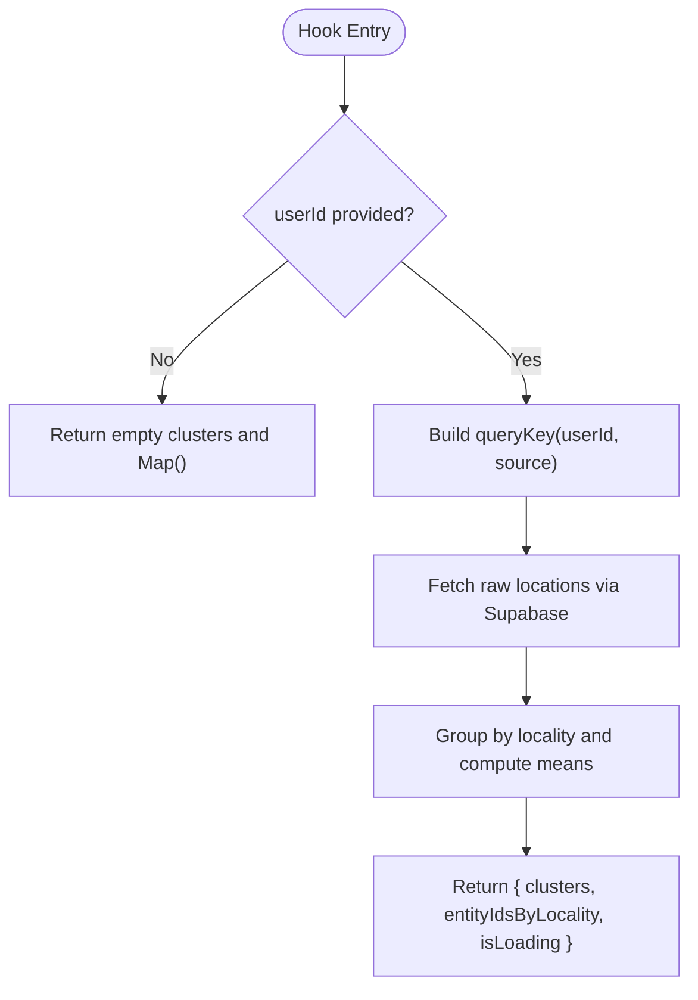
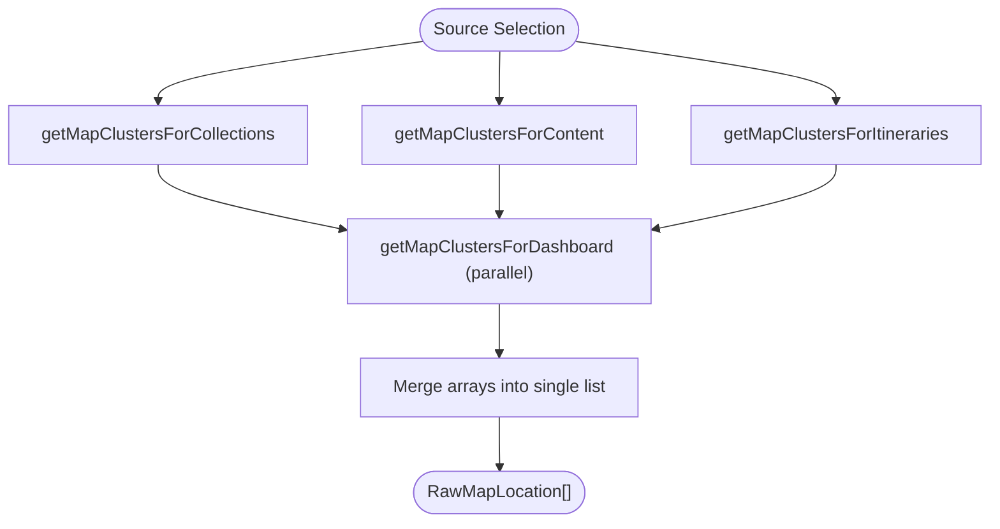
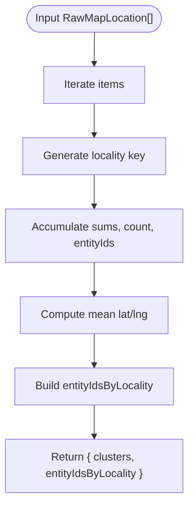
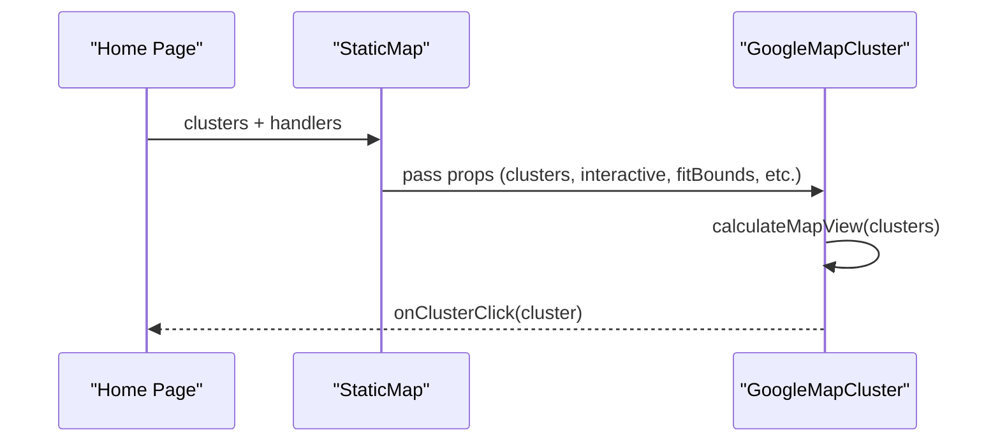
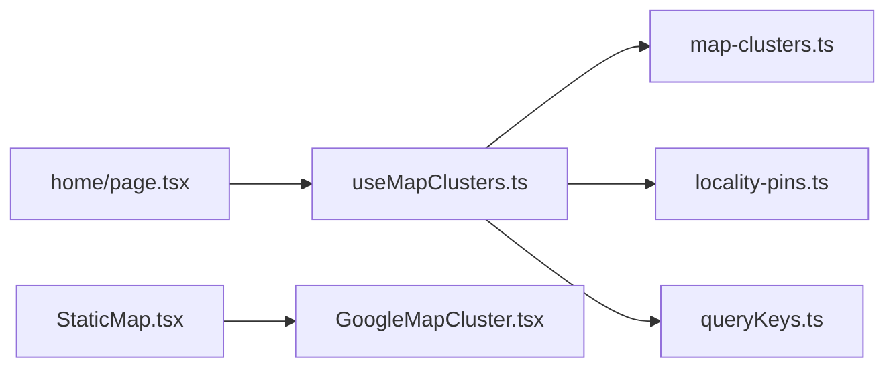

# Map Clusters Hook

<cite>
**Referenced Files in This Document**
- [useMapClusters.ts](file://src/hooks/useMapClusters.ts)
- [map-clusters.ts](file://src/lib/supabase/queries/map-clusters.ts)
- [locality-pins.ts](file://src/lib/maps/locality-pins.ts)
- [StaticMap.tsx](file://src/components/ui/map/StaticMap.tsx)
- [GoogleMapCluster.tsx](file://src/components/ui/map/GoogleMapCluster.tsx)
- [queryKeys.ts](file://src/lib/query/queryKeys.ts)
- [page.tsx](file://src/app/home/page.tsx)
</cite>

## Table of Contents
1. [Introduction](#introduction)
2. [Project Structure](#project-structure)
3. [Core Components](#core-components)
4. [Architecture Overview](#architecture-overview)
5. [Detailed Component Analysis](#detailed-component-analysis)
6. [Dependency Analysis](#dependency-analysis)
7. [Performance Considerations](#performance-considerations)
8. [Troubleshooting Guide](#troubleshooting-guide)
9. [Conclusion](#conclusion)
10. [Appendices](#appendices)

## Introduction
This document provides comprehensive documentation for the useMapClusters hook, which fetches and prepares location-based map clusters for different data sources (dashboard, collections, content, itineraries). It explains the hook’s API, parameters, return values, data processing pipeline, integration with map components, error handling, loading states, and performance strategies for large datasets and real-time updates.

## Project Structure
The clustering feature spans several modules:
- Hook layer: useMapClusters orchestrates data fetching and transformation.
- Data layer: Supabase queries retrieve raw locations per source.
- Transformation layer: locality-pins groups entities into “locality pins” by region/country and computes cluster metadata.
- UI layer: StaticMap and GoogleMapCluster render clusters on a map and handle interactions.
- Query keys: Centralized query key generation for caching and invalidation.

**Diagram sources**
- [useMapClusters.ts:35-59](file://src/hooks/useMapClusters.ts#L35-L59)
- [map-clusters.ts:19-95](file://src/lib/supabase/queries/map-clusters.ts#L19-L95)
- [locality-pins.ts:28-77](file://src/lib/maps/locality-pins.ts#L28-L77)
- [queryKeys.ts:13](file://src/lib/query/queryKeys.ts#L13)
- [StaticMap.tsx:21-32](file://src/components/ui/map/StaticMap.tsx#L21-L32)
- [GoogleMapCluster.tsx:69-136](file://src/components/ui/map/GoogleMapCluster.tsx#L69-L136)
- [page.tsx:294-303](file://src/app/home/page.tsx#L294-L303)

**Section sources**
- [useMapClusters.ts:35-59](file://src/hooks/useMapClusters.ts#L35-L59)
- [map-clusters.ts:19-95](file://src/lib/supabase/queries/map-clusters.ts#L19-L95)
- [locality-pins.ts:28-77](file://src/lib/maps/locality-pins.ts#L28-L77)
- [StaticMap.tsx:21-32](file://src/components/ui/map/StaticMap.tsx#L21-L32)
- [GoogleMapCluster.tsx:69-136](file://src/components/ui/map/GoogleMapCluster.tsx#L69-L136)
- [queryKeys.ts:13](file://src/lib/query/queryKeys.ts#L13)
- [page.tsx:294-303](file://src/app/home/page.tsx#L294-L303)

## Core Components
- useMapClusters hook: Fetches raw locations via Supabase based on a source, transforms them into clusters using buildLocalityPins, and returns clusters, entityIdsByLocality mapping, and isLoading state. It uses React Query for caching and conditional execution.
- Supabase queries: Provide functions to fetch locations for each source (collections, content, itineraries, dashboard), normalizing coordinates and filtering out records without country or latitude.
- Locality pin builder: Groups items by “region, country” or “country”, computes mean lat/lng, counts, and builds a mapping from locality label to entity IDs.
- Map components: StaticMap renders a container and conditionally loads GoogleMapCluster; GoogleMapCluster handles map rendering, bounds fitting, hover states, and click handlers.

Key responsibilities:
- Data acquisition and normalization (Supabase queries)
- Aggregation and grouping (locality-pins)
- State management and caching (React Query via useQuery)
- Rendering and interaction (StaticMap and GoogleMapCluster)

**Section sources**
- [useMapClusters.ts:35-59](file://src/hooks/useMapClusters.ts#L35-L59)
- [map-clusters.ts:19-95](file://src/lib/supabase/queries/map-clusters.ts#L19-L95)
- [locality-pins.ts:28-77](file://src/lib/maps/locality-pins.ts#L28-L77)
- [StaticMap.tsx:21-32](file://src/components/ui/map/StaticMap.tsx#L21-L32)
- [GoogleMapCluster.tsx:69-136](file://src/components/ui/map/GoogleMapCluster.tsx#L69-L136)

## Architecture Overview
The hook composes data fetching, transformation, and UI integration:

**Diagram sources**
- [useMapClusters.ts:43-53](file://src/hooks/useMapClusters.ts#L43-L53)
- [map-clusters.ts:19-95](file://src/lib/supabase/queries/map-clusters.ts#L19-L95)
- [locality-pins.ts:28-77](file://src/lib/maps/locality-pins.ts#L28-L77)
- [StaticMap.tsx:67-93](file://src/components/ui/map/StaticMap.tsx#L67-L93)
- [GoogleMapCluster.tsx:109-127](file://src/components/ui/map/GoogleMapCluster.tsx#L109-L127)
- [page.tsx:294-303](file://src/app/home/page.tsx#L294-L303)

## Detailed Component Analysis

### useMapClusters Hook
- Purpose: Provides clustered map data for a given user and source, with loading state and a locality-to-entity mapping.
- Parameters:
  - userId: string | null — determines whether to enable the query.
  - source: "dashboard" | "collections" | "content" | "itineraries" — selects the appropriate Supabase query function and cluster variant.
- Return value:
  - clusters: MapClusterData[] — array of cluster objects with id, count, label, latitude, longitude, variant, size, state, filterValue.
  - entityIdsByLocality: Map<string, Set<string>> — maps locality labels to sets of entity IDs for filtering.
  - isLoading: boolean — indicates pending data.
- Behavior:
  - Uses React Query with a stable query key derived from userId and source.
  - Enables query only when userId is present.
  - Sets a long staleTime to reduce re-fetch frequency.
  - Transforms raw locations into clusters using buildLocalityPins.
  - Returns safe defaults for empty or initial states.

**Diagram sources**
- [useMapClusters.ts:35-59](file://src/hooks/useMapClusters.ts#L35-L59)
- [queryKeys.ts:13](file://src/lib/query/queryKeys.ts#L13)
- [map-clusters.ts:19-95](file://src/lib/supabase/queries/map-clusters.ts#L19-L95)
- [locality-pins.ts:28-77](file://src/lib/maps/locality-pins.ts#L28-L77)

**Section sources**
- [useMapClusters.ts:35-59](file://src/hooks/useMapClusters.ts#L35-L59)
- [queryKeys.ts:13](file://src/lib/query/queryKeys.ts#L13)

### Supabase Queries (map-clusters.ts)
- Functions:
  - getMapClustersForCollections: Selects collection locations tied to a user, filters non-null country and latitude, normalizes coordinates.
  - getMapClustersForContent: Similar to collections but for content items.
  - getMapClustersForItineraries: Selects itinerary locations owned by a user, filters non-null latitude.
  - getMapClustersForDashboard: Aggregates results from collections, content, and itineraries in parallel.
- Error handling:
  - If errors occur or data is missing, returns an empty array to avoid breaking downstream logic.
- Output shape:
  - Array of RawMapLocation with entityId, region, country, latitude, longitude.

**Diagram sources**
- [map-clusters.ts:19-95](file://src/lib/supabase/queries/map-clusters.ts#L19-L95)

**Section sources**
- [map-clusters.ts:19-95](file://src/lib/supabase/queries/map-clusters.ts#L19-L95)

### Locality Pin Builder (locality-pins.ts)
- Purpose: Groups raw locations into locality-based clusters for presentation.
- Grouping key:
  - If region exists: "{region}, {country}"
  - Else: "{country}"
- Computation:
  - Accumulates latitudeSum, longitudeSum, count, and entityIds per group.
  - Computes mean latitude and longitude for each cluster.
  - Builds entityIdsByLocality mapping for filtering.
- Output:
  - clusters: MapClusterData[] with id, count, label, latitude, longitude, variant, size, state, filterValue.
  - entityIdsByLocality: Map<string, Set<string>>.

**Diagram sources**
- [locality-pins.ts:28-77](file://src/lib/maps/locality-pins.ts#L28-L77)

**Section sources**
- [locality-pins.ts:28-77](file://src/lib/maps/locality-pins.ts#L28-L77)

### Map Components Integration
- StaticMap:
  - Props include clusters, center, zoom, height, className, onClusterClick, interactive, fitBounds, renderDetailContent, showZoomControls.
  - Handles lazy loading of GoogleMapCluster and intersection-based visibility tracking.
  - Provides a loading placeholder while the map is not in view.
- GoogleMapCluster:
  - Renders markers for each cluster with hover and click interactions.
  - Calculates auto-fit bounds and zoom based on cluster spread.
  - Supports optional zoom controls and theme-aware map IDs.

**Diagram sources**
- [StaticMap.tsx:21-32](file://src/components/ui/map/StaticMap.tsx#L21-L32)
- [StaticMap.tsx:67-93](file://src/components/ui/map/StaticMap.tsx#L67-L93)
- [GoogleMapCluster.tsx:13-45](file://src/components/ui/map/GoogleMapCluster.tsx#L13-L45)
- [GoogleMapCluster.tsx:109-127](file://src/components/ui/map/GoogleMapCluster.tsx#L109-L127)
- [page.tsx:294-303](file://src/app/home/page.tsx#L294-L303)

**Section sources**
- [StaticMap.tsx:21-32](file://src/components/ui/map/StaticMap.tsx#L21-L32)
- [StaticMap.tsx:67-93](file://src/components/ui/map/StaticMap.tsx#L67-L93)
- [GoogleMapCluster.tsx:13-45](file://src/components/ui/map/GoogleMapCluster.tsx#L13-L45)
- [GoogleMapCluster.tsx:109-127](file://src/components/ui/map/GoogleMapCluster.tsx#L109-L127)
- [page.tsx:294-303](file://src/app/home/page.tsx#L294-L303)

## Dependency Analysis
- useMapClusters depends on:
  - React Query for caching and lifecycle management.
  - Supabase client and query functions for data retrieval.
  - Locality pin builder for transformation.
  - Query keys for consistent cache keys.
- Map components depend on:
  - Cluster data structure defined in StaticMap.
  - Google Maps SDK via react-google-maps.
  - Theme provider for map styling.

**Diagram sources**
- [useMapClusters.ts:35-59](file://src/hooks/useMapClusters.ts#L35-L59)
- [map-clusters.ts:19-95](file://src/lib/supabase/queries/map-clusters.ts#L19-L95)
- [locality-pins.ts:28-77](file://src/lib/maps/locality-pins.ts#L28-L77)
- [queryKeys.ts:13](file://src/lib/query/queryKeys.ts#L13)
- [StaticMap.tsx:21-32](file://src/components/ui/map/StaticMap.tsx#L21-L32)
- [GoogleMapCluster.tsx:69-136](file://src/components/ui/map/GoogleMapCluster.tsx#L69-L136)
- [page.tsx:294-303](file://src/app/home/page.tsx#L294-L303)

**Section sources**
- [useMapClusters.ts:35-59](file://src/hooks/useMapClusters.ts#L35-L59)
- [map-clusters.ts:19-95](file://src/lib/supabase/queries/map-clusters.ts#L19-L95)
- [locality-pins.ts:28-77](file://src/lib/maps/locality-pins.ts#L28-L77)
- [queryKeys.ts:13](file://src/lib/query/queryKeys.ts#L13)
- [StaticMap.tsx:21-32](file://src/components/ui/map/StaticMap.tsx#L21-L32)
- [GoogleMapCluster.tsx:69-136](file://src/components/ui/map/GoogleMapCluster.tsx#L69-L136)
- [page.tsx:294-303](file://src/app/home/page.tsx#L294-L303)

## Performance Considerations
- Caching strategy:
  - React Query caches results with a long staleTime to minimize network requests.
  - Query keys incorporate userId and source to isolate caches per context.
- Conditional execution:
  - The query is enabled only when userId is present, preventing unnecessary requests.
- Data aggregation:
  - Parallel fetching for dashboard aggregates multiple sources efficiently.
  - Grouping by locality reduces marker count and improves rendering performance.
- Map rendering:
  - Auto-fit bounds and zoom calculation optimize viewport for cluster distribution.
  - Lazy loading of GoogleMapCluster reduces initial bundle size and load time.
- Real-time updates:
  - Use queryClient.invalidateQueries with appropriate keys to refresh clusters after mutations.
  - Consider debouncing rapid zoom changes if integrating custom zoom handlers.

[No sources needed since this section provides general guidance]

## Troubleshooting Guide
- Empty clusters:
  - Ensure userId is provided; otherwise, the query is disabled and returns defaults.
  - Verify that source data has non-null country and latitude fields; records without these are filtered out.
- No map markers visible:
  - Confirm clusters array is populated and contains valid latitude/longitude values.
  - Check that StaticMap is in view; it only renders GoogleMapCluster when intersecting.
- Click handler not firing:
  - Ensure onClusterClick is passed to StaticMap and handled in the parent component.
  - Validate that GoogleMapCluster receives interactive mode if hover/detail behavior is required.
- Stale data:
  - Invalidate queries after creating/updating/deleting locations to reflect changes.
  - Adjust staleTime if more frequent updates are necessary.

**Section sources**
- [useMapClusters.ts:43-53](file://src/hooks/useMapClusters.ts#L43-L53)
- [map-clusters.ts:23-30](file://src/lib/supabase/queries/map-clusters.ts#L23-L30)
- [map-clusters.ts:45-52](file://src/lib/supabase/queries/map-clusters.ts#L45-L52)
- [map-clusters.ts:67-73](file://src/lib/supabase/queries/map-clusters.ts#L67-L73)
- [StaticMap.tsx:61-65](file://src/components/ui/map/StaticMap.tsx#L61-L65)
- [StaticMap.tsx:76-93](file://src/components/ui/map/StaticMap.tsx#L76-L93)
- [GoogleMapCluster.tsx:109-127](file://src/components/ui/map/GoogleMapCluster.tsx#L109-L127)

## Conclusion
The useMapClusters hook provides a robust, cached, and transform-ready dataset for map clustering across multiple sources. By combining efficient data fetching, locality-based grouping, and responsive map rendering, it supports scalable visualization of location data. Proper integration with map components and careful attention to caching and invalidation ensure smooth user experiences even with large datasets.

[No sources needed since this section summarizes without analyzing specific files]

## Appendices

### API Reference
- useMapClusters(userId, source):
  - Parameters:
    - userId: string | null
    - source: "dashboard" | "collections" | "content" | "itineraries"
  - Returns:
    - clusters: MapClusterData[]
    - entityIdsByLocality: Map<string, Set<string>>
    - isLoading: boolean

- MapClusterData:
  - Fields: id, count, label, latitude, longitude, variant, size, state, filterValue

- StaticMap props:
  - clusters, center, zoom, height, className, onClusterClick, interactive, fitBounds, renderDetailContent, showZoomControls

- GoogleMapCluster behavior:
  - Auto-fits bounds and calculates zoom based on cluster spread
  - Supports hover and click interactions
  - Optional zoom controls and theme-aware map IDs

**Section sources**
- [useMapClusters.ts:35-59](file://src/hooks/useMapClusters.ts#L35-L59)
- [StaticMap.tsx:9-32](file://src/components/ui/map/StaticMap.tsx#L9-L32)
- [GoogleMapCluster.tsx:13-45](file://src/components/ui/map/GoogleMapCluster.tsx#L13-L45)
- [GoogleMapCluster.tsx:161-172](file://src/components/ui/map/GoogleMapCluster.tsx#L161-L172)

### Usage Example
- Initialize hook with user ID and source:
  - Call useMapClusters(userId, "dashboard") to fetch aggregated clusters.
- Handle cluster clicks:
  - Implement onClusterClick to update filters or navigate.
- Integrate with map:
  - Pass clusters to StaticMap and configure interactive mode as needed.

**Section sources**
- [page.tsx:294-303](file://src/app/home/page.tsx#L294-L303)
- [StaticMap.tsx:67-93](file://src/components/ui/map/StaticMap.tsx#L67-L93)
- [GoogleMapCluster.tsx:109-127](file://src/components/ui/map/GoogleMapCluster.tsx#L109-L127)