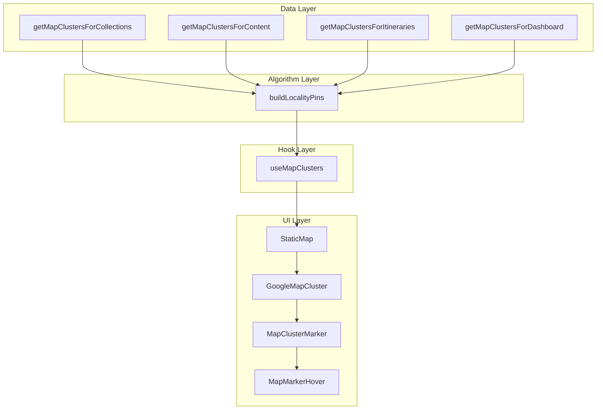
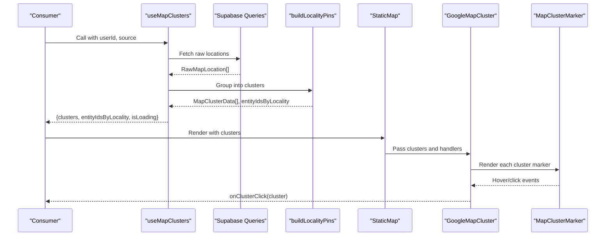
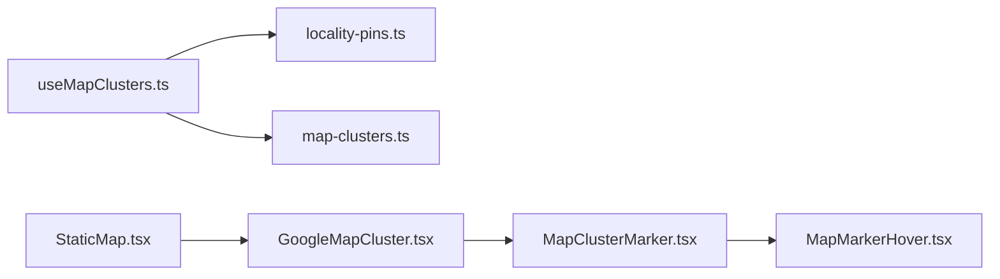
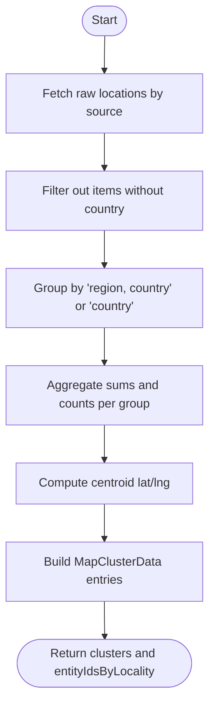

# Map Clustering

<cite>
**Referenced Files in This Document**
- [useMapClusters.ts](file://src/hooks/useMapClusters.ts)
- [map-clusters.ts](file://src/lib/supabase/queries/map-clusters.ts)
- [locality-pins.ts](file://src/lib/maps/locality-pins.ts)
- [StaticMap.tsx](file://src/components/ui/map/StaticMap.tsx)
- [GoogleMapCluster.tsx](file://src/components/ui/map/GoogleMapCluster.tsx)
- [MapClusterMarker.tsx](file://src/components/ui/map/MapClusterMarker.tsx)
- [MapMarkerHover.tsx](file://src/components/ui/map/MapMarkerHover.tsx)
</cite>

## Table of Contents
1. [Introduction](#introduction)
2. [Project Structure](#project-structure)
3. [Core Components](#core-components)
4. [Architecture Overview](#architecture-overview)
5. [Detailed Component Analysis](#detailed-component-analysis)
6. [Dependency Analysis](#dependency-analysis)
7. [Performance Considerations](#performance-considerations)
8. [Troubleshooting Guide](#troubleshooting-guide)
9. [Conclusion](#conclusion)
10. [Appendices](#appendices)

## Introduction
This document explains Argo’s map clustering system used to aggregate and visualize location data across multiple surfaces (dashboard, collections, content, itineraries). It covers:
- The useMapClusters hook for fetching and preparing clustered location data
- The locality-based grouping algorithm that builds clusters by region/country or other variants
- The MapClusterMarker component for rendering cluster visuals with hover states and styling variants
- How the Google map integration renders clusters, computes view bounds, and handles interactions such as click and hover
- Configuration examples, customization options, and drill-down patterns via cluster click events

## Project Structure
The clustering feature spans hooks, data queries, algorithms, and UI components:
- Data layer: Supabase queries fetch raw locations per source
- Algorithm layer: Locality pins group items into clusters and compute centroids
- Hook layer: useMapClusters orchestrates query execution and returns normalized cluster data
- UI layer: StaticMap and GoogleMapCluster render clusters; MapClusterMarker and MapMarkerHover provide visual feedback

**Diagram sources**
- [map-clusters.ts:19-95](file://src/lib/supabase/queries/map-clusters.ts#L19-L95)
- [locality-pins.ts:28-77](file://src/lib/maps/locality-pins.ts#L28-L77)
- [useMapClusters.ts:35-60](file://src/hooks/useMapClusters.ts#L35-L60)
- [StaticMap.tsx:39-96](file://src/components/ui/map/StaticMap.tsx#L39-L96)
- [GoogleMapCluster.tsx:80-136](file://src/components/ui/map/GoogleMapCluster.tsx#L80-L136)
- [MapClusterMarker.tsx:51-113](file://src/components/ui/map/MapClusterMarker.tsx#L51-L113)
- [MapMarkerHover.tsx:42-72](file://src/components/ui/map/MapMarkerHover.tsx#L42-L72)

**Section sources**
- [map-clusters.ts:19-95](file://src/lib/supabase/queries/map-clusters.ts#L19-L95)
- [locality-pins.ts:28-77](file://src/lib/maps/locality-pins.ts#L28-L77)
- [useMapClusters.ts:35-60](file://src/hooks/useMapClusters.ts#L35-L60)
- [StaticMap.tsx:39-96](file://src/components/ui/map/StaticMap.tsx#L39-L96)
- [GoogleMapCluster.tsx:80-136](file://src/components/ui/map/GoogleMapCluster.tsx#L80-L136)
- [MapClusterMarker.tsx:51-113](file://src/components/ui/map/MapClusterMarker.tsx#L51-L113)
- [MapMarkerHover.tsx:42-72](file://src/components/ui/map/MapMarkerHover.tsx#L42-L72)

## Core Components
- useMapClusters: Fetches raw locations from Supabase based on a source (dashboard, collections, content, itineraries), then groups them into clusters using buildLocalityPins. Returns clusters, entityIdsByLocality mapping, and loading state.
- buildLocalityPins: Groups raw locations by a presentation key (region + country or country only), computes centroid coordinates, counts unique entities, and produces MapClusterData entries.
- StaticMap: Lazy-loads the interactive map when visible, manages hover state for clusters, and passes props to GoogleMapCluster.
- GoogleMapCluster: Renders clusters as AdvancedMarker elements, fits map bounds automatically, and wires up click/hover events.
- MapClusterMarker: Visual marker with variant-driven styling, size, and hover states; supports compact or detail hover modes.
- MapMarkerHover: Compact hover tooltip showing count and label, styled by variant and size.

**Section sources**
- [useMapClusters.ts:35-60](file://src/hooks/useMapClusters.ts#L35-L60)
- [locality-pins.ts:28-77](file://src/lib/maps/locality-pins.ts#L28-L77)
- [StaticMap.tsx:39-96](file://src/components/ui/map/StaticMap.tsx#L39-L96)
- [GoogleMapCluster.tsx:80-136](file://src/components/ui/map/GoogleMapCluster.tsx#L80-L136)
- [MapClusterMarker.tsx:51-113](file://src/components/ui/map/MapClusterMarker.tsx#L51-L113)
- [MapMarkerHover.tsx:42-72](file://src/components/ui/map/MapMarkerHover.tsx#L42-L72)

## Architecture Overview
The system follows a layered architecture:
- Data queries retrieve raw locations per source
- An algorithm aggregates these into clusters by locality
- A React hook encapsulates caching and normalization
- UI components render clusters and handle user interactions

**Diagram sources**
- [useMapClusters.ts:35-60](file://src/hooks/useMapClusters.ts#L35-L60)
- [map-clusters.ts:19-95](file://src/lib/supabase/queries/map-clusters.ts#L19-L95)
- [locality-pins.ts:28-77](file://src/lib/maps/locality-pins.ts#L28-L77)
- [StaticMap.tsx:39-96](file://src/components/ui/map/StaticMap.tsx#L39-L96)
- [GoogleMapCluster.tsx:80-136](file://src/components/ui/map/GoogleMapCluster.tsx#L80-L136)
- [MapClusterMarker.tsx:51-113](file://src/components/ui/map/MapClusterMarker.tsx#L51-L113)

## Detailed Component Analysis

### useMapClusters Hook
Responsibilities:
- Selects the appropriate query function based on source
- Executes query with React Query, enabling caching and stale-time configuration
- Transforms raw locations into clusters via buildLocalityPins
- Returns normalized clusters, entity-to-locality mapping, and loading state

Key behaviors:
- Enabled only when userId is present
- Stale time set to cache results for 10 minutes
- Placeholder data prevents layout shifts during initial load

Configuration tips:
- Choose source to target dashboard, collections, content, or itineraries
- Adjust staleTime for different freshness requirements
- Use entityIdsByLocality to filter or highlight related entities

**Section sources**
- [useMapClusters.ts:35-60](file://src/hooks/useMapClusters.ts#L35-L60)

### Locality Pins Algorithm (buildLocalityPins)
Grouping strategy:
- Groups items by a string key composed of region and country (or country-only if no region)
- Computes centroid latitude/longitude by averaging member coordinates
- Counts unique entities per locality
- Produces MapClusterData with consistent shape and default sizes/states

Complexity:
- Time: O(n) to iterate and group items
- Space: O(k) where k is number of unique localities

Optimization opportunities:
- Pre-filter null countries at query level
- De-duplicate entityIds before aggregation if duplicates exist upstream

**Section sources**
- [locality-pins.ts:28-77](file://src/lib/maps/locality-pins.ts#L28-L77)

### StaticMap Component
Responsibilities:
- Lazily loads the interactive map when it enters the viewport
- Tracks map load analytics
- Manages hovered cluster id and passes it down to GoogleMapCluster
- Provides fitBounds and zoom controls toggles

Interaction model:
- onClusterClick forwarded to parent for drill-down
- renderDetailContent allows customizing hover detail per cluster

**Section sources**
- [StaticMap.tsx:39-96](file://src/components/ui/map/StaticMap.tsx#L39-L96)

### GoogleMapCluster Component
Responsibilities:
- Wraps the Google Maps provider and renders clusters as markers
- Automatically calculates center and zoom based on cluster spread
- Fits map bounds to include all clusters
- Wires hover and click events to parent handlers

View calculation:
- Single cluster centers and zooms to a detailed view
- Multiple clusters compute bounding box and choose an appropriate zoom level based on geographic spread

Interactions:
- onClusterClick receives the clicked cluster for drill-down
- Hover state controlled by hoveredClusterId passed from StaticMap

**Section sources**
- [GoogleMapCluster.tsx:13-67](file://src/components/ui/map/GoogleMapCluster.tsx#L13-L67)
- [GoogleMapCluster.tsx:80-136](file://src/components/ui/map/GoogleMapCluster.tsx#L80-L136)

### MapClusterMarker Component
Visual features:
- Variants: “by Country”, “by Collection”, “by Location”
- Sizes: Small, Medium
- States: Default, Hover, Active
- Hover modes: compact (count + label) or detail (custom content)

Hover behavior:
- Shows MapMarkerHover in compact mode or custom detailContent in detail mode
- Emphasizes marker icon when hovered or active

Customization:
- className prop for additional styling
- isHovered prop to reflect external hover state

**Section sources**
- [MapClusterMarker.tsx:51-113](file://src/components/ui/map/MapClusterMarker.tsx#L51-L113)

### MapMarkerHover Component
Features:
- Displays count badge and label text
- Styles vary by variant and size
- Supports children for extended content

Usage:
- Used within MapClusterMarker for compact hover tooltips

**Section sources**
- [MapMarkerHover.tsx:42-72](file://src/components/ui/map/MapMarkerHover.tsx#L42-L72)

## Dependency Analysis
The following diagram shows how components depend on each other and on data utilities:

**Diagram sources**
- [useMapClusters.ts:35-60](file://src/hooks/useMapClusters.ts#L35-L60)
- [locality-pins.ts:28-77](file://src/lib/maps/locality-pins.ts#L28-L77)
- [map-clusters.ts:19-95](file://src/lib/supabase/queries/map-clusters.ts#L19-L95)
- [StaticMap.tsx:39-96](file://src/components/ui/map/StaticMap.tsx#L39-L96)
- [GoogleMapCluster.tsx:80-136](file://src/components/ui/map/GoogleMapCluster.tsx#L80-L136)
- [MapClusterMarker.tsx:51-113](file://src/components/ui/map/MapClusterMarker.tsx#L51-L113)
- [MapMarkerHover.tsx:42-72](file://src/components/ui/map/MapMarkerHover.tsx#L42-L72)

**Section sources**
- [useMapClusters.ts:35-60](file://src/hooks/useMapClusters.ts#L35-L60)
- [locality-pins.ts:28-77](file://src/lib/maps/locality-pins.ts#L28-L77)
- [map-clusters.ts:19-95](file://src/lib/supabase/queries/map-clusters.ts#L19-L95)
- [StaticMap.tsx:39-96](file://src/components/ui/map/StaticMap.tsx#L39-L96)
- [GoogleMapCluster.tsx:80-136](file://src/components/ui/map/GoogleMapCluster.tsx#L80-L136)
- [MapClusterMarker.tsx:51-113](file://src/components/ui/map/MapClusterMarker.tsx#L51-L113)
- [MapMarkerHover.tsx:42-72](file://src/components/ui/map/MapMarkerHover.tsx#L42-L72)

## Performance Considerations
- Caching: useMapClusters uses React Query with a 10-minute stale time to reduce repeated network calls.
- Lazy loading: StaticMap defers map initialization until the component is in view, improving initial page performance.
- Efficient grouping: buildLocalityPins runs in linear time relative to input size and avoids heavy geometry computations.
- View optimization: GoogleMapCluster computes bounds once per clusters change and chooses a sensible zoom level based on geographic spread.
- Rendering: MapClusterMarker uses class-variance-authority for efficient style application without re-renders.

[No sources needed since this section provides general guidance]

## Troubleshooting Guide
Common issues and resolutions:
- No clusters displayed:
  - Ensure userId is provided to enable the query in useMapClusters
  - Verify that raw locations have non-null country and latitude fields
- Incorrect cluster positions:
  - Confirm that latitude and longitude are numeric and correctly parsed from strings
- Hover not working:
  - Check that StaticMap passes hoveredClusterId and onHoverChange to GoogleMapCluster
  - Ensure MapClusterMarker receives isHovered and updates its state accordingly
- Click not firing:
  - Verify onClusterClick is passed through StaticMap to GoogleMapCluster and handled by the consumer

**Section sources**
- [useMapClusters.ts:35-60](file://src/hooks/useMapClusters.ts#L35-L60)
- [map-clusters.ts:19-95](file://src/lib/supabase/queries/map-clusters.ts#L19-L95)
- [StaticMap.tsx:39-96](file://src/components/ui/map/StaticMap.tsx#L39-L96)
- [GoogleMapCluster.tsx:80-136](file://src/components/ui/map/GoogleMapCluster.tsx#L80-L136)
- [MapClusterMarker.tsx:51-113](file://src/components/ui/map/MapClusterMarker.tsx#L51-L113)

## Conclusion
Argo’s map clustering system cleanly separates concerns across data, algorithm, hook, and UI layers. The locality-based grouping provides fast, predictable clusters for large datasets, while the UI components offer flexible styling and interaction patterns. Consumers can configure behavior via source selection, hover modes, and click handlers to implement drill-down experiences tailored to their needs.

[No sources needed since this section summarizes without analyzing specific files]

## Appendices

### Cluster Calculation Logic Flow

**Diagram sources**
- [map-clusters.ts:19-95](file://src/lib/supabase/queries/map-clusters.ts#L19-L95)
- [locality-pins.ts:28-77](file://src/lib/maps/locality-pins.ts#L28-L77)

### Example Configurations and Usage Patterns
- Configure clustering by source:
  - Use useMapClusters with source set to dashboard, collections, content, or itineraries
  - Adjust staleTime if you need fresher or more cached data
- Customize cluster appearance:
  - Set variant to “by Country”, “by Collection”, or “by Location”
  - Choose size Small or Medium
  - Control hoverMode between compact and detail
- Handle cluster clicks for drill-down:
  - Provide onClusterClick to StaticMap or GoogleMapCluster
  - Use the returned cluster object to navigate or open details
- Fit bounds and zoom:
  - Enable fitBounds to auto-fit the map to all clusters
  - Optionally override center and zoom for manual control

**Section sources**
- [useMapClusters.ts:35-60](file://src/hooks/useMapClusters.ts#L35-L60)
- [StaticMap.tsx:39-96](file://src/components/ui/map/StaticMap.tsx#L39-L96)
- [GoogleMapCluster.tsx:80-136](file://src/components/ui/map/GoogleMapCluster.tsx#L80-L136)
- [MapClusterMarker.tsx:51-113](file://src/components/ui/map/MapClusterMarker.tsx#L51-L113)