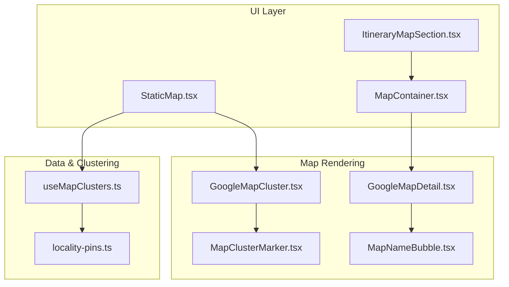
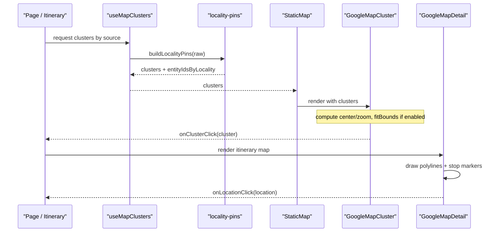
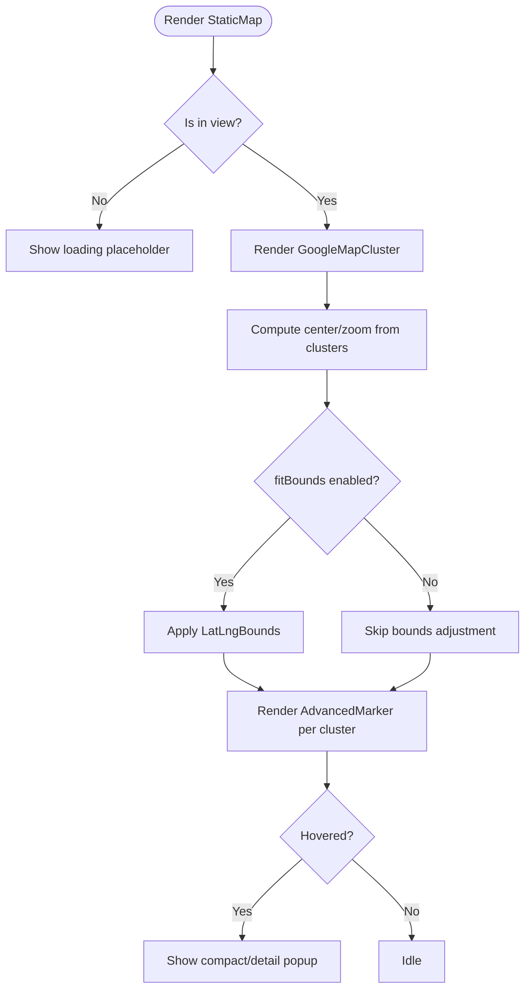
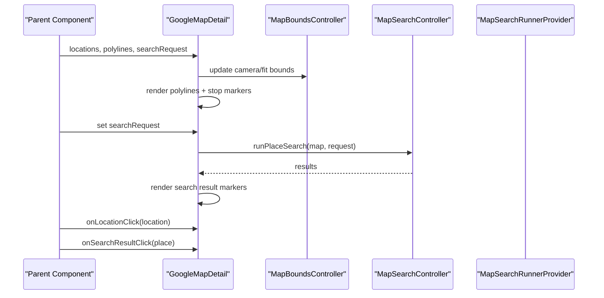
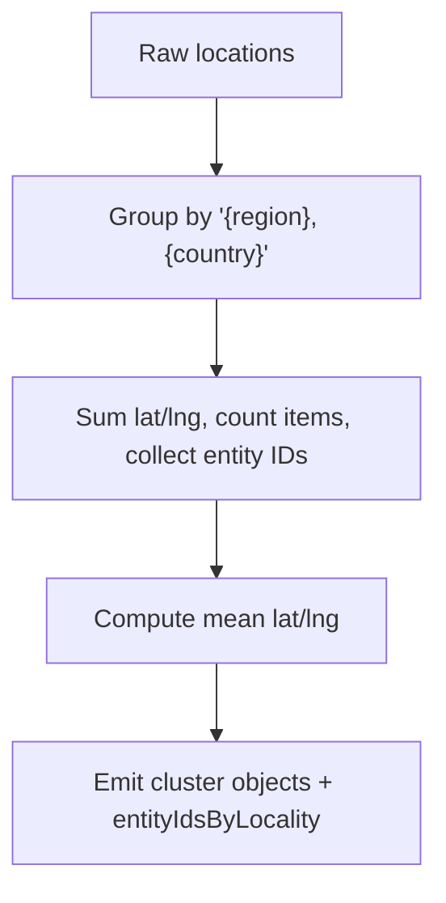
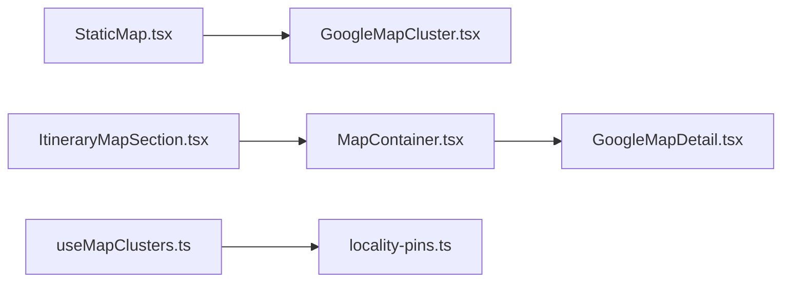

# Map Integration

<cite>
**Referenced Files in This Document**
- [GoogleMapCluster.tsx](file://src/components/ui/map/GoogleMapCluster.tsx)
- [GoogleMapDetail.tsx](file://src/components/ui/map/GoogleMapDetail.tsx)
- [MapContainer.tsx](file://src/components/ui/map/MapContainer.tsx)
- [StaticMap.tsx](file://src/components/ui/map/StaticMap.tsx)
- [MapClusterMarker.tsx](file://src/components/ui/map/MapClusterMarker.tsx)
- [MapNameBubble.tsx](file://src/components/ui/map/MapNameBubble.tsx)
- [useMapClusters.ts](file://src/hooks/useMapClusters.ts)
- [locality-pins.ts](file://src/lib/maps/locality-pins.ts)
- [ItineraryMapSection.tsx](file://src/components/ui/itinerary/ItineraryMapSection.tsx)
</cite>

## Table of Contents
1. Introduction
2. Project Structure
3. Core Components
4. Architecture Overview
5. Detailed Component Analysis
6. Dependency Analysis
7. Performance Considerations
8. Troubleshooting Guide
9. Conclusion

## Introduction
This document explains how Google Maps is integrated across the application, focusing on interactive maps, clustering for performance, marker management, and static map generation. It covers the components that render maps, how clusters are computed and displayed, how to add custom markers, handle map events, optimize large datasets, and integrate with the itinerary planning workflow. Best practices for map-heavy applications are included to help you maintain performance and usability at scale.

## Project Structure
The mapping system is organized into reusable UI components under src/components/ui/map, a container that handles lazy loading and intersection-based rendering, hooks for data fetching and clustering, and utilities for building locality-based cluster pins. An itinerary-specific section composes these pieces to display routes and stops.

**Diagram sources**
- [StaticMap.tsx:34-92](file://src/components/ui/map/StaticMap.tsx#L34-L92)
- [MapContainer.tsx:40-88](file://src/components/ui/map/MapContainer.tsx#L40-L88)
- [ItineraryMapSection.tsx:8-48](file://src/components/ui/itinerary/ItineraryMapSection.tsx#L8-L48)
- [GoogleMapCluster.tsx:99-135](file://src/components/ui/map/GoogleMapCluster.tsx#L99-L135)
- [GoogleMapDetail.tsx:341-461](file://src/components/ui/map/GoogleMapDetail.tsx#L341-L461)
- [useMapClusters.ts:35-60](file://src/hooks/useMapClusters.ts#L35-L60)
- [locality-pins.ts:28-77](file://src/lib/maps/locality-pins.ts#L28-L77)

**Section sources**
- [StaticMap.tsx:1-103](file://src/components/ui/map/StaticMap.tsx#L1-L103)
- [MapContainer.tsx:1-99](file://src/components/ui/map/MapContainer.tsx#L1-L99)
- [ItineraryMapSection.tsx:1-54](file://src/components/ui/itinerary/ItineraryMapSection.tsx#L1-L54)
- [GoogleMapCluster.tsx:1-181](file://src/components/ui/map/GoogleMapCluster.tsx#L1-L181)
- [GoogleMapDetail.tsx:1-490](file://src/components/ui/map/GoogleMapDetail.tsx#L1-L490)
- [useMapClusters.ts:1-61](file://src/hooks/useMapClusters.ts#L1-L61)
- [locality-pins.ts:1-78](file://src/lib/maps/locality-pins.ts#L1-L78)

## Core Components
- StaticMap: A lazy-loaded wrapper around the clustered map. It renders a placeholder until the component enters the viewport, tracks map load events, and passes props to the underlying GoogleMapCluster.
- GoogleMapCluster: Renders an interactive or non-interactive Google Map using APIProvider and Map. It computes initial center/zoom from clusters, fits bounds when needed, and renders AdvancedMarker items with MapClusterMarker. Supports hover states and optional zoom controls.
- MapContainer: Lazy-loads GoogleMapDetail only when visible (or eager mode). Tracks map load and forwards all map-related props.
- GoogleMapDetail: Full-featured interactive map for itineraries and detail views. Handles bounds animation, polylines, stop markers, search result markers, and hover affordances. Exposes place search and place details capabilities via callbacks.
- MapClusterMarker: Visual representation of a cluster pin with hover badge showing count and label. Supports variants, sizes, and state-driven styling.
- MapNameBubble: Lightweight name label shown above pins in “name” hover variant.
- useMapClusters: Data hook that fetches raw locations by source and builds locality-based cluster pins for static maps.
- locality-pins: Groups entities by region/country labels and computes mean coordinates to produce cluster pins.

**Section sources**
- [StaticMap.tsx:21-99](file://src/components/ui/map/StaticMap.tsx#L21-L99)
- [GoogleMapCluster.tsx:13-135](file://src/components/ui/map/GoogleMapCluster.tsx#L13-L135)
- [MapContainer.tsx:10-99](file://src/components/ui/map/MapContainer.tsx#L10-L99)
- [GoogleMapDetail.tsx:27-103](file://src/components/ui/map/GoogleMapDetail.tsx#L27-L103)
- [MapClusterMarker.tsx:8-115](file://src/components/ui/map/MapClusterMarker.tsx#L8-L115)
- [MapNameBubble.tsx:5-26](file://src/components/ui/map/MapNameBubble.tsx#L5-L26)
- [useMapClusters.ts:16-60](file://src/hooks/useMapClusters.ts#L16-L60)
- [locality-pins.ts:4-77](file://src/lib/maps/locality-pins.ts#L4-L77)

## Architecture Overview
The architecture separates concerns between data preparation, map rendering, and user interaction:
- Data layer: useMapClusters fetches raw locations per source and uses locality-pins to build cluster pins suitable for static maps.
- Rendering layer: StaticMap and MapContainer provide lazy loading and viewport-aware initialization. GoogleMapCluster and GoogleMapDetail render interactive maps with markers and overlays.
- Interaction layer: Event handlers propagate clicks and hovers to parent components; search controllers run place searches tied to the current viewport.

**Diagram sources**
- [useMapClusters.ts:35-60](file://src/hooks/useMapClusters.ts#L35-L60)
- [locality-pins.ts:28-77](file://src/lib/maps/locality-pins.ts#L28-L77)
- [StaticMap.tsx:34-92](file://src/components/ui/map/StaticMap.tsx#L34-L92)
- [GoogleMapCluster.tsx:99-135](file://src/components/ui/map/GoogleMapCluster.tsx#L99-L135)
- [GoogleMapDetail.tsx:341-461](file://src/components/ui/map/GoogleMapDetail.tsx#L341-L461)

## Detailed Component Analysis

### StaticMap and GoogleMapCluster (Clustering and Static Display)
- StaticMap lazily loads GoogleMapCluster once visible and tracks map load events. It manages hover state for cluster markers and exposes click handling.
- GoogleMapCluster initializes the map with theme-aware map IDs, calculates auto center/zoom based on cluster spread, and optionally fits bounds to show all clusters. Each cluster is rendered as an AdvancedMarker with MapClusterMarker, supporting compact or detail hover modes. Optional zoom controls can be toggled.

**Diagram sources**
- [StaticMap.tsx:52-92](file://src/components/ui/map/StaticMap.tsx#L52-L92)
- [GoogleMapCluster.tsx:13-67](file://src/components/ui/map/GoogleMapCluster.tsx#L13-L67)
- [GoogleMapCluster.tsx:99-135](file://src/components/ui/map/GoogleMapCluster.tsx#L99-L135)

**Section sources**
- [StaticMap.tsx:21-99](file://src/components/ui/map/StaticMap.tsx#L21-L99)
- [GoogleMapCluster.tsx:13-135](file://src/components/ui/map/GoogleMapCluster.tsx#L13-L135)
- [MapClusterMarker.tsx:8-115](file://src/components/ui/map/MapClusterMarker.tsx#L8-L115)

### GoogleMapDetail (Interactive Itinerary Map)
- Computes initial center and zoom from locations or defaults.
- Draws route polylines with layered strokes for visibility.
- Renders numbered stop pins colored by day index, with hover cards or lightweight name bubbles.
- Integrates place search: a controller runs viewport-biased searches and displays result markers with hover affordances.
- Exposes callbacks for place details fetching and place search runner to enable adding locations from the map.

**Diagram sources**
- [GoogleMapDetail.tsx:27-103](file://src/components/ui/map/GoogleMapDetail.tsx#L27-L103)
- [GoogleMapDetail.tsx:116-151](file://src/components/ui/map/GoogleMapDetail.tsx#L116-L151)
- [GoogleMapDetail.tsx:164-184](file://src/components/ui/map/GoogleMapDetail.tsx#L164-L184)
- [GoogleMapDetail.tsx:341-461](file://src/components/ui/map/GoogleMapDetail.tsx#L341-L461)

**Section sources**
- [GoogleMapDetail.tsx:27-103](file://src/components/ui/map/GoogleMapDetail.tsx#L27-L103)
- [GoogleMapDetail.tsx:116-184](file://src/components/ui/map/GoogleMapDetail.tsx#L116-L184)
- [GoogleMapDetail.tsx:254-461](file://src/components/ui/map/GoogleMapDetail.tsx#L254-L461)

### MapContainer (Lazy Loading and Intersection Observer)
- Uses an intersection observer to defer rendering until the map is visible, reducing initial bundle and SDK load costs.
- Tracks map load events when rendered.
- Forwards all relevant props to GoogleMapDetail, including interactive mode, hover variant, and callbacks.

**Section sources**
- [MapContainer.tsx:10-99](file://src/components/ui/map/MapContainer.tsx#L10-L99)

### ItineraryMapSection (Integration with Itinerary Workflow)
- Composes MapContainer within a styled card layout.
- Passes locations and polylines derived from the itinerary to visualize stops and routes.
- Supports configurable hover variant for lightweight or rich popups.

**Section sources**
- [ItineraryMapSection.tsx:13-54](file://src/components/ui/itinerary/ItineraryMapSection.tsx#L13-L54)

### Clustering Algorithm (Locality Pins)
- Groups raw locations by a human-readable locality label (region and country).
- Aggregates counts and sums lat/lng to compute the centroid for each cluster.
- Returns both cluster data and a mapping of locality to entity IDs for filtering or drill-down.

**Diagram sources**
- [locality-pins.ts:28-77](file://src/lib/maps/locality-pins.ts#L28-L77)

**Section sources**
- [locality-pins.ts:4-77](file://src/lib/maps/locality-pins.ts#L4-L77)
- [useMapClusters.ts:16-60](file://src/hooks/useMapClusters.ts#L16-L60)

## Dependency Analysis
- StaticMap depends on GoogleMapCluster and uses dynamic imports to avoid SSR issues.
- MapContainer depends on GoogleMapDetail and uses dynamic imports plus intersection observer for performance.
- useMapClusters depends on Supabase queries and locality-pins to transform raw data into cluster pins.
- GoogleMapDetail depends on Google Maps libraries (Map, AdvancedMarker, Polyline) and integrates place search via a places library provider.

**Diagram sources**
- [StaticMap.tsx:34-92](file://src/components/ui/map/StaticMap.tsx#L34-L92)
- [MapContainer.tsx:40-88](file://src/components/ui/map/MapContainer.tsx#L40-L88)
- [useMapClusters.ts:35-60](file://src/hooks/useMapClusters.ts#L35-L60)
- [ItineraryMapSection.tsx:8-48](file://src/components/ui/itinerary/ItineraryMapSection.tsx#L8-L48)

**Section sources**
- [StaticMap.tsx:34-92](file://src/components/ui/map/StaticMap.tsx#L34-L92)
- [MapContainer.tsx:40-88](file://src/components/ui/map/MapContainer.tsx#L40-L88)
- [useMapClusters.ts:35-60](file://src/hooks/useMapClusters.ts#L35-L60)
- [ItineraryMapSection.tsx:8-48](file://src/components/ui/itinerary/ItineraryMapSection.tsx#L8-L48)

## Performance Considerations
- Lazy loading: Both StaticMap and MapContainer defer map rendering until the component is in view, reducing initial payload and SDK initialization time.
- Viewport-aware search: Place search is scoped to the current map viewport, limiting results and improving relevance while minimizing API calls.
- Efficient bounds computation: Initial center and zoom are calculated from cluster spread or location distribution to avoid unnecessary re-renders.
- Marker optimization: Use cluster pins for large datasets; reserve individual markers for smaller sets or specific contexts like itinerary stops.
- Theme-aware map IDs: Switching map styles via environment variables avoids extra network requests for different themes.
- Intersection tracking: Map load events are tracked only when the map is actually rendered, preventing false positives.

[No sources needed since this section provides general guidance]

## Troubleshooting Guide
- Map not loading: Ensure the API key and map IDs are configured in environment variables. Verify that the component is visible (intersection observer) so it triggers rendering.
- No markers shown: Confirm that locations or clusters have valid latitude/longitude values. Check that fitBounds is enabled when expected and that data arrays are non-empty.
- Search not returning results: Validate that the places library is loaded and that the search request includes appropriate types. Check console logs for errors from the search controller.
- Incorrect bounds or zoom: Review the logic that computes center/zoom from data spread. Adjust thresholds or use explicit defaultCenter/defaultZoom if needed.
- Hover popups not appearing: Ensure hoverVariant is set appropriately and that event handlers are wired correctly in parent components.

**Section sources**
- [GoogleMapCluster.tsx:13-67](file://src/components/ui/map/GoogleMapCluster.tsx#L13-L67)
- [GoogleMapDetail.tsx:116-151](file://src/components/ui/map/GoogleMapDetail.tsx#L116-L151)
- [StaticMap.tsx:52-92](file://src/components/ui/map/StaticMap.tsx#L52-L92)
- [MapContainer.tsx:47-88](file://src/components/ui/map/MapContainer.tsx#L47-L88)

## Conclusion
The mapping integration combines lazy-loading containers, robust interactive maps, and efficient clustering to deliver performant experiences across static and dynamic contexts. By leveraging locality-based clustering for large datasets, viewport-scoped place search, and theme-aware configuration, the system scales well for map-heavy applications. Follow the best practices outlined here to maintain responsiveness and clarity when adding custom markers, handling events, and integrating with itinerary workflows.

[No sources needed since this section summarizes without analyzing specific files]