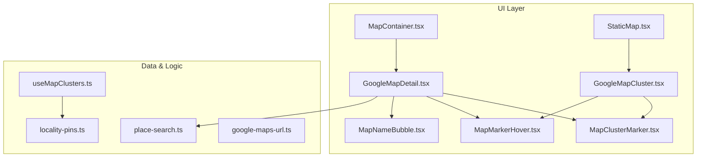
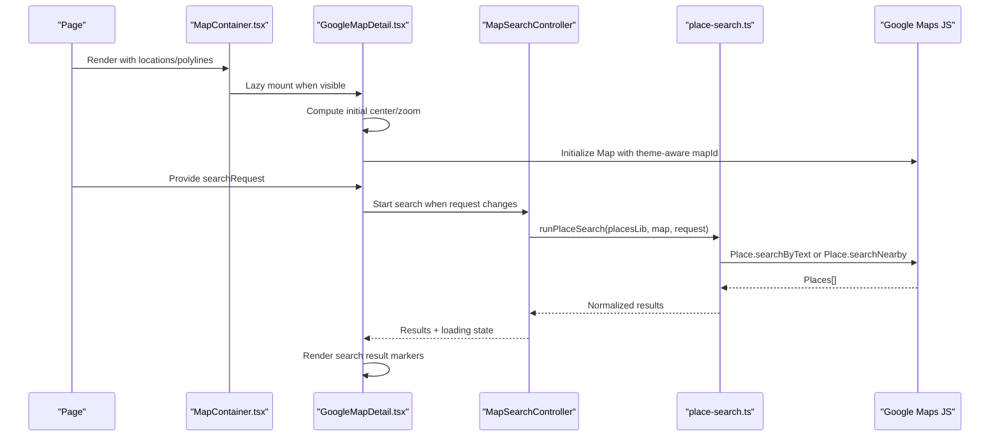
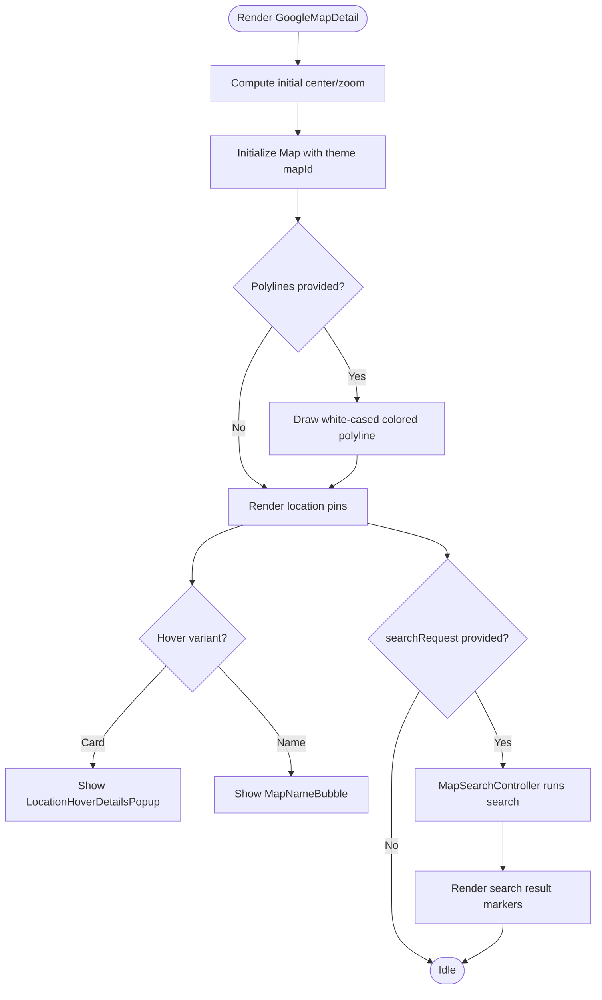
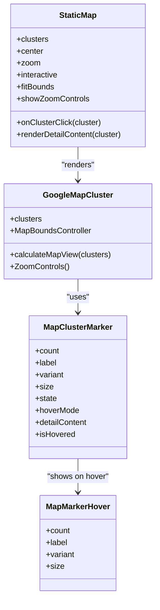
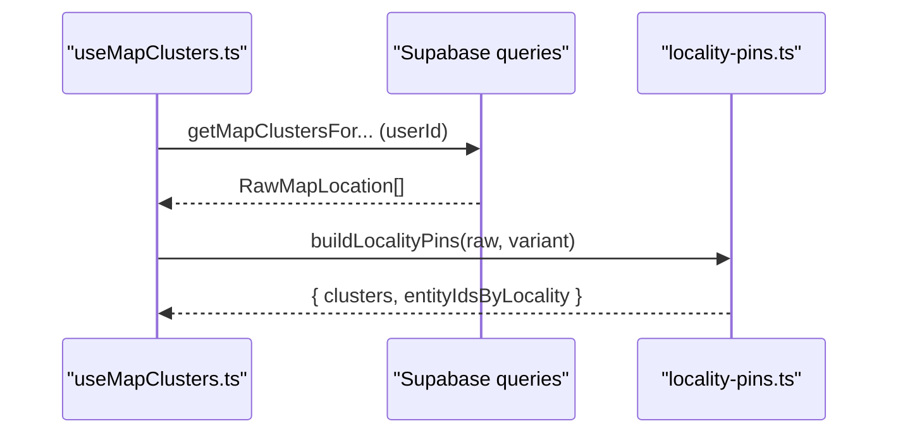
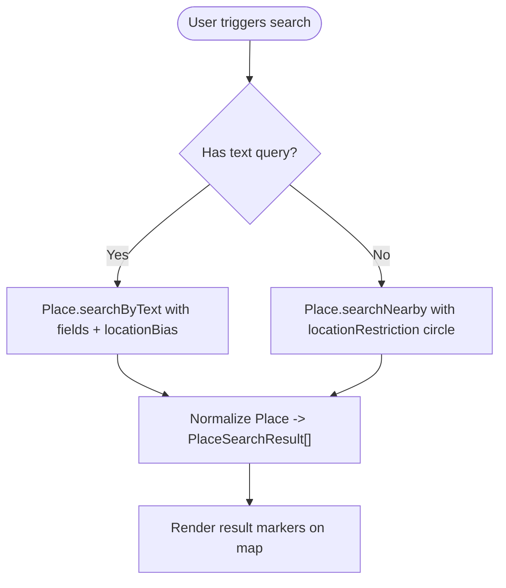
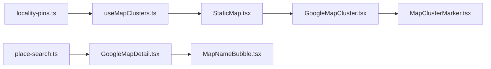

# Map Integration

<cite>
**Referenced Files in This Document**
- [GoogleMapCluster.tsx](file://src/components/ui/map/GoogleMapCluster.tsx)
- [GoogleMapDetail.tsx](file://src/components/ui/map/GoogleMapDetail.tsx)
- [MapContainer.tsx](file://src/components/ui/map/MapContainer.tsx)
- [StaticMap.tsx](file://src/components/ui/map/StaticMap.tsx)
- [MapClusterMarker.tsx](file://src/components/ui/map/MapClusterMarker.tsx)
- [MapMarkerHover.tsx](file://src/components/ui/map/MapMarkerHover.tsx)
- [MapNameBubble.tsx](file://src/components/ui/map/MapNameBubble.tsx)
- [useMapClusters.ts](file://src/hooks/useMapClusters.ts)
- [place-search.ts](file://src/lib/maps/place-search.ts)
- [locality-pins.ts](file://src/lib/maps/locality-pins.ts)
- [google-maps-url.ts](file://src/lib/maps/google-maps-url.ts)
</cite>

## Table of Contents
1. Introduction
2. Project Structure
3. Core Components
4. Architecture Overview
5. Detailed Component Analysis
6. Dependency Analysis
7. Performance Considerations
8. Troubleshooting Guide
9. Conclusion
10. Appendices

## Introduction
This document explains Argo’s Google Maps integration across interactive maps, static map tiles with clustering, and search-driven place discovery. It covers marker rendering, route visualization via polylines, state management, event handling, performance optimizations for large datasets, mobile responsiveness, accessibility, and cross-browser considerations. It also provides guidance on extending the map features and customizing appearance.

## Project Structure
The map feature is implemented as a set of reusable React components under src/components/ui/map, a hook for data fetching and clustering under src/hooks, and utility modules under src/lib/maps for Places API interactions and locality grouping.

**Diagram sources**
- [MapContainer.tsx:1-99](file://src/components/ui/map/MapContainer.tsx#L1-L99)
- [StaticMap.tsx:1-103](file://src/components/ui/map/StaticMap.tsx#L1-L103)
- [GoogleMapDetail.tsx:1-490](file://src/components/ui/map/GoogleMapDetail.tsx#L1-L490)
- [GoogleMapCluster.tsx:1-181](file://src/components/ui/map/GoogleMapCluster.tsx#L1-L181)
- [MapClusterMarker.tsx:1-115](file://src/components/ui/map/MapClusterMarker.tsx#L1-L115)
- [MapMarkerHover.tsx:1-78](file://src/components/ui/map/MapMarkerHover.tsx#L1-L78)
- [MapNameBubble.tsx:1-26](file://src/components/ui/map/MapNameBubble.tsx#L1-L26)
- [useMapClusters.ts:1-61](file://src/hooks/useMapClusters.ts#L1-L61)
- [place-search.ts:1-467](file://src/lib/maps/place-search.ts#L1-L467)
- [locality-pins.ts:1-78](file://src/lib/maps/locality-pins.ts#L1-L78)

**Section sources**
- [MapContainer.tsx:1-99](file://src/components/ui/map/MapContainer.tsx#L1-L99)
- [StaticMap.tsx:1-103](file://src/components/ui/map/StaticMap.tsx#L1-L103)
- [GoogleMapDetail.tsx:1-490](file://src/components/ui/map/GoogleMapDetail.tsx#L1-L490)
- [GoogleMapCluster.tsx:1-181](file://src/components/ui/map/GoogleMapCluster.tsx#L1-L181)
- [useMapClusters.ts:1-61](file://src/hooks/useMapClusters.ts#L1-L61)
- [place-search.ts:1-467](file://src/lib/maps/place-search.ts#L1-L467)
- [locality-pins.ts:1-78](file://src/lib/maps/locality-pins.ts#L1-L78)

## Core Components
- MapContainer: Lazy-loads the interactive map when visible; tracks map load events; passes locations, polylines, and interaction props to the detail map.
- StaticMap: Lazy-loads the clustered map tile; manages hover state for cluster markers; supports optional zoom controls and fit-bounds behavior.
- GoogleMapDetail: Renders an interactive map with location pins, route polylines, place search results, and rich hover cards or name bubbles.
- GoogleMapCluster: Renders clustered markers with automatic view calculation and optional zoom controls.
- MapClusterMarker + MapMarkerHover: Visual cluster markers with compact or detail hover modes.
- MapNameBubble: Lightweight label shown above pins in “name” hover mode.

Key responsibilities:
- Data binding: locations, polylines, clusters
- View management: centering, zoom estimation, fit bounds
- Interaction: click/hover handlers, optional interactivity toggle
- Search integration: viewport-biased place search and result markers
- Accessibility: aria labels on controls, semantic markup for markers

**Section sources**
- [MapContainer.tsx:1-99](file://src/components/ui/map/MapContainer.tsx#L1-L99)
- [StaticMap.tsx:1-103](file://src/components/ui/map/StaticMap.tsx#L1-L103)
- [GoogleMapDetail.tsx:1-490](file://src/components/ui/map/GoogleMapDetail.tsx#L1-L490)
- [GoogleMapCluster.tsx:1-181](file://src/components/ui/map/GoogleMapCluster.tsx#L1-L181)
- [MapClusterMarker.tsx:1-115](file://src/components/ui/map/MapClusterMarker.tsx#L1-L115)
- [MapMarkerHover.tsx:1-78](file://src/components/ui/map/MapMarkerHover.tsx#L1-L78)
- [MapNameBubble.tsx:1-26](file://src/components/ui/map/MapNameBubble.tsx#L1-L26)

## Architecture Overview
The system composes two primary map experiences:
- Interactive itinerary/detail map (GoogleMapDetail) with route polylines, numbered stop pins, and live place search.
- Clustered overview map (StaticMap + GoogleMapCluster) for dashboards/collections, using locality-based grouping.

**Diagram sources**
- [MapContainer.tsx:1-99](file://src/components/ui/map/MapContainer.tsx#L1-L99)
- [GoogleMapDetail.tsx:105-184](file://src/components/ui/map/GoogleMapDetail.tsx#L105-L184)
- [GoogleMapDetail.tsx:289-463](file://src/components/ui/map/GoogleMapDetail.tsx#L289-L463)
- [place-search.ts:391-466](file://src/lib/maps/place-search.ts#L391-L466)

## Detailed Component Analysis

### Interactive Map (GoogleMapDetail)
- Center and zoom: Computes average center and estimates zoom based on coordinate spread; supports default center/zoom when no locations are present.
- Route visualization: Draws layered polylines (white outline + colored path) using encoded paths; color derived from day palette and theme.
- Stop markers: Numbered teardrop pins per day group; fallback default pin when no day index; hover shows either a rich card or a lightweight name bubble.
- Place search: Integrates viewport-biased search; renders result markers with hover names; exposes a runner and details fetcher to parent pages.
- Bounds control: Smooth pan-to-single-location or fit-bounds for multiple locations; optional animation flag.

**Diagram sources**
- [GoogleMapDetail.tsx:27-54](file://src/components/ui/map/GoogleMapDetail.tsx#L27-L54)
- [GoogleMapDetail.tsx:341-463](file://src/components/ui/map/GoogleMapDetail.tsx#L341-L463)
- [GoogleMapDetail.tsx:105-184](file://src/components/ui/map/GoogleMapDetail.tsx#L105-L184)

**Section sources**
- [GoogleMapDetail.tsx:27-54](file://src/components/ui/map/GoogleMapDetail.tsx#L27-L54)
- [GoogleMapDetail.tsx:341-463](file://src/components/ui/map/GoogleMapDetail.tsx#L341-L463)
- [GoogleMapDetail.tsx:105-184](file://src/components/ui/map/GoogleMapDetail.tsx#L105-L184)

### Clustered Map (StaticMap + GoogleMapCluster)
- Clustering strategy: Groups entities by locality label (“region, country”) and computes mean coordinates; used for dashboard/collections overview.
- Auto view: Calculates center and zoom based on cluster spread; fits bounds unless disabled.
- Marker UX: Compact hover badge or full detail content; optional zoom controls; theme-aware styling.

**Diagram sources**
- [StaticMap.tsx:1-103](file://src/components/ui/map/StaticMap.tsx#L1-L103)
- [GoogleMapCluster.tsx:13-67](file://src/components/ui/map/GoogleMapCluster.tsx#L13-L67)
- [GoogleMapCluster.tsx:80-139](file://src/components/ui/map/GoogleMapCluster.tsx#L80-L139)
- [MapClusterMarker.tsx:1-115](file://src/components/ui/map/MapClusterMarker.tsx#L1-L115)
- [MapMarkerHover.tsx:1-78](file://src/components/ui/map/MapMarkerHover.tsx#L1-L78)

**Section sources**
- [StaticMap.tsx:1-103](file://src/components/ui/map/StaticMap.tsx#L1-L103)
- [GoogleMapCluster.tsx:13-67](file://src/components/ui/map/GoogleMapCluster.tsx#L13-L67)
- [GoogleMapCluster.tsx:80-139](file://src/components/ui/map/GoogleMapCluster.tsx#L80-L139)
- [MapClusterMarker.tsx:1-115](file://src/components/ui/map/MapClusterMarker.tsx#L1-L115)
- [MapMarkerHover.tsx:1-78](file://src/components/ui/map/MapMarkerHover.tsx#L1-L78)

### Data Fetching and Locality Grouping
- useMapClusters: Queries Supabase for raw locations by source (dashboard/collections/content/itineraries), then builds locality pins for display.
- buildLocalityPins: Groups items by region+country, computes mean lat/lng, and returns clusters plus entity-id mapping for filtering.

**Diagram sources**
- [useMapClusters.ts:1-61](file://src/hooks/useMapClusters.ts#L1-L61)
- [locality-pins.ts:1-78](file://src/lib/maps/locality-pins.ts#L1-L78)

**Section sources**
- [useMapClusters.ts:1-61](file://src/hooks/useMapClusters.ts#L1-L61)
- [locality-pins.ts:1-78](file://src/lib/maps/locality-pins.ts#L1-L78)

### Place Search Integration
- Mode selection: Text query uses Text Search; empty query with chips uses Nearby Search restricted to viewport circle.
- Billing model: Always requests Enterprise fields to maximize value per request; single call returns up to ~20 places.
- Result normalization: Extracts photos, address components, opening hours periods, price level/range, and links; filters out entries without coordinates.
- Enrichment: On pin click, can fetch Place Details to enrich Pro-tier results.

**Diagram sources**
- [place-search.ts:154-174](file://src/lib/maps/place-search.ts#L154-L174)
- [place-search.ts:176-263](file://src/lib/maps/place-search.ts#L176-L263)
- [place-search.ts:391-466](file://src/lib/maps/place-search.ts#L391-L466)

**Section sources**
- [place-search.ts:154-174](file://src/lib/maps/place-search.ts#L154-L174)
- [place-search.ts:176-263](file://src/lib/maps/place-search.ts#L176-L263)
- [place-search.ts:391-466](file://src/lib/maps/place-search.ts#L391-L466)

## Dependency Analysis
- UI components depend on Google Maps JS via @vis.gl/react-google-maps (APIProvider, Map, AdvancedMarker, Polyline).
- GoogleMapDetail depends on place-search utilities for viewport-biased searches and result rendering.
- StaticMap and GoogleMapCluster depend on locality-pins for grouping and on MapClusterMarker for visuals.
- useMapClusters bridges Supabase queries and locality grouping to produce clusters for overview maps.

**Diagram sources**
- [place-search.ts:1-467](file://src/lib/maps/place-search.ts#L1-L467)
- [GoogleMapDetail.tsx:1-490](file://src/components/ui/map/GoogleMapDetail.tsx#L1-L490)
- [locality-pins.ts:1-78](file://src/lib/maps/locality-pins.ts#L1-L78)
- [useMapClusters.ts:1-61](file://src/hooks/useMapClusters.ts#L1-L61)
- [StaticMap.tsx:1-103](file://src/components/ui/map/StaticMap.tsx#L1-L103)
- [GoogleMapCluster.tsx:1-181](file://src/components/ui/map/GoogleMapCluster.tsx#L1-L181)
- [MapClusterMarker.tsx:1-115](file://src/components/ui/map/MapClusterMarker.tsx#L1-L115)
- [MapNameBubble.tsx:1-26](file://src/components/ui/map/MapNameBubble.tsx#L1-L26)

**Section sources**
- [place-search.ts:1-467](file://src/lib/maps/place-search.ts#L1-L467)
- [GoogleMapDetail.tsx:1-490](file://src/components/ui/map/GoogleMapDetail.tsx#L1-L490)
- [locality-pins.ts:1-78](file://src/lib/maps/locality-pins.ts#L1-L78)
- [useMapClusters.ts:1-61](file://src/hooks/useMapClusters.ts#L1-L61)
- [StaticMap.tsx:1-103](file://src/components/ui/map/StaticMap.tsx#L1-L103)
- [GoogleMapCluster.tsx:1-181](file://src/components/ui/map/GoogleMapCluster.tsx#L1-L181)
- [MapClusterMarker.tsx:1-115](file://src/components/ui/map/MapClusterMarker.tsx#L1-L115)
- [MapNameBubble.tsx:1-26](file://src/components/ui/map/MapNameBubble.tsx#L1-L26)

## Performance Considerations
- Lazy loading: Both MapContainer and StaticMap defer rendering until the container is in view using intersection observers, reducing initial bundle and SDK load impact.
- Efficient clustering: Locality grouping aggregates many entities into fewer pins; auto view calculation avoids unnecessary panning/zooming.
- Single billed request: Place search always requests Enterprise fields to minimize total calls; results normalized once and reused.
- Polylines: Encoded paths reduce payload size; layered strokes improve readability without extra network calls.
- Theme switching: Map IDs switch between light/dark variants to avoid reinitialization overhead where possible.

[No sources needed since this section provides general guidance]

## Troubleshooting Guide
Common issues and remedies:
- Map does not render: Ensure environment variables for API key and map IDs are set; verify that the component is mounted and visible (lazy loading may delay rendering).
- No search results: Confirm the map has valid bounds; check that included types are appropriate; review console logs for request debug output during development.
- Excessive billing: Avoid redundant Place Details calls; rely on search results’ Enterprise fields; only enrich when missing critical data.
- Incorrect clustering: Verify that locality grouping keys exist (region/country); ensure coordinates are valid numbers before grouping.

Operational notes:
- Place search logs detailed request/response groups in non-production environments to aid debugging.
- Error messages are sanitized for user-facing displays; technical errors do not leak to users.

**Section sources**
- [place-search.ts:436-463](file://src/lib/maps/place-search.ts#L436-L463)
- [place-search.ts:376-383](file://src/lib/maps/place-search.ts#L376-L383)
- [locality-pins.ts:28-77](file://src/lib/maps/locality-pins.ts#L28-L77)

## Conclusion
Argo’s map integration combines efficient clustering for overview views with a rich interactive map for itineraries and detail views. It leverages Google Maps JS through a clean React abstraction, integrates robust place search with cost-conscious billing, and provides flexible customization points for markers, routes, and hover affordances. The design emphasizes performance (lazy loading, single-request enrichment), accessibility (aria labels, semantic structure), and maintainability (clear separation of concerns between UI, data, and utilities).

[No sources needed since this section summarizes without analyzing specific files]

## Appendices

### Adding New Map Features
- Add a new marker type: Create a small component and render it inside an AdvancedMarker at the desired position; attach hover logic similar to existing markers.
- Extend clustering: Modify buildLocalityPins to group by a different dimension if needed; update variant labels accordingly.
- Integrate additional services: Use useMapsLibrary to load required libraries (e.g., geometry, routing) and add overlays or controls within the Map context.

### Customizing Map Appearance
- Theme-aware map IDs: Switch between light/dark map styles via environment variables.
- Marker styling: Adjust sizes, states, and hover badges via MapClusterMarker and MapMarkerHover variants.
- Route colors: Derive colors from day palettes and theme; override per segment if necessary.

### Handling Map-Related Errors
- Graceful fallbacks: When no locations exist, show defaults or placeholders; handle empty search results cleanly.
- User-friendly messages: Use error utilities to prevent leaking technical details to users.

### Mobile Responsiveness and Accessibility
- Responsive containers: Use relative sizing and height props to adapt to screen sizes; lazy loading improves performance on mobile.
- Accessibility: Zoom controls include aria-labels; markers use descriptive alt attributes where applicable; hover popups are positioned for visibility.

### Cross-Browser Compatibility
- Uses standard web APIs supported by modern browsers; relies on Google Maps JS for geospatial operations.
- IntersectionObserver for lazy loading is widely supported; provide fallbacks if targeting legacy environments.

**Section sources**
- [GoogleMapCluster.tsx:138-158](file://src/components/ui/map/GoogleMapCluster.tsx#L138-L158)
- [MapClusterMarker.tsx:1-115](file://src/components/ui/map/MapClusterMarker.tsx#L1-L115)
- [MapMarkerHover.tsx:1-78](file://src/components/ui/map/MapMarkerHover.tsx#L1-L78)
- [StaticMap.tsx:39-97](file://src/components/ui/map/StaticMap.tsx#L39-L97)
- [GoogleMapDetail.tsx:341-463](file://src/components/ui/map/GoogleMapDetail.tsx#L341-L463)