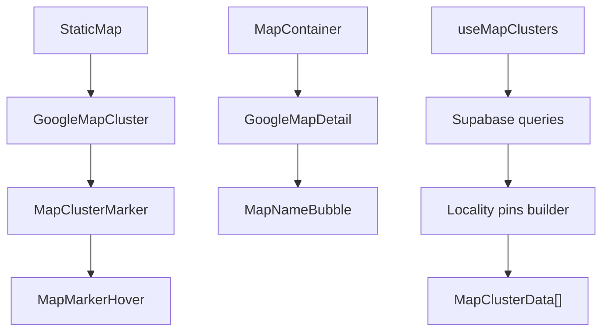
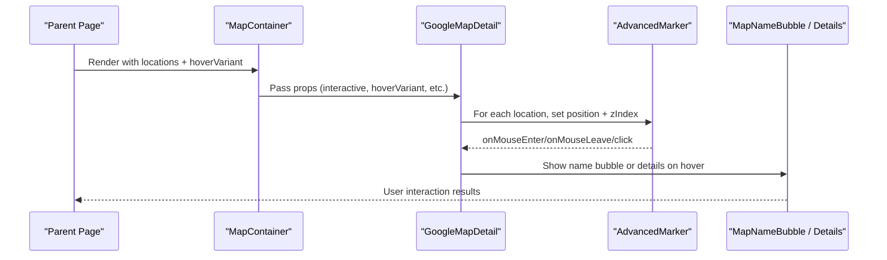
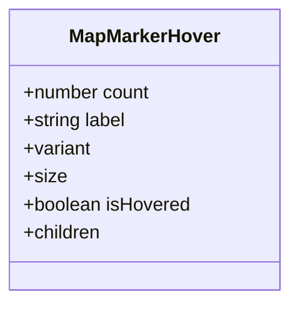
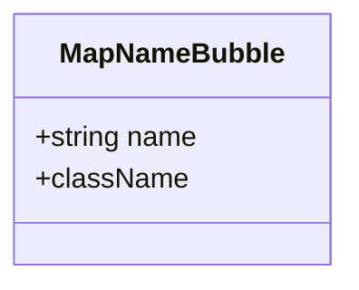
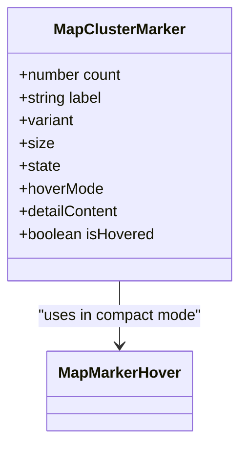
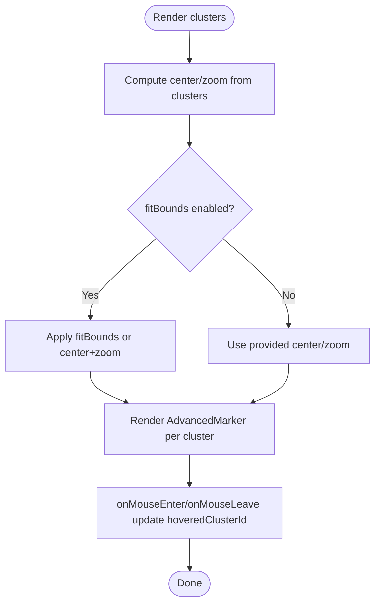
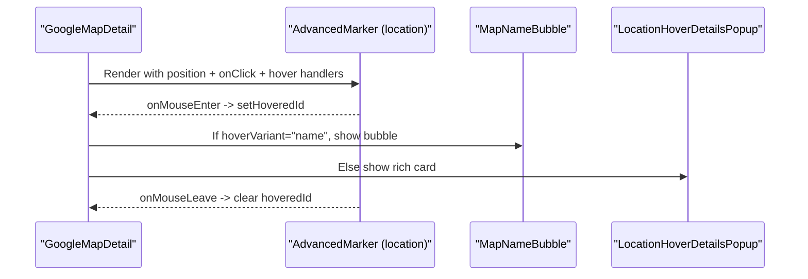
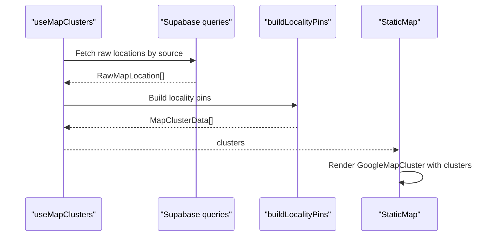
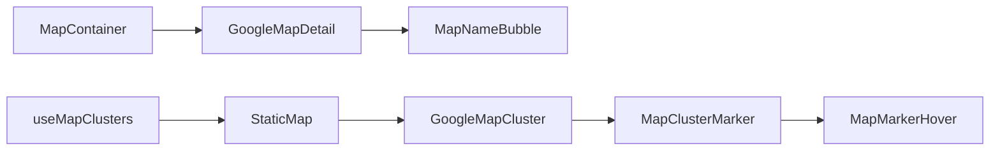

# Marker Management & Customization

<cite>
**Referenced Files in This Document**
- [MapMarkerHover.tsx](file://src/components/ui/map/MapMarkerHover.tsx)
- [MapNameBubble.tsx](file://src/components/ui/map/MapNameBubble.tsx)
- [MapClusterMarker.tsx](file://src/components/ui/map/MapClusterMarker.tsx)
- [GoogleMapCluster.tsx](file://src/components/ui/map/GoogleMapCluster.tsx)
- [StaticMap.tsx](file://src/components/ui/map/StaticMap.tsx)
- [GoogleMapDetail.tsx](file://src/components/ui/map/GoogleMapDetail.tsx)
- [MapContainer.tsx](file://src/components/ui/map/MapContainer.tsx)
- [useMapClusters.ts](file://src/hooks/useMapClusters.ts)
- [globals.css](file://src/app/globals.css)
</cite>

## Table of Contents
1. [Introduction](#introduction)
2. [Project Structure](#project-structure)
3. [Core Components](#core-components)
4. [Architecture Overview](#architecture-overview)
5. [Detailed Component Analysis](#detailed-component-analysis)
6. [Dependency Analysis](#dependency-analysis)
7. [Performance Considerations](#performance-considerations)
8. [Troubleshooting Guide](#troubleshooting-guide)
9. [Conclusion](#conclusion)

## Introduction
This document explains how markers are managed and customized across the map integration, focusing on:
- Enhanced marker interactions and tooltips via MapMarkerHover
- Lightweight location name display via MapNameBubble
- Marker positioning, z-index management, and visual hierarchy
- Creating custom marker icons, handling selection states, implementing hover effects, and managing visibility based on filters
- Performance optimization for large numbers of markers
- Accessibility considerations for screen readers

## Project Structure
The map feature is composed of reusable components that render either a detail-oriented map (itinerary-style pins with rich popups) or a clustered overview map (grouped markers). A container component lazy-loads the appropriate map implementation and manages intersection-based rendering to improve performance.

**Diagram sources**
- [MapContainer.tsx:40-90](file://src/components/ui/map/MapContainer.tsx#L40-L90)
- [GoogleMapDetail.tsx:341-461](file://src/components/ui/map/GoogleMapDetail.tsx#L341-L461)
- [StaticMap.tsx:39-95](file://src/components/ui/map/StaticMap.tsx#L39-L95)
- [GoogleMapCluster.tsx:80-135](file://src/components/ui/map/GoogleMapCluster.tsx#L80-L135)
- [MapClusterMarker.tsx:51-108](file://src/components/ui/map/MapClusterMarker.tsx#L51-L108)
- [MapMarkerHover.tsx:42-72](file://src/components/ui/map/MapMarkerHover.tsx#L42-L72)
- [useMapClusters.ts:35-60](file://src/hooks/useMapClusters.ts#L35-L60)

**Section sources**
- [MapContainer.tsx:1-99](file://src/components/ui/map/MapContainer.tsx#L1-L99)
- [StaticMap.tsx:1-103](file://src/components/ui/map/StaticMap.tsx#L1-L103)
- [GoogleMapDetail.tsx:1-490](file://src/components/ui/map/GoogleMapDetail.tsx#L1-L490)
- [GoogleMapCluster.tsx:1-181](file://src/components/ui/map/GoogleMapCluster.tsx#L1-L181)
- [MapClusterMarker.tsx:1-115](file://src/components/ui/map/MapClusterMarker.tsx#L1-L115)
- [MapMarkerHover.tsx:1-78](file://src/components/ui/map/MapMarkerHover.tsx#L1-L78)
- [useMapClusters.ts:1-61](file://src/hooks/useMapClusters.ts#L1-L61)

## Core Components
- MapMarkerHover: A compact tooltip pill showing a count badge and label, styled with variants and sizes. Used by cluster markers to present contextual info on hover.
- MapNameBubble: A lightweight bubble displaying just the location name above a pin when using the “name” hover variant.
- MapClusterMarker: The interactive marker used in clustered maps; renders an icon and a hover popup (either compact tooltip or full detail content).
- GoogleMapCluster: Renders a Google Map with AdvancedMarker instances for each cluster, computes auto-fit bounds, and wires hover state.
- StaticMap: Lazy-loads the clustered map, tracks viewability, and manages hover state for clusters.
- GoogleMapDetail: Renders individual itinerary/location pins, supports two hover variants (rich card or name bubble), and integrates place search result markers.
- MapContainer: Lazy-loads GoogleMapDetail, observes visibility, and passes props like hoverVariant and highlightedLocationId.

**Section sources**
- [MapMarkerHover.tsx:1-78](file://src/components/ui/map/MapMarkerHover.tsx#L1-L78)
- [MapNameBubble.tsx:1-26](file://src/components/ui/map/MapNameBubble.tsx#L1-L26)
- [MapClusterMarker.tsx:1-115](file://src/components/ui/map/MapClusterMarker.tsx#L1-L115)
- [GoogleMapCluster.tsx:1-181](file://src/components/ui/map/GoogleMapCluster.tsx#L1-L181)
- [StaticMap.tsx:1-103](file://src/components/ui/map/StaticMap.tsx#L1-L103)
- [GoogleMapDetail.tsx:1-490](file://src/components/ui/map/GoogleMapDetail.tsx#L1-L490)
- [MapContainer.tsx:1-99](file://src/components/ui/map/MapContainer.tsx#L1-L99)

## Architecture Overview
The system provides two primary rendering paths:
- Detail map path: MapContainer -> GoogleMapDetail -> AdvancedMarker per location -> optional MapNameBubble or rich LocationHoverDetailsPopup.
- Clustered map path: StaticMap -> GoogleMapCluster -> AdvancedMarker per cluster -> MapClusterMarker -> MapMarkerHover or custom detailContent.

Both paths use theme-aware map IDs and compute initial viewport automatically from data.

**Diagram sources**
- [MapContainer.tsx:45-90](file://src/components/ui/map/MapContainer.tsx#L45-L90)
- [GoogleMapDetail.tsx:341-461](file://src/components/ui/map/GoogleMapDetail.tsx#L341-L461)

## Detailed Component Analysis

### MapMarkerHover
- Purpose: Displays a compact tooltip pill with a count badge and label for cluster markers.
- Props: count, label, variant, size, className, children, isHovered.
- Behavior: Uses class-variance-authority to style based on variant and size; text color adapts by variant.
- Usage: Rendered inside MapClusterMarker’s hover popup in compact mode.

**Diagram sources**
- [MapMarkerHover.tsx:28-40](file://src/components/ui/map/MapMarkerHover.tsx#L28-L40)
- [MapMarkerHover.tsx:42-72](file://src/components/ui/map/MapMarkerHover.tsx#L42-L72)

**Section sources**
- [MapMarkerHover.tsx:1-78](file://src/components/ui/map/MapMarkerHover.tsx#L1-L78)

### MapNameBubble
- Purpose: Lightweight label shown above a pin on hover when hoverVariant="name".
- Props: name, className.
- Behavior: Renders a rounded bubble with a caret below it.

**Diagram sources**
- [MapNameBubble.tsx:5-8](file://src/components/ui/map/MapNameBubble.tsx#L5-L8)
- [MapNameBubble.tsx:15-24](file://src/components/ui/map/MapNameBubble.tsx#L15-L24)

**Section sources**
- [MapNameBubble.tsx:1-26](file://src/components/ui/map/MapNameBubble.tsx#L1-L26)

### MapClusterMarker
- Purpose: Interactive marker for clustered views; shows an icon and a hover popup.
- Props: count, label, variant, size, state, className, hoverMode ("compact" | "detail"), detailContent, isHovered.
- Behavior: Applies emphasis styles when hovered/active; toggles between compact tooltip (MapMarkerHover) or custom detailContent.

**Diagram sources**
- [MapClusterMarker.tsx:35-49](file://src/components/ui/map/MapClusterMarker.tsx#L35-L49)
- [MapClusterMarker.tsx:51-108](file://src/components/ui/map/MapClusterMarker.tsx#L51-L108)

**Section sources**
- [MapClusterMarker.tsx:1-115](file://src/components/ui/map/MapClusterMarker.tsx#L1-L115)

### GoogleMapCluster
- Purpose: Renders a Google Map with clustered markers, computes auto-fit center/zoom, and handles hover state for clusters.
- Key behaviors:
  - Auto-fits bounds or centers on single cluster.
  - Wires mouse enter/leave to update hoveredClusterId in parent.
  - Supports optional zoom controls and detail rendering via renderDetailContent.

**Diagram sources**
- [GoogleMapCluster.tsx:13-45](file://src/components/ui/map/GoogleMapCluster.tsx#L13-L45)
- [GoogleMapCluster.tsx:47-67](file://src/components/ui/map/GoogleMapCluster.tsx#L47-L67)
- [GoogleMapCluster.tsx:80-135](file://src/components/ui/map/GoogleMapCluster.tsx#L80-L135)

**Section sources**
- [GoogleMapCluster.tsx:1-181](file://src/components/ui/map/GoogleMapCluster.tsx#L1-L181)

### StaticMap
- Purpose: Lazy-loads GoogleMapCluster, tracks viewability, and manages hover state for clusters.
- Behavior: Shows loading placeholder until in view; tracks map load events.

**Section sources**
- [StaticMap.tsx:1-103](file://src/components/ui/map/StaticMap.tsx#L1-L103)

### GoogleMapDetail
- Purpose: Renders detailed location pins with hover variants and place search result markers.
- Key behaviors:
  - Computes initial center/zoom from locations.
  - Manages hoveredId for location pins and hoveredSearchId for search result pins.
  - Supports hoverVariant "card" (rich details) or "name" (MapNameBubble).
  - Z-index management:
    - Highlighted location pins get higher z-index than default pins.
    - Search result markers have elevated z-index when hovered.

**Diagram sources**
- [GoogleMapDetail.tsx:341-461](file://src/components/ui/map/GoogleMapDetail.tsx#L341-L461)

**Section sources**
- [GoogleMapDetail.tsx:1-490](file://src/components/ui/map/GoogleMapDetail.tsx#L1-L490)

### MapContainer
- Purpose: Lazy-loads GoogleMapDetail, observes intersection to defer heavy work, and exposes props like hoverVariant and highlightedLocationId.
- Behavior: Tracks map load once visible; renders placeholder while not in view.

**Section sources**
- [MapContainer.tsx:1-99](file://src/components/ui/map/MapContainer.tsx#L1-L99)

### Data Flow for Clusters
- useMapClusters fetches raw locations grouped by locality and builds MapClusterData arrays with consistent variants and sizes.
- StaticMap consumes these clusters and renders them via GoogleMapCluster.

**Diagram sources**
- [useMapClusters.ts:35-60](file://src/hooks/useMapClusters.ts#L35-L60)
- [StaticMap.tsx:39-95](file://src/components/ui/map/StaticMap.tsx#L39-L95)

**Section sources**
- [useMapClusters.ts:1-61](file://src/hooks/useMapClusters.ts#L1-L61)

## Dependency Analysis
- MapContainer depends on GoogleMapDetail and uses intersection observer to defer rendering.
- GoogleMapDetail composes AdvancedMarker instances and conditionally renders MapNameBubble or rich details.
- StaticMap depends on GoogleMapCluster, which composes MapClusterMarker and MapMarkerHover.
- useMapClusters depends on Supabase queries and a locality pins builder to produce standardized cluster data.

**Diagram sources**
- [MapContainer.tsx:40-90](file://src/components/ui/map/MapContainer.tsx#L40-L90)
- [GoogleMapDetail.tsx:341-461](file://src/components/ui/map/GoogleMapDetail.tsx#L341-L461)
- [StaticMap.tsx:39-95](file://src/components/ui/map/StaticMap.tsx#L39-L95)
- [GoogleMapCluster.tsx:80-135](file://src/components/ui/map/GoogleMapCluster.tsx#L80-L135)
- [MapClusterMarker.tsx:51-108](file://src/components/ui/map/MapClusterMarker.tsx#L51-L108)
- [MapMarkerHover.tsx:42-72](file://src/components/ui/map/MapMarkerHover.tsx#L42-L72)
- [useMapClusters.ts:35-60](file://src/hooks/useMapClusters.ts#L35-L60)

**Section sources**
- [MapContainer.tsx:1-99](file://src/components/ui/map/MapContainer.tsx#L1-L99)
- [GoogleMapDetail.tsx:1-490](file://src/components/ui/map/GoogleMapDetail.tsx#L1-L490)
- [StaticMap.tsx:1-103](file://src/components/ui/map/StaticMap.tsx#L1-L103)
- [GoogleMapCluster.tsx:1-181](file://src/components/ui/map/GoogleMapCluster.tsx#L1-L181)
- [MapClusterMarker.tsx:1-115](file://src/components/ui/map/MapClusterMarker.tsx#L1-L115)
- [MapMarkerHover.tsx:1-78](file://src/components/ui/map/MapMarkerHover.tsx#L1-L78)
- [useMapClusters.ts:1-61](file://src/hooks/useMapClusters.ts#L1-L61)

## Performance Considerations
- Lazy loading: Both MapContainer and StaticMap use dynamic imports and intersection observers to avoid loading the map until it is visible.
- Initial viewport calculation: GoogleMapDetail and GoogleMapCluster compute sensible defaults for center and zoom based on data spread to reduce unnecessary panning.
- Minimal DOM overhead: MapNameBubble is intentionally lightweight compared to rich cards; choose hoverVariant="name" for dense datasets.
- Reduced motion: Global CSS respects reduced-motion preferences for animations and transitions.

[No sources needed since this section provides general guidance]

## Troubleshooting Guide
- Markers not appearing: Ensure clusters or locations are non-empty and coordinates are valid; verify API key and map ID environment variables are set.
- Hover not working: Confirm that mouse enter/leave handlers are wired and that the parent state updates hovered ids correctly.
- Z-index stacking issues: In GoogleMapDetail, highlighted pins and hovered search result markers receive elevated z-index values; ensure no parent containers override these with conflicting z-index rules.
- Performance lag with many markers: Prefer clustered views (StaticMap + GoogleMapCluster) for large datasets; use MapNameBubble instead of rich cards where possible.

**Section sources**
- [GoogleMapDetail.tsx:373-461](file://src/components/ui/map/GoogleMapDetail.tsx#L373-L461)
- [GoogleMapCluster.tsx:80-135](file://src/components/ui/map/GoogleMapCluster.tsx#L80-L135)
- [globals.css:1009-1020](file://src/app/globals.css#L1009-L1020)

## Conclusion
The map integration offers flexible marker management through two rendering modes:
- Detailed pins with rich or lightweight hover content
- Clustered markers with compact tooltips or custom detail panels

Z-index and visual hierarchy are handled explicitly to emphasize selected or hovered items. Performance is optimized via lazy loading, viewport calculations, and lightweight hover elements. Accessibility is supported through aria attributes and reduced-motion preferences.

[No sources needed since this section summarizes without analyzing specific files]