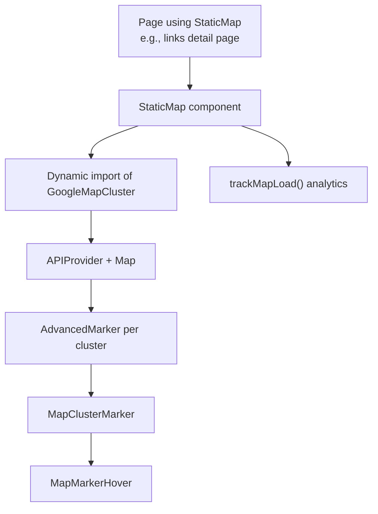
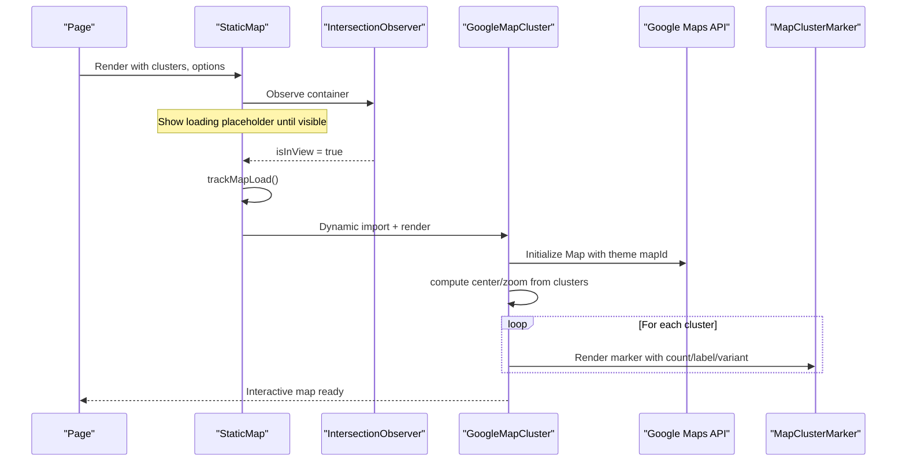
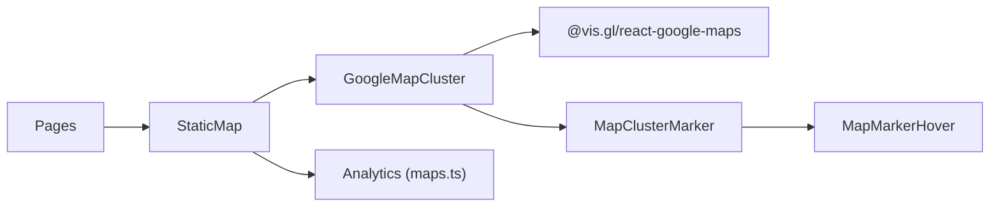

# Static Map Generation

<cite>
**Referenced Files in This Document**
- [StaticMap.tsx](file://src/components/ui/map/StaticMap.tsx)
- [GoogleMapCluster.tsx](file://src/components/ui/map/GoogleMapCluster.tsx)
- [MapClusterMarker.tsx](file://src/components/ui/map/MapClusterMarker.tsx)
- [MapMarkerHover.tsx](file://src/components/ui/map/MapMarkerHover.tsx)
- [maps.ts](file://src/lib/api/maps.ts)
- [google-maps-url.ts](file://src/lib/maps/google-maps-url.ts)
- [page.tsx (links detail)](file://src/app/links/[id]/page.tsx)
</cite>

## Table of Contents
1. [Introduction](#introduction)
2. [Project Structure](#project-structure)
3. [Core Components](#core-components)
4. [Architecture Overview](#architecture-overview)
5. [Detailed Component Analysis](#detailed-component-analysis)
6. [Dependency Analysis](#dependency-analysis)
7. [Performance Considerations](#performance-considerations)
8. [Troubleshooting Guide](#troubleshooting-guide)
9. [Conclusion](#conclusion)
10. [Appendices](#appendices)

## Introduction
This document explains the static map generation functionality used for sharing and embedding maps. It focuses on the StaticMap component implementation, parameter configuration for appearance and markers, image optimization strategies, and performance considerations for batch processing. It also covers practical use cases such as email previews, social media sharing, and print-friendly exports, along with caching strategies to reduce costs and improve responsiveness.

## Project Structure
The static map feature is implemented as a client-side React component that renders an interactive Google Map via dynamic import. The component:
- Lazily loads the underlying map library only when visible
- Renders cluster markers with hover states and optional detail content
- Tracks analytics on first render
- Supports theme-aware map styles via environment variables

**Diagram sources**
- [StaticMap.tsx:34-93](file://src/components/ui/map/StaticMap.tsx#L34-L93)
- [GoogleMapCluster.tsx:9-180](file://src/components/ui/map/GoogleMapCluster.tsx#L9-L180)
- [MapClusterMarker.tsx:51-113](file://src/components/ui/map/MapClusterMarker.tsx#L51-L113)
- [MapMarkerHover.tsx:42-76](file://src/components/ui/map/MapMarkerHover.tsx#L42-L76)
- [maps.ts:11-33](file://src/lib/api/maps.ts#L11-L33)
- [page.tsx (links detail):624-631](file://src/app/links/[id]/page.tsx#L624-L631)

**Section sources**
- [StaticMap.tsx:21-99](file://src/components/ui/map/StaticMap.tsx#L21-L99)
- [GoogleMapCluster.tsx:13-135](file://src/components/ui/map/GoogleMapCluster.tsx#L13-L135)
- [page.tsx (links detail):624-631](file://src/app/links/[id]/page.tsx#L624-L631)

## Core Components
- StaticMap: A container that defers loading the map until it enters the viewport and renders a placeholder while loading. It passes cluster data, center, zoom, interactivity, fit-bounds behavior, and custom detail rendering to the underlying map component.
- GoogleMapCluster: Wraps the Google Maps API, computes auto view (center/zoom), applies theme-based map IDs, renders AdvancedMarker elements for each cluster, and optionally shows zoom controls.
- MapClusterMarker: Renders the marker icon and manages hover state transitions.
- MapMarkerHover: Displays compact hover badges or full detail content based on mode.

Key props and behaviors:
- clusters: Array of cluster items with id, count, label, latitude, longitude, variant, size, state, filterValue
- center?: [lat, lng], zoom?: number
- height?: number|string; className?: string
- onClusterClick?(cluster)
- interactive?: boolean (enables gestures and zoom controls)
- fitBounds?: boolean (auto-fit to all clusters)
- renderDetailContent?(cluster) -> ReactNode
- showZoomControls?: boolean (defaults to interactive)

**Section sources**
- [StaticMap.tsx:21-99](file://src/components/ui/map/StaticMap.tsx#L21-L99)
- [GoogleMapCluster.tsx:69-135](file://src/components/ui/map/GoogleMapCluster.tsx#L69-L135)
- [MapClusterMarker.tsx:35-113](file://src/components/ui/map/MapClusterMarker.tsx#L35-L113)
- [MapMarkerHover.tsx:28-76](file://src/components/ui/map/MapMarkerHover.tsx#L28-L76)

## Architecture Overview
The architecture uses lazy loading and intersection observation to minimize initial bundle size and network requests. When the map becomes visible, it tracks usage and renders the map with computed bounds and markers.

**Diagram sources**
- [StaticMap.tsx:52-93](file://src/components/ui/map/StaticMap.tsx#L52-L93)
- [GoogleMapCluster.tsx:13-135](file://src/components/ui/map/GoogleMapCluster.tsx#L13-L135)
- [maps.ts:11-33](file://src/lib/api/maps.ts#L11-L33)

## Detailed Component Analysis

### StaticMap
Responsibilities:
- Lazy load the map component only when needed
- Provide a loading placeholder until the map is visible
- Track map load analytics once visible
- Pass through cluster data and configuration to the underlying map

Configuration highlights:
- Height can be numeric pixels or CSS string
- Fit bounds automatically adjusts view to include all clusters unless disabled
- Interactivity toggles gesture handling and zoom controls
- Custom detail content can be injected per cluster

Usage example reference:
- Embedded in a link detail hero area with fit bounds enabled

**Section sources**
- [StaticMap.tsx:21-99](file://src/components/ui/map/StaticMap.tsx#L21-L99)
- [page.tsx (links detail):624-631](file://src/app/links/[id]/page.tsx#L624-L631)

### GoogleMapCluster
Responsibilities:
- Wrap the Google Maps API provider with theme-aware map IDs
- Compute default center and zoom based on cluster spread
- Apply fit-bounds logic when requested
- Render markers and optional zoom controls

Behavior details:
- Auto view calculation chooses a zoom level based on geographic spread
- Gesture handling is disabled by default; enable via interactive prop
- Theme selection switches between light/dark map IDs from environment variables

**Section sources**
- [GoogleMapCluster.tsx:9-135](file://src/components/ui/map/GoogleMapCluster.tsx#L9-L135)

### MapClusterMarker and MapMarkerHover
Responsibilities:
- Render a consistent marker icon with hover emphasis
- Display compact hover badge or full detail content depending on mode
- Support variants and sizes for visual consistency

**Section sources**
- [MapClusterMarker.tsx:51-113](file://src/components/ui/map/MapClusterMarker.tsx#L51-L113)
- [MapMarkerHover.tsx:42-76](file://src/components/ui/map/MapMarkerHover.tsx#L42-L76)

### Analytics and URL Utilities
- trackMapLoad(): Increments monthly usage counters for map loads via Supabase RPCs
- looksLikeGoogleMapsUrl(): Validates URLs against known Google Maps hosts

**Section sources**
- [maps.ts:11-33](file://src/lib/api/maps.ts#L11-L33)
- [google-maps-url.ts:1-12](file://src/lib/maps/google-maps-url.ts#L1-L12)

## Dependency Analysis
The components form a clear dependency chain with minimal coupling:
- StaticMap depends on GoogleMapCluster (dynamic import) and analytics
- GoogleMapCluster depends on Google Maps API via @vis.gl/react-google-maps
- Markers depend on shared UI primitives and hover components
- Pages consume StaticMap with cluster data and configuration

**Diagram sources**
- [StaticMap.tsx:34-93](file://src/components/ui/map/StaticMap.tsx#L34-L93)
- [GoogleMapCluster.tsx:9-180](file://src/components/ui/map/GoogleMapCluster.tsx#L9-L180)
- [MapClusterMarker.tsx:51-113](file://src/components/ui/map/MapClusterMarker.tsx#L51-L113)
- [MapMarkerHover.tsx:42-76](file://src/components/ui/map/MapMarkerHover.tsx#L42-L76)
- [maps.ts:11-33](file://src/lib/api/maps.ts#L11-L33)

**Section sources**
- [StaticMap.tsx:34-93](file://src/components/ui/map/StaticMap.tsx#L34-L93)
- [GoogleMapCluster.tsx:9-180](file://src/components/ui/map/GoogleMapCluster.tsx#L9-L180)

## Performance Considerations
- Lazy loading: The map component is dynamically imported and only rendered when visible, reducing initial bundle size and avoiding unnecessary API calls.
- Intersection observer: Prevents map initialization until the container is in view, improving perceived performance.
- Fit bounds vs manual center/zoom: Use fitBounds for multi-cluster views to avoid excessive reflows; for single markers, set explicit center and zoom for faster rendering.
- Marker density: Large numbers of clusters increase DOM nodes and interactions. Consider clustering at the data layer before passing to the map.
- Theme switching: Map ID selection is lightweight; ensure map IDs are preconfigured for both themes to avoid runtime lookups.
- Batch processing: When generating many maps (e.g., for export), reuse cluster computations and avoid redundant API calls. Defer heavy operations until necessary.

[No sources needed since this section provides general guidance]

## Troubleshooting Guide
Common issues and resolutions:
- Map not loading: Ensure the container has a defined height and is visible; check that the dynamic import resolves and the API key is configured.
- Incorrect view: If fitBounds is enabled but no clusters exist, verify cluster data contains valid lat/lng values.
- Missing markers: Confirm clusters array is non-empty and each item includes required fields (id, latitude, longitude).
- Analytics not tracking: trackMapLoad runs only when the map is in view; verify intersection observer triggers and user is authenticated if required by backend.

**Section sources**
- [StaticMap.tsx:52-93](file://src/components/ui/map/StaticMap.tsx#L52-L93)
- [GoogleMapCluster.tsx:13-67](file://src/components/ui/map/GoogleMapCluster.tsx#L13-L67)
- [maps.ts:11-33](file://src/lib/api/maps.ts#L11-L33)

## Conclusion
The StaticMap component provides a performant, theme-aware, and configurable way to render maps for sharing and embedding. By leveraging lazy loading, intersection observation, and sensible defaults for center/zoom and fit bounds, it balances usability and performance. For production scenarios involving large datasets or high-frequency rendering, apply clustering at the data layer and consider server-side image generation for static outputs like emails and print exports.

[No sources needed since this section summarizes without analyzing specific files]

## Appendices

### Parameter Configuration Reference
- clusters: Array of cluster objects with id, count, label, latitude, longitude, variant, size, state, filterValue
- center?: [latitude, longitude]
- zoom?: number
- height?: number|string
- className?: string
- onClusterClick?(cluster)
- interactive?: boolean
- fitBounds?: boolean
- renderDetailContent?(cluster) -> ReactNode
- showZoomControls?: boolean

**Section sources**
- [StaticMap.tsx:21-32](file://src/components/ui/map/StaticMap.tsx#L21-L32)
- [GoogleMapCluster.tsx:69-135](file://src/components/ui/map/GoogleMapCluster.tsx#L69-L135)

### Use Cases and Examples
- Email previews: Render a static snapshot of the map region using fitBounds and a fixed height; generate an image server-side for reliable delivery across clients.
- Social media sharing: Use a compact view with a few key clusters and a centered focus; optimize image dimensions for platform requirements.
- Print-friendly exports: Generate high-resolution images with appropriate DPI and color profiles; prefer vector or raster formats suitable for print.

[No sources needed since this section provides conceptual guidance]

### Image Optimization and High-Resolution Displays
- Choose appropriate image formats (WebP/AVIF) and compression levels for web delivery.
- For high-DPI displays, serve appropriately sized images or use responsive techniques.
- For server-side generation, scale images to target dimensions and compress to balance quality and file size.

[No sources needed since this section provides general guidance]

### Caching Strategies
- Client-side: Defer map initialization until visible; reuse cluster computations across renders.
- Server-side: Cache generated map images keyed by parameters (center, zoom, clusters hash, style).
- CDN: Serve cached images via CDN for global distribution and reduced latency.

[No sources needed since this section provides general guidance]