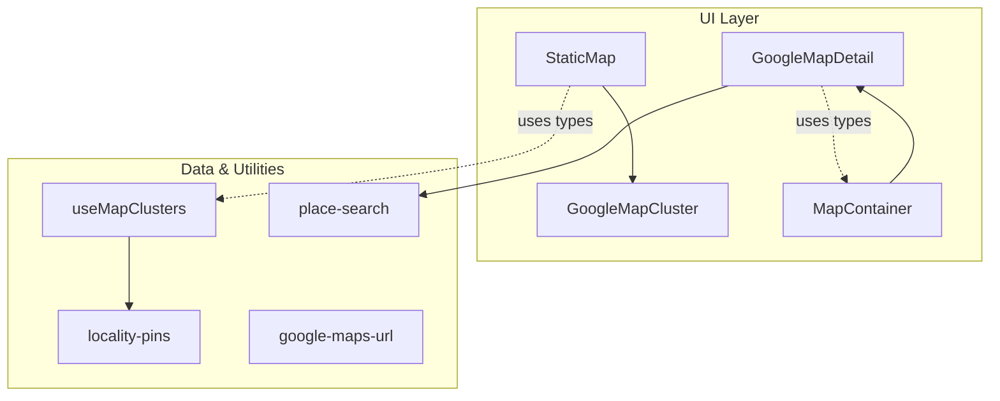
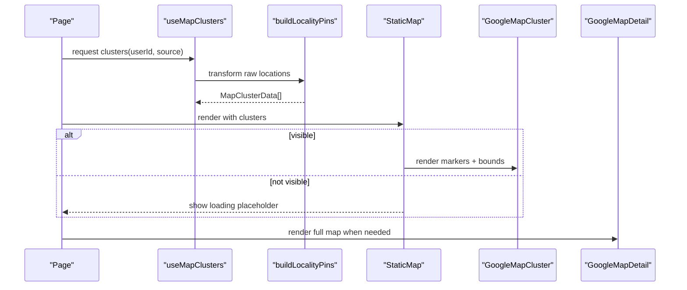
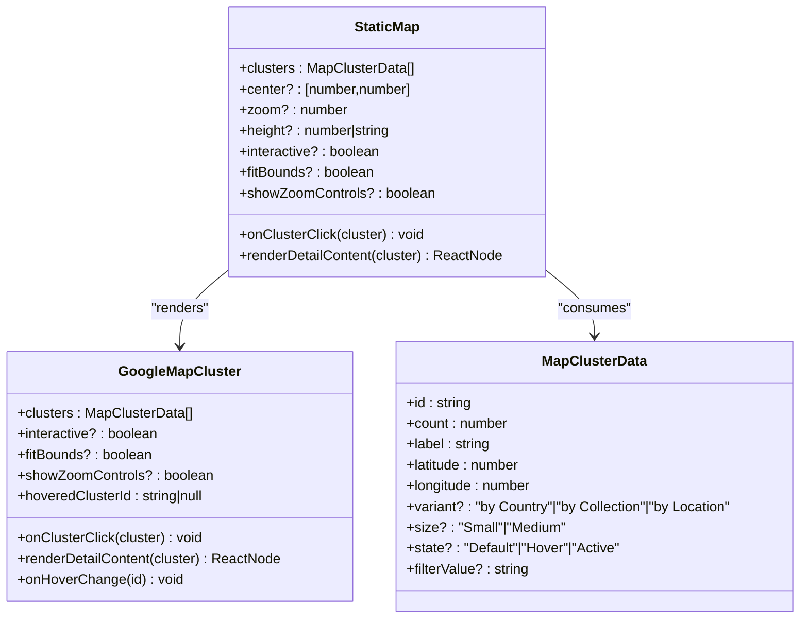
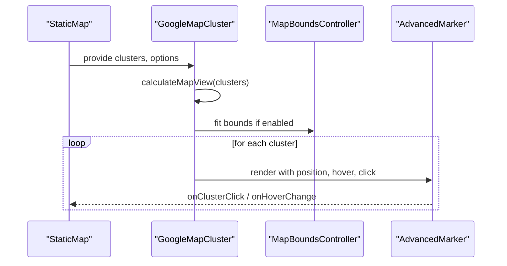
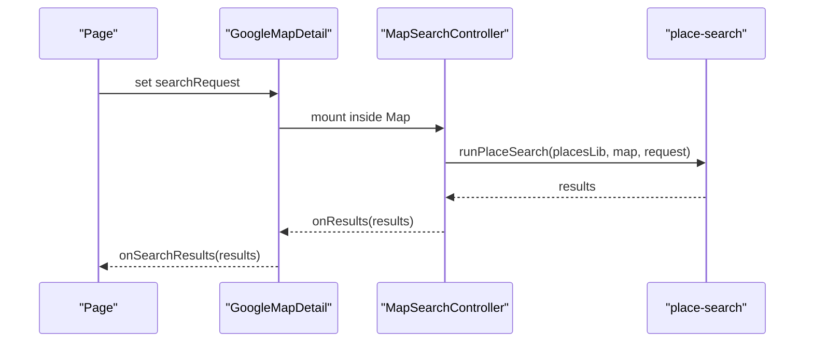

# Static Maps

<cite>
**Referenced Files in This Document**
- [StaticMap.tsx](file://src/components/ui/map/StaticMap.tsx)
- [GoogleMapCluster.tsx](file://src/components/ui/map/GoogleMapCluster.tsx)
- [GoogleMapDetail.tsx](file://src/components/ui/map/GoogleMapDetail.tsx)
- [MapContainer.tsx](file://src/components/ui/map/MapContainer.tsx)
- [MapClusterMarker.tsx](file://src/components/ui/map/MapClusterMarker.tsx)
- [MapMarkerHover.tsx](file://src/components/ui/map/MapMarkerHover.tsx)
- [useMapClusters.ts](file://src/hooks/useMapClusters.ts)
- [locality-pins.ts](file://src/lib/maps/locality-pins.ts)
- [google-maps-url.ts](file://src/lib/maps/google-maps-url.ts)
- [place-search.ts](file://src/lib/maps/place-search.ts)
</cite>

## Table of Contents
1. Introduction
2. Project Structure
3. Core Components
4. Architecture Overview
5. Detailed Component Analysis
6. Dependency Analysis
7. Performance Considerations
8. Troubleshooting Guide
9. Conclusion
10. Appendices

## Introduction
This document explains Argo’s static map generation system and the related interactive map components used for thumbnails, previews, and detailed views. It focuses on:
- The StaticMap component that renders lightweight cluster-based maps suitable for thumbnails and previews.
- The MapClusterData interface and how it is built from raw data into presentation-ready clusters.
- The GoogleMapDetail component for rich, interactive map experiences with enhanced information display.
- Integration points with Google Maps via environment-configured API keys and map styles.
- Rendering optimization techniques such as lazy loading, intersection-based rendering, and bounds auto-fitting.
- Practical examples for generating map thumbnails, customizing appearance, and optimizing load times for map-heavy pages.

Note: The codebase implements interactive map rendering using Google Maps JavaScript (via a React wrapper). There is no server-side static image generation pipeline present in this repository. “Static” refers to non-interactive or lazily loaded map surfaces optimized for performance.

## Project Structure
The map-related functionality is organized under src/components/ui/map and supported by hooks and utilities:
- StaticMap: A lazy-loaded container that renders either a placeholder or an interactive cluster map when visible.
- GoogleMapCluster: Renders clustered markers with hover states and optional zoom controls.
- GoogleMapDetail: Full-featured interactive map with pins, polylines, search, and detail popups.
- MapContainer: Lazy-loading wrapper around GoogleMapDetail for efficient rendering.
- useMapClusters: Data hook that fetches and builds locality-based clusters for display.
- locality-pins: Groups raw locations into clusters by region/country and computes centroid coordinates.
- google-maps-url: Utility to validate Google Maps URLs.
- place-search: Viewport-biased place search integration used by GoogleMapDetail.

**Diagram sources**
- [StaticMap.tsx:1-103](file://src/components/ui/map/StaticMap.tsx#L1-L103)
- [GoogleMapCluster.tsx:1-181](file://src/components/ui/map/GoogleMapCluster.tsx#L1-L181)
- [GoogleMapDetail.tsx:1-490](file://src/components/ui/map/GoogleMapDetail.tsx#L1-L490)
- [MapContainer.tsx:1-99](file://src/components/ui/map/MapContainer.tsx#L1-L99)
- [useMapClusters.ts:1-61](file://src/hooks/useMapClusters.ts#L1-L61)
- [locality-pins.ts:1-78](file://src/lib/maps/locality-pins.ts#L1-L78)
- [place-search.ts](file://src/lib/maps/place-search.ts)
- [google-maps-url.ts:1-12](file://src/lib/maps/google-maps-url.ts#L1-L12)

**Section sources**
- [StaticMap.tsx:1-103](file://src/components/ui/map/StaticMap.tsx#L1-L103)
- [GoogleMapCluster.tsx:1-181](file://src/components/ui/map/GoogleMapCluster.tsx#L1-L181)
- [GoogleMapDetail.tsx:1-490](file://src/components/ui/map/GoogleMapDetail.tsx#L1-L490)
- [MapContainer.tsx:1-99](file://src/components/ui/map/MapContainer.tsx#L1-L99)
- [useMapClusters.ts:1-61](file://src/hooks/useMapClusters.ts#L1-L61)
- [locality-pins.ts:1-78](file://src/lib/maps/locality-pins.ts#L1-L78)
- [google-maps-url.ts:1-12](file://src/lib/maps/google-maps-url.ts#L1-L12)

## Core Components
- StaticMap: Provides a lightweight, lazily rendered map surface for thumbnails and previews. It uses an intersection observer to defer loading until the map is visible and tracks map loads for analytics. It accepts MapClusterData arrays and can render interactive clusters if enabled.
- GoogleMapCluster: Renders AdvancedMarker instances for each cluster, computes initial view based on cluster spread, supports fitBounds, hover states, and optional zoom controls.
- GoogleMapDetail: Full-featured interactive map with location pins, route polylines, place search, and rich hover details. It manages viewport, default center/zoom, and theme-aware styling.
- MapContainer: Wraps GoogleMapDetail with lazy loading and intersection-based rendering to optimize performance on pages with multiple maps.
- useMapClusters: Fetches raw location data and transforms it into MapClusterData via buildLocalityPins, enabling consistent cluster presentation across dashboards, collections, content, and itineraries.
- locality-pins: Groups entities by region/country labels, computes centroids, and produces MapClusterData arrays along with entity-to-locality mappings.

Key interfaces:
- MapClusterData: Defines cluster identity, count, label, coordinates, variant, size, state, and filter value.
- MapLocation and MapPolylineSegment: Define pin and route segment structures used by GoogleMapDetail and MapContainer.

**Section sources**
- [StaticMap.tsx:9-32](file://src/components/ui/map/StaticMap.tsx#L9-L32)
- [StaticMap.tsx:39-99](file://src/components/ui/map/StaticMap.tsx#L39-L99)
- [GoogleMapCluster.tsx:13-45](file://src/components/ui/map/GoogleMapCluster.tsx#L13-L45)
- [GoogleMapCluster.tsx:69-136](file://src/components/ui/map/GoogleMapCluster.tsx#L69-L136)
- [GoogleMapDetail.tsx:254-287](file://src/components/ui/map/GoogleMapDetail.tsx#L254-L287)
- [MapContainer.tsx:10-38](file://src/components/ui/map/MapContainer.tsx#L10-L38)
- [useMapClusters.ts:16-60](file://src/hooks/useMapClusters.ts#L16-L60)
- [locality-pins.ts:14-77](file://src/lib/maps/locality-pins.ts#L14-L77)

## Architecture Overview
The architecture separates data preparation from rendering:
- Data layer: useMapClusters queries Supabase and calls buildLocalityPins to produce MapClusterData arrays.
- Presentation layer: StaticMap renders a lazily loaded GoogleMapCluster; MapContainer renders a lazily loaded GoogleMapDetail.
- Interaction layer: GoogleMapDetail integrates place search and rich hover details; GoogleMapCluster provides cluster interactions and optional zoom controls.
- Environment configuration: API key and map style IDs are read from environment variables and applied at runtime.

**Diagram sources**
- [useMapClusters.ts:35-60](file://src/hooks/useMapClusters.ts#L35-L60)
- [locality-pins.ts:28-77](file://src/lib/maps/locality-pins.ts#L28-L77)
- [StaticMap.tsx:39-99](file://src/components/ui/map/StaticMap.tsx#L39-L99)
- [GoogleMapCluster.tsx:69-136](file://src/components/ui/map/GoogleMapCluster.tsx#L69-L136)
- [GoogleMapDetail.tsx:289-463](file://src/components/ui/map/GoogleMapDetail.tsx#L289-L463)

## Detailed Component Analysis

### StaticMap Component
Responsibilities:
- Lazily load the interactive cluster map only when the container is in view.
- Track map load events for analytics.
- Manage hover state for cluster markers and pass them down to child components.
- Provide props for center, zoom, height, interactivity, fit bounds, and detail rendering.

Rendering flow:
- If not in view, show a loading placeholder.
- If in view, dynamically import and render GoogleMapCluster with provided clusters and options.

Optimization techniques:
- IntersectionObserver-based lazy loading reduces initial bundle and SDK load.
- Dynamic imports defer heavy dependencies until needed.
- Minimal state management keeps re-renders lean.

Usage example (conceptual):
- Pass MapClusterData[] from useMapClusters to StaticMap to render a thumbnail-style map.
- Set interactive=false for preview-only behavior; enable showZoomControls when interactive=true.

**Section sources**
- [StaticMap.tsx:1-103](file://src/components/ui/map/StaticMap.tsx#L1-L103)

#### Class Diagram: StaticMap and Related Types

**Diagram sources**
- [StaticMap.tsx:9-32](file://src/components/ui/map/StaticMap.tsx#L9-L32)
- [StaticMap.tsx:39-99](file://src/components/ui/map/StaticMap.tsx#L39-L99)
- [GoogleMapCluster.tsx:69-172](file://src/components/ui/map/GoogleMapCluster.tsx#L69-L172)

### GoogleMapCluster Component
Responsibilities:
- Compute initial map view based on cluster distribution.
- Render AdvancedMarker instances for each cluster with hover states.
- Optionally fit bounds to encompass all clusters.
- Provide zoom controls when interactive mode is enabled.

View calculation:
- For zero clusters, return a default center and low zoom.
- For one cluster, center and zoom to highlight it.
- For multiple clusters, compute bounding box and choose zoom based on geographic spread.

Interaction:
- Hover changes propagate up to StaticMap to manage marker emphasis.
- Click handlers allow drill-down or selection logic.

**Section sources**
- [GoogleMapCluster.tsx:13-45](file://src/components/ui/map/GoogleMapCluster.tsx#L13-L45)
- [GoogleMapCluster.tsx:47-67](file://src/components/ui/map/GoogleMapCluster.tsx#L47-L67)
- [GoogleMapCluster.tsx:69-136](file://src/components/ui/map/GoogleMapCluster.tsx#L69-L136)
- [GoogleMapCluster.tsx:138-159](file://src/components/ui/map/GoogleMapCluster.tsx#L138-L159)

#### Sequence Diagram: Cluster Rendering Flow

**Diagram sources**
- [GoogleMapCluster.tsx:13-45](file://src/components/ui/map/GoogleMapCluster.tsx#L13-L45)
- [GoogleMapCluster.tsx:47-67](file://src/components/ui/map/GoogleMapCluster.tsx#L47-L67)
- [GoogleMapCluster.tsx:109-136](file://src/components/ui/map/GoogleMapCluster.tsx#L109-L136)

### GoogleMapDetail Component
Responsibilities:
- Render a full interactive map with location pins, route polylines, and place search.
- Manage default center/zoom and animated bounds transitions.
- Expose place search runner and place details fetcher to parent components.
- Support hover variants for lightweight name bubbles or rich detail cards.

Key features:
- Theme-aware map ID selection for light/dark modes.
- Automatic zoom estimation based on location spread.
- Place search controller runs against current viewport and updates result markers.
- Rich hover details include images, addresses, opening hours, and actions.

Integration points:
- Uses environment variables for API key and map style IDs.
- Integrates with place-search utility for Enterprise Places requests.
- Tracks search mode for analytics.

**Section sources**
- [GoogleMapDetail.tsx:23-25](file://src/components/ui/map/GoogleMapDetail.tsx#L23-L25)
- [GoogleMapDetail.tsx:27-54](file://src/components/ui/map/GoogleMapDetail.tsx#L27-L54)
- [GoogleMapDetail.tsx:105-151](file://src/components/ui/map/GoogleMapDetail.tsx#L105-L151)
- [GoogleMapDetail.tsx:153-184](file://src/components/ui/map/GoogleMapDetail.tsx#L153-L184)
- [GoogleMapDetail.tsx:289-463](file://src/components/ui/map/GoogleMapDetail.tsx#L289-L463)
- [GoogleMapDetail.tsx:465-490](file://src/components/ui/map/GoogleMapDetail.tsx#L465-L490)

#### Sequence Diagram: Place Search Flow

**Diagram sources**
- [GoogleMapDetail.tsx:105-151](file://src/components/ui/map/GoogleMapDetail.tsx#L105-L151)
- [place-search.ts](file://src/lib/maps/place-search.ts)

### MapContainer Component
Responsibilities:
- Wrap GoogleMapDetail with lazy loading and intersection-based rendering.
- Track map load events when the map becomes visible.
- Provide eager rendering option for off-screen panels or picture-in-picture contexts.

Optimization techniques:
- IntersectionObserver defers SDK initialization until the map is visible.
- Dynamic import reduces initial payload.
- Placeholder UI improves perceived performance.

**Section sources**
- [MapContainer.tsx:1-99](file://src/components/ui/map/MapContainer.tsx#L1-L99)

### MapClusterMarker and MapMarkerHover
Responsibilities:
- Render cluster marker icons with hover emphasis and accessible labels.
- Display compact hover badges with count and label or delegate to custom detail content.

Styling:
- Use variant and size classes to adapt appearance.
- Hover visibility toggles via CSS classes controlled by isHovered state.

**Section sources**
- [MapClusterMarker.tsx:1-115](file://src/components/ui/map/MapClusterMarker.tsx#L1-L115)
- [MapMarkerHover.tsx:1-78](file://src/components/ui/map/MapMarkerHover.tsx#L1-L78)

## Dependency Analysis
Component relationships and coupling:
- StaticMap depends on GoogleMapCluster and MapClusterData types.
- GoogleMapCluster depends on AdvancedMarker and theme-aware map IDs.
- GoogleMapDetail depends on place-search and exposes runners/fetchers to parents.
- useMapClusters depends on Supabase queries and buildLocalityPins to produce MapClusterData.
- MapContainer depends on GoogleMapDetail and intersection observation.

External integrations:
- Google Maps JavaScript via APIProvider with environment-configured API key and map IDs.
- Place search via place-search utility for Enterprise Places.
- Analytics tracking for map loads and place searches.

Potential circular dependencies:
- None observed; components communicate through props and callbacks.

**Section sources**
- [StaticMap.tsx:1-103](file://src/components/ui/map/StaticMap.tsx#L1-L103)
- [GoogleMapCluster.tsx:1-181](file://src/components/ui/map/GoogleMapCluster.tsx#L1-L181)
- [GoogleMapDetail.tsx:1-490](file://src/components/ui/map/GoogleMapDetail.tsx#L1-L490)
- [MapContainer.tsx:1-99](file://src/components/ui/map/MapContainer.tsx#L1-L99)
- [useMapClusters.ts:1-61](file://src/hooks/useMapClusters.ts#L1-L61)
- [locality-pins.ts:1-78](file://src/lib/maps/locality-pins.ts#L1-L78)

## Performance Considerations
- Lazy loading: Both StaticMap and MapContainer use intersection observers to defer rendering until visible, reducing initial load time and SDK usage.
- Dynamic imports: Heavy map components are imported on demand, minimizing bundle size.
- Bounds auto-fit: GoogleMapCluster and GoogleMapDetail compute optimal zoom and center based on data spread, avoiding manual tuning.
- Hover optimization: Lightweight name bubbles reduce DOM overhead for dense datasets.
- Caching strategies:
  - Session-level memoization for photo lookups exists in other parts of the app; similar patterns can be applied to map-related caches (e.g., place search results) if needed.
  - Query caching via React Query in useMapClusters prevents redundant data fetching.
- Large datasets:
  - Prefer clustering by locality to reduce marker count.
  - Use fitBounds sparingly; large sets benefit from computed initial views rather than repeated recalculations.
  - Avoid eager rendering for off-screen maps; rely on intersection-based loading.

[No sources needed since this section provides general guidance]

## Troubleshooting Guide
Common issues and resolutions:
- Map does not render:
  - Ensure the container has a defined height and is visible before rendering.
  - Verify environment variables for API key and map IDs are set correctly.
- Place search returns no results:
  - Confirm the places library is loaded before running searches.
  - Check that the request includes valid query or included types.
- Excessive re-renders:
  - Stabilize callback identities and avoid passing new objects on every render.
  - Use refs for unstable callbacks where appropriate.
- Incorrect bounds or zoom:
  - Review estimateZoom logic and adjust thresholds if necessary for specific datasets.
  - Use fitBoundsKey to force re-fitting when data changes.

**Section sources**
- [GoogleMapDetail.tsx:105-151](file://src/components/ui/map/GoogleMapDetail.tsx#L105-L151)
- [GoogleMapDetail.tsx:27-54](file://src/components/ui/map/GoogleMapDetail.tsx#L27-L54)
- [StaticMap.tsx:39-99](file://src/components/ui/map/StaticMap.tsx#L39-L99)
- [MapContainer.tsx:45-99](file://src/components/ui/map/MapContainer.tsx#L45-L99)

## Conclusion
Argo’s map system combines lightweight, lazily loaded cluster maps for thumbnails and previews with a rich, interactive map for detailed views. The design emphasizes performance through lazy loading, dynamic imports, and intelligent bounds calculations. Data preparation via useMapClusters and buildLocalityPins ensures consistent cluster presentation across features. While there is no server-side static image generation in this repository, the components effectively simulate “static” experiences by deferring heavy work until necessary and optimizing rendering for large datasets.

[No sources needed since this section summarizes without analyzing specific files]

## Appendices

### Examples and Best Practices

- Generating map thumbnails:
  - Use StaticMap with clusters from useMapClusters and interactive=false to render a lightweight preview.
  - Set a fixed height and disable fitBounds if you want a consistent thumbnail size.
  - Reference: [StaticMap.tsx:21-32](file://src/components/ui/map/StaticMap.tsx#L21-L32), [useMapClusters.ts:35-60](file://src/hooks/useMapClusters.ts#L35-L60)

- Customizing static map appearance:
  - Adjust cluster size and variant via MapClusterData properties.
  - Toggle hoverMode between compact and detail for different tooltip behaviors.
  - Reference: [MapClusterMarker.tsx:8-33](file://src/components/ui/map/MapClusterMarker.tsx#L8-L33), [MapMarkerHover.tsx:7-26](file://src/components/ui/map/MapMarkerHover.tsx#L7-L26)

- Optimizing load times for map-heavy pages:
  - Rely on intersection-based lazy loading in StaticMap and MapContainer.
  - Use eager=true only for off-screen panels that must render immediately.
  - Reference: [StaticMap.tsx:52-99](file://src/components/ui/map/StaticMap.tsx#L52-L99), [MapContainer.tsx:45-99](file://src/components/ui/map/MapContainer.tsx#L45-L99)

- Using MapClusterData:
  - Build clusters with buildLocalityPins to group entities by region/country and compute centroids.
  - Reference: [locality-pins.ts:28-77](file://src/lib/maps/locality-pins.ts#L28-L77)

- Validating Google Maps links:
  - Use looksLikeGoogleMapsUrl to ensure URLs resolve to recognized hosts.
  - Reference: [google-maps-url.ts:1-12](file://src/lib/maps/google-maps-url.ts#L1-L12)

[No sources needed since this section provides general guidance]