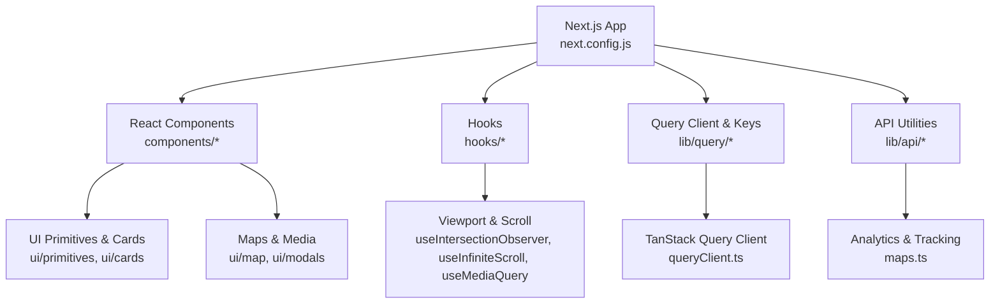
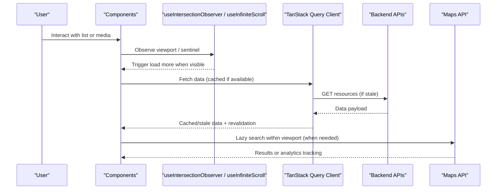
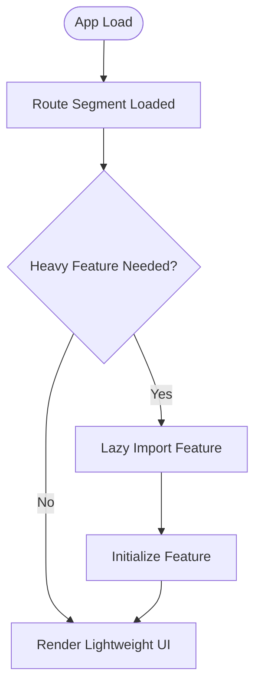
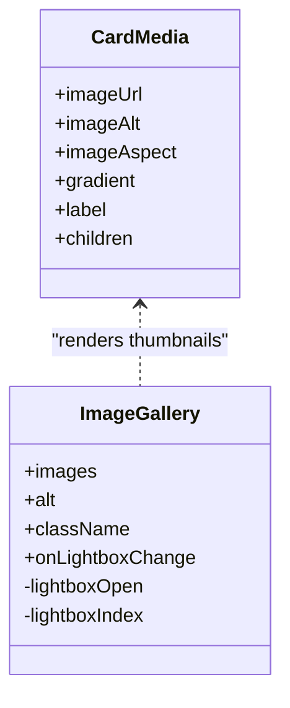
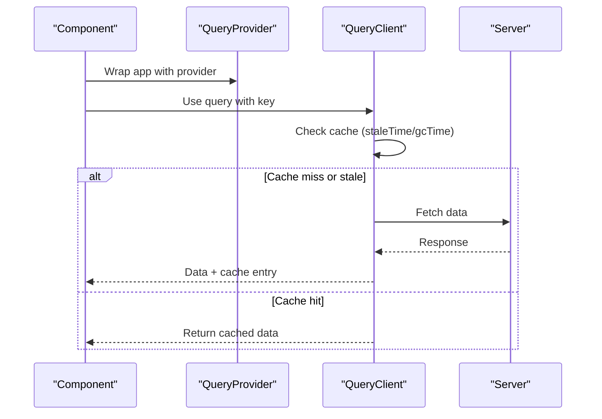
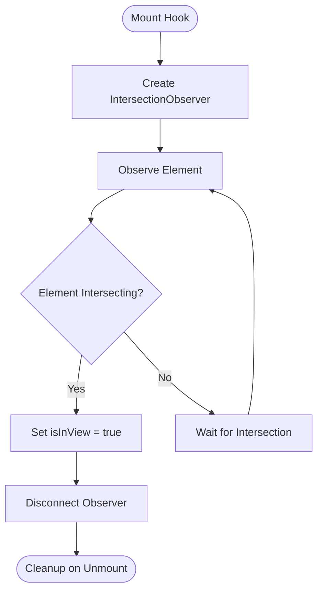
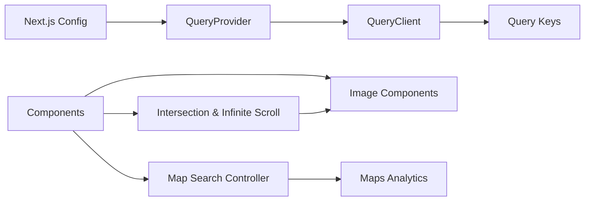

# Performance Optimization

<cite>
**Referenced Files in This Document**
- [next.config.js](file://next.config.js)
- [package.json](file://package.json)
- [QueryProvider.tsx](file://src/components/QueryProvider.tsx)
- [queryClient.ts](file://src/lib/query/queryClient.ts)
- [queryKeys.ts](file://src/lib/query/queryKeys.ts)
- [useIntersectionObserver.ts](file://src/hooks/useIntersectionObserver.ts)
- [useInfiniteScroll.ts](file://src/hooks/useInfiniteScroll.ts)
- [CardMedia.tsx](file://src/components/ui/cards/CardMedia.tsx)
- [ImageGallery.tsx](file://src/components/ui/modals/ImageGallery.tsx)
- [GoogleMapDetail.tsx](file://src/components/ui/map/GoogleMapDetail.tsx)
- [maps.ts](file://src/lib/api/maps.ts)
- [useMediaQuery.ts](file://src/hooks/useMediaQuery.ts)
- [motion.css](file://src/styles/tokens/motion.css)
- [CardGridSkeleton.tsx](file://src/components/ui/skeletons/CardGridSkeleton.tsx)
- [NavigationLoadingContext.tsx](file://src/contexts/NavigationLoadingContext.tsx)
</cite>

## Table of Contents
1. Introduction
2. Project Structure
3. Core Components
4. Architecture Overview
5. Detailed Component Analysis
6. Dependency Analysis
7. Performance Considerations
8. Troubleshooting Guide
9. Conclusion

## Introduction
This document explains Argo’s performance optimization strategies with a focus on code splitting, lazy loading, bundle size reduction, image optimization, caching (React Query and browser/CDN), intersection observer usage for efficient scrolling and viewport-based loading, performance monitoring and profiling, mobile considerations, network optimization, and memory management. It maps each strategy to concrete files in the codebase and provides diagrams to visualize data flow and component interactions.

## Project Structure
Argo is a Next.js application that leverages framework-level optimizations (Turbopack, image handling, package import optimization) alongside React patterns (hooks, contexts) and TanStack Query for data caching. The structure separates UI components, hooks, query configuration, and API utilities into focused modules, enabling targeted performance improvements.

**Diagram sources**
- [next.config.js:1-18](file://next.config.js#L1-L18)
- [QueryProvider.tsx:1-13](file://src/components/QueryProvider.tsx#L1-L13)
- [queryClient.ts:1-12](file://src/lib/query/queryClient.ts#L1-L12)
- [useIntersectionObserver.ts:1-28](file://src/hooks/useIntersectionObserver.ts#L1-L28)
- [useInfiniteScroll.ts:1-35](file://src/hooks/useInfiniteScroll.ts#L1-L35)
- [useMediaQuery.ts:1-68](file://src/hooks/useMediaQuery.ts#L1-L68)
- [maps.ts:1-75](file://src/lib/api/maps.ts#L1-L75)

**Section sources**
- [next.config.js:1-18](file://next.config.js#L1-L18)
- [package.json:1-45](file://package.json#L1-L45)

## Core Components
- Query client configuration centralizes cache lifetimes and refetch behavior to reduce redundant network calls and control memory usage.
- Intersection observer and infinite scroll hooks enable viewport-aware rendering and pagination without overloading the main thread.
- Image components provide safe fallbacks and error handling to prevent layout shifts and wasted bandwidth.
- Map search controller throttles expensive map operations based on viewport changes.
- Media queries and motion tokens ensure responsive and accessible experiences with minimal runtime overhead.

**Section sources**
- [queryClient.ts:1-12](file://src/lib/query/queryClient.ts#L1-L12)
- [useIntersectionObserver.ts:1-28](file://src/hooks/useIntersectionObserver.ts#L1-L28)
- [useInfiniteScroll.ts:1-35](file://src/hooks/useInfiniteScroll.ts#L1-L35)
- [CardMedia.tsx:1-63](file://src/components/ui/cards/CardMedia.tsx#L1-L63)
- [GoogleMapDetail.tsx:112-127](file://src/components/ui/map/GoogleMapDetail.tsx#L112-L127)
- [useMediaQuery.ts:1-68](file://src/hooks/useMediaQuery.ts#L1-L68)
- [motion.css:57-98](file://src/styles/tokens/motion.css#L57-L98)

## Architecture Overview
The application uses Next.js as the runtime, TanStack Query for data caching, and custom hooks for viewport-driven rendering. Images are handled via Next.js configuration and component-level fallbacks. Analytics tracking is decoupled from UI logic to avoid blocking user interactions.

**Diagram sources**
- [useIntersectionObserver.ts:1-28](file://src/hooks/useIntersectionObserver.ts#L1-L28)
- [useInfiniteScroll.ts:1-35](file://src/hooks/useInfiniteScroll.ts#L1-L35)
- [QueryProvider.tsx:1-13](file://src/components/QueryProvider.tsx#L1-L13)
- [queryClient.ts:1-12](file://src/lib/query/queryClient.ts#L1-L12)
- [GoogleMapDetail.tsx:112-127](file://src/components/ui/map/GoogleMapDetail.tsx#L112-L127)
- [maps.ts:1-75](file://src/lib/api/maps.ts#L1-L75)

## Detailed Component Analysis

### Code Splitting and Lazy Loading
- Next.js enables Turbopack for faster builds and dev experience, and optimizes specific packages to reduce bundle size.
- Page-level route segments allow automatic code splitting per route.
- Dynamic imports can be used for heavy features like maps; the current map controller demonstrates conditional execution tied to viewport and request identity to avoid unnecessary work.

**Section sources**
- [package.json:1-45](file://package.json#L1-L45)
- [next.config.js:1-18](file://next.config.js#L1-L18)
- [GoogleMapDetail.tsx:112-127](file://src/components/ui/map/GoogleMapDetail.tsx#L112-L127)

### Bundle Size Optimization
- Package import optimization targets known libraries to minimize unused code.
- Using lightweight primitives and avoiding heavy dependencies reduces initial bundle size.
- Skeleton components improve perceived performance without adding heavy assets.

**Section sources**
- [next.config.js:1-18](file://next.config.js#L1-L18)
- [CardGridSkeleton.tsx:1-23](file://src/components/ui/skeletons/CardGridSkeleton.tsx#L1-L23)

### Image Optimization Strategies
- Next.js image remote patterns define allowed domains for optimized delivery.
- CardMedia provides graceful fallbacks (gradient or placeholder) when images fail, preventing layout shift and wasted requests.
- ImageGallery supports lightbox navigation and manages open state to defer heavy rendering until needed.

**Diagram sources**
- [CardMedia.tsx:1-63](file://src/components/ui/cards/CardMedia.tsx#L1-L63)
- [ImageGallery.tsx:141-176](file://src/components/ui/modals/ImageGallery.tsx#L141-L176)

**Section sources**
- [next.config.js:1-18](file://next.config.js#L1-L18)
- [CardMedia.tsx:1-63](file://src/components/ui/cards/CardMedia.tsx#L1-L63)
- [ImageGallery.tsx:141-176](file://src/components/ui/modals/ImageGallery.tsx#L141-L176)

### Caching Mechanisms (React Query, Browser, CDN)
- TanStack Query client sets default stale time, garbage collection time, retry count, and window focus refetch behavior to balance freshness and performance.
- Query keys organize cache entries by domain and parameters, enabling precise invalidation and reuse.
- Next.js image configuration allows CDN-backed delivery for approved remote patterns.

**Diagram sources**
- [QueryProvider.tsx:1-13](file://src/components/QueryProvider.tsx#L1-L13)
- [queryClient.ts:1-12](file://src/lib/query/queryClient.ts#L1-L12)
- [queryKeys.ts:1-41](file://src/lib/query/queryKeys.ts#L1-L41)

**Section sources**
- [queryClient.ts:1-12](file://src/lib/query/queryClient.ts#L1-L12)
- [queryKeys.ts:1-41](file://src/lib/query/queryKeys.ts#L1-L41)
- [next.config.js:1-18](file://next.config.js#L1-L18)

### Intersection Observer and Efficient Scrolling
- useIntersectionObserver creates an observer with rootMargin and threshold to detect when elements enter the viewport, then disconnects to free resources.
- useInfiniteScroll attaches a sentinel element and triggers onLoadMore when it enters the scroll container’s viewport, supporting custom root containers and margins.

**Diagram sources**
- [useIntersectionObserver.ts:1-28](file://src/hooks/useIntersectionObserver.ts#L1-L28)
- [useInfiniteScroll.ts:1-35](file://src/hooks/useInfiniteScroll.ts#L1-L35)

**Section sources**
- [useIntersectionObserver.ts:1-28](file://src/hooks/useIntersectionObserver.ts#L1-L28)
- [useInfiniteScroll.ts:1-35](file://src/hooks/useInfiniteScroll.ts#L1-L35)

### Mobile Performance and Responsive Behavior
- useMediaQuery provides SSR-safe media query subscriptions and exposes breakpoint buckets aligned with CSS variants, enabling JS branching consistent with styles.
- Motion tokens disable animations under reduced-motion preferences to improve accessibility and reduce CPU usage on low-end devices.

**Section sources**
- [useMediaQuery.ts:1-68](file://src/hooks/useMediaQuery.ts#L1-L68)
- [motion.css:57-98](file://src/styles/tokens/motion.css#L57-L98)

### Network Optimization and Analytics
- Map-related analytics functions track usage without breaking UI flow, using try/catch to isolate failures.
- Map search controller reads callbacks through refs to avoid canceling in-flight searches due to unstable identities, reducing redundant network calls.

**Section sources**
- [maps.ts:1-75](file://src/lib/api/maps.ts#L1-L75)
- [GoogleMapDetail.tsx:112-127](file://src/components/ui/map/GoogleMapDetail.tsx#L112-L127)

### Memory Management Strategies
- Observers are disconnected after use to prevent leaks.
- Refs store callbacks to avoid re-running effects due to unstable function references.
- Context providers manage loading states efficiently with memoized callbacks.

**Section sources**
- [useIntersectionObserver.ts:1-28](file://src/hooks/useIntersectionObserver.ts#L1-L28)
- [GoogleMapDetail.tsx:112-127](file://src/components/ui/map/GoogleMapDetail.tsx#L112-L127)
- [NavigationLoadingContext.tsx:1-48](file://src/contexts/NavigationLoadingContext.tsx#L1-L48)

## Dependency Analysis
The following diagram shows how core modules depend on each other to deliver a performant experience.

**Diagram sources**
- [next.config.js:1-18](file://next.config.js#L1-L18)
- [QueryProvider.tsx:1-13](file://src/components/QueryProvider.tsx#L1-L13)
- [queryClient.ts:1-12](file://src/lib/query/queryClient.ts#L1-L12)
- [queryKeys.ts:1-41](file://src/lib/query/queryKeys.ts#L1-L41)
- [useIntersectionObserver.ts:1-28](file://src/hooks/useIntersectionObserver.ts#L1-L28)
- [useInfiniteScroll.ts:1-35](file://src/hooks/useInfiniteScroll.ts#L1-L35)
- [CardMedia.tsx:1-63](file://src/components/ui/cards/CardMedia.tsx#L1-L63)
- [GoogleMapDetail.tsx:112-127](file://src/components/ui/map/GoogleMapDetail.tsx#L112-L127)
- [maps.ts:1-75](file://src/lib/api/maps.ts#L1-L75)

**Section sources**
- [next.config.js:1-18](file://next.config.js#L1-L18)
- [QueryProvider.tsx:1-13](file://src/components/QueryProvider.tsx#L1-L13)
- [queryClient.ts:1-12](file://src/lib/query/queryClient.ts#L1-L12)
- [queryKeys.ts:1-41](file://src/lib/query/queryKeys.ts#L1-L41)
- [useIntersectionObserver.ts:1-28](file://src/hooks/useIntersectionObserver.ts#L1-L28)
- [useInfiniteScroll.ts:1-35](file://src/hooks/useInfiniteScroll.ts#L1-L35)
- [CardMedia.tsx:1-63](file://src/components/ui/cards/CardMedia.tsx#L1-L63)
- [GoogleMapDetail.tsx:112-127](file://src/components/ui/map/GoogleMapDetail.tsx#L112-L127)
- [maps.ts:1-75](file://src/lib/api/maps.ts#L1-L75)

## Performance Considerations
- Prefer skeleton placeholders to maintain layout stability during loading.
- Use viewport-based loading to defer non-critical work until necessary.
- Configure cache lifetimes to balance freshness and bandwidth savings.
- Isolate analytics and side effects to avoid blocking UI threads.
- Respect reduced-motion preferences to improve performance and accessibility on constrained devices.

[No sources needed since this section provides general guidance]

## Troubleshooting Guide
- If images fail to load, verify remotePatterns and ensure fallbacks render correctly to avoid layout shifts.
- If lists do not paginate, check that the sentinel element is attached and the observer is configured with appropriate rootMargin.
- If queries refetch too often, adjust staleTime and gcTime in the query client defaults.
- If map searches trigger excessively, ensure the controller uses stable refs and only runs when request identity changes.

**Section sources**
- [next.config.js:1-18](file://next.config.js#L1-L18)
- [CardMedia.tsx:1-63](file://src/components/ui/cards/CardMedia.tsx#L1-L63)
- [useInfiniteScroll.ts:1-35](file://src/hooks/useInfiniteScroll.ts#L1-L35)
- [queryClient.ts:1-12](file://src/lib/query/queryClient.ts#L1-L12)
- [GoogleMapDetail.tsx:112-127](file://src/components/ui/map/GoogleMapDetail.tsx#L112-L127)

## Conclusion
Argo combines Next.js build-time optimizations, TanStack Query caching, and carefully designed hooks to deliver fast, responsive experiences. By leveraging viewport-aware loading, robust image fallbacks, and isolated analytics, the application minimizes unnecessary work and maximizes perceived performance across devices. Continued attention to cache tuning, bundle composition, and accessibility will further enhance performance and reliability.

[No sources needed since this section summarizes without analyzing specific files]