# Performance Optimization

<cite>
**Referenced Files in This Document**
- [next.config.js](file://next.config.js)
- [useInfiniteScroll.ts](file://src/hooks/useInfiniteScroll.ts)
- [useIntersectionObserver.ts](file://src/hooks/useIntersectionObserver.ts)
- [usePaginatedContent.ts](file://src/hooks/usePaginatedContent.ts)
- [CardGridSkeleton.tsx](file://src/components/ui/skeletons/CardGridSkeleton.tsx)
- [FilterToolbarSkeleton.tsx](file://src/components/ui/skeletons/FilterToolbarSkeleton.tsx)
- [ItineraryLoadingScreen.tsx](file://src/components/ui/itinerary/ItineraryLoadingScreen.tsx)
- [QueryProvider.tsx](file://src/components/QueryProvider.tsx)
- [queryClient.ts](file://src/lib/query/queryClient.ts)
- [ImageGallery.tsx](file://src/components/ui/modals/ImageGallery.tsx)
- [CardMedia.tsx](file://src/components/ui/cards/CardMedia.tsx)
- [DayTimePicker.tsx](file://src/components/ui/itinerary/DayTimePicker.tsx)
- [collections/[id]/page.tsx](file://src/app/collections/[id]/page.tsx)
- [home/page.tsx](file://src/app/home/page.tsx)
- [itineraries/[id]/page.tsx](file://src/app/itineraries/[id]/page.tsx)
- [links/[id]/page.tsx](file://src/app/links/[id]/page.tsx)
- [LocationDetailView.tsx](file://src/components/ui/detail-views/LocationDetailView.tsx)
- [ItineraryMapSection.tsx](file://src/components/ui/itinerary/ItineraryMapSection.tsx)
- [MapContainer.tsx](file://src/components/ui/map/MapContainer.tsx)
- [StaticMap.tsx](file://src/components/ui/map/StaticMap.tsx)
</cite>

## Table of Contents
1. Introduction
2. Project Structure
3. Core Components
4. Architecture Overview
5. Detailed Component Analysis
6. Dependency Analysis
7. Performance Considerations
8. Troubleshooting Guide
9. Conclusion

## Introduction
This document explains the performance optimization strategies implemented in the application, focusing on lazy loading, code splitting, image optimization, efficient data fetching, infinite scrolling with intersection observers, skeleton loading states, and memory management. It also outlines monitoring and profiling approaches to maintain optimal performance as the app scales.

## Project Structure
The project uses Next.js for routing and rendering, React Query for caching and background updates, and a set of reusable hooks and components that implement performance-focused patterns:
- Lazy-loaded heavy components (maps) via dynamic imports at page and component boundaries.
- Intersection Observer-based hooks for viewport detection and infinite scroll.
- Paginated data fetching with deduplication and real-time updates.
- Skeleton UI components for perceived performance during loading.
- Image handling optimized through Next.js configuration and lightweight inline images where appropriate.

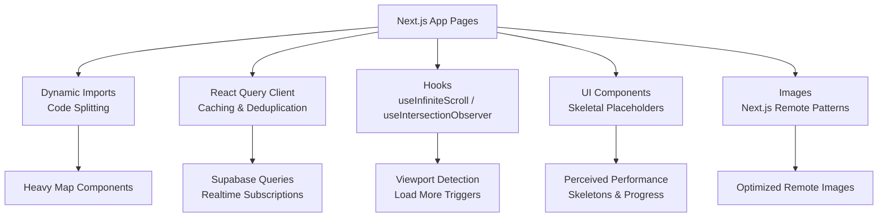

**Diagram sources**
- [next.config.js:8-14](file://next.config.js#L8-L14)
- [useInfiniteScroll.ts:29-75](file://src/hooks/useInfiniteScroll.ts#L29-L75)
- [useIntersectionObserver.ts:5-26](file://src/hooks/useIntersectionObserver.ts#L5-L26)
- [usePaginatedContent.ts:119-207](file://src/hooks/usePaginatedContent.ts#L119-L207)
- [CardGridSkeleton.tsx:7-21](file://src/components/ui/skeletons/CardGridSkeleton.tsx#L7-L21)
- [FilterToolbarSkeleton.tsx:11-29](file://src/components/ui/skeletons/FilterToolbarSkeleton.tsx#L11-L29)
- [ItineraryLoadingScreen.tsx:27-96](file://src/components/ui/itinerary/ItineraryLoadingScreen.tsx#L27-L96)
- [QueryProvider.tsx:7-12](file://src/components/QueryProvider.tsx#L7-L12)
- [queryClient.ts:3-12](file://src/lib/query/queryClient.ts#L3-L12)

**Section sources**
- [next.config.js:1-18](file://next.config.js#L1-L18)
- [useInfiniteScroll.ts:1-93](file://src/hooks/useInfiniteScroll.ts#L1-L93)
- [useIntersectionObserver.ts:1-28](file://src/hooks/useIntersectionObserver.ts#L1-L28)
- [usePaginatedContent.ts:1-288](file://src/hooks/usePaginatedContent.ts#L1-L288)
- [CardGridSkeleton.tsx:1-23](file://src/components/ui/skeletons/CardGridSkeleton.tsx#L1-L23)
- [FilterToolbarSkeleton.tsx:1-31](file://src/components/ui/skeletons/FilterToolbarSkeleton.tsx#L1-L31)
- [ItineraryLoadingScreen.tsx:1-97](file://src/components/ui/itinerary/ItineraryLoadingScreen.tsx#L1-L97)
- [QueryProvider.tsx:1-13](file://src/components/QueryProvider.tsx#L1-L13)
- [queryClient.ts:1-13](file://src/lib/query/queryClient.ts#L1-L13)

## Core Components
- Infinite Scroll Hook: Uses IntersectionObserver to detect when a sentinel element enters the viewport and triggers load-more actions within custom scroll containers.
- Intersection Observer Hook: Provides a simple ref + boolean pair to lazily trigger actions once an element becomes visible.
- Paginated Content Hook: Manages initial fetch, incremental loading, deduplication, and realtime updates from Supabase channels.
- Skeleton Components: Lightweight placeholders that reduce layout shifts and improve perceived performance during data loads.
- Loading Screen: Shows progress and ETA for long-running jobs, improving UX during heavy operations.
- Query Provider and Client: Centralized React Query setup with sensible defaults for caching, garbage collection, retries, and focus behavior.
- Image Handling: Next.js remote image patterns allow optimized delivery; inline images used in lightweight contexts.

**Section sources**
- [useInfiniteScroll.ts:29-75](file://src/hooks/useInfiniteScroll.ts#L29-L75)
- [useIntersectionObserver.ts:5-26](file://src/hooks/useIntersectionObserver.ts#L5-L26)
- [usePaginatedContent.ts:119-207](file://src/hooks/usePaginatedContent.ts#L119-L207)
- [CardGridSkeleton.tsx:7-21](file://src/components/ui/skeletons/CardGridSkeleton.tsx#L7-L21)
- [FilterToolbarSkeleton.tsx:11-29](file://src/components/ui/skeletons/FilterToolbarSkeleton.tsx#L11-L29)
- [ItineraryLoadingScreen.tsx:27-96](file://src/components/ui/itinerary/ItineraryLoadingScreen.tsx#L27-L96)
- [QueryProvider.tsx:7-12](file://src/components/QueryProvider.tsx#L7-L12)
- [queryClient.ts:3-12](file://src/lib/query/queryClient.ts#L3-L12)
- [next.config.js:8-14](file://next.config.js#L8-L14)

## Architecture Overview
The performance architecture combines several layers:
- Code splitting via dynamic imports reduces initial bundle size by deferring heavy map components until needed.
- Data layer uses React Query for caching and deduplication, plus Supabase realtime subscriptions for live updates without extra polling.
- Viewport-driven loading leverages IntersectionObserver to avoid unnecessary work until content is about to be seen.
- Skeletons and progress indicators provide immediate feedback while data or jobs are in flight.
- Image optimization is configured at build time to allow remote images and leverage Next.js optimizations.

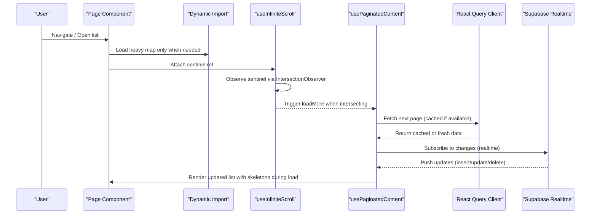

**Diagram sources**
- [useInfiniteScroll.ts:42-67](file://src/hooks/useInfiniteScroll.ts#L42-L67)
- [usePaginatedContent.ts:156-207](file://src/hooks/usePaginatedContent.ts#L156-L207)
- [usePaginatedContent.ts:209-284](file://src/hooks/usePaginatedContent.ts#L209-L284)
- [QueryProvider.tsx:7-12](file://src/components/QueryProvider.tsx#L7-L12)
- [queryClient.ts:3-12](file://src/lib/query/queryClient.ts#L3-L12)

## Detailed Component Analysis

### Infinite Scrolling with IntersectionObserver
- The hook sets up an IntersectionObserver tied to the nearest scrollable ancestor so rootMargin works inside custom containers.
- It maintains a stable callback reference and re-subscribes when the sentinel node or enabled flag changes.
- When the sentinel intersects, it invokes the provided onLoadMore function to fetch more items.

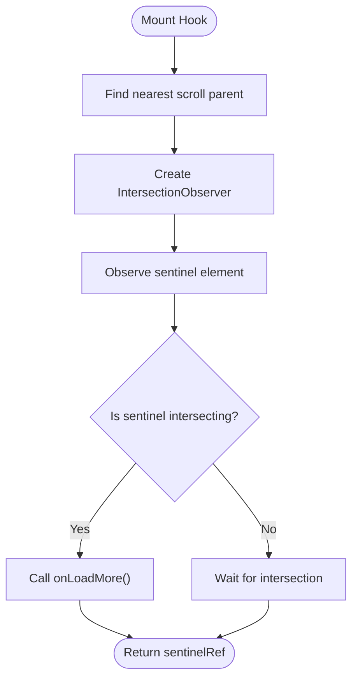

**Diagram sources**
- [useInfiniteScroll.ts:42-67](file://src/hooks/useInfiniteScroll.ts#L42-L67)
- [useInfiniteScroll.ts:78-92](file://src/hooks/useInfiniteScroll.ts#L78-L92)

**Section sources**
- [useInfiniteScroll.ts:29-75](file://src/hooks/useInfiniteScroll.ts#L29-L75)
- [useInfiniteScroll.ts:78-92](file://src/hooks/useInfiniteScroll.ts#L78-L92)

### Viewport Detection Hook
- Returns a ref and a boolean indicating whether the observed element has entered the viewport.
- Automatically disconnects after first intersection to avoid unnecessary work.

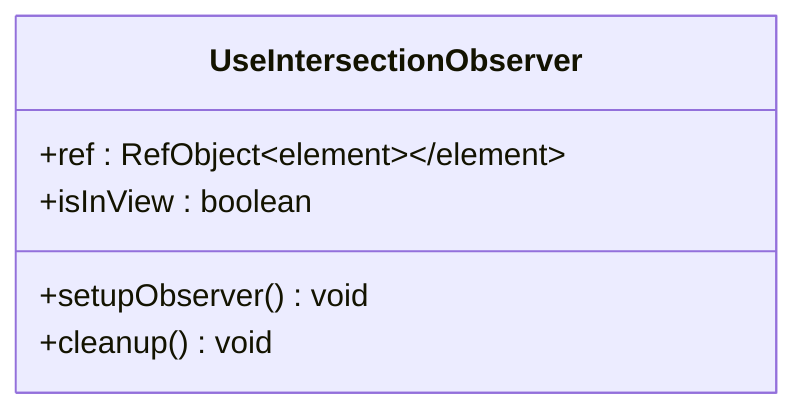

**Diagram sources**
- [useIntersectionObserver.ts:5-26](file://src/hooks/useIntersectionObserver.ts#L5-L26)

**Section sources**
- [useIntersectionObserver.ts:5-26](file://src/hooks/useIntersectionObserver.ts#L5-L26)

### Efficient Data Fetching and Realtime Updates
- Initial page fetches are performed with pagination and sorting options.
- Load more uses offset-based queries and deduplicates incoming items to handle overlap between paginated fetches and realtime updates.
- Realtime subscription listens for inserts, updates, and deletes, updating local state efficiently.

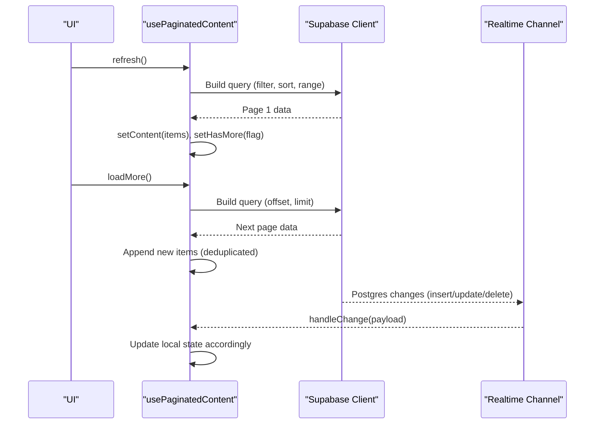

**Diagram sources**
- [usePaginatedContent.ts:45-87](file://src/hooks/usePaginatedContent.ts#L45-L87)
- [usePaginatedContent.ts:140-179](file://src/hooks/usePaginatedContent.ts#L140-L179)
- [usePaginatedContent.ts:181-207](file://src/hooks/usePaginatedContent.ts#L181-L207)
- [usePaginatedContent.ts:209-284](file://src/hooks/usePaginatedContent.ts#L209-L284)

**Section sources**
- [usePaginatedContent.ts:45-87](file://src/hooks/usePaginatedContent.ts#L45-L87)
- [usePaginatedContent.ts:119-207](file://src/hooks/usePaginatedContent.ts#L119-L207)
- [usePaginatedContent.ts:209-284](file://src/hooks/usePaginatedContent.ts#L209-L284)

### Skeleton Loading States
- Card grid and filter toolbar skeletons render lightweight placeholders with animations to indicate activity and prevent layout shifts.
- These components are composable and configurable for different contexts.

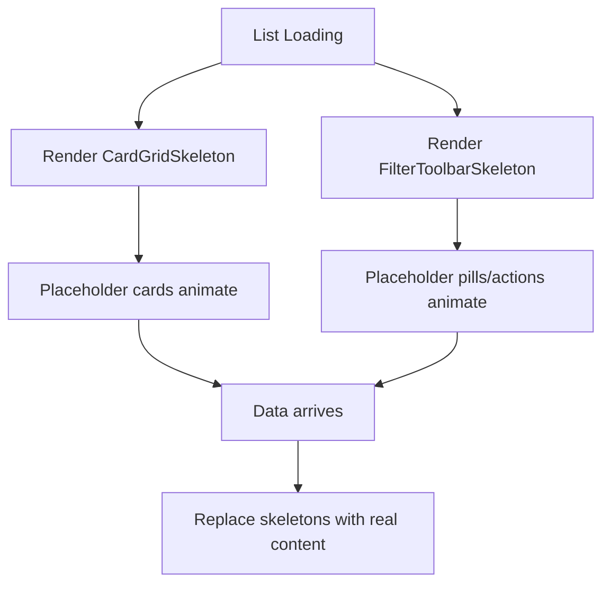

**Diagram sources**
- [CardGridSkeleton.tsx:7-21](file://src/components/ui/skeletons/CardGridSkeleton.tsx#L7-L21)
- [FilterToolbarSkeleton.tsx:11-29](file://src/components/ui/skeletons/FilterToolbarSkeleton.tsx#L11-L29)

**Section sources**
- [CardGridSkeleton.tsx:1-23](file://src/components/ui/skeletons/CardGridSkeleton.tsx#L1-L23)
- [FilterToolbarSkeleton.tsx:1-31](file://src/components/ui/skeletons/FilterToolbarSkeleton.tsx#L1-L31)

### Long-Running Job Progress and ETA
- The loading screen shows a spinner, title/subtitle, and either an indeterminate progress bar or tracked progress based on job status.
- Hooks compute animated progress and ETA labels to inform users during heavy tasks.

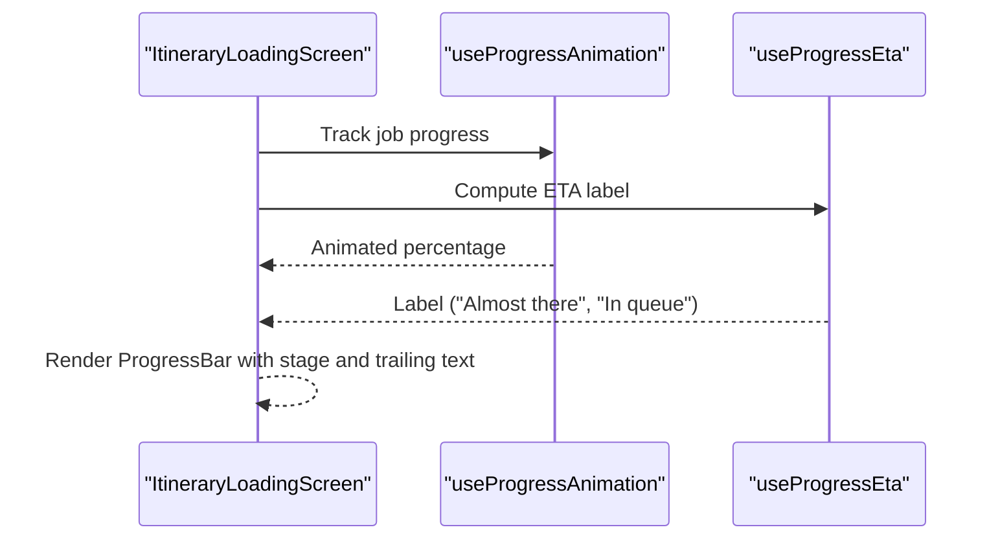

**Diagram sources**
- [ItineraryLoadingScreen.tsx:27-96](file://src/components/ui/itinerary/ItineraryLoadingScreen.tsx#L27-L96)

**Section sources**
- [ItineraryLoadingScreen.tsx:27-96](file://src/components/ui/itinerary/ItineraryLoadingScreen.tsx#L27-L96)

### Image Optimization
- Next.js configuration declares allowed remote image hosts, enabling optimized delivery and caching for external images.
- Inline images are used in lightweight contexts to avoid additional network requests.

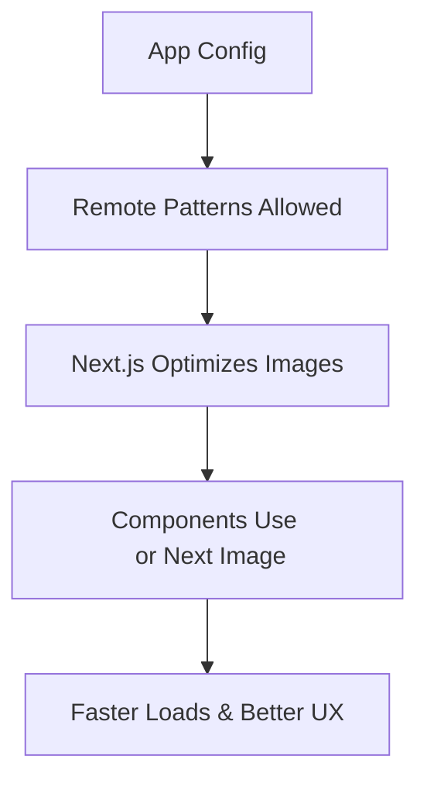

**Diagram sources**
- [next.config.js:8-14](file://next.config.js#L8-L14)
- [ImageGallery.tsx:133-139](file://src/components/ui/modals/ImageGallery.tsx#L133-L139)
- [CardMedia.tsx:42-54](file://src/components/ui/cards/CardMedia.tsx#L42-L54)

**Section sources**
- [next.config.js:8-14](file://next.config.js#L8-L14)
- [ImageGallery.tsx:133-139](file://src/components/ui/modals/ImageGallery.tsx#L133-L139)
- [CardMedia.tsx:42-54](file://src/components/ui/cards/CardMedia.tsx#L42-L54)

### Memory Management and Cleanup
- IntersectionObserver instances are disconnected on cleanup to prevent leaks.
- Realtime subscriptions are removed on unmount, with reconnect logic for transient errors.
- Event listeners and pointer captures are released in interactive components to free resources.

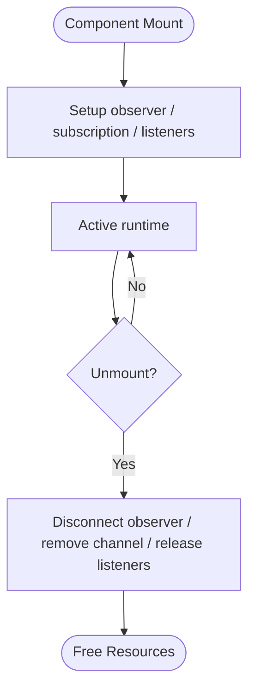

**Diagram sources**
- [useIntersectionObserver.ts:11-24](file://src/hooks/useIntersectionObserver.ts#L11-L24)
- [usePaginatedContent.ts:209-284](file://src/hooks/usePaginatedContent.ts#L209-L284)
- [DayTimePicker.tsx:398-442](file://src/components/ui/itinerary/DayTimePicker.tsx#L398-L442)

**Section sources**
- [useIntersectionObserver.ts:11-24](file://src/hooks/useIntersectionObserver.ts#L11-L24)
- [usePaginatedContent.ts:209-284](file://src/hooks/usePaginatedContent.ts#L209-L284)
- [DayTimePicker.tsx:398-442](file://src/components/ui/itinerary/DayTimePicker.tsx#L398-L442)

### Code Splitting and Lazy Loading
- Heavy map components are dynamically imported at page and component boundaries to defer their loading until they are actually needed.
- This reduces initial bundle size and improves Time to Interactive.

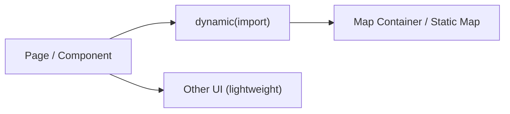

**Diagram sources**
- [collections/[id]/page.tsx:52-52](file://src/app/collections/[id]/page.tsx#L52-L52)
- [home/page.tsx:48-48](file://src/app/home/page.tsx#L48-L48)
- [itineraries/[id]/page.tsx:205-205](file://src/app/itineraries/[id]/page.tsx#L205-L205)
- [links/[id]/page.tsx:42-42](file://src/app/links/[id]/page.tsx#L42-L42)
- [LocationDetailView.tsx:46-46](file://src/components/ui/detail-views/LocationDetailView.tsx#L46-L46)
- [ItineraryMapSection.tsx:8-8](file://src/components/ui/itinerary/ItineraryMapSection.tsx#L8-L8)
- [MapContainer.tsx:40-40](file://src/components/ui/map/MapContainer.tsx#L40-L40)
- [StaticMap.tsx:34-34](file://src/components/ui/map/StaticMap.tsx#L34-L34)

**Section sources**
- [collections/[id]/page.tsx:52-52](file://src/app/collections/[id]/page.tsx#L52-L52)
- [home/page.tsx:48-48](file://src/app/home/page.tsx#L48-L48)
- [itineraries/[id]/page.tsx:205-205](file://src/app/itineraries/[id]/page.tsx#L205-L205)
- [links/[id]/page.tsx:42-42](file://src/app/links/[id]/page.tsx#L42-L42)
- [LocationDetailView.tsx:46-46](file://src/components/ui/detail-views/LocationDetailView.tsx#L46-L46)
- [ItineraryMapSection.tsx:8-8](file://src/components/ui/itinerary/ItineraryMapSection.tsx#L8-L8)
- [MapContainer.tsx:40-40](file://src/components/ui/map/MapContainer.tsx#L40-L40)
- [StaticMap.tsx:34-34](file://src/components/ui/map/StaticMap.tsx#L34-L34)

## Dependency Analysis
- The data layer depends on Supabase client and realtime channels; React Query provides caching and deduplication across components.
- UI components depend on hooks for viewport detection and pagination, ensuring minimal work until necessary.
- Configuration centralizes image optimization and package import optimizations.

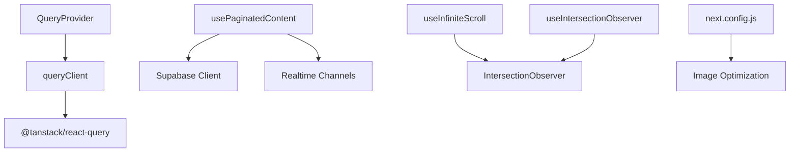

**Diagram sources**
- [QueryProvider.tsx:7-12](file://src/components/QueryProvider.tsx#L7-L12)
- [queryClient.ts:3-12](file://src/lib/query/queryClient.ts#L3-L12)
- [usePaginatedContent.ts:119-207](file://src/hooks/usePaginatedContent.ts#L119-L207)
- [useInfiniteScroll.ts:42-67](file://src/hooks/useInfiniteScroll.ts#L42-L67)
- [useIntersectionObserver.ts:11-24](file://src/hooks/useIntersectionObserver.ts#L11-L24)
- [next.config.js:8-14](file://next.config.js#L8-L14)

**Section sources**
- [QueryProvider.tsx:7-12](file://src/components/QueryProvider.tsx#L7-L12)
- [queryClient.ts:3-12](file://src/lib/query/queryClient.ts#L3-L12)
- [usePaginatedContent.ts:119-207](file://src/hooks/usePaginatedContent.ts#L119-L207)
- [useInfiniteScroll.ts:42-67](file://src/hooks/useInfiniteScroll.ts#L42-L67)
- [useIntersectionObserver.ts:11-24](file://src/hooks/useIntersectionObserver.ts#L11-L24)
- [next.config.js:8-14](file://next.config.js#L8-L14)

## Performance Considerations
- Prefer lazy loading for heavy features like maps to reduce initial payload.
- Use pagination and intersection observers to avoid loading off-screen content.
- Leverage React Query caching to minimize redundant network requests.
- Show skeletons and progress indicators to improve perceived performance.
- Configure image optimization to allow remote images and benefit from CDN caching.
- Ensure proper cleanup of observers, subscriptions, and event listeners to prevent memory leaks.

[No sources needed since this section provides general guidance]

## Troubleshooting Guide
- If infinite scroll does not trigger, verify the sentinel ref is attached and the nearest scrollable ancestor is correctly detected.
- If realtime updates are missing, check channel subscription status and ensure cleanup runs on unmount.
- For slow initial loads, confirm dynamic imports are applied to heavy components and that image remote patterns are correct.
- If skeletons persist too long, inspect loading states and ensure data fetch completion paths update UI properly.

**Section sources**
- [useInfiniteScroll.ts:42-67](file://src/hooks/useInfiniteScroll.ts#L42-L67)
- [usePaginatedContent.ts:209-284](file://src/hooks/usePaginatedContent.ts#L209-L284)
- [next.config.js:8-14](file://next.config.js#L8-L14)

## Conclusion
The application employs a comprehensive set of performance strategies: code splitting for heavy components, viewport-driven loading via IntersectionObserver, efficient data fetching with caching and realtime updates, skeleton UI for perceived responsiveness, and image optimization through Next.js configuration. Together, these practices help maintain smooth interactions and fast load times as the application grows.

[No sources needed since this section summarizes without analyzing specific files]