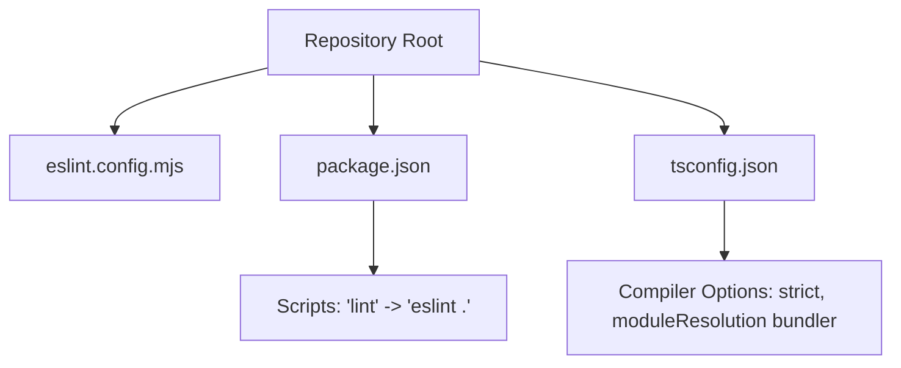
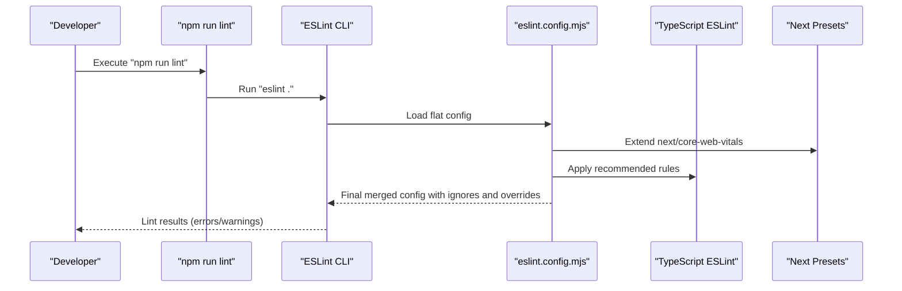
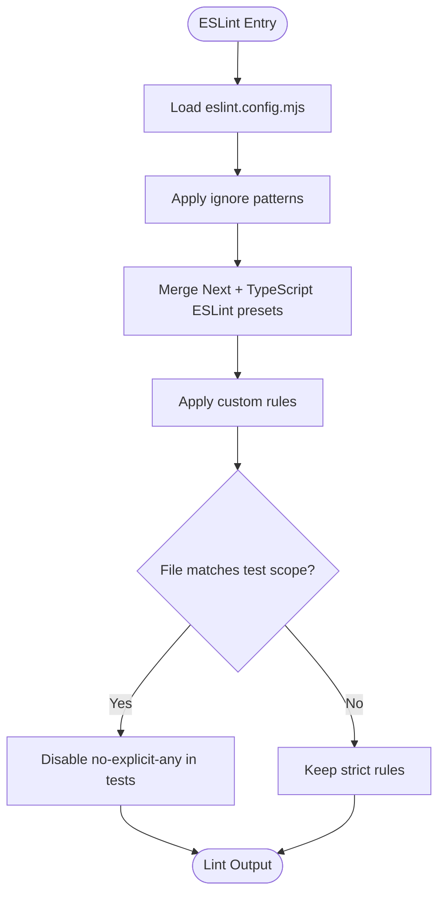
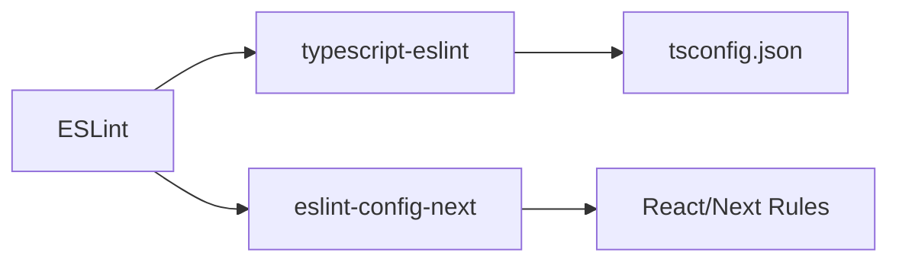

# ESLint Configuration

<cite>
**Referenced Files in This Document**
- [eslint.config.mjs](file://eslint.config.mjs)
- [package.json](file://package.json)
- [tsconfig.json](file://tsconfig.json)
- [AGENTS.md](file://AGENTS.md)
</cite>

## Table of Contents
1. Introduction
2. Project Structure
3. Core Components
4. Architecture Overview
5. Detailed Component Analysis
6. Dependency Analysis
7. Performance Considerations
8. Troubleshooting Guide
9. Conclusion

## Introduction
This document explains the ESLint configuration for the project, focusing on how linting is set up, which rules are enforced, and how TypeScript and Next.js integrations are configured. It also provides guidance for running lint checks and understanding rule behavior across production and test code.

## Project Structure
The project uses a modern flat ESLint configuration file at the repository root. Linting is executed via an npm script that invokes the ESLint CLI directly against the current directory. TypeScript strict mode is enabled in the TypeScript configuration to complement static analysis performed by ESLint.

**Diagram sources**
- [eslint.config.mjs:1-37](file://eslint.config.mjs#L1-L37)
- [package.json:5-12](file://package.json#L5-L12)
- [tsconfig.json:1-29](file://tsconfig.json#L1-L29)

**Section sources**
- [eslint.config.mjs:1-37](file://eslint.config.mjs#L1-L37)
- [package.json:5-12](file://package.json#L5-L12)
- [tsconfig.json:1-29](file://tsconfig.json#L1-L29)

## Core Components
- Flat configuration: The project uses a single flat config file to define ignores, shared configs, and custom rules.
- Shared configs:
  - Next.js web vitals preset for React Hooks and performance-related rules.
  - TypeScript ESLint recommended ruleset for TypeScript-specific checks.
- Custom rules:
  - Unused variables: Variables or arguments prefixed with underscore are allowed; otherwise unused bindings are errors.
  - Test exceptions: Explicit any is disabled in test files and specific planner test directories to simplify test doubles and fixtures.
- Ignored paths: Build artifacts, dependencies, generated migrations, and environment type declarations are excluded from linting.

**Section sources**
- [eslint.config.mjs:11-36](file://eslint.config.mjs#L11-L36)

## Architecture Overview
The lint pipeline composes multiple rule sets and applies them selectively based on file patterns. The flow below shows how ESLint loads the flat config, merges shared presets, and enforces project-specific rules.

**Diagram sources**
- [package.json:5-12](file://package.json#L5-L12)
- [eslint.config.mjs:1-36](file://eslint.config.mjs#L1-L36)

## Detailed Component Analysis

### Flat Config Composition
- Ignores: Excludes build outputs, node modules, database migrations, scripted outputs, and auto-generated types to keep lint runs fast and focused on source code.
- Shared presets:
  - Next.js core web vitals preset brings React Hooks dependency checks and related best practices.
  - TypeScript ESLint recommended ruleset adds TypeScript-aware linting.
- Custom rules:
  - Unused variables: Enforced as errors with allowances for intentionally unused identifiers using underscore prefixes.
  - Test overrides: Disables explicit any in test files and planner tests to accommodate test doubles and fixtures without compromising production code quality.

**Diagram sources**
- [eslint.config.mjs:11-36](file://eslint.config.mjs#L11-L36)

**Section sources**
- [eslint.config.mjs:11-36](file://eslint.config.mjs#L11-L36)

### Rule Behavior and Scope
- Unused variables:
  - Errors for unused bindings unless they start with underscore.
  - Applies to both arguments and caught errors when prefixed with underscore.
- Explicit any:
  - Allowed in test files and planner test directories to simplify mock shapes and casts.
  - Production code remains under full strictness.

**Section sources**
- [eslint.config.mjs:19-35](file://eslint.config.mjs#L19-L35)

### Integration with TypeScript
- TypeScript compiler options enforce strict mode and bundler-style module resolution, aligning with ESLint’s expectations for accurate type-aware linting.
- Path aliases defined in TypeScript configuration are respected by tooling that honors tsconfig paths.

**Section sources**
- [tsconfig.json:1-29](file://tsconfig.json#L1-L29)

### Running Lint
- The npm script executes ESLint against the entire repository root.
- The configuration explicitly notes that Next’s built-in lint command is deprecated in newer versions, so direct CLI invocation is used.

**Section sources**
- [package.json:5-12](file://package.json#L5-L12)
- [eslint.config.mjs:1-3](file://eslint.config.mjs#L1-L3)
- [AGENTS.md:170-178](file://AGENTS.md#L170-L178)

## Dependency Analysis
Key development dependencies involved in linting:
- ESLint core and plugins for flat config compatibility.
- TypeScript ESLint for type-aware rules.
- Next.js ESLint preset for React and Next-specific rules.

**Diagram sources**
- [package.json:49-64](file://package.json#L49-L64)
- [eslint.config.mjs:6-18](file://eslint.config.mjs#L6-L18)
- [tsconfig.json:1-29](file://tsconfig.json#L1-L29)

**Section sources**
- [package.json:49-64](file://package.json#L49-L64)
- [eslint.config.mjs:6-18](file://eslint.config.mjs#L6-L18)

## Performance Considerations
- Ignoring large or generated directories reduces scan time and avoids noisy output.
- Using shared presets centralizes rule management and minimizes duplication.
- Keeping test-specific rule relaxations scoped narrowly prevents accidental weakening of production checks.

[No sources needed since this section provides general guidance]

## Troubleshooting Guide
- If you see unexpected unused variable errors:
  - Prefix intentionally unused identifiers with underscore to satisfy the rule.
  - Review whether the binding is truly unused before silencing.
- If you need to allow explicit any in new test files:
  - Place tests under matching patterns recognized by the test override scope.
  - Avoid disabling explicit any in production code.
- If lint fails due to Next or React Hooks rules:
  - Ensure dependencies in hooks are correctly declared per the Next preset requirements.
- To run lint locally:
  - Use the provided npm script to execute ESLint against the repository root.

**Section sources**
- [eslint.config.mjs:19-35](file://eslint.config.mjs#L19-L35)
- [package.json:5-12](file://package.json#L5-L12)

## Conclusion
The project employs a concise, modern ESLint setup using a flat configuration that combines Next.js and TypeScript ESLint presets with targeted custom rules. Unused variables are enforced with sensible allowances, and test code has scoped relaxations to improve developer experience without compromising production quality. Running lint via the npm script ensures consistent checks across the codebase.