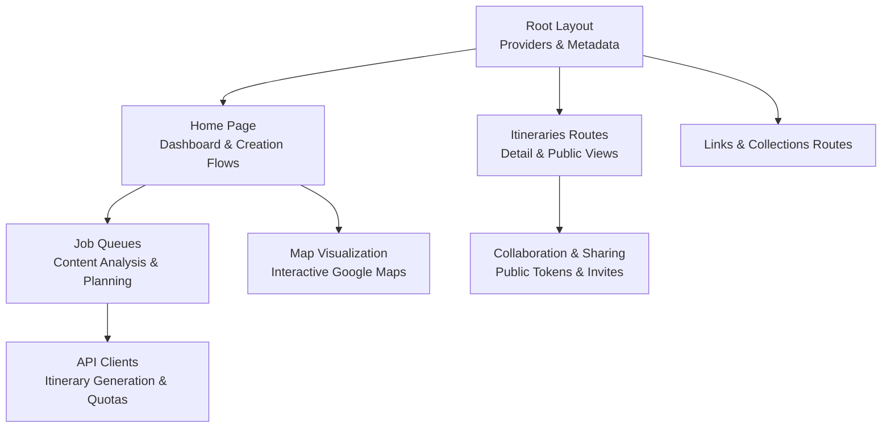
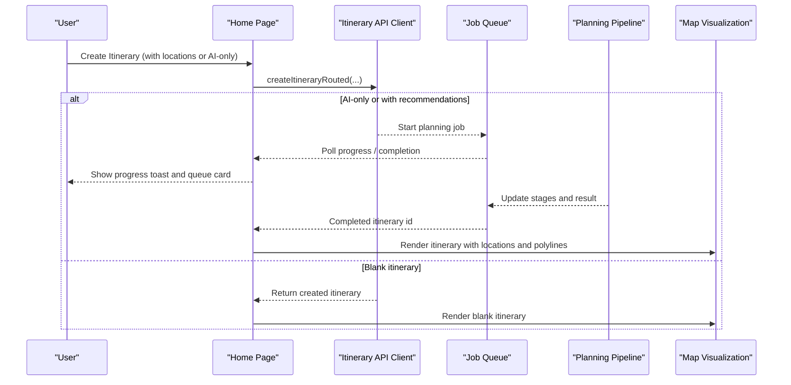
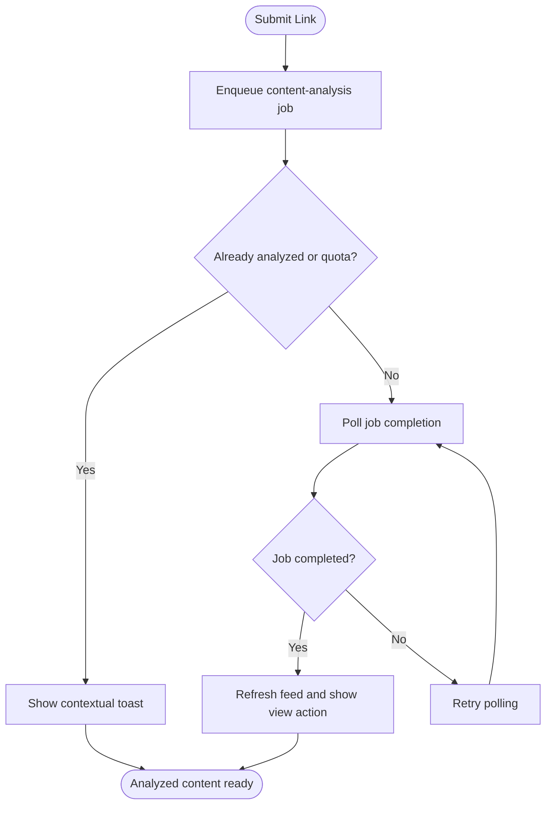
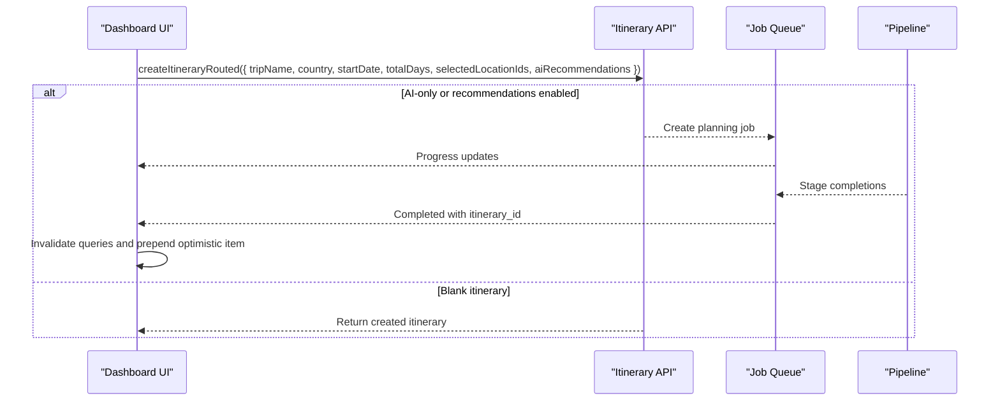
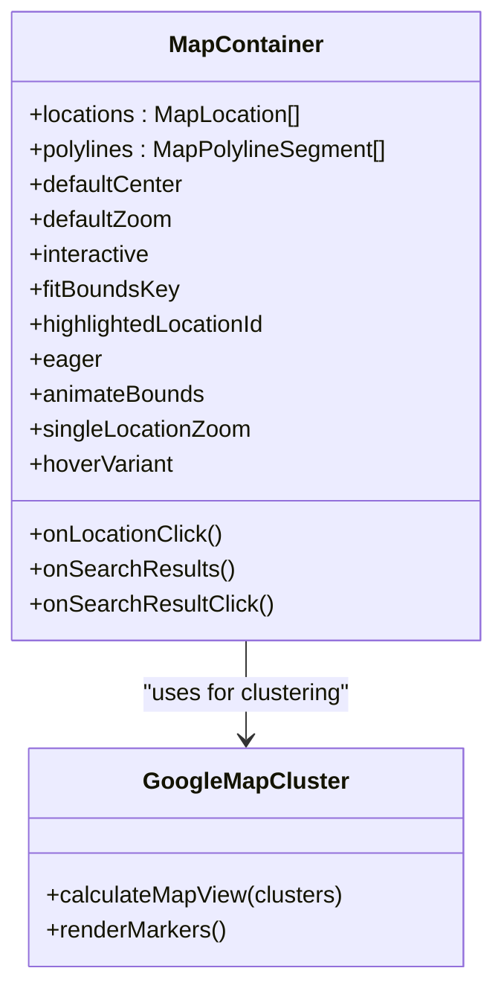
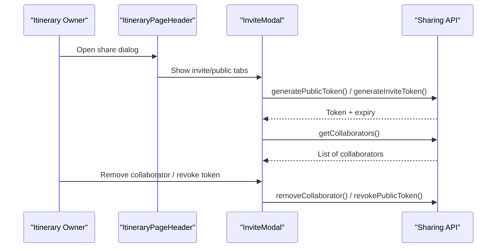
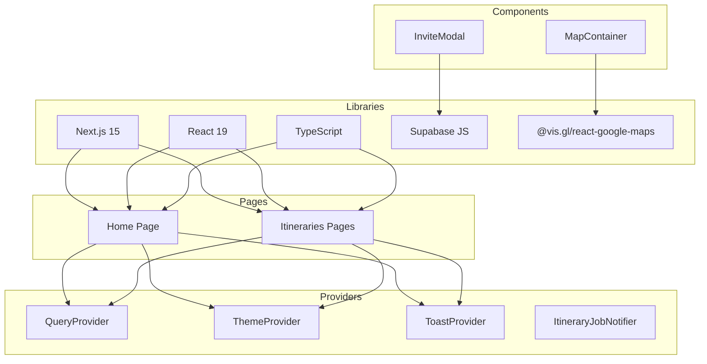

# Project Overview

<cite>
**Referenced Files in This Document**
- [package.json](file://package.json)
- [src/app/layout.tsx](file://src/app/layout.tsx)
- [src/app/page.tsx](file://src/app/page.tsx)
- [src/app/home/page.tsx](file://src/app/home/page.tsx)
- [src/components/ThemeProvider.tsx](file://src/components/ThemeProvider.tsx)
- [src/components/QueryProvider.tsx](file://src/components/QueryProvider.tsx)
- [src/lib/api/itineraries.ts](file://src/lib/api/itineraries.ts)
- [src/components/ui/itinerary/ItineraryPageHeader.tsx](file://src/components/ui/itinerary/ItineraryPageHeader.tsx)
- [src/components/ui/map/MapContainer.tsx](file://src/components/ui/map/MapContainer.tsx)
- [src/components/ui/map/GoogleMapCluster.tsx](file://src/components/ui/map/GoogleMapCluster.tsx)
- [src/components/ui/modals/InviteModal.tsx](file://src/components/ui/modals/InviteModal.tsx)
- [docs/personalization-pipeline.md](file://docs/personalization-pipeline.md)
- [docs/implementation-plan.md](file://docs/implementation-plan.md)
</cite>

## Table of Contents
1. [Introduction](#introduction)
2. [Project Structure](#project-structure)
3. [Core Components](#core-components)
4. [Architecture Overview](#architecture-overview)
5. [Detailed Component Analysis](#detailed-component-analysis)
6. [Dependency Analysis](#dependency-analysis)
7. [Performance Considerations](#performance-considerations)
8. [Troubleshooting Guide](#troubleshooting-guide)
9. [Conclusion](#conclusion)

## Introduction
Argo is an AI-powered itinerary planning platform that transforms saved links into actionable, day-by-day travel itineraries. Users save articles, videos, or web pages; the system analyzes content to extract travel-related locations and preferences, then builds a structured plan with map visualization, scheduling, and sharing capabilities. The platform emphasizes personalization through preference profiles, deterministic scoring, and AI-assisted assignment and narration while keeping time math and constraints under code control.

Key value proposition:
- Turn any saved link into a place-aware building block for trips
- Build collections of places and curate them before planning
- Generate personalized itineraries using a staged pipeline (retrieval → ranking → clustering → assignment → scheduling → narration)
- Visualize plans on interactive maps and share or collaborate with others

Technology highlights:
- Next.js 15 with React 19 and TypeScript
- Supabase client integration for data access patterns
- Google Maps via @vis.gl/react-google-maps for interactive visualization
- Modern UI primitives and motion-based interactions
- Context-based state management and custom hooks for data fetching and job queues

**Section sources**
- [src/app/layout.tsx:15-49](file://src/app/layout.tsx#L15-L49)
- [package.json:12-33](file://package.json#L12-L33)

## Project Structure
The application follows a Next.js App Router layout with feature-oriented directories:
- app: page routes for home, links, collections, itineraries, and public views
- components: reusable UI primitives, domain-specific modules (itinerary, map, modals), and layout
- contexts: global state providers (toasts, navigation visibility, filters)
- hooks: custom hooks for queries, jobs, media, and interactions
- lib: API clients, utilities, query configuration, and planner design docs

**Diagram sources**
- [src/app/layout.tsx:57-80](file://src/app/layout.tsx#L57-L80)
- [src/app/home/page.tsx:172-240](file://src/app/home/page.tsx#L172-L240)
- [src/lib/api/itineraries.ts:59-78](file://src/lib/api/itineraries.ts#L59-L78)

**Section sources**
- [src/app/layout.tsx:57-80](file://src/app/layout.tsx#L57-L80)
- [src/app/home/page.tsx:172-240](file://src/app/home/page.tsx#L172-L240)

## Core Components
- Root providers and metadata: Theme, Query, Toast, and Itinerary Job Notifier are wrapped at the root layout to provide global behavior and SEO metadata.
- Dashboard/Home: Central hub for creating links, collections, and itineraries; displays recent content and in-flight jobs; supports location filtering and mobile create carousel.
- Itinerary generation: Routed creation supports both blank itineraries and async AI planning jobs; quota handling and optimistic updates ensure smooth UX.
- Map visualization: Lazy-loaded Google Maps container with clustering, search, and detail interactions; tracks load events for analytics.
- Collaboration and sharing: Invite modal supports public tokens and invite tokens for itineraries and collections; collaborator lists and role management.

**Section sources**
- [src/app/layout.tsx:57-80](file://src/app/layout.tsx#L57-L80)
- [src/app/home/page.tsx:172-240](file://src/app/home/page.tsx#L172-L240)
- [src/lib/api/itineraries.ts:339-439](file://src/lib/api/itineraries.ts#L339-L439)
- [src/components/ui/map/MapContainer.tsx:45-93](file://src/components/ui/map/MapContainer.tsx#L45-L93)
- [src/components/ui/modals/InviteModal.tsx:91-107](file://src/components/ui/modals/InviteModal.tsx#L91-L107)

## Architecture Overview
Argo’s architecture combines a component-driven UI with a staged AI pipeline for itinerary generation. The frontend orchestrates user actions, manages job queues, and renders rich visualizations. The backend pipeline (designed in docs) performs retrieval, scoring, clustering, assignment, scheduling, and narration, with caching and cost controls.

**Diagram sources**
- [src/app/home/page.tsx:492-551](file://src/app/home/page.tsx#L492-L551)
- [src/lib/api/itineraries.ts:373-439](file://src/lib/api/itineraries.ts#L373-L439)
- [docs/personalization-pipeline.md:13-107](file://docs/personalization-pipeline.md#L13-L107)

## Detailed Component Analysis

### Content Analysis Pipeline
- Purpose: Convert saved links into structured locations and insights for itinerary building.
- Flow: Submit URL → enqueue content-analysis job → poll completion → display analyzed content and extracted locations.
- UX: Toast notifications, error handling for already-analyzed links and quota limits, and quick navigation to results.

**Diagram sources**
- [src/app/home/page.tsx:192-217](file://src/app/home/page.tsx#L192-L217)
- [src/app/home/page.tsx:417-456](file://src/app/home/page.tsx#L417-L456)

**Section sources**
- [src/app/home/page.tsx:192-217](file://src/app/home/page.tsx#L192-L217)
- [src/app/home/page.tsx:417-456](file://src/app/home/page.tsx#L417-L456)

### Collection Management
- Purpose: Organize saved locations and curated sets of places for later planning.
- Features: Create collections with metadata (country, region, coordinates, tags); add locations from links or direct entries; preview images and thumbnails; delete and manage archived collections.
- Integration: Dashboard grid shows collections alongside links and itineraries; infinite scroll and filtering by locality.

**Section sources**
- [src/app/home/page.tsx:458-490](file://src/app/home/page.tsx#L458-L490)
- [src/lib/supabase/queries/home.ts:369-400](file://src/lib/supabase/queries/home.ts#L369-L400)
- [src/lib/supabase/queries/home.ts:764-780](file://src/lib/supabase/queries/home.ts#L764-L780)

### AI-Powered Itinerary Generation
- Purpose: Generate personalized, scheduled itineraries from collected locations or AI-only inputs.
- Stages: Retrieval (cache-first), hard filters, scoring, clustering, LLM assignment, scheduling, validation, narration, photo resolution.
- Frontend orchestration: createItineraryRouted decides between blank creation and async planning; job queue provides progress and completion; optimistic items keep UI responsive.

**Diagram sources**
- [src/lib/api/itineraries.ts:373-439](file://src/lib/api/itineraries.ts#L373-L439)
- [src/app/home/page.tsx:492-551](file://src/app/home/page.tsx#L492-L551)
- [docs/personalization-pipeline.md:13-107](file://docs/personalization-pipeline.md#L13-L107)

**Section sources**
- [src/lib/api/itineraries.ts:373-439](file://src/lib/api/itineraries.ts#L373-L439)
- [src/app/home/page.tsx:492-551](file://src/app/home/page.tsx#L492-L551)
- [docs/personalization-pipeline.md:13-107](file://docs/personalization-pipeline.md#L13-L107)

### Interactive Map Visualization
- Purpose: Visualize itinerary stops, clusters, and routes on Google Maps with performance-conscious loading.
- Features: Lazy rendering via intersection observer, clustering for large datasets, polyline segments per day, search and detail callbacks, theme-aware map IDs.
- Integration: Used across itinerary details and dashboard to show geographic context and facilitate exploration.

**Diagram sources**
- [src/components/ui/map/MapContainer.tsx:10-31](file://src/components/ui/map/MapContainer.tsx#L10-L31)
- [src/components/ui/map/MapContainer.tsx:45-93](file://src/components/ui/map/MapContainer.tsx#L45-L93)
- [src/components/ui/map/GoogleMapCluster.tsx:13-30](file://src/components/ui/map/GoogleMapCluster.tsx#L13-L30)

**Section sources**
- [src/components/ui/map/MapContainer.tsx:45-93](file://src/components/ui/map/MapContainer.tsx#L45-L93)
- [src/components/ui/map/GoogleMapCluster.tsx:13-30](file://src/components/ui/map/GoogleMapCluster.tsx#L13-L30)

### Collaborative Planning Capabilities
- Purpose: Share itineraries and collections publicly or via invites; manage collaborators and roles.
- Features: Public token generation and revocation; invite token lifecycle; collaborator listing and removal; role-based permissions.
- UI: Invite modal abstracts sharing APIs for itineraries and collections; header exposes collaboration controls and view/edit modes.

**Diagram sources**
- [src/components/ui/itinerary/ItineraryPageHeader.tsx:118-133](file://src/components/ui/itinerary/ItineraryPageHeader.tsx#L118-L133)
- [src/components/ui/modals/InviteModal.tsx:91-107](file://src/components/ui/modals/InviteModal.tsx#L91-L107)

**Section sources**
- [src/components/ui/itinerary/ItineraryPageHeader.tsx:118-133](file://src/components/ui/itinerary/ItineraryPageHeader.tsx#L118-L133)
- [src/components/ui/modals/InviteModal.tsx:91-107](file://src/components/ui/modals/InviteModal.tsx#L91-L107)

## Dependency Analysis
- Providers: Root layout composes QueryProvider, ToastProvider, ThemeProvider, and ItineraryJobNotifier to enable global state and notifications.
- Data layer: Supabase client used throughout for queries and mutations; API clients encapsulate fetch logic and error mapping.
- UI dependencies: Tailwind CSS, motion, Base UI primitives, Lucide icons; Google Maps via @vis.gl/react-google-maps.
- Routing: Next.js App Router with dynamic routes for entities and public sharing.

**Diagram sources**
- [src/app/layout.tsx:57-80](file://src/app/layout.tsx#L57-L80)
- [package.json:12-33](file://package.json#L12-L33)

**Section sources**
- [src/app/layout.tsx:57-80](file://src/app/layout.tsx#L57-L80)
- [package.json:12-33](file://package.json#L12-L33)

## Performance Considerations
- Lazy map rendering: Intersection observer defers heavy map initialization until visible; eager mode available for off-screen panels.
- Job queue polling: TanStack Query refetch interval replaces realtime subscriptions for job progress; reduces complexity and avoids realtime quotas.
- Cache-first retrieval: Design emphasizes caching place searches and enrichment to minimize billed calls and latency.
- Optimistic UI: Feed items are prepended immediately after creation; real data refreshes seamlessly without flicker.

[No sources needed since this section provides general guidance]

## Troubleshooting Guide
- Already analyzed link: If submitting a duplicate URL, the system detects it and shows a toast with a “View” action to the existing analyzed content.
- Quota limits: When exceeding monthly link or itinerary limits, users see contextual toasts guiding upgrades or deletions; usage cards reflect current consumption.
- Job failures: Failed analysis or planning jobs surface friendly errors; users can retry or dismiss jobs; global notifier centralizes completion alerts.

**Section sources**
- [src/app/home/page.tsx:192-217](file://src/app/home/page.tsx#L192-L217)
- [src/app/home/page.tsx:417-456](file://src/app/home/page.tsx#L417-L456)
- [src/lib/api/itineraries.ts:89-98](file://src/lib/api/itineraries.ts#L89-L98)

## Conclusion
Argo delivers a modern, AI-augmented travel planning experience that turns scattered links into coherent, map-backed itineraries. Its component-driven architecture, robust job queue integration, and thoughtful UX patterns make it easy to discover content, organize collections, and generate personalized plans. The staged pipeline ensures reliability, cost control, and explainability, while collaborative features enable sharing and teamwork. With Next.js 15, React 19, TypeScript, Supabase, and Google Maps, Argo balances performance, scalability, and developer ergonomics for a compelling travel planning product.

[No sources needed since this section summarizes without analyzing specific files]