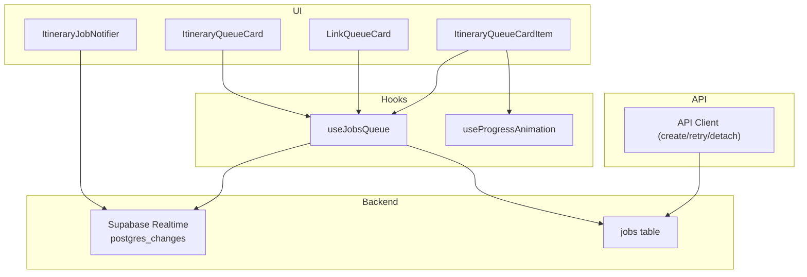
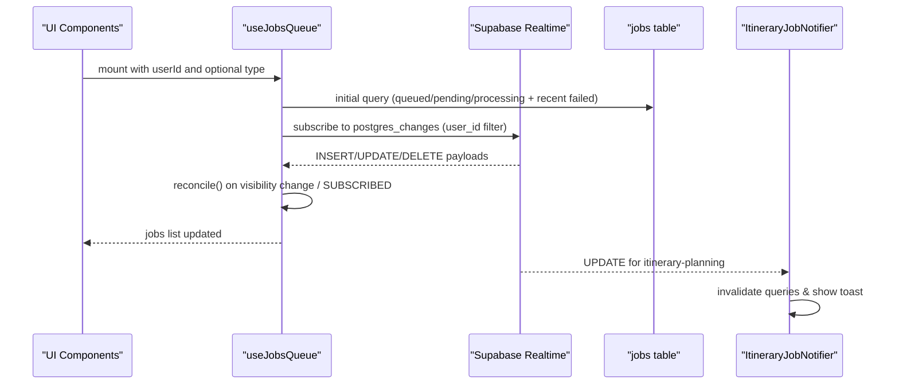
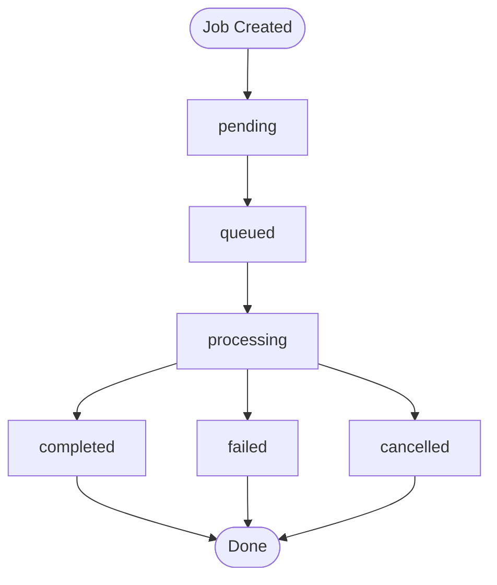
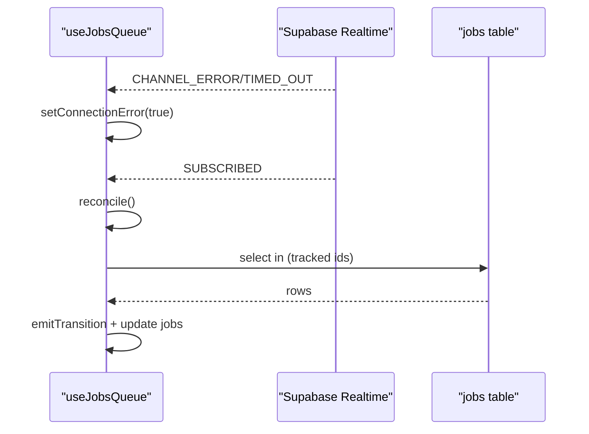
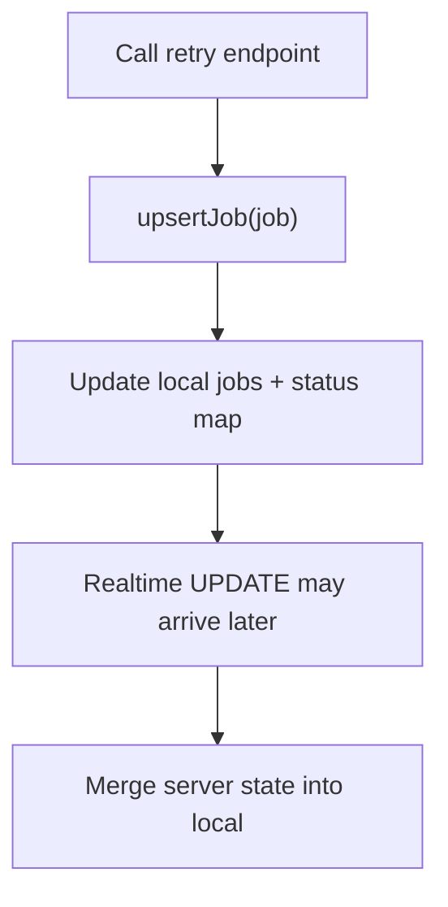
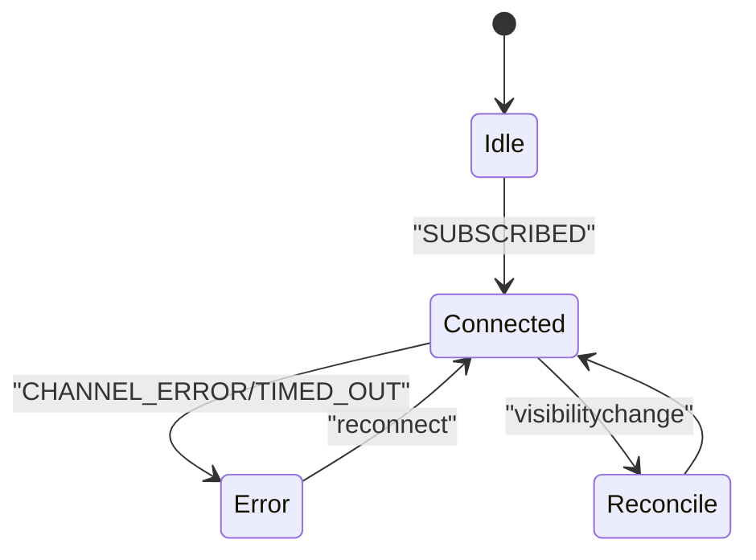
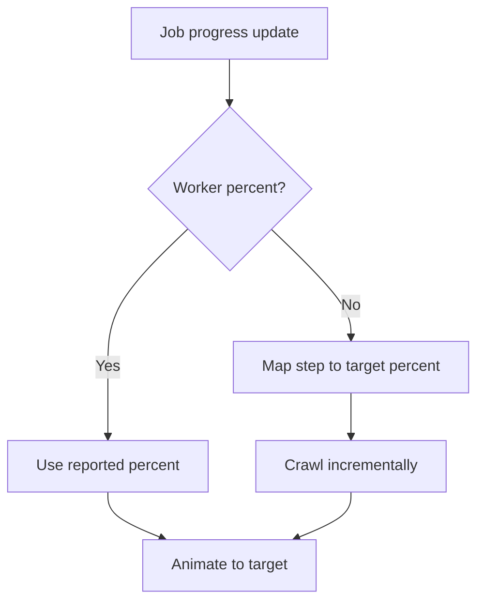
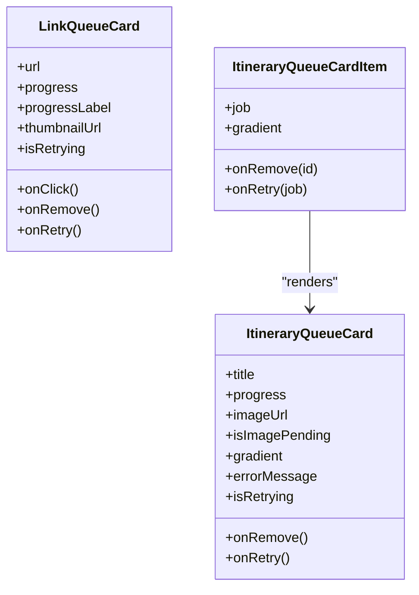
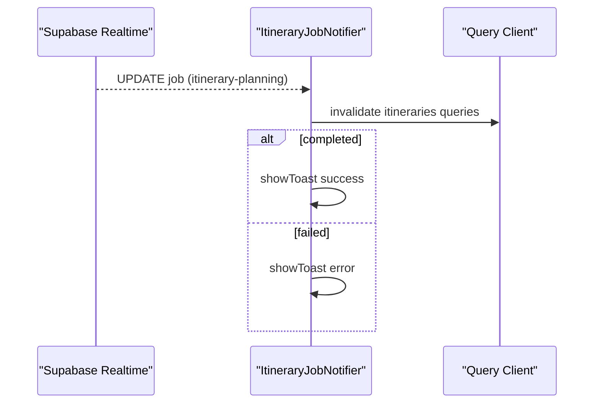
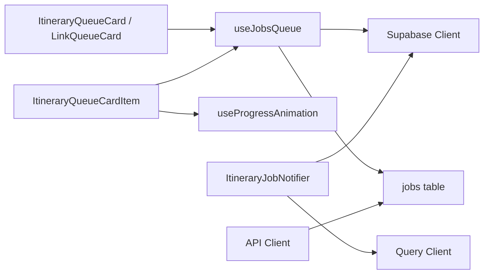

# Job Queue System

<cite>
**Referenced Files in This Document**
- [useJobsQueue.ts](file://src/hooks/useJobsQueue.ts)
- [ItineraryJobNotifier.tsx](file://src/components/notifications/ItineraryJobNotifier.tsx)
- [ItineraryQueueCard.tsx](file://src/components/ui/itinerary/ItineraryQueueCard.tsx)
- [ItineraryQueueCardItem.tsx](file://src/components/ui/itinerary/ItineraryQueueCardItem.tsx)
- [LinkQueueCard.tsx](file://src/components/ui/links/LinkQueueCard.tsx)
- [useProgressAnimation.ts](file://src/hooks/useProgressAnimation.ts)
- [client.ts](file://src/lib/api/client.ts)
</cite>

## Table of Contents
1. [Introduction](#introduction)
2. [Project Structure](#project-structure)
3. [Core Components](#core-components)
4. [Architecture Overview](#architecture-overview)
5. [Detailed Component Analysis](#detailed-component-analysis)
6. [Dependency Analysis](#dependency-analysis)
7. [Performance Considerations](#performance-considerations)
8. [Troubleshooting Guide](#troubleshooting-guide)
9. [Conclusion](#conclusion)
10. [Appendices](#appendices)

## Introduction
This document explains the job queue system used to create, track, and process background jobs with Supabase real-time subscriptions. It covers the QueueJob interface, status transitions, progress reporting, error handling, reconciliation on connection drops, optimistic UI updates, and how to extend the system for new job types and custom progress reporting.

## Project Structure
The job queue spans a small set of focused modules:
- A React hook that owns the queue state, subscribes to Supabase real-time changes, reconciles missed updates, and exposes helpers for optimistic updates.
- UI components that render in-flight jobs, show progress, and allow retry or removal.
- A notifier component that listens for completion/failure events and triggers cache invalidation and user notifications.
- An animation hook that smooths progress between backend-reported steps.
- API client utilities for creating, retrying, and detaching jobs.

**Diagram sources**
- [useJobsQueue.ts:167-260](file://src/hooks/useJobsQueue.ts#L167-L260)
- [ItineraryJobNotifier.tsx:45-85](file://src/components/notifications/ItineraryJobNotifier.tsx#L45-L85)
- [ItineraryQueueCard.tsx:180-189](file://src/components/ui/itinerary/ItineraryQueueCard.tsx#L180-L189)
- [ItineraryQueueCardItem.tsx:50-99](file://src/components/ui/itinerary/ItineraryQueueCardItem.tsx#L50-L99)
- [LinkQueueCard.tsx:199-208](file://src/components/ui/links/LinkQueueCard.tsx#L199-L208)
- [useProgressAnimation.ts:37-103](file://src/hooks/useProgressAnimation.ts#L37-L103)
- [client.ts:147-155](file://src/lib/api/client.ts#L147-L155)

**Section sources**
- [useJobsQueue.ts:1-296](file://src/hooks/useJobsQueue.ts#L1-L296)
- [ItineraryJobNotifier.tsx:1-92](file://src/components/notifications/ItineraryJobNotifier.tsx#L1-L92)
- [ItineraryQueueCard.tsx:1-199](file://src/components/ui/itinerary/ItineraryQueueCard.tsx#L1-L199)
- [ItineraryQueueCardItem.tsx:1-101](file://src/components/ui/itinerary/ItineraryQueueCardItem.tsx#L1-L101)
- [LinkQueueCard.tsx:1-218](file://src/components/ui/links/LinkQueueCard.tsx#L1-L218)
- [useProgressAnimation.ts:1-104](file://src/hooks/useProgressAnimation.ts#L1-L104)
- [client.ts:147-155](file://src/lib/api/client.ts#L147-L155)

## Core Components
- QueueJob interface defines the shape of a job including id, user_id, type, status, payload, result, error, content_id, progress object, detached flag, timestamps, and optional completed_at. Status values include pending, queued, processing, completed, failed, cancelled. The progress object supports step-based milestones, labels, timing metadata, and an authoritative percent field when provided by workers.
- useJobsQueue hook manages local state for jobs, subscribes to Supabase postgres_changes on the jobs table filtered by user_id, reconciles missed updates after visibility changes or reconnects, and provides removeJob and upsertJob for optimistic UI updates.
- ItineraryQueueCard and LinkQueueCard are presentational components that display job cards with progress bars, error states, and retry/remove actions.
- ItineraryQueueCardItem binds a QueueJob to the itinerary card, computes whether a retry is allowed based on failure or stuck-in-flight thresholds, and drives progress via useProgressAnimation.
- ItineraryJobNotifier subscribes to job updates for a specific job type, invalidates relevant caches on completion/failure, and shows toast notifications.
- useProgressAnimation animates the visual progress bar using worker-provided percent when available, otherwise maps step numbers to target percentages and crawls forward between steps.
- API client exposes functions to create jobs, retry jobs, and detach jobs.

**Section sources**
- [useJobsQueue.ts:6-34](file://src/hooks/useJobsQueue.ts#L6-L34)
- [useJobsQueue.ts:45-295](file://src/hooks/useJobsQueue.ts#L45-L295)
- [ItineraryQueueCard.tsx:12-33](file://src/components/ui/itinerary/ItineraryQueueCard.tsx#L12-L33)
- [ItineraryQueueCard.tsx:180-189](file://src/components/ui/itinerary/ItineraryQueueCard.tsx#L180-L189)
- [LinkQueueCard.tsx:11-34](file://src/components/ui/links/LinkQueueCard.tsx#L11-L34)
- [LinkQueueCard.tsx:199-208](file://src/components/ui/links/LinkQueueCard.tsx#L199-L208)
- [ItineraryQueueCardItem.tsx:13-32](file://src/components/ui/itinerary/ItineraryQueueCardItem.tsx#L13-L32)
- [ItineraryQueueCardItem.tsx:39-100](file://src/components/ui/itinerary/ItineraryQueueCardItem.tsx#L39-L100)
- [ItineraryJobNotifier.tsx:10-88](file://src/components/notifications/ItineraryJobNotifier.tsx#L10-L88)
- [useProgressAnimation.ts:6-31](file://src/hooks/useProgressAnimation.ts#L6-L31)
- [useProgressAnimation.ts:37-103](file://src/hooks/useProgressAnimation.ts#L37-L103)
- [client.ts:147-155](file://src/lib/api/client.ts#L147-L155)

## Architecture Overview
The system uses Supabase real-time to keep the UI synchronized with job state changes without polling. The hook sets up a channel per instance and filters updates by user_id. On INSERT/UPDATE/DELETE, it updates local state and fires terminal transition callbacks. A reconciliation pass re-reads in-flight jobs to recover from missed realtime messages. UI components render progress and offer retry/removal. A notifier handles global notifications and cache invalidation.

**Diagram sources**
- [useJobsQueue.ts:138-159](file://src/hooks/useJobsQueue.ts#L138-L159)
- [useJobsQueue.ts:167-260](file://src/hooks/useJobsQueue.ts#L167-L260)
- [useJobsQueue.ts:109-136](file://src/hooks/useJobsQueue.ts#L109-L136)
- [ItineraryJobNotifier.tsx:45-85](file://src/components/notifications/ItineraryJobNotifier.tsx#L45-L85)

## Detailed Component Analysis

### QueueJob Interface and Status Transitions
- Statuses: pending, queued, processing, completed, failed, cancelled.
- Terminal transitions trigger callbacks:
  - completed: if result contains rejection marker, fire rejected callback; otherwise completed callback.
  - failed: fire failed callback.
- Progress tracking:
  - Worker can provide percent for authoritative progress.
  - If not provided, step number maps to target percentages; crawling occurs between steps.
  - Stage metadata (next_percent, stage_ms, fired_at) enables gap-filling animations.

**Diagram sources**
- [useJobsQueue.ts:6-34](file://src/hooks/useJobsQueue.ts#L6-L34)
- [useJobsQueue.ts:89-103](file://src/hooks/useJobsQueue.ts#L89-L103)
- [useProgressAnimation.ts:18-31](file://src/hooks/useProgressAnimation.ts#L18-L31)

**Section sources**
- [useJobsQueue.ts:6-34](file://src/hooks/useJobsQueue.ts#L6-L34)
- [useJobsQueue.ts:89-103](file://src/hooks/useJobsQueue.ts#L89-L103)
- [useProgressAnimation.ts:18-31](file://src/hooks/useProgressAnimation.ts#L18-L31)

### Realtime Subscription and Reconciliation
- Subscribes to postgres_changes on public.jobs with user_id filter.
- Handles INSERT/UPDATE/DELETE to update local jobs array and status map.
- Reconcile function re-reads tracked in-flight jobs to settle any missed updates due to tab backgrounding or network issues.
- Visibility change triggers reconcile; subscription status changes also trigger reconcile on SUBSCRIBED.

**Diagram sources**
- [useJobsQueue.ts:167-260](file://src/hooks/useJobsQueue.ts#L167-L260)
- [useJobsQueue.ts:109-136](file://src/hooks/useJobsQueue.ts#L109-L136)

**Section sources**
- [useJobsQueue.ts:105-136](file://src/hooks/useJobsQueue.ts#L105-L136)
- [useJobsQueue.ts:167-260](file://src/hooks/useJobsQueue.ts#L167-L260)

### Optimistic UI Updates
- upsertJob merges a job into local state immediately, updating status and preserving payload/progress fields.
- Used when retry endpoints return a job row so the UI reflects changes before realtime arrives.

**Diagram sources**
- [useJobsQueue.ts:274-292](file://src/hooks/useJobsQueue.ts#L274-L292)
- [client.ts:147-155](file://src/lib/api/client.ts#L147-L155)

**Section sources**
- [useJobsQueue.ts:274-292](file://src/hooks/useJobsQueue.ts#L274-L292)
- [client.ts:147-155](file://src/lib/api/client.ts#L147-L155)

### Error Handling and Connection Recovery
- Connection errors set a flag to indicate realtime issues.
- Reconciliation runs on visibility change and on reconnect to ensure no jobs remain stuck mid-progress.
- Recent failed jobs (within 24 hours) are included in initial fetch and visible for retry.

**Diagram sources**
- [useJobsQueue.ts:138-159](file://src/hooks/useJobsQueue.ts#L138-L159)
- [useJobsQueue.ts:161-165](file://src/hooks/useJobsQueue.ts#L161-L165)
- [useJobsQueue.ts:250-260](file://src/hooks/useJobsQueue.ts#L250-L260)

**Section sources**
- [useJobsQueue.ts:138-159](file://src/hooks/useJobsQueue.ts#L138-L159)
- [useJobsQueue.ts:161-165](file://src/hooks/useJobsQueue.ts#L161-L165)
- [useJobsQueue.ts:250-260](file://src/hooks/useJobsQueue.ts#L250-L260)

### Progress Tracking and Animation
- When worker reports percent, useProgressAnimation trusts it.
- Otherwise, step-to-percent mapping provides targets; crawling increments occur between steps.
- Stage metadata allows smooth interpolation across long-running stages.

**Diagram sources**
- [useProgressAnimation.ts:18-31](file://src/hooks/useProgressAnimation.ts#L18-L31)
- [useProgressAnimation.ts:54-100](file://src/hooks/useProgressAnimation.ts#L54-L100)

**Section sources**
- [useProgressAnimation.ts:18-31](file://src/hooks/useProgressAnimation.ts#L18-L31)
- [useProgressAnimation.ts:54-100](file://src/hooks/useProgressAnimation.ts#L54-L100)

### UI Components and User Interactions
- ItineraryQueueCard displays title, media, error message, retry button, and progress bar.
- LinkQueueCard mirrors similar behavior for link-related jobs.
- ItineraryQueueCardItem determines retry eligibility based on failure or stuck-in-flight threshold and drives progress via useProgressAnimation.

**Diagram sources**
- [ItineraryQueueCard.tsx:35-53](file://src/components/ui/itinerary/ItineraryQueueCard.tsx#L35-L53)
- [ItineraryQueueCard.tsx:180-189](file://src/components/ui/itinerary/ItineraryQueueCard.tsx#L180-L189)
- [LinkQueueCard.tsx:36-50](file://src/components/ui/links/LinkQueueCard.tsx#L36-L50)
- [LinkQueueCard.tsx:199-208](file://src/components/ui/links/LinkQueueCard.tsx#L199-L208)
- [ItineraryQueueCardItem.tsx:39-100](file://src/components/ui/itinerary/ItineraryQueueCardItem.tsx#L39-L100)

**Section sources**
- [ItineraryQueueCard.tsx:180-189](file://src/components/ui/itinerary/ItineraryQueueCard.tsx#L180-L189)
- [LinkQueueCard.tsx:199-208](file://src/components/ui/links/LinkQueueCard.tsx#L199-L208)
- [ItineraryQueueCardItem.tsx:39-100](file://src/components/ui/itinerary/ItineraryQueueCardItem.tsx#L39-L100)

### Notifications and Cache Invalidation
- ItineraryJobNotifier subscribes to updates for itinerary-planning jobs, invalidates related queries, and shows success/error toasts.

**Diagram sources**
- [ItineraryJobNotifier.tsx:45-85](file://src/components/notifications/ItineraryJobNotifier.tsx#L45-L85)

**Section sources**
- [ItineraryJobNotifier.tsx:45-85](file://src/components/notifications/ItineraryJobNotifier.tsx#L45-L85)

## Dependency Analysis
- useJobsQueue depends on Supabase client for querying and subscribing to postgres_changes.
- UI components depend on useJobsQueue for jobs data and on useProgressAnimation for animated progress.
- ItineraryJobNotifier depends on Supabase client and Query Client for cache invalidation and notifications.
- API client provides create/retry/detach operations that interact with backend services which update the jobs table.

**Diagram sources**
- [useJobsQueue.ts:167-260](file://src/hooks/useJobsQueue.ts#L167-L260)
- [ItineraryJobNotifier.tsx:45-85](file://src/components/notifications/ItineraryJobNotifier.tsx#L45-L85)
- [client.ts:147-155](file://src/lib/api/client.ts#L147-L155)

**Section sources**
- [useJobsQueue.ts:167-260](file://src/hooks/useJobsQueue.ts#L167-L260)
- [ItineraryJobNotifier.tsx:45-85](file://src/components/notifications/ItineraryJobNotifier.tsx#L45-L85)
- [client.ts:147-155](file://src/lib/api/client.ts#L147-L155)

## Performance Considerations
- Realtime subscriptions avoid polling but require reconciliation to handle missed updates.
- Filtering by user_id reduces noise and improves performance.
- Reconciliation only queries tracked in-flight jobs, minimizing database load.
- Progress animation avoids backward jumps and uses efficient intervals.
- UI components minimize re-renders by updating localized state and sorting efficiently.

[No sources needed since this section provides general guidance]

## Troubleshooting Guide
- Jobs stuck mid-progress:
  - Ensure reconcile runs on visibility change and reconnect; check connectionError state.
  - Verify initial fetch includes recent failed jobs and in-flight statuses.
- No updates received:
  - Confirm Supabase channel is subscribed and user_id filter matches.
  - Check for CHANNEL_ERROR/TIMED_OUT and wait for SUBSCRIBED to trigger reconcile.
- Retry not reflecting immediately:
  - Use upsertJob to optimistically merge retry response into local state.
- Progress appears frozen:
  - Ensure worker provides percent or stage metadata; otherwise rely on step-to-percent mapping and crawling.

**Section sources**
- [useJobsQueue.ts:105-136](file://src/hooks/useJobsQueue.ts#L105-L136)
- [useJobsQueue.ts:138-159](file://src/hooks/useJobsQueue.ts#L138-L159)
- [useJobsQueue.ts:250-260](file://src/hooks/useJobsQueue.ts#L250-L260)
- [useJobsQueue.ts:274-292](file://src/hooks/useJobsQueue.ts#L274-L292)
- [useProgressAnimation.ts:54-100](file://src/hooks/useProgressAnimation.ts#L54-L100)

## Conclusion
The job queue system leverages Supabase real-time to deliver responsive, accurate job tracking with robust recovery mechanisms. The hook centralizes state management and synchronization, while UI components provide clear feedback and user actions. Extensibility is straightforward through the QueueJob interface and typed hooks, enabling new job types and custom progress reporting.

[No sources needed since this section summarizes without analyzing specific files]

## Appendices

### Extending the Queue System
- Add a new job type:
  - Create jobs with a distinct type field; useJobsQueue can filter by type.
  - Implement progress reporting in the worker; optionally provide percent for authoritative progress.
  - Wire UI components to render the new job type and handle retries.
- Custom progress reporting:
  - Include percent in progress when available; otherwise supply next_percent, stage_ms, and fired_at for smooth interpolation.
  - Update step and label as the job progresses; useProgressAnimation will animate accordingly.

**Section sources**
- [useJobsQueue.ts:45-57](file://src/hooks/useJobsQueue.ts#L45-L57)
- [useJobsQueue.ts:138-159](file://src/hooks/useJobsQueue.ts#L138-L159)
- [useProgressAnimation.ts:18-31](file://src/hooks/useProgressAnimation.ts#L18-L31)
- [useProgressAnimation.ts:54-100](file://src/hooks/useProgressAnimation.ts#L54-L100)