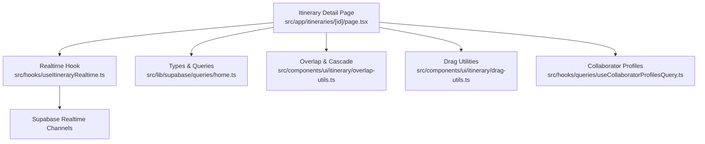
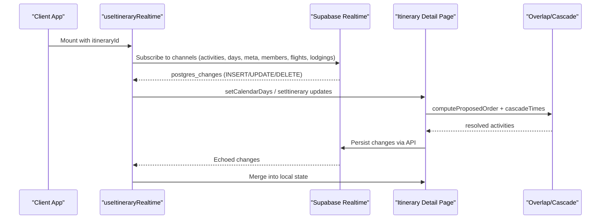
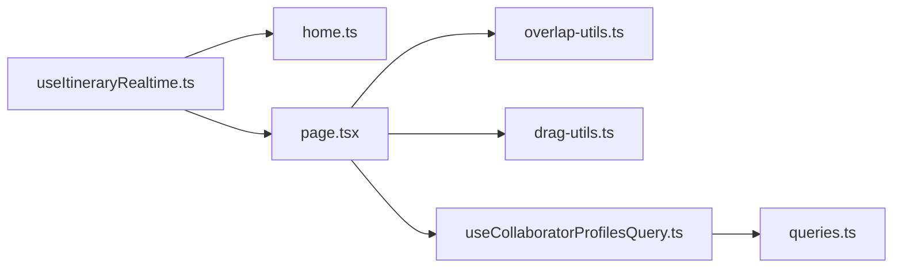

# Live Collaboration

<cite>
**Referenced Files in This Document**
- [useItineraryRealtime.ts](file://src/hooks/useItineraryRealtime.ts)
- [page.tsx](file://src/app/itineraries/[id]/page.tsx)
- [home.ts](file://src/lib/supabase/queries/home.ts)
- [overlap-utils.ts](file://src/components/ui/itinerary/overlap-utils.ts)
- [drag-utils.ts](file://src/components/ui/itinerary/drag-utils.ts)
- [ItineraryJobNotifier.tsx](file://src/components/notifications/ItineraryJobNotifier.tsx)
- [useJobsQueue.ts](file://src/hooks/useJobsQueue.ts)
- [useCollaboratorProfilesQuery.ts](file://src/hooks/queries/useCollaboratorProfilesQuery.ts)
- [queries.ts](file://src/lib/supabase/queries.ts)
</cite>

## Table of Contents
1. Introduction
2. Project Structure
3. Core Components
4. Architecture Overview
5. Detailed Component Analysis
6. Dependency Analysis
7. Performance Considerations
8. Troubleshooting Guide
9. Conclusion

## Introduction
This document explains how live collaboration works for itineraries using Supabase Realtime channels. It covers real-time data synchronization, conflict resolution when multiple users edit the same content, performance optimizations for concurrent updates, and the implementation details of the itinerary real-time hook. It also provides guidance on implementing collaborative editing features and managing user presence.

## Project Structure
The collaboration layer is centered around a React hook that subscribes to Supabase Realtime channels for specific tables and scopes changes by itinerary. The itinerary detail page orchestrates optimistic edits, conflict resolution, and server reconciliation. Supporting utilities handle overlap detection, time cascading, and leg recalculation.

**Diagram sources**
- [useItineraryRealtime.ts:27-333](file://src/hooks/useItineraryRealtime.ts#L27-L333)
- [page.tsx:106-178](file://src/app/itineraries/[id]/page.tsx#L106-L178)
- [home.ts:159-303](file://src/lib/supabase/queries/home.ts#L159-L303)
- [overlap-utils.ts:138-184](file://src/components/ui/itinerary/overlap-utils.ts#L138-L184)
- [drag-utils.ts:1-200](file://src/components/ui/itinerary/drag-utils.ts#L1-L200)
- [useCollaboratorProfilesQuery.ts:7-17](file://src/hooks/queries/useCollaboratorProfilesQuery.ts#L7-L17)

**Section sources**
- [useItineraryRealtime.ts:27-533](file://src/hooks/useItineraryRealtime.ts#L27-L533)
- [page.tsx:106-178](file://src/app/itineraries/[id]/page.tsx#L106-L178)
- [home.ts:159-303](file://src/lib/supabase/queries/home.ts#L159-L303)

## Core Components
- Realtime subscription hook: Subscribes to Postgres change events for activities, days, metadata, collaborators, flights, and lodgings. Updates local state immediately upon receiving INSERT/UPDATE/DELETE payloads.
- Itinerary detail page: Manages optimistic edits, merges server state with pending local changes, resolves overlaps, and persists changes via API calls.
- Overlap and cascade utilities: Detect conflicts in proposed order and recompute times while respecting locked anchors and travel legs.
- Collaborator profiles query: Fetches profile information for active collaborators to display presence.

**Section sources**
- [useItineraryRealtime.ts:27-533](file://src/hooks/useItineraryRealtime.ts#L27-L533)
- [page.tsx:106-178](file://src/app/itineraries/[id]/page.tsx#L106-L178)
- [overlap-utils.ts:138-184](file://src/components/ui/itinerary/overlap-utils.ts#L138-L184)
- [useCollaboratorProfilesQuery.ts:7-17](file://src/hooks/queries/useCollaboratorProfilesQuery.ts#L7-L17)

## Architecture Overview
The system uses Supabase Realtime channels scoped per itinerary to synchronize state across clients. Each client maintains a working copy for editing and merges server-driven updates without losing optimistic actions. Conflict resolution runs locally before persisting to ensure consistent schedules.

**Diagram sources**
- [useItineraryRealtime.ts:89-333](file://src/hooks/useItineraryRealtime.ts#L89-L333)
- [page.tsx:926-984](file://src/app/itineraries/[id]/page.tsx#L926-L984)
- [overlap-utils.ts:138-184](file://src/components/ui/itinerary/overlap-utils.ts#L138-L184)

## Detailed Component Analysis

### Realtime Hook: useItineraryRealtime
Responsibilities:
- Subscribes to Per-table channels filtered by itinerary_id for activities, days, itinerary metadata, collaborators, flights, and lodgings.
- Applies INSERT/UPDATE/DELETE handlers to both calendar view state and itinerary model state to keep both surfaces consistent.
- Hydrates location details for newly inserted activities asynchronously to avoid blocking UI updates.
- Cleans up channels on unmount to prevent leaks.

Key behaviors:
- Activity inserts: Adds to calendar and itinerary arrays; hydrates location if available.
- Activity updates: Handles same-day replacements and cross-day moves while preserving array order semantics for map markers.
- Activity deletes: Removes from both views.
- Day inserts/deletes: Syncs date range changes and mirrors into itinerary model.
- Metadata updates: Merges partial itinerary fields (name, country, counts).
- Member changes: Tracks collaborator joins/leaves to update presence UI.
- Conditional subscriptions: Flights and lodgings channels only subscribe when their sidebars are open to reduce overhead.

Connection drop handling:
- Channels rely on Supabase’s built-in reconnection. For job-related queues, explicit status checks reconcile after reconnect; the realtime hook does not implement custom reconnect logic but benefits from channel lifecycle management.

Performance considerations:
- Conditional subscriptions for sidebars minimize unnecessary listeners.
- Idempotent updates check for existing items before appending.
- Location hydration is asynchronous and best-effort to avoid blocking.

**Section sources**
- [useItineraryRealtime.ts:27-533](file://src/hooks/useItineraryRealtime.ts#L27-L533)

### Itinerary Detail Page: Optimistic Edits and Conflict Resolution
Responsibilities:
- Maintains an editable working copy of days and activities.
- Merges server state with pending local changes, preserving optimistic cards until they reconcile with server echoes.
- Resolves overlaps when dragging or reordering activities, computing a proposed order and cascading times.
- Persists confirmed changes through API endpoints and triggers targeted refetches or leg recalculations.

Conflict resolution strategy:
- Compute proposed order considering locked anchors and new adjacencies.
- Cascade start/end times from the first conflict onward, snapping to a 10-minute grid and preserving durations.
- Use backend-provided leg durations for newly created adjacencies to improve accuracy.
- Present a confirmation dialog showing changes and locked anchors before applying.

Data consistency:
- Uses correlation tokens to match optimistic adds to server rows even when names/times change.
- Preserves user-expressed order during merges to avoid reverting drag intent.
- Clears stale legs on reordered rows so they recompute against new neighbors.

**Section sources**
- [page.tsx:106-178](file://src/app/itineraries/[id]/page.tsx#L106-L178)
- [page.tsx:926-984](file://src/app/itineraries/[id]/page.tsx#L926-L984)
- [page.tsx:2272-2290](file://src/app/itineraries/[id]/page.tsx#L2272-L2290)

### Overlap and Cascade Utilities
Responsibilities:
- Detect conflicts in proposed activity order and identify new adjacencies requiring leg pricing.
- Cascade times across conflicting segments, honoring locked anchors and travel durations.

Algorithm highlights:
- Identify first conflict index and build ordered list with merged tails.
- Track new adjacency pairs to fetch accurate travel durations from backend.
- Iterate from first conflict, advancing a cursor based on previous end plus travel, snapping to grid steps.

Complexity:
- Linear in number of activities within the affected segment; efficient for typical day sizes.

**Section sources**
- [overlap-utils.ts:138-184](file://src/components/ui/itinerary/overlap-utils.ts#L138-L184)

### Data Models and Initial Load
Responsibilities:
- Define types for itinerary, days, activities, and locations.
- Load full itinerary detail including collaborators and activities with embedded locations.
- Order activities by position (authoritative) and tie-break by start_time for legacy rows.

Consistency notes:
- Position field is authoritative for display order; arrays are rebuilt frequently and must not be relied upon for ordering.
- Embedded locations projection matches realtime hydration fields to avoid silent drops.

**Section sources**
- [home.ts:46-121](file://src/lib/supabase/queries/home.ts#L46-L121)
- [home.ts:159-303](file://src/lib/supabase/queries/home.ts#L159-L303)

### User Presence and Collaborator Profiles
Presence signals:
- Collaborator join/leave events are synced via realtime changes to the user_itinerary table and reflected in the itinerary model.
- Profile information for collaborators is fetched on demand using a query hook that retrieves profiles by user IDs.

Implementation notes:
- Presence is derived from database membership rather than ephemeral presence channels.
- Profile queries are cached indefinitely once loaded to avoid repeated network calls.

**Section sources**
- [useItineraryRealtime.ts:407-440](file://src/hooks/useItineraryRealtime.ts#L407-L440)
- [useCollaboratorProfilesQuery.ts:7-17](file://src/hooks/queries/useCollaboratorProfilesQuery.ts#L7-L17)
- [queries.ts:31-46](file://src/lib/supabase/queries.ts#L31-L46)

### Job Notifications and Reconciliation
While not part of core itinerary editing, job notifications demonstrate robust realtime patterns:
- Subscribes to jobs table updates for a specific user and type.
- Tracks last known status per job to detect transitions and invalidate caches accordingly.
- On connection errors or timeouts, sets a flag; on SUBSCRIBED, reconciles state to cover missed updates.

Relevance to collaboration:
- Demonstrates safe handling of connection drops and reconciliation strategies applicable to other realtime flows.

**Section sources**
- [ItineraryJobNotifier.tsx:1-92](file://src/components/notifications/ItineraryJobNotifier.tsx#L1-L92)
- [useJobsQueue.ts:45-295](file://src/hooks/useJobsQueue.ts#L45-L295)

## Dependency Analysis
The collaboration flow depends on several modules:

**Diagram sources**
- [useItineraryRealtime.ts:27-533](file://src/hooks/useItineraryRealtime.ts#L27-L533)
- [page.tsx:106-178](file://src/app/itineraries/[id]/page.tsx#L106-L178)
- [overlap-utils.ts:138-184](file://src/components/ui/itinerary/overlap-utils.ts#L138-L184)
- [drag-utils.ts:1-200](file://src/components/ui/itinerary/drag-utils.ts#L1-L200)
- [useCollaboratorProfilesQuery.ts:7-17](file://src/hooks/queries/useCollaboratorProfilesQuery.ts#L7-L17)
- [queries.ts:31-46](file://src/lib/supabase/queries.ts#L31-L46)

**Section sources**
- [useItineraryRealtime.ts:27-533](file://src/hooks/useItineraryRealtime.ts#L27-L533)
- [page.tsx:106-178](file://src/app/itineraries/[id]/page.tsx#L106-L178)

## Performance Considerations
- Conditional subscriptions: Only subscribe to flight and lodging channels when their sidebars are visible to reduce bandwidth and CPU usage.
- Idempotent updates: Avoid duplicate entries by checking existence before appending.
- Asynchronous hydration: Defer location fetching for new activities to keep UI responsive.
- Authoritative ordering: Rely on position field for stable ordering instead of array identity, minimizing re-renders caused by transient array rebuilds.
- Targeted refetches: After confirmations, trigger focused updates (e.g., legs-only refill) to limit scope of changes.

[No sources needed since this section provides general guidance]

## Troubleshooting Guide
Common issues and resolutions:
- Missing location details after insert: Ensure location hydration path is invoked; failures are logged and do not block UI.
- Duplicate activities: Verify idempotency checks in realtime handlers and deduplication logic in merge functions.
- Stale legs after reorder: Confirm clear_leg_ids are passed to backend to force recomputation for affected rows.
- Connection drops: Observe channel status flags; reconcile state on reconnect similar to job queue pattern.

**Section sources**
- [useItineraryRealtime.ts:50-87](file://src/hooks/useItineraryRealtime.ts#L50-L87)
- [page.tsx:926-984](file://src/app/itineraries/[id]/page.tsx#L926-L984)
- [useJobsQueue.ts:244-260](file://src/hooks/useJobsQueue.ts#L244-L260)

## Conclusion
The live collaboration system leverages Supabase Realtime channels to synchronize itinerary data across clients with minimal latency. The realtime hook ensures immediate UI updates, while the detail page manages optimistic edits and conflict resolution to maintain consistency. Overlap detection and time cascading provide a smooth editing experience, and conditional subscriptions optimize performance. Presence is tracked via database membership, and profile queries enrich the UI. Robust patterns for connection handling and reconciliation are demonstrated in job notifications and can be applied broadly.

[No sources needed since this section summarizes without analyzing specific files]