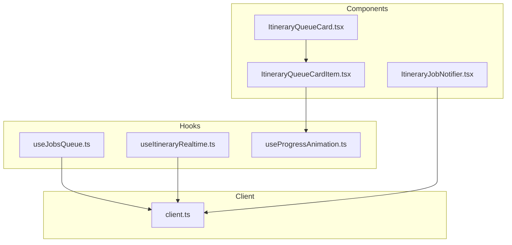
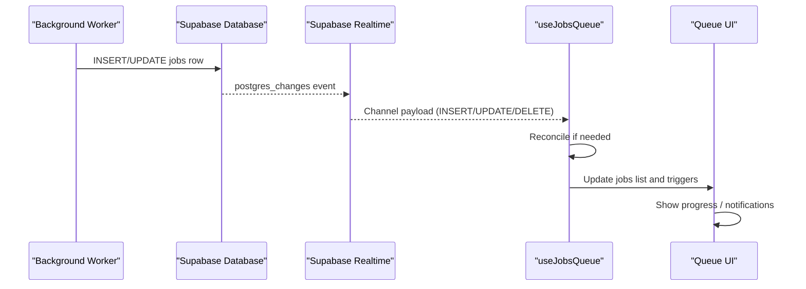
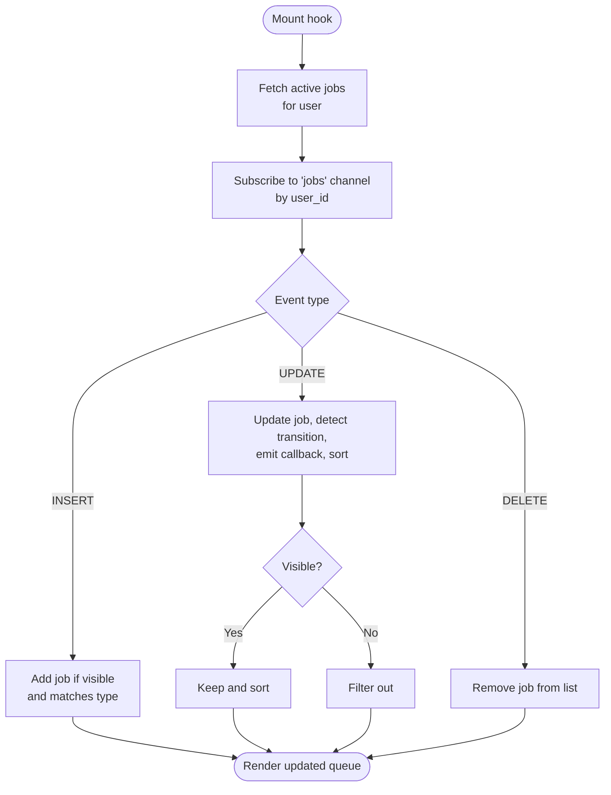
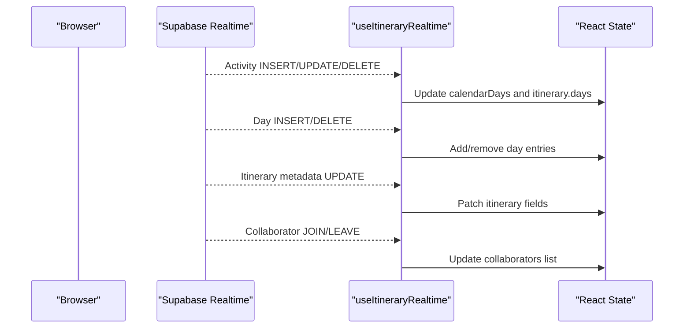
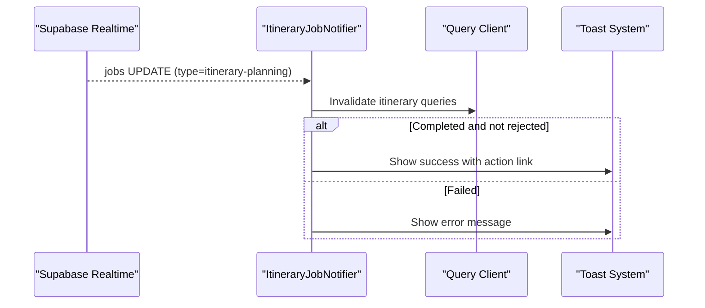
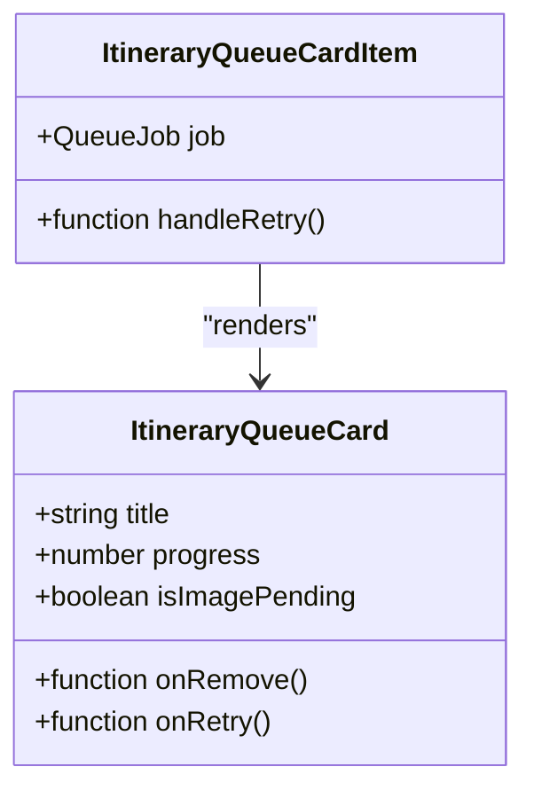
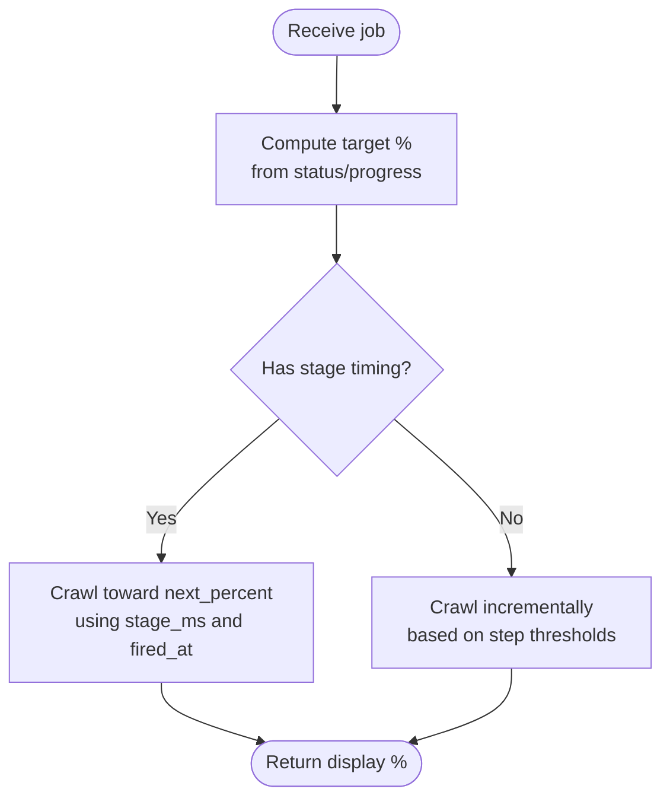
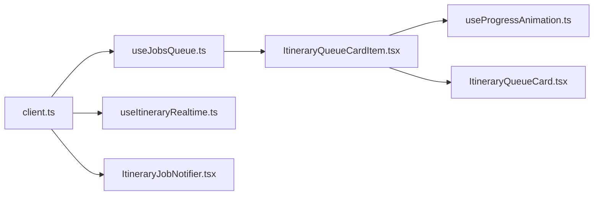

# Real-time Features

<cite>
**Referenced Files in This Document**
- [useJobsQueue.ts](file://src/hooks/useJobsQueue.ts)
- [ItineraryJobNotifier.tsx](file://src/components/notifications/ItineraryJobNotifier.tsx)
- [useItineraryRealtime.ts](file://src/hooks/useItineraryRealtime.ts)
- [ItineraryQueueCard.tsx](file://src/components/ui/itinerary/ItineraryQueueCard.tsx)
- [ItineraryQueueCardItem.tsx](file://src/components/ui/itinerary/ItineraryQueueCardItem.tsx)
- [useProgressAnimation.ts](file://src/hooks/useProgressAnimation.ts)
- [client.ts](file://src/lib/supabase/client.ts)
- [personalization-pipeline.md](file://docs/personalization-pipeline.md)
</cite>

## Table of Contents
1. [Introduction](#introduction)
2. [Project Structure](#project-structure)
3. [Core Components](#core-components)
4. [Architecture Overview](#architecture-overview)
5. [Detailed Component Analysis](#detailed-component-analysis)
6. [Dependency Analysis](#dependency-analysis)
7. [Performance Considerations](#performance-considerations)
8. [Troubleshooting Guide](#troubleshooting-guide)
9. [Conclusion](#conclusion)
10. [Appendices](#appendices)

## Introduction
This document explains the real-time collaboration and background job processing features implemented in the application. It focuses on:
- The job queue system architecture for long-running background tasks (e.g., itinerary planning).
- WebSocket-based real-time updates using Supabase Realtime channels to keep UIs live.
- Notification mechanisms that inform users about job outcomes.
- Job status tracking, progress updates, error handling, and retry flows.
- Practical guidance for extending the job system with new background processes.

## Project Structure
The real-time and job-related logic is primarily implemented in React hooks and components under src/hooks and src/components, with a small client wrapper for Supabase.

**Diagram sources**
- [useJobsQueue.ts:1-296](file://src/hooks/useJobsQueue.ts#L1-L296)
- [useItineraryRealtime.ts:1-534](file://src/hooks/useItineraryRealtime.ts#L1-L534)
- [ItineraryJobNotifier.tsx:1-92](file://src/components/notifications/ItineraryJobNotifier.tsx#L1-L92)
- [ItineraryQueueCard.tsx:1-199](file://src/components/ui/itinerary/ItineraryQueueCard.tsx#L1-L199)
- [ItineraryQueueCardItem.tsx:1-101](file://src/components/ui/itinerary/ItineraryQueueCardItem.tsx#L1-L101)
- [useProgressAnimation.ts:1-104](file://src/hooks/useProgressAnimation.ts#L1-L104)
- [client.ts:1-8](file://src/lib/supabase/client.ts#L1-L8)

**Section sources**
- [useJobsQueue.ts:1-296](file://src/hooks/useJobsQueue.ts#L1-L296)
- [useItineraryRealtime.ts:1-534](file://src/hooks/useItineraryRealtime.ts#L1-L534)
- [ItineraryJobNotifier.tsx:1-92](file://src/components/notifications/ItineraryJobNotifier.tsx#L1-L92)
- [ItineraryQueueCard.tsx:1-199](file://src/components/ui/itinerary/ItineraryQueueCard.tsx#L1-L199)
- [ItineraryQueueCardItem.tsx:1-101](file://src/components/ui/itinerary/ItineraryQueueCardItem.tsx#L1-L101)
- [useProgressAnimation.ts:1-104](file://src/hooks/useProgressAnimation.ts#L1-L104)
- [client.ts:1-8](file://src/lib/supabase/client.ts#L1-L8)

## Core Components
- useJobsQueue: Subscribes to Supabase Realtime changes on the jobs table, maintains local state, reconciles missed updates, and exposes helpers to remove or optimistically upsert jobs.
- ItineraryJobNotifier: Listens for job updates for a specific type and shows toast notifications while invalidating relevant caches.
- useItineraryRealtime: Subscribes to multiple tables (activities, days, itineraries, flights, lodgings) to provide live collaborative editing experiences.
- ItineraryQueueCard and ItineraryQueueCardItem: Render in-flight jobs with progress bars, retry actions, and visual states.
- useProgressAnimation: Smoothly animates progress based on worker-reported steps and optional stage timing hints.
- Supabase client: Provides browser client creation for realtime subscriptions.

**Section sources**
- [useJobsQueue.ts:45-295](file://src/hooks/useJobsQueue.ts#L45-L295)
- [ItineraryJobNotifier.tsx:10-88](file://src/components/notifications/ItineraryJobNotifier.tsx#L10-L88)
- [useItineraryRealtime.ts:39-532](file://src/hooks/useItineraryRealtime.ts#L39-L532)
- [ItineraryQueueCard.tsx:35-199](file://src/components/ui/itinerary/ItineraryQueueCard.tsx#L35-L199)
- [ItineraryQueueCardItem.tsx:13-101](file://src/components/ui/itinerary/ItineraryQueueCardItem.tsx#L13-L101)
- [useProgressAnimation.ts:18-104](file://src/hooks/useProgressAnimation.ts#L18-L104)
- [client.ts:3-8](file://src/lib/supabase/client.ts#L3-L8)

## Architecture Overview
The system uses Supabase Realtime channels to stream database changes into the browser. Jobs are persisted in a jobs table; workers update rows as they run. The UI subscribes to these changes and updates the interface immediately. For collaborative editing, additional channels listen to itinerary-related tables to reflect other users’ changes in real time.

**Diagram sources**
- [useJobsQueue.ts:167-260](file://src/hooks/useJobsQueue.ts#L167-L260)
- [ItineraryJobNotifier.tsx:45-85](file://src/components/notifications/ItineraryJobNotifier.tsx#L45-L85)
- [client.ts:3-8](file://src/lib/supabase/client.ts#L3-L8)

## Detailed Component Analysis

### Job Queue System (useJobsQueue)
Responsibilities:
- Initial fetch of active jobs (including recent failures) for a user.
- Subscribe to Supabase Realtime channel for the jobs table filtered by user_id.
- Handle INSERT/UPDATE/DELETE events to maintain a sorted, visible queue.
- Track last known status per job to detect transitions and emit callbacks for completion/failure/rejection.
- Reconcile missed updates when visibility changes or after reconnect.
- Provide removeJob and upsertJob for UI control and optimistic updates.

Key behaviors:
- Failed jobs pin to the front; newest first within groups.
- Only non-detached jobs are shown; failed jobs are kept for 24 hours to allow retries.
- Type filtering allows isolating queues by job type.
- Connection errors set a flag; re-subscription triggers reconciliation.

**Diagram sources**
- [useJobsQueue.ts:138-247](file://src/hooks/useJobsQueue.ts#L138-L247)

**Section sources**
- [useJobsQueue.ts:6-43](file://src/hooks/useJobsQueue.ts#L6-L43)
- [useJobsQueue.ts:109-165](file://src/hooks/useJobsQueue.ts#L109-L165)
- [useJobsQueue.ts:167-260](file://src/hooks/useJobsQueue.ts#L167-L260)
- [useJobsQueue.ts:269-295](file://src/hooks/useJobsQueue.ts#L269-L295)

### Live Collaboration (useItineraryRealtime)
Responsibilities:
- Subscribe to changes on itinerary_activities, itinerary_days, itineraries, user_itinerary, itinerary_flights, and itinerary_lodgings.
- Mirror backend changes into both calendar view state and itinerary detail state to keep all views consistent.
- Hydrate activity locations asynchronously when needed.
- Manage collaborators joining/leaving via user_itinerary changes.

Highlights:
- Separate channels per entity to avoid cross-talk.
- Careful handling of same-day vs cross-day moves for activities.
- Conditional subscriptions for sidebars (flights/lodgings) to reduce overhead.

**Diagram sources**
- [useItineraryRealtime.ts:39-333](file://src/hooks/useItineraryRealtime.ts#L39-L333)
- [useItineraryRealtime.ts:335-440](file://src/hooks/useItineraryRealtime.ts#L335-L440)
- [useItineraryRealtime.ts:442-530](file://src/hooks/useItineraryRealtime.ts#L442-L530)

**Section sources**
- [useItineraryRealtime.ts:39-532](file://src/hooks/useItineraryRealtime.ts#L39-L532)

### Notifications (ItineraryJobNotifier)
Responsibilities:
- Listen for job updates for a specific type (e.g., itinerary-planning).
- Invalidate relevant query caches upon completion or failure.
- Show success or error toasts with actionable links.

Behavior:
- Tracks previous statuses to avoid duplicate notifications.
- Skips rejected completions.

**Diagram sources**
- [ItineraryJobNotifier.tsx:45-85](file://src/components/notifications/ItineraryJobNotifier.tsx#L45-L85)

**Section sources**
- [ItineraryJobNotifier.tsx:10-88](file://src/components/notifications/ItineraryJobNotifier.tsx#L10-L88)

### Queue UI (ItineraryQueueCard and ItineraryQueueCardItem)
Responsibilities:
- Display in-flight jobs with appropriate states (queued, processing, failed).
- Show progress bar and ETA-like labels.
- Offer retry actions for failed or stuck jobs.
- Resolve destination photos for preview consistency.

Stuck detection:
- If a job remains in queued/pending/processing beyond a threshold, offer retry.

**Diagram sources**
- [ItineraryQueueCard.tsx:35-199](file://src/components/ui/itinerary/ItineraryQueueCard.tsx#L35-L199)
- [ItineraryQueueCardItem.tsx:13-101](file://src/components/ui/itinerary/ItineraryQueueCardItem.tsx#L13-L101)

**Section sources**
- [ItineraryQueueCard.tsx:35-199](file://src/components/ui/itinerary/ItineraryQueueCard.tsx#L35-L199)
- [ItineraryQueueCardItem.tsx:13-101](file://src/components/ui/itinerary/ItineraryQueueCardItem.tsx#L13-L101)

### Progress Animation (useProgressAnimation)
Responsibilities:
- Compute target percentage from job status and worker-reported progress.
- Animate progress smoothly between steps, optionally using stage timing hints.
- Avoid backward movement during processing to prevent confusing UI behavior.

Algorithm highlights:
- Trust worker-reported percent when present.
- Otherwise map step numbers to target percentages.
- Crawl forward gradually until next step or stage boundary.

**Diagram sources**
- [useProgressAnimation.ts:18-104](file://src/hooks/useProgressAnimation.ts#L18-L104)

**Section sources**
- [useProgressAnimation.ts:18-104](file://src/hooks/useProgressAnimation.ts#L18-L104)

## Dependency Analysis
- All realtime subscriptions are built on the Supabase browser client.
- useJobsQueue depends on Supabase Realtime and manages its own channel lifecycle.
- ItineraryJobNotifier also uses Supabase Realtime and integrates with the query cache and toast system.
- useItineraryRealtime creates multiple channels for different entities.
- UI components depend on hooks for data and animation.

**Diagram sources**
- [client.ts:3-8](file://src/lib/supabase/client.ts#L3-L8)
- [useJobsQueue.ts:167-260](file://src/hooks/useJobsQueue.ts#L167-L260)
- [useItineraryRealtime.ts:89-530](file://src/hooks/useItineraryRealtime.ts#L89-L530)
- [ItineraryJobNotifier.tsx:45-85](file://src/components/notifications/ItineraryJobNotifier.tsx#L45-L85)
- [ItineraryQueueCardItem.tsx:39-101](file://src/components/ui/itinerary/ItineraryQueueCardItem.tsx#L39-L101)
- [useProgressAnimation.ts:37-104](file://src/hooks/useProgressAnimation.ts#L37-L104)

**Section sources**
- [client.ts:3-8](file://src/lib/supabase/client.ts#L3-L8)
- [useJobsQueue.ts:167-260](file://src/hooks/useJobsQueue.ts#L167-L260)
- [useItineraryRealtime.ts:89-530](file://src/hooks/useItineraryRealtime.ts#L89-L530)
- [ItineraryJobNotifier.tsx:45-85](file://src/components/notifications/ItineraryJobNotifier.tsx#L45-L85)
- [ItineraryQueueCardItem.tsx:39-101](file://src/components/ui/itinerary/ItineraryQueueCardItem.tsx#L39-L101)
- [useProgressAnimation.ts:37-104](file://src/hooks/useProgressAnimation.ts#L37-L104)

## Performance Considerations
- Channel deduplication: Each hook instance generates a unique suffix to avoid sharing channels across instances.
- Visibility reconciliation: On tab focus, the job queue reconciles missed updates to ensure consistency.
- Selective subscriptions: Sidebars subscribe only when visible to reduce realtime load.
- Optimistic UI: UpsertJob allows immediate feedback before realtime updates arrive.
- Stuck job detection: UI offers retry for jobs stalled beyond a threshold.

[No sources needed since this section provides general guidance]

## Troubleshooting Guide
Common issues and resolutions:
- Missed realtime updates: The job queue reconciles on visibility change and re-subscription; ensure channels are subscribed and not removed prematurely.
- Duplicate notifications: Status tracking prevents repeated callbacks; verify previous status checks.
- Stuck jobs: Offer retry when jobs remain in flight too long; ensure backend acknowledges retries promptly.
- Connection errors: The hook sets a connectionError flag; consider retrying subscription or falling back to polling.

**Section sources**
- [useJobsQueue.ts:161-165](file://src/hooks/useJobsQueue.ts#L161-L165)
- [useJobsQueue.ts:250-260](file://src/hooks/useJobsQueue.ts#L250-L260)
- [ItineraryQueueCardItem.tsx:64-83](file://src/components/ui/itinerary/ItineraryQueueCardItem.tsx#L64-L83)
- [ItineraryJobNotifier.tsx:57-82](file://src/components/notifications/ItineraryJobNotifier.tsx#L57-L82)

## Conclusion
The application implements robust real-time collaboration and background job processing using Supabase Realtime channels. Jobs are tracked with detailed status and progress, and users receive timely notifications. The design supports resilient updates through reconciliation, optimistic UI, and selective subscriptions. Extending the system involves adding new job types, subscribing to relevant tables, and wiring UI components to display progress and actions.

[No sources needed since this section summarizes without analyzing specific files]

## Appendices

### Extending the Job System
Steps to add a new background process:
1. Define a new job type and ensure the worker updates the jobs table with status and progress.
2. In your page or component, call useJobsQueue with the new type to subscribe to those jobs.
3. Use the returned jobs array to render queue cards; leverage ItineraryQueueCardItem for consistent visuals.
4. Optionally add a dedicated notifier similar to ItineraryJobNotifier to show toasts and invalidate caches.
5. If you need collaborative updates for related entities, follow the pattern in useItineraryRealtime to create channels for those tables.

**Section sources**
- [useJobsQueue.ts:45-76](file://src/hooks/useJobsQueue.ts#L45-L76)
- [ItineraryQueueCardItem.tsx:39-101](file://src/components/ui/itinerary/ItineraryQueueCardItem.tsx#L39-L101)
- [ItineraryJobNotifier.tsx:45-85](file://src/components/notifications/ItineraryJobNotifier.tsx#L45-L85)
- [useItineraryRealtime.ts:89-530](file://src/hooks/useItineraryRealtime.ts#L89-L530)

### Migration Notes
The project documents a plan to replace some realtime subscriptions with polling where appropriate, particularly for job queues, due to platform constraints.

**Section sources**
- [personalization-pipeline.md:140-155](file://docs/personalization-pipeline.md#L140-L155)