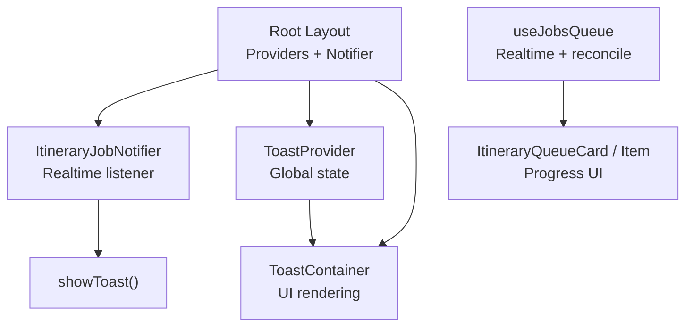
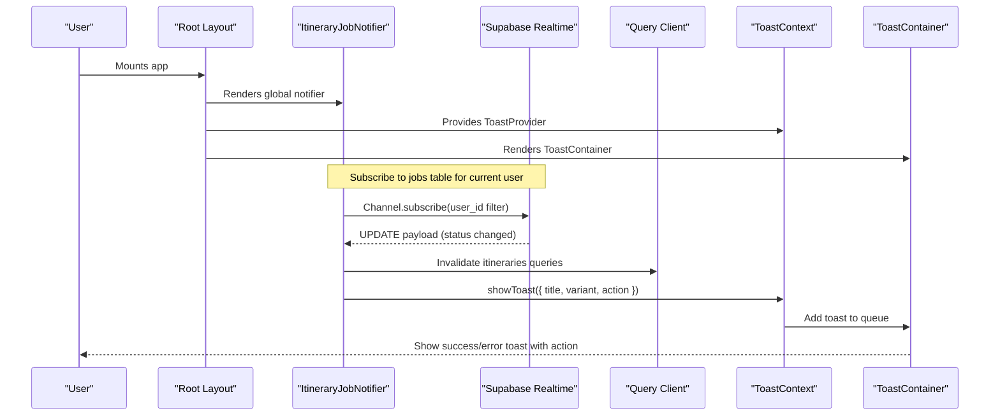
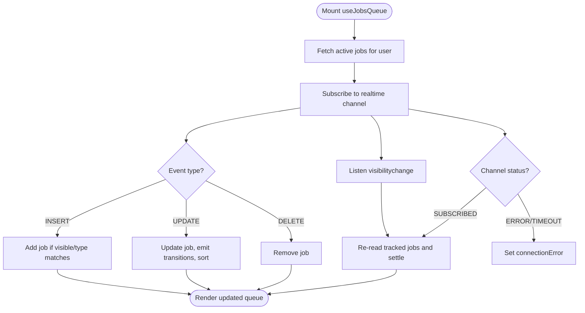
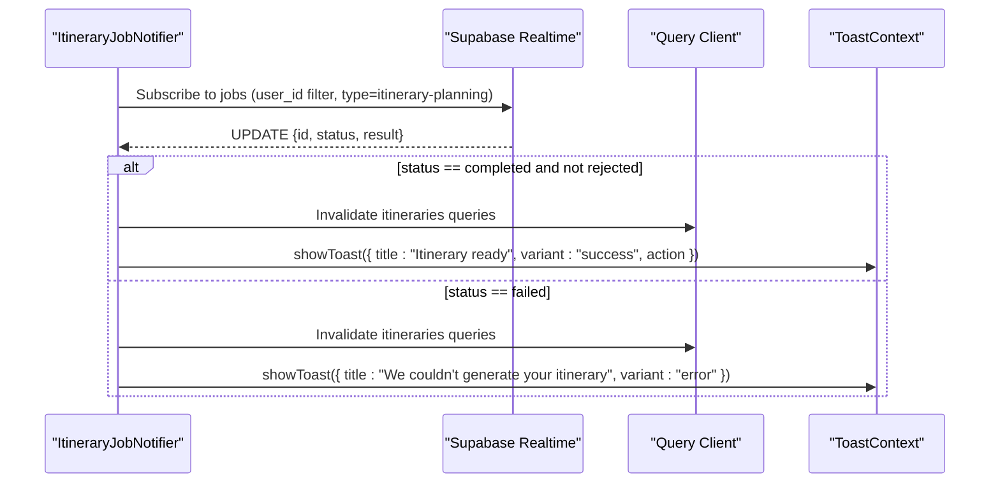
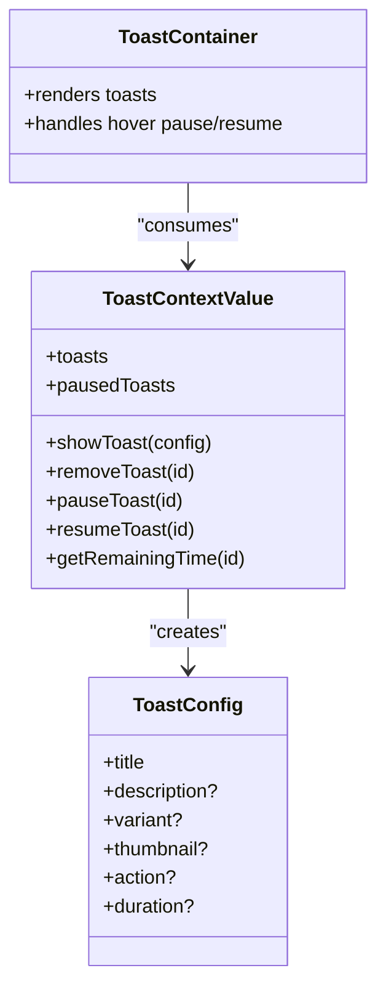
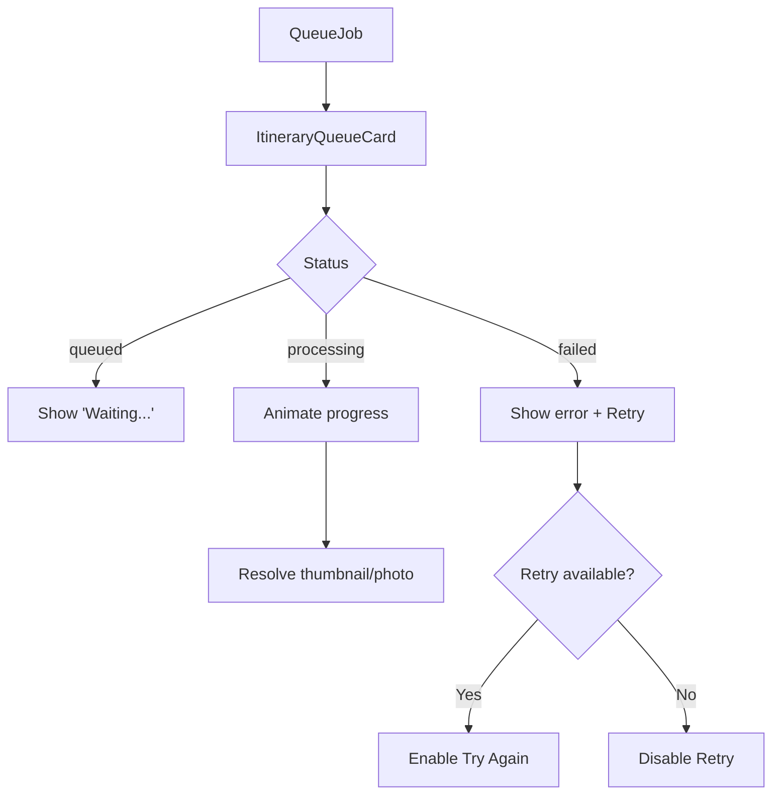
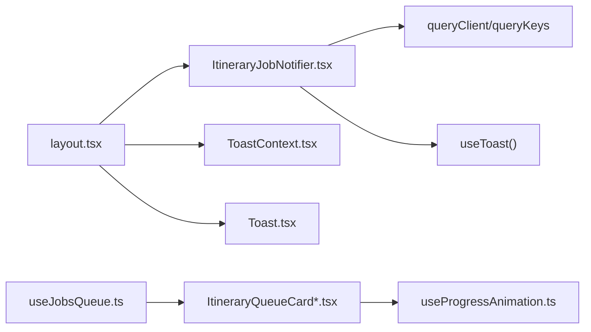
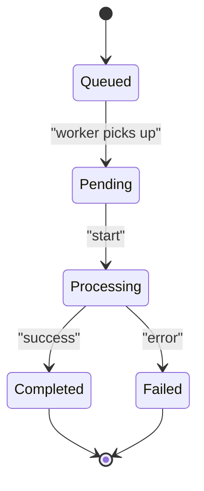

# Real-time Notifications

<cite>
**Referenced Files in This Document**
- [layout.tsx](file://src/app/layout.tsx)
- [ItineraryJobNotifier.tsx](file://src/components/notifications/ItineraryJobNotifier.tsx)
- [useJobsQueue.ts](file://src/hooks/useJobsQueue.ts)
- [ToastContext.tsx](file://src/contexts/ToastContext.tsx)
- [Toast.tsx](file://src/components/ui/primitives/Toast.tsx)
- [ItineraryQueueCard.tsx](file://src/components/ui/itinerary/ItineraryQueueCard.tsx)
- [ItineraryQueueCardItem.tsx](file://src/components/ui/itinerary/ItineraryQueueCardItem.tsx)
- [useProgressAnimation.ts](file://src/hooks/useProgressAnimation.ts)
</cite>

## Table of Contents
1. [Introduction](#introduction)
2. [Project Structure](#project-structure)
3. [Core Components](#core-components)
4. [Architecture Overview](#architecture-overview)
5. [Detailed Component Analysis](#detailed-component-analysis)
6. [Dependency Analysis](#dependency-analysis)
7. [Performance Considerations](#performance-considerations)
8. [Troubleshooting Guide](#troubleshooting-guide)
9. [Conclusion](#conclusion)
10. [Appendices](#appendices)

## Introduction
This document explains the real-time notification system that keeps users informed about background job progress and completion. It covers how notifications are triggered by job status changes, how they integrate with the job queue hook, and the user experience patterns for displaying progress updates. The lifecycle from job creation to completion or failure is documented, including visual feedback, auto-dismissal behavior, and user interaction options. Guidance is also provided for adding custom notification types and styling them to match application themes.

## Project Structure
The notification system spans several layers:
- Global layout wires up providers and global listeners.
- A dedicated notifier component subscribes to job updates and surfaces success/failure toasts.
- A reusable job queue hook manages in-flight jobs, realtime updates, reconciliation, and transitions.
- A toast context and container render persistent, auto-dismissing notifications with actions and thumbnails.
- Queue cards visualize in-progress jobs with animated progress bars and retry flows.

**Diagram sources**
- [layout.tsx:62-78](file://src/app/layout.tsx#L62-L78)
- [ItineraryJobNotifier.tsx:29-88](file://src/components/notifications/ItineraryJobNotifier.tsx#L29-L88)
- [ToastContext.tsx:42-147](file://src/contexts/ToastContext.tsx#L42-L147)
- [Toast.tsx:47-173](file://src/components/ui/primitives/Toast.tsx#L47-L173)
- [useJobsQueue.ts:78-267](file://src/hooks/useJobsQueue.ts#L78-L267)

**Section sources**
- [layout.tsx:62-78](file://src/app/layout.tsx#L62-L78)

## Core Components
- ItineraryJobNotifier: Subscribes to Supabase realtime updates for a user’s itinerary-planning jobs and shows success or error toasts when terminal statuses arrive. It also invalidates relevant query caches so the UI refreshes automatically.
- useJobsQueue: Manages a live list of jobs per user, handles INSERT/UPDATE/DELETE events, reconciles missed updates on reconnect or visibility change, and exposes transition callbacks for completed/failed/rejected jobs.
- ToastContext + ToastContainer: Provide a global toast API with auto-dismiss timers, pause/resume on hover, optional thumbnails, and action buttons. Rendered via portal at the root level.
- ItineraryQueueCard / ItineraryQueueCardItem: Visualize in-progress jobs with progress bars, retry actions, and image placeholders; animate progress using worker-reported percentages or step-based crawling.
- useProgressAnimation: Smoothly animates progress values based on job steps and worker-reported timing metadata.

**Section sources**
- [ItineraryJobNotifier.tsx:10-90](file://src/components/notifications/ItineraryJobNotifier.tsx#L10-L90)
- [useJobsQueue.ts:6-34](file://src/hooks/useJobsQueue.ts#L6-L34)
- [useJobsQueue.ts:78-267](file://src/hooks/useJobsQueue.ts#L78-L267)
- [ToastContext.tsx:12-36](file://src/contexts/ToastContext.tsx#L12-L36)
- [Toast.tsx:47-173](file://src/components/ui/primitives/Toast.tsx#L47-L173)
- [ItineraryQueueCard.tsx:12-199](file://src/components/ui/itinerary/ItineraryQueueCard.tsx#L12-L199)
- [ItineraryQueueCardItem.tsx:14-101](file://src/components/ui/itinerary/ItineraryQueueCardItem.tsx#L14-L101)
- [useProgressAnimation.ts:6-104](file://src/hooks/useProgressAnimation.ts#L6-L104)

## Architecture Overview
The system combines server-driven job updates with client-side state management and UI rendering:

**Diagram sources**
- [layout.tsx:62-78](file://src/app/layout.tsx#L62-L78)
- [ItineraryJobNotifier.tsx:29-88](file://src/components/notifications/ItineraryJobNotifier.tsx#L29-L88)
- [ToastContext.tsx:90-98](file://src/contexts/ToastContext.tsx#L90-L98)
- [Toast.tsx:47-173](file://src/components/ui/primitives/Toast.tsx#L47-L173)

## Detailed Component Analysis

### Job Queue Hook: useJobsQueue
Responsibilities:
- Initial fetch of active jobs (including recent failures) for the current user.
- Realtime subscription to INSERT/UPDATE/DELETE on the jobs table filtered by user.
- Reconciliation pass to recover from missed updates when tabs become visible or after reconnection.
- Emitting transition callbacks for terminal states (completed, failed, rejected).
- Managing local job list sorting and visibility rules (e.g., failed jobs pinned to front, hidden if detached or older than threshold).

Key behaviors:
- Failed jobs remain visible for a day to allow retries.
- Optimistic upsert supports immediate UI updates after retry calls.
- Connection errors set a flag to indicate realtime issues.

**Diagram sources**
- [useJobsQueue.ts:78-267](file://src/hooks/useJobsQueue.ts#L78-L267)

**Section sources**
- [useJobsQueue.ts:78-267](file://src/hooks/useJobsQueue.ts#L78-L267)

### Itinerary Job Notifier: ItineraryJobNotifier
Responsibilities:
- Track current authenticated user and subscribe to realtime updates for itinerary-planning jobs.
- On completion without rejection, invalidate related queries and show a success toast with an action link to view the new itinerary.
- On failure, invalidate queries and show an error toast with guidance to retry later.

Lifecycle highlights:
- Maintains a Map of last known statuses per job to detect transitions and avoid duplicate toasts.
- Cleans up channels on unmount.

**Diagram sources**
- [ItineraryJobNotifier.tsx:29-88](file://src/components/notifications/ItineraryJobNotifier.tsx#L29-L88)

**Section sources**
- [ItineraryJobNotifier.tsx:10-90](file://src/components/notifications/ItineraryJobNotifier.tsx#L10-L90)

### Toast System: Context and Container
Responsibilities:
- Manage a global list of toasts with unique IDs, durations, and variants.
- Auto-dismiss with a timer; pause/resume on hover; remove manually or via action.
- Render accessible, animated toasts with optional thumbnails and action buttons.

User experience:
- Default duration applies unless overridden.
- Error toasts do not show action buttons; success/info can include a “View” action.
- Progress bar drains along the bottom edge while visible.

**Diagram sources**
- [ToastContext.tsx:12-36](file://src/contexts/ToastContext.tsx#L12-L36)
- [ToastContext.tsx:90-98](file://src/contexts/ToastContext.tsx#L90-L98)
- [Toast.tsx:47-173](file://src/components/ui/primitives/Toast.tsx#L47-L173)

**Section sources**
- [ToastContext.tsx:42-147](file://src/contexts/ToastContext.tsx#L42-L147)
- [Toast.tsx:47-173](file://src/components/ui/primitives/Toast.tsx#L47-L173)

### In-Flight Job Visualization: Queue Cards
Responsibilities:
- Display queued, processing, or failed jobs with progress indicators and retry actions.
- Animate progress using worker-reported percentages or step-based crawling.
- Resolve destination images and handle pending media states.

UX patterns:
- Failed jobs show an error message and a “Try Again” button.
- Stuck jobs (long time in flight) offer retry even without formal failure.
- Progress labels show “Waiting...” for queued jobs or percentage for processing.

**Diagram sources**
- [ItineraryQueueCard.tsx:12-199](file://src/components/ui/itinerary/ItineraryQueueCard.tsx#L12-L199)
- [ItineraryQueueCardItem.tsx:14-101](file://src/components/ui/itinerary/ItineraryQueueCardItem.tsx#L14-L101)
- [useProgressAnimation.ts:6-104](file://src/hooks/useProgressAnimation.ts#L6-L104)

**Section sources**
- [ItineraryQueueCard.tsx:12-199](file://src/components/ui/itinerary/ItineraryQueueCard.tsx#L12-L199)
- [ItineraryQueueCardItem.tsx:14-101](file://src/components/ui/itinerary/ItineraryQueueCardItem.tsx#L14-L101)
- [useProgressAnimation.ts:6-104](file://src/hooks/useProgressAnimation.ts#L6-L104)

## Dependency Analysis
- Root layout composes providers and renders the global notifier and toast container once.
- ItineraryJobNotifier depends on Supabase client, query client cache keys, and toast API.
- useJobsQueue depends on Supabase client and provides hooks for components to consume job lists and transitions.
- Queue cards depend on progress animation and photo resolution hooks to render smooth UX.

**Diagram sources**
- [layout.tsx:62-78](file://src/app/layout.tsx#L62-L78)
- [ItineraryJobNotifier.tsx:29-88](file://src/components/notifications/ItineraryJobNotifier.tsx#L29-L88)
- [useJobsQueue.ts:78-267](file://src/hooks/useJobsQueue.ts#L78-L267)
- [ItineraryQueueCard.tsx:12-199](file://src/components/ui/itinerary/ItineraryQueueCard.tsx#L12-L199)
- [useProgressAnimation.ts:6-104](file://src/hooks/useProgressAnimation.ts#L6-L104)

**Section sources**
- [layout.tsx:62-78](file://src/app/layout.tsx#L62-L78)

## Performance Considerations
- Realtime deduplication: Each notifier and queue hook uses a unique instance ID suffix to avoid channel conflicts when multiple instances share the same user context.
- Reconciliation: Missed updates are recovered on visibility change and reconnect to prevent stuck progress states.
- Efficient updates: Local maps track last known statuses to avoid redundant toasts and UI churn.
- Optimistic UI: Upsert operations update the queue immediately, reducing perceived latency after retries.
- Reduced motion: Toast animations respect reduced motion preferences.

[No sources needed since this section provides general guidance]

## Troubleshooting Guide
Common issues and resolutions:
- Duplicate toasts on completion: Ensure status tracking map prevents repeated triggers for the same terminal status.
- Stuck progress: Trigger reconciliation on visibility change or reconnect; verify realtime channel status and filters.
- Missing toasts after tab backgrounding: Rely on reconcile pass to catch missed updates; ensure channel remains subscribed.
- Toast not dismissing: Verify default duration and that timers are cleared on removal; check paused state logic.

**Section sources**
- [ItineraryJobNotifier.tsx:29-88](file://src/components/notifications/ItineraryJobNotifier.tsx#L29-L88)
- [useJobsQueue.ts:105-136](file://src/hooks/useJobsQueue.ts#L105-L136)
- [useJobsQueue.ts:250-260](file://src/hooks/useJobsQueue.ts#L250-L260)
- [ToastContext.tsx:56-88](file://src/contexts/ToastContext.tsx#L56-L88)

## Conclusion
The real-time notification system integrates Supabase realtime updates with a robust client-side state model to deliver timely, accurate feedback for background jobs. ItineraryJobNotifier surfaces terminal outcomes via toasts and cache invalidation, while useJobsQueue maintains a resilient, animated view of in-flight work. The toast system offers accessible, themeable notifications with auto-dismissal and user interactions. Together, these components provide a cohesive user experience from job creation through completion or failure.

[No sources needed since this section summarizes without analyzing specific files]

## Appendices

### Notification Lifecycle: From Creation to Completion/Failure
- Job created: Appears in the queue card with initial progress state.
- Processing: Progress animates using worker-reported percent or step-based crawling; ETA may be inferred from stage metadata.
- Completed: Queries invalidated; success toast shown with optional action to view results.
- Failed: Error toast displayed; queue card offers retry if eligible.

[No sources needed since this diagram shows conceptual workflow, not actual code structure]

### Adding Custom Notification Types
Steps:
- Define a new toast variant in the context configuration.
- Extend the toast renderer to handle the new variant’s styling and behavior.
- Trigger the new toast from any component via the toast API.

Guidance:
- Keep titles concise; add descriptions for context.
- Use thumbnails sparingly to enhance recognition.
- Provide actions only where appropriate (e.g., success paths).

**Section sources**
- [ToastContext.tsx:12-36](file://src/contexts/ToastContext.tsx#L12-L36)
- [Toast.tsx:66-165](file://src/components/ui/primitives/Toast.tsx#L66-L165)

### Styling Notifications to Match Application Themes
Approach:
- Leverage existing CSS classes and design tokens used by the toast container.
- Adjust padding and typography to align with the application’s design system.
- Respect reduced motion preferences for accessibility.

Best practices:
- Maintain consistent spacing and hierarchy across variants.
- Ensure contrast and readability for all variants.
- Test under different themes and screen sizes.

**Section sources**
- [Toast.tsx:98-165](file://src/components/ui/primitives/Toast.tsx#L98-L165)