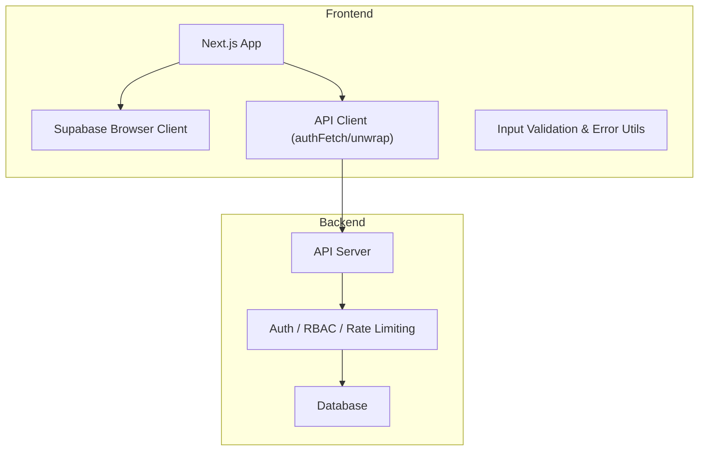
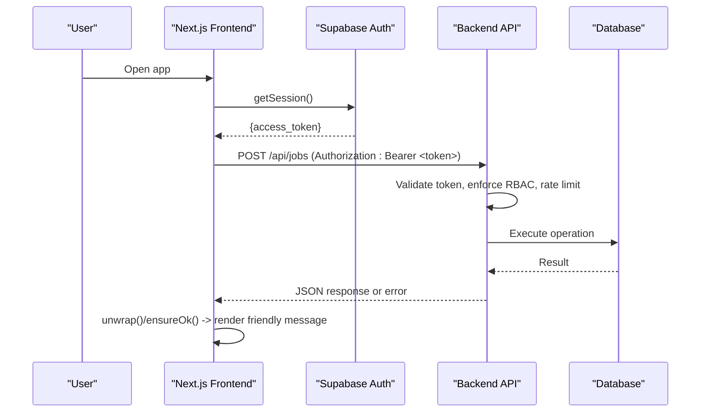
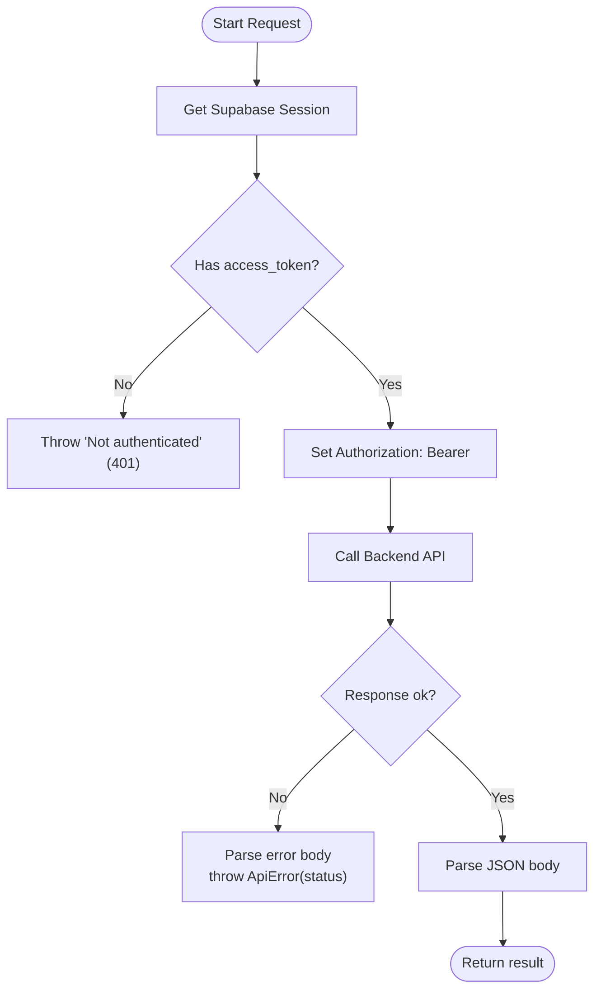
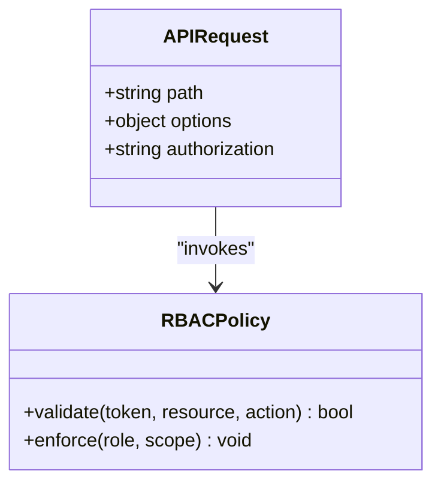
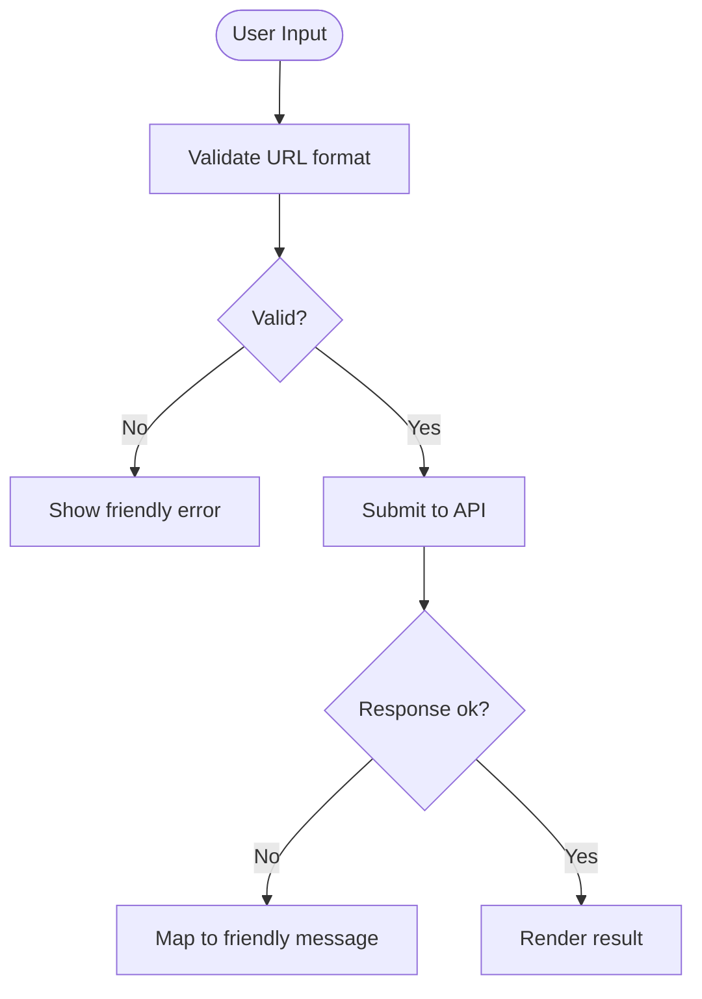
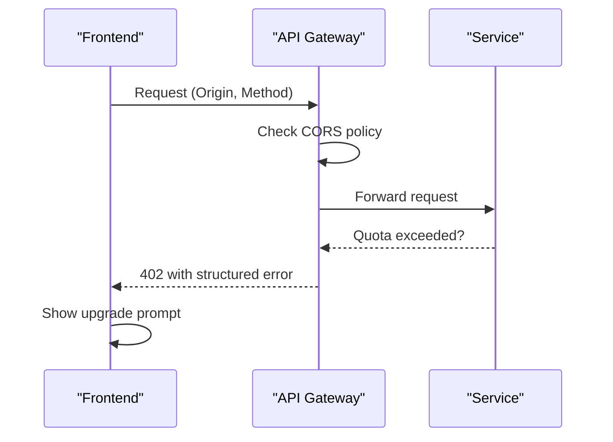
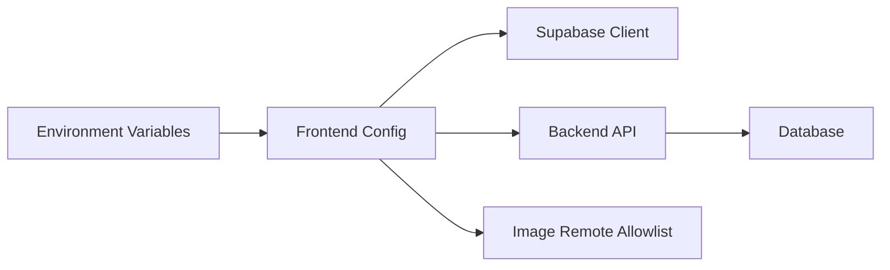
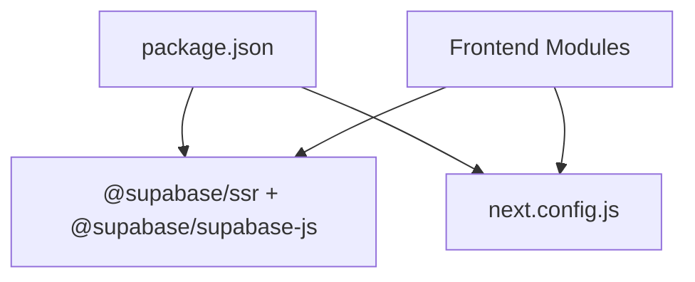

# Security Considerations

<cite>
**Referenced Files in This Document**
- [client.ts](file://src/lib/api/client.ts)
- [password-policy.ts](file://src/lib/auth/password-policy.ts)
- [client.ts (Supabase)](file://src/lib/supabase/client.ts)
- [next.config.js](file://next.config.js)
- [userMessages.ts](file://src/lib/errors/userMessages.ts)
- [collections.ts](file://src/lib/api/collections.ts)
- [url-validation.ts](file://src/lib/utils/url-validation.ts)
- [NewLinkModal.tsx](file://src/components/ui/modals/NewLinkModal.tsx)
- [useQuotaGate.ts](file://src/hooks/useQuotaGate.ts)
- [package.json](file://package.json)
</cite>

## Table of Contents
1. Introduction
2. Project Structure
3. Core Components
4. Architecture Overview
5. Detailed Component Analysis
6. Dependency Analysis
7. Performance Considerations
8. Troubleshooting Guide
9. Conclusion
10. Appendices

## Introduction
This document provides comprehensive security guidance for the Argo application’s authentication, authorization, data protection, API security, sensitive data handling, and secure development practices. It focuses on how the frontend secures sessions and tokens, validates input, encodes output safely, and integrates with Supabase and a backend API. It also outlines best practices for rate limiting, CORS, secure headers, encryption strategies, storage, client-side security, auditing, penetration testing, incident response, compliance, and monitoring.

## Project Structure
Security-relevant areas are concentrated in:
- Authentication and session management via Supabase browser client and token propagation to the backend API
- Centralized API client that enforces authenticated requests and standardized error handling
- Password policy enforcement aligned with server configuration
- Input validation utilities and safe UI error messaging
- Next.js image remote domain allowlist to prevent SSRF-like misuse
- Public token endpoints for read-only sharing of collections

**Diagram sources**
- [client.ts (Supabase):1-9](file://src/lib/supabase/client.ts#L1-L9)
- [client.ts:1-156](file://src/lib/api/client.ts#L1-L156)
- [next.config.js:1-18](file://next.config.js#L1-L18)

**Section sources**
- [client.ts:1-156](file://src/lib/api/client.ts#L1-L156)
- [client.ts (Supabase):1-9](file://src/lib/supabase/client.ts#L1-L9)
- [next.config.js:1-18](file://next.config.js#L1-L18)

## Core Components
- Session and token handling: The Supabase browser client is used to obtain the current session and access token, which is attached as a Bearer token to all outbound API calls through a centralized fetch wrapper.
- Authorization boundary: All mutating or scoped operations require an active session; unauthenticated requests fail early with a typed error.
- Password policy: Client-side password rules mirror server-side requirements to provide immediate feedback while relying on server enforcement for final validation.
- Input validation: URL inputs are validated before submission to prevent malformed or unsafe values from reaching downstream services.
- Safe error presentation: User-facing messages are sanitized to avoid leaking technical details; only whitelisted backend messages are shown verbatim.
- Image loading policy: Only explicitly allowed remote domains are permitted for images to reduce risk of SSRF or malicious content loading.

**Section sources**
- [client.ts:48-83](file://src/lib/api/client.ts#L48-L83)
- [password-policy.ts:1-41](file://src/lib/auth/password-policy.ts#L1-L41)
- [url-validation.ts:1-17](file://src/lib/utils/url-validation.ts#L1-L17)
- [userMessages.ts:94-106](file://src/lib/errors/userMessages.ts#L94-L106)
- [next.config.js:8-14](file://next.config.js#L8-L14)

## Architecture Overview
The security architecture centers on short-lived bearer tokens obtained from Supabase, propagated to the backend API, and enforced by server-side auth/RBAC. Public read endpoints use time-bound tokens for shareable resources.

**Diagram sources**
- [client.ts:48-94](file://src/lib/api/client.ts#L48-L94)
- [collections.ts:134-157](file://src/lib/api/collections.ts#L134-L157)

## Detailed Component Analysis

### Authentication and Session Management
- Token acquisition: The frontend retrieves the current session and extracts the access token using the Supabase browser client.
- Token propagation: All API calls go through a central wrapper that injects the Authorization header with the Bearer token.
- Unauthenticated guard: If no session exists, requests fail early with a typed 401-equivalent error.
- Public sharing: Collections support generating and revoking public tokens for read-only access.

**Diagram sources**
- [client.ts:48-107](file://src/lib/api/client.ts#L48-L107)
- [collections.ts:134-157](file://src/lib/api/collections.ts#L134-L157)

**Section sources**
- [client.ts:48-107](file://src/lib/api/client.ts#L48-L107)
- [collections.ts:134-157](file://src/lib/api/collections.ts#L134-L157)

### Authorization and Role-Based Access Control
- RBAC enforcement occurs on the backend after token validation. The frontend delegates permission checks to the server and surfaces user-friendly errors when access is denied.
- Collaborator endpoints expose roles and join timestamps for collaboration workflows.

[No diagram sources needed since this diagram shows conceptual relationships not tied to specific code structures]

**Section sources**
- [collections.ts:127-157](file://src/lib/api/collections.ts#L127-L157)

### Data Protection: Input Validation and Output Encoding
- URL validation: Inputs are validated to ensure only http/https URLs with valid hostnames are accepted before submission.
- Safe error rendering: User-facing error messages are filtered to show only whitelisted backend messages; otherwise, a safe fallback is displayed.
- Form-level validation: Forms validate required fields and trim inputs before submission to reduce invalid payloads.

**Diagram sources**
- [url-validation.ts:1-17](file://src/lib/utils/url-validation.ts#L1-L17)
- [userMessages.ts:94-106](file://src/lib/errors/userMessages.ts#L94-L106)
- [NewLinkModal.tsx:51-86](file://src/components/ui/modals/NewLinkModal.tsx#L51-L86)

**Section sources**
- [url-validation.ts:1-17](file://src/lib/utils/url-validation.ts#L1-L17)
- [userMessages.ts:94-106](file://src/lib/errors/userMessages.ts#L94-L106)
- [NewLinkModal.tsx:51-86](file://src/components/ui/modals/NewLinkModal.tsx#L51-L86)

### API Security: Rate Limiting, CORS, and Secure Headers
- Rate limiting: Enforced server-side; quota-related responses are mapped to typed errors and surfaced via a centralized quota gate UI hook.
- CORS: Configure the backend to allow only trusted origins and methods; restrict credentials usage accordingly.
- Secure headers: Implement standard security headers (e.g., HSTS, X-Content-Type-Options, Referrer-Policy, Content-Security-Policy) at the API gateway or server.

[No diagram sources needed since this diagram shows conceptual workflow, not actual code structure]

**Section sources**
- [useQuotaGate.ts:1-40](file://src/hooks/useQuotaGate.ts#L1-L40)
- [client.ts:109-155](file://src/lib/api/client.ts#L109-L155)

### Sensitive Data Handling, Encryption, and Secure Storage
- Secrets: Use environment variables for API base URL, Supabase URL, and anon key; never hardcode secrets in source.
- Tokens: Store and transmit short-lived access tokens via Supabase; do not persist long-lived secrets in client storage.
- Images: Restrict allowed remote image domains to known providers to mitigate SSRF risks.
- Database: Ensure least-privilege access, parameterized queries, and encrypted connections at rest and in transit.

**Diagram sources**
- [client.ts (Supabase):1-9](file://src/lib/supabase/client.ts#L1-L9)
- [next.config.js:8-14](file://next.config.js#L8-L14)

**Section sources**
- [client.ts (Supabase):1-9](file://src/lib/supabase/client.ts#L1-L9)
- [next.config.js:8-14](file://next.config.js#L8-L14)

### Frontend Security Best Practices and Vulnerability Mitigation
- Password policy alignment: Keep client-side password rules synchronized with server policies to avoid misleading UX and ensure consistent enforcement.
- Avoid XSS: Do not render raw backend strings directly into UI; always route through friendly message mapping.
- Strict input validation: Validate and sanitize all user inputs before sending to the backend.
- Least privilege: Only request permissions necessary for each feature; prefer read-only public tokens where possible.

**Section sources**
- [password-policy.ts:1-41](file://src/lib/auth/password-policy.ts#L1-L41)
- [NewLinkModal.tsx:51-86](file://src/components/ui/modals/NewLinkModal.tsx#L51-L86)
- [userMessages.ts:94-106](file://src/lib/errors/userMessages.ts#L94-L106)

## Dependency Analysis
Key dependencies and their security relevance:
- Supabase SDK: Provides secure session management and token retrieval.
- Next.js: Controls image loading policy and build-time behavior.
- React Query and other libraries: Used for data fetching and caching; ensure they do not inadvertently cache sensitive data.

**Diagram sources**
- [package.json:12-33](file://package.json#L12-L33)
- [next.config.js:1-18](file://next.config.js#L1-L18)

**Section sources**
- [package.json:12-33](file://package.json#L12-L33)
- [next.config.js:1-18](file://next.config.js#L1-L18)

## Performance Considerations
- Minimize network round-trips by batching requests where appropriate.
- Cache non-sensitive data using React Query with appropriate TTLs.
- Avoid heavy client-side validation loops; rely on efficient validators.
- Offload expensive computations to the backend when possible.

[No sources needed since this section provides general guidance]

## Troubleshooting Guide
Common issues and resolutions:
- Unauthenticated requests: Ensure a Supabase session exists before calling protected endpoints; handle 401 errors by redirecting to login.
- Network failures: Transport errors produce status 0; surface a friendly message and retry logic.
- Quota exceeded: Map quota errors to upgrade prompts via the quota gate hook.
- Invalid URLs: Validate URLs client-side and present clear errors.

**Section sources**
- [client.ts:59-83](file://src/lib/api/client.ts#L59-L83)
- [useQuotaGate.ts:1-40](file://src/hooks/useQuotaGate.ts#L1-L40)
- [url-validation.ts:1-17](file://src/lib/utils/url-validation.ts#L1-L17)

## Conclusion
Argo’s security model relies on short-lived tokens from Supabase, centralized API calls with strict authentication, robust input validation, and safe error messaging. The backend should enforce RBAC, rate limiting, CORS, and secure headers. Follow the recommended practices for secret management, encryption, and secure storage to maintain a strong security posture.

[No sources needed since this section summarizes without analyzing specific files]

## Appendices

### Compliance Considerations
- Data minimization: Collect only necessary data.
- Consent and privacy: Provide clear notices and controls for data collection and sharing.
- Audit logging: Log access and changes to sensitive resources without capturing secrets.

[No sources needed since this section provides general guidance]

### Security Monitoring Strategies
- Metrics: Track failed auth attempts, quota violations, and error rates.
- Alerts: Alert on spikes in 4xx/5xx responses and unusual traffic patterns.
- Forensics: Preserve request logs with timestamps and correlation IDs for incident analysis.

[No sources needed since this section provides general guidance]