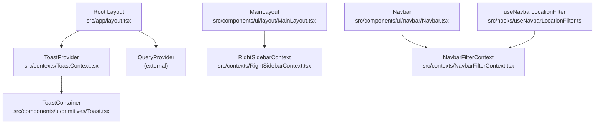
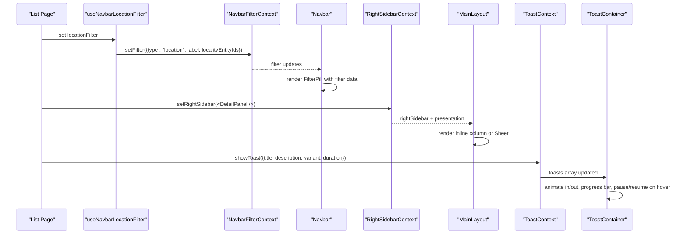
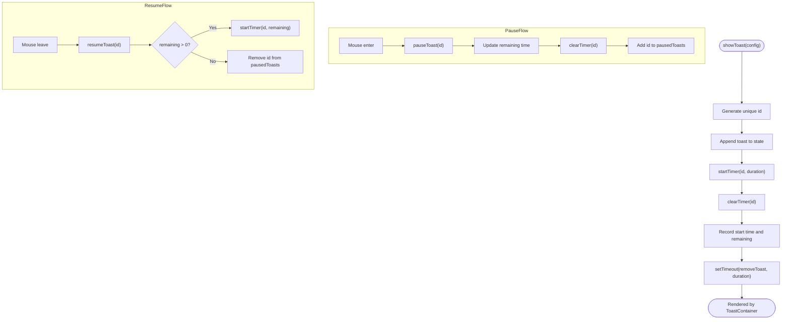
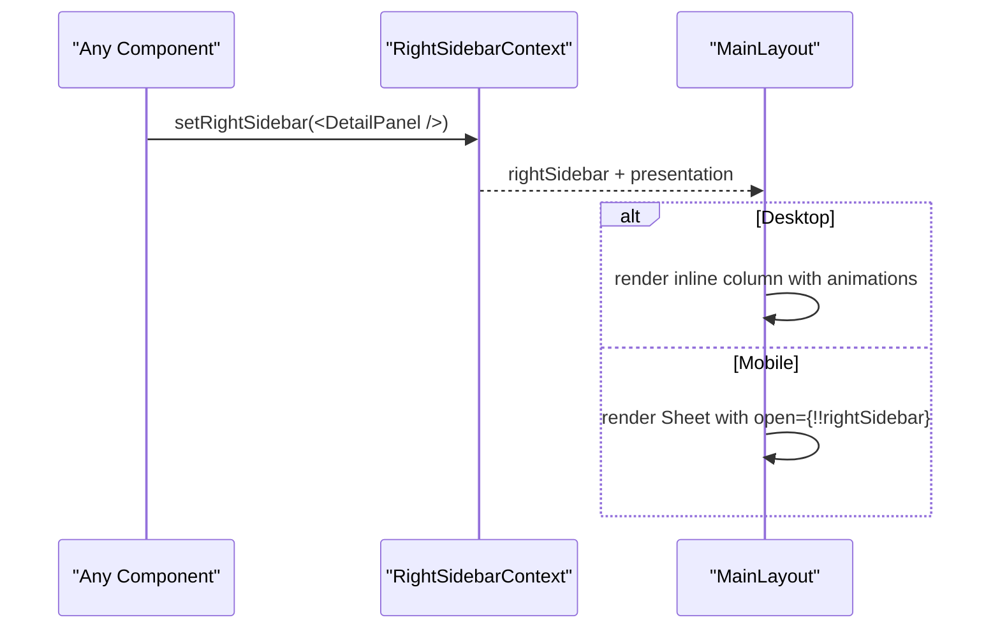
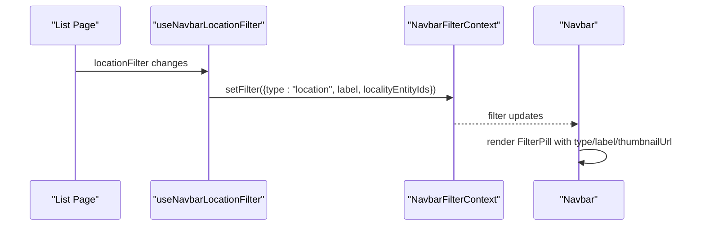
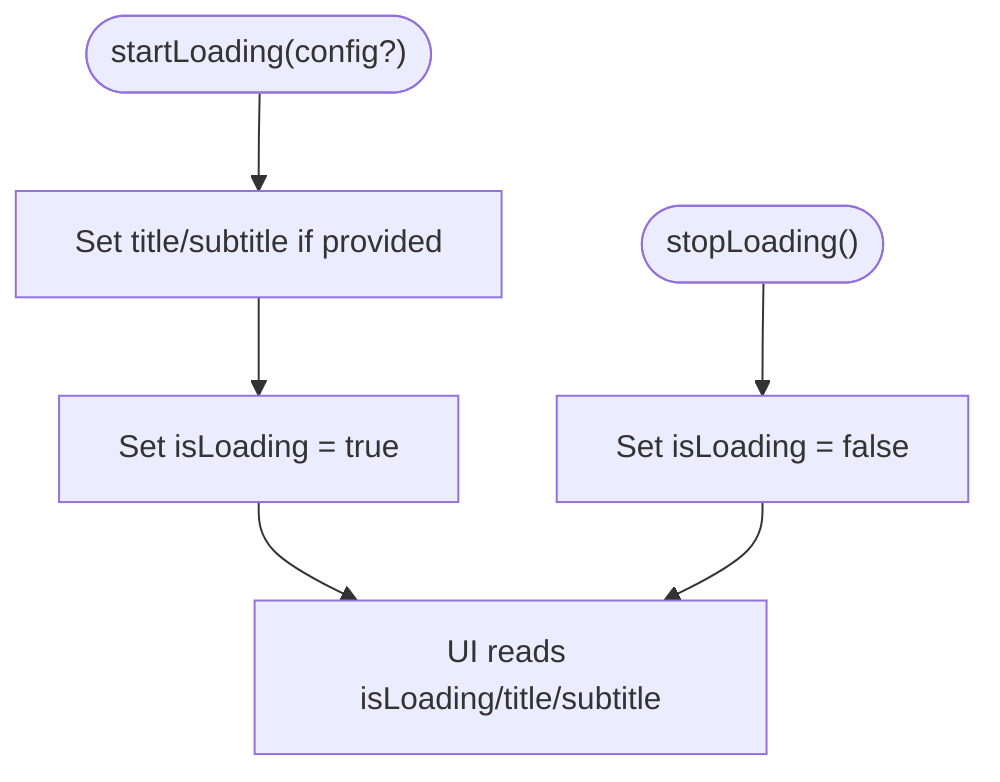
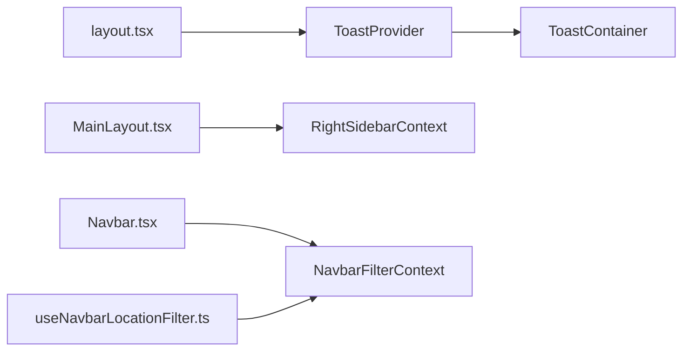

# Context API Global State

<cite>
**Referenced Files in This Document**
- [ToastContext.tsx](file://src/contexts/ToastContext.tsx)
- [RightSidebarContext.tsx](file://src/contexts/RightSidebarContext.tsx)
- [NavbarFilterContext.tsx](file://src/contexts/NavbarFilterContext.tsx)
- [NavigationLoadingContext.tsx](file://src/contexts/NavigationLoadingContext.tsx)
- [NavbarVisibilityContext.tsx](file://src/contexts/NavbarVisibilityContext.tsx)
- [Toast.tsx](file://src/components/ui/primitives/Toast.tsx)
- [MainLayout.tsx](file://src/components/ui/layout/MainLayout.tsx)
- [Navbar.tsx](file://src/components/ui/navbar/Navbar.tsx)
- [useNavbarLocationFilter.ts](file://src/hooks/useNavbarLocationFilter.ts)
- [layout.tsx](file://src/app/layout.tsx)
</cite>

## Table of Contents
1. Introduction
2. Project Structure
3. Core Components
4. Architecture Overview
5. Detailed Component Analysis
6. Dependency Analysis
7. Performance Considerations
8. Troubleshooting Guide
9. Conclusion
10. Appendices

## Introduction
This document explains Argo’s global client state management using React Context. It focuses on four key contexts:
- ToastContext for user notifications
- RightSidebarContext for UI layout control
- NavbarFilterContext for navigation state
- NavigationLoadingContext for loading states

It also covers provider patterns, state synchronization across components, performance optimization techniques (memoization, stable references, minimal re-renders), and best practices for composing multiple contexts at scale.

## Project Structure
The contexts live under src/contexts and are consumed by UI components and hooks throughout the app. The root layout wires up global providers so that all pages can access them.

**Diagram sources**
- [layout.tsx:57-83](file://src/app/layout.tsx#L57-L83)
- [ToastContext.tsx:42-147](file://src/contexts/ToastContext.tsx#L42-L147)
- [Toast.tsx:47-173](file://src/components/ui/primitives/Toast.tsx#L47-L173)
- [RightSidebarContext.tsx:34-46](file://src/contexts/RightSidebarContext.tsx#L34-L46)
- [MainLayout.tsx:299-343](file://src/components/ui/layout/MainLayout.tsx#L299-L343)
- [NavbarFilterContext.tsx:35-43](file://src/contexts/NavbarFilterContext.tsx#L35-L43)
- [Navbar.tsx:326-449](file://src/components/ui/navbar/Navbar.tsx#L326-L449)
- [useNavbarLocationFilter.ts:1-28](file://src/hooks/useNavbarLocationFilter.ts#L1-L28)

**Section sources**
- [layout.tsx:57-83](file://src/app/layout.tsx#L57-L83)

## Core Components
- ToastContext: Manages a queue of toasts with timers, pause/resume, and removal. Provides actions to show, remove, pause, resume, and query remaining time.
- RightSidebarContext: Holds the current right sidebar content and presentation mode (inline vs overlay) based on breakpoints.
- NavbarFilterContext: Holds an active filter pill state used by the navbar and list pages.
- NavigationLoadingContext: Controls a global loading indicator with optional title/subtitle.
- NavbarVisibilityContext: Provides a setter to hide/show the navbar from child components.

These contexts follow a consistent pattern:
- Create a context with a typed value
- Provide a Provider component that owns state and exposes setters
- Export a custom hook that reads the context and either returns it or a safe no-op fallback when not inside a provider

**Section sources**
- [ToastContext.tsx:12-38](file://src/contexts/ToastContext.tsx#L12-L38)
- [RightSidebarContext.tsx:6-15](file://src/contexts/RightSidebarContext.tsx#L6-L15)
- [NavbarFilterContext.tsx:5-18](file://src/contexts/NavbarFilterContext.tsx#L5-L18)
- [NavigationLoadingContext.tsx:5-18](file://src/contexts/NavigationLoadingContext.tsx#L5-L18)
- [NavbarVisibilityContext.tsx:5-9](file://src/contexts/NavbarVisibilityContext.tsx#L5-L9)

## Architecture Overview
The application composes multiple contexts to coordinate cross-cutting concerns:
- Notifications flow through ToastContext and render via a portal-based container.
- Layout decisions for the right sidebar are driven by RightSidebarContext and rendered conditionally in MainLayout.
- Navigation state (active filter pill) is shared between list pages and the Navbar via NavbarFilterContext.
- Global loading states are toggled via NavigationLoadingContext.

**Diagram sources**
- [useNavbarLocationFilter.ts:1-28](file://src/hooks/useNavbarLocationFilter.ts#L1-L28)
- [NavbarFilterContext.tsx:35-43](file://src/contexts/NavbarFilterContext.tsx#L35-L43)
- [Navbar.tsx:326-449](file://src/components/ui/navbar/Navbar.tsx#L326-L449)
- [RightSidebarContext.tsx:34-46](file://src/contexts/RightSidebarContext.tsx#L34-L46)
- [MainLayout.tsx:299-343](file://src/components/ui/layout/MainLayout.tsx#L299-L343)
- [ToastContext.tsx:42-147](file://src/contexts/ToastContext.tsx#L42-L147)
- [Toast.tsx:47-173](file://src/components/ui/primitives/Toast.tsx#L47-L173)

## Detailed Component Analysis

### ToastContext
Responsibilities:
- Maintain a list of toasts with unique IDs and durations
- Manage timers per toast; support pause/resume while hovering
- Provide methods to show, remove, pause, resume, and query remaining time
- Expose pausedToasts set for UI to reflect pause state

Key implementation highlights:
- Uses refs for timers, start times, and remaining times to avoid unnecessary re-renders
- Wraps callbacks with useCallback for stable references
- Cleans up timers on unmount

**Diagram sources**
- [ToastContext.tsx:42-147](file://src/contexts/ToastContext.tsx#L42-L147)
- [Toast.tsx:47-173](file://src/components/ui/primitives/Toast.tsx#L47-L173)

Usage example path:
- Show a success notification from any component within the provider tree: [ToastContext.tsx:90-98](file://src/contexts/ToastContext.tsx#L90-L98)
- Render toasts in the DOM via portal: [Toast.tsx:59-173](file://src/components/ui/primitives/Toast.tsx#L59-L173)

Performance notes:
- Timers and timing metadata are stored in refs to prevent re-renders on every tick
- Callbacks are memoized to minimize consumer re-renders
- Only necessary state slices are exposed to consumers

**Section sources**
- [ToastContext.tsx:42-147](file://src/contexts/ToastContext.tsx#L42-L147)
- [Toast.tsx:47-173](file://src/components/ui/primitives/Toast.tsx#L47-L173)

### RightSidebarContext
Responsibilities:
- Hold the current right sidebar content
- Determine presentation mode based on breakpoint (inline vs overlay)
- Provide a no-op fallback when used outside the provider

Behavior:
- presentation switches between inline and overlay depending on isDesktop
- MainLayout renders the sidebar as a column on desktop or a Sheet on mobile

**Diagram sources**
- [RightSidebarContext.tsx:34-46](file://src/contexts/RightSidebarContext.tsx#L34-L46)
- [MainLayout.tsx:299-343](file://src/components/ui/layout/MainLayout.tsx#L299-L343)

Usage example path:
- Read sidebar state and presentation: [RightSidebarContext.tsx:17-28](file://src/contexts/RightSidebarContext.tsx#L17-L28)
- Render conditional layout: [MainLayout.tsx:299-343](file://src/components/ui/layout/MainLayout.tsx#L299-L343)

**Section sources**
- [RightSidebarContext.tsx:6-46](file://src/contexts/RightSidebarContext.tsx#L6-L46)
- [MainLayout.tsx:299-343](file://src/components/ui/layout/MainLayout.tsx#L299-L343)

### NavbarFilterContext
Responsibilities:
- Store the currently active filter pill (type, label, thumbnailUrl, entityId, localityEntityIds)
- Allow list pages to update the shared filter state
- Provide a no-op setter when used outside the provider

Synchronization:
- useNavbarLocationFilter syncs a page’s local filter into the global filter pill
- Navbar consumes the filter to render a FilterPill

**Diagram sources**
- [useNavbarLocationFilter.ts:1-28](file://src/hooks/useNavbarLocationFilter.ts#L1-L28)
- [NavbarFilterContext.tsx:35-43](file://src/contexts/NavbarFilterContext.tsx#L35-L43)
- [Navbar.tsx:326-449](file://src/components/ui/navbar/Navbar.tsx#L326-L449)

Usage example path:
- Sync filter from page to navbar: [useNavbarLocationFilter.ts:15-27](file://src/hooks/useNavbarLocationFilter.ts#L15-L27)
- Consume filter in Navbar: [Navbar.tsx:354-363](file://src/components/ui/navbar/Navbar.tsx#L354-L363)

**Section sources**
- [NavbarFilterContext.tsx:5-43](file://src/contexts/NavbarFilterContext.tsx#L5-L43)
- [useNavbarLocationFilter.ts:1-28](file://src/hooks/useNavbarLocationFilter.ts#L1-L28)
- [Navbar.tsx:326-449](file://src/components/ui/navbar/Navbar.tsx#L326-L449)

### NavigationLoadingContext
Responsibilities:
- Control a global loading flag and optional title/subtitle
- Provide startLoading and stopLoading actions

Use cases:
- Show a top-level loading banner during navigation or data fetching
- Hide it when operations complete

**Diagram sources**
- [NavigationLoadingContext.tsx:20-41](file://src/contexts/NavigationLoadingContext.tsx#L20-L41)

Usage example path:
- Toggle loading state: [NavigationLoadingContext.tsx:25-33](file://src/contexts/NavigationLoadingContext.tsx#L25-L33)

**Section sources**
- [NavigationLoadingContext.tsx:5-48](file://src/contexts/NavigationLoadingContext.tsx#L5-L48)

### NavbarVisibilityContext
Responsibilities:
- Provide a setter to hide/show the navbar from nested components

Note:
- This context passes down a function rather than owning state locally, enabling parent components to manage visibility while exposing a controlled interface to children.

Usage example path:
- Provider definition and hook: [NavbarVisibilityContext.tsx:11-27](file://src/contexts/NavbarVisibilityContext.tsx#L11-L27)

**Section sources**
- [NavbarVisibilityContext.tsx:5-27](file://src/contexts/NavbarVisibilityContext.tsx#L5-L27)

## Dependency Analysis
- Root layout wires ToastProvider globally, making toasts available everywhere.
- MainLayout consumes RightSidebarContext to decide rendering strategy.
- Navbar consumes NavbarFilterContext to display the active filter pill.
- List pages synchronize their filters into NavbarFilterContext via a dedicated hook.
- ToastContainer renders toasts via a portal and interacts with ToastContext.

**Diagram sources**
- [layout.tsx:57-83](file://src/app/layout.tsx#L57-L83)
- [ToastContext.tsx:42-147](file://src/contexts/ToastContext.tsx#L42-L147)
- [Toast.tsx:47-173](file://src/components/ui/primitives/Toast.tsx#L47-L173)
- [RightSidebarContext.tsx:34-46](file://src/contexts/RightSidebarContext.tsx#L34-L46)
- [MainLayout.tsx:299-343](file://src/components/ui/layout/MainLayout.tsx#L299-L343)
- [NavbarFilterContext.tsx:35-43](file://src/contexts/NavbarFilterContext.tsx#L35-L43)
- [Navbar.tsx:326-449](file://src/components/ui/navbar/Navbar.tsx#L326-L449)
- [useNavbarLocationFilter.ts:1-28](file://src/hooks/useNavbarLocationFilter.ts#L1-L28)

**Section sources**
- [layout.tsx:57-83](file://src/app/layout.tsx#L57-L83)
- [ToastContext.tsx:42-147](file://src/contexts/ToastContext.tsx#L42-L147)
- [RightSidebarContext.tsx:34-46](file://src/contexts/RightSidebarContext.tsx#L34-L46)
- [NavbarFilterContext.tsx:35-43](file://src/contexts/NavbarFilterContext.tsx#L35-L43)
- [Navbar.tsx:326-449](file://src/components/ui/navbar/Navbar.tsx#L326-L449)
- [useNavbarLocationFilter.ts:1-28](file://src/hooks/useNavbarLocationFilter.ts#L1-L28)

## Performance Considerations
- Memoize callbacks: Use useCallback for functions passed to consumers to avoid unnecessary re-renders (e.g., ToastContext actions).
- Prefer refs for non-UI state: Store timers and timing metadata in refs to prevent re-renders on frequent updates.
- Split contexts by concern: Keep each context focused (notifications, layout, navigation, loading) to limit the size of provider values and reduce re-render scope.
- Provide no-op fallbacks: For contexts like RightSidebarContext and NavbarFilterContext, return safe defaults when not inside a provider to avoid errors and extra checks in consumers.
- Avoid deep object churn: Pass stable identifiers (IDs) instead of large objects where possible; rebuild only what changed.
- Portal rendering for overlays: Render toasts via a portal to keep the main tree lightweight and avoid layout thrashing.
- Conditional rendering: Use presentation flags (e.g., inline vs overlay) to switch rendering strategies without duplicating logic.

[No sources needed since this section provides general guidance]

## Troubleshooting Guide
Common issues and resolutions:
- Using a context outside its provider:
  - Some hooks throw when used without a provider (e.g., useToast, useNavigationLoading). Ensure the appropriate provider wraps your route/component tree.
  - For contexts with no-op fallbacks (e.g., RightSidebarContext, NavbarFilterContext), missing providers will silently degrade to defaults.
- Toast not auto-dismissing:
  - Verify that timers are started and not cleared prematurely. Check that pause/resume flows correctly update remaining time and pausedToasts.
- Sidebar not appearing:
  - Confirm that setRightSidebar is called with a valid node and that MainLayout is reading the context. On mobile, ensure the Sheet opens when rightSidebar is present.
- Filter pill not updating:
  - Ensure useNavbarLocationFilter runs with correct dependencies and clears the filter on unmount. Verify Navbar consumes the same context.

**Section sources**
- [ToastContext.tsx:42-147](file://src/contexts/ToastContext.tsx#L42-L147)
- [RightSidebarContext.tsx:17-28](file://src/contexts/RightSidebarContext.tsx#L17-L28)
- [NavbarFilterContext.tsx:24-33](file://src/contexts/NavbarFilterContext.tsx#L24-L33)
- [NavigationLoadingContext.tsx:44-48](file://src/contexts/NavigationLoadingContext.tsx#L44-L48)
- [useNavbarLocationFilter.ts:15-27](file://src/hooks/useNavbarLocationFilter.ts#L15-L27)

## Conclusion
Argo’s Context API implementation cleanly separates concerns across notifications, layout, navigation, and loading states. Providers encapsulate state and expose stable APIs, while consumers subscribe only to what they need. By combining focused contexts, careful memoization, and smart use of refs and portals, the application achieves scalable global state management with predictable performance.

[No sources needed since this section summarizes without analyzing specific files]

## Appendices

### Creating a New Context: Best Practices
- Define a clear interface for the context value and a provider that owns state and exposes setters.
- Export a typed hook that reads the context and either returns it or a safe default.
- Place providers near the root or feature boundary to scope state appropriately.
- Keep values small and stable; prefer splitting large contexts into smaller ones.

Example reference paths:
- Provider pattern: [RightSidebarContext.tsx:34-46](file://src/contexts/RightSidebarContext.tsx#L34-L46)
- No-op fallback pattern: [RightSidebarContext.tsx:17-28](file://src/contexts/RightSidebarContext.tsx#L17-L28)

### Managing Complex State Relationships
- Use hooks to synchronize local page state with global contexts (e.g., useNavbarLocationFilter syncing to NavbarFilterContext).
- Compose multiple contexts to coordinate cross-cutting features (e.g., showing toasts after successful navigation or sidebar actions).

Reference paths:
- Synchronization hook: [useNavbarLocationFilter.ts:1-28](file://src/hooks/useNavbarLocationFilter.ts#L1-L28)
- Composition in root layout: [layout.tsx:57-83](file://src/app/layout.tsx#L57-L83)

### Avoiding Unnecessary Re-renders
- Memoize callbacks and split contexts to limit re-render scope.
- Use refs for ephemeral or frequently changing data (e.g., timers).
- Leverage conditional rendering and presentation flags to avoid redundant work.

Reference paths:
- Memoized callbacks and refs: [ToastContext.tsx:42-147](file://src/contexts/ToastContext.tsx#L42-L147)
- Presentation-driven rendering: [RightSidebarContext.tsx:34-46](file://src/contexts/RightSidebarContext.tsx#L34-L46), [MainLayout.tsx:299-343](file://src/components/ui/layout/MainLayout.tsx#L299-L343)