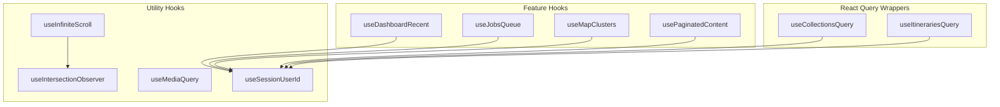
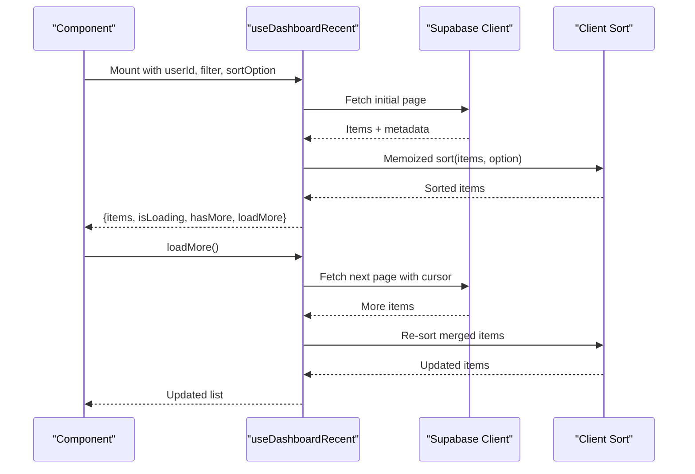
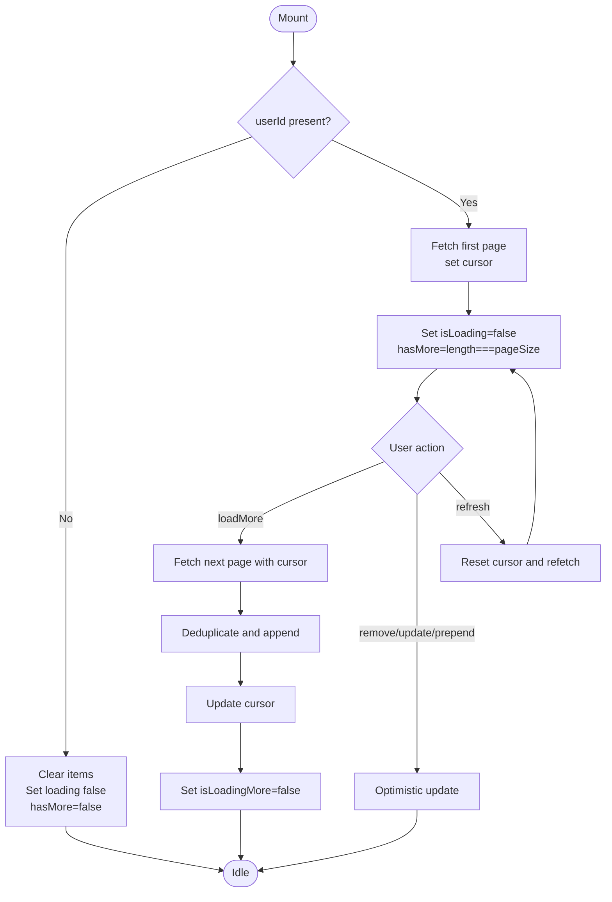
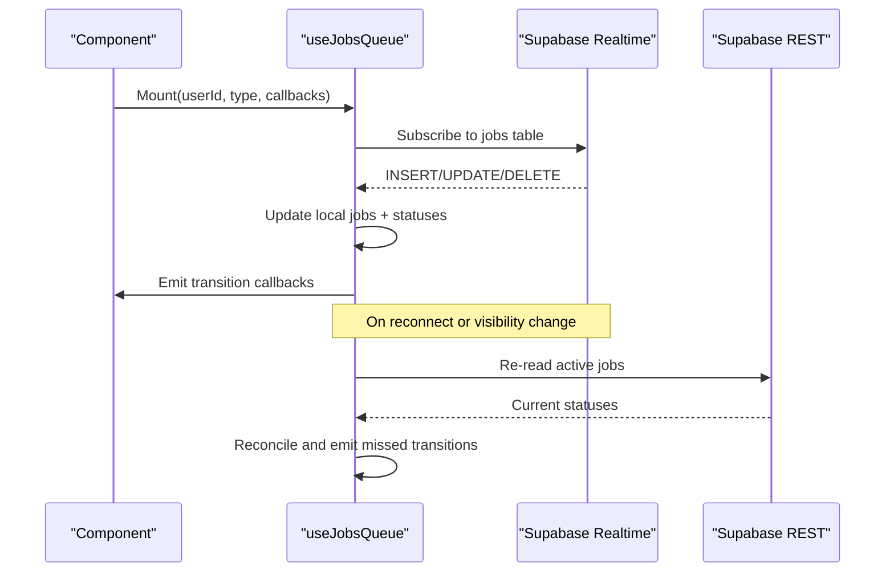
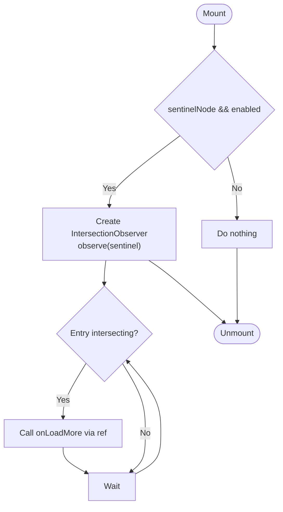
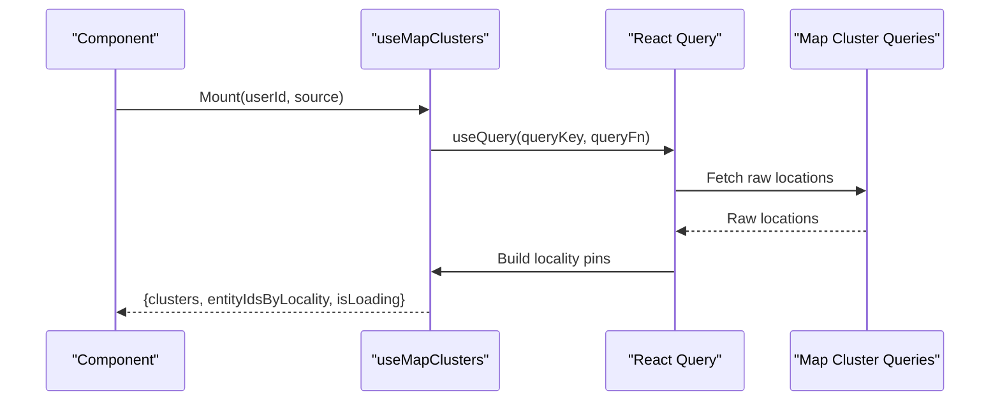
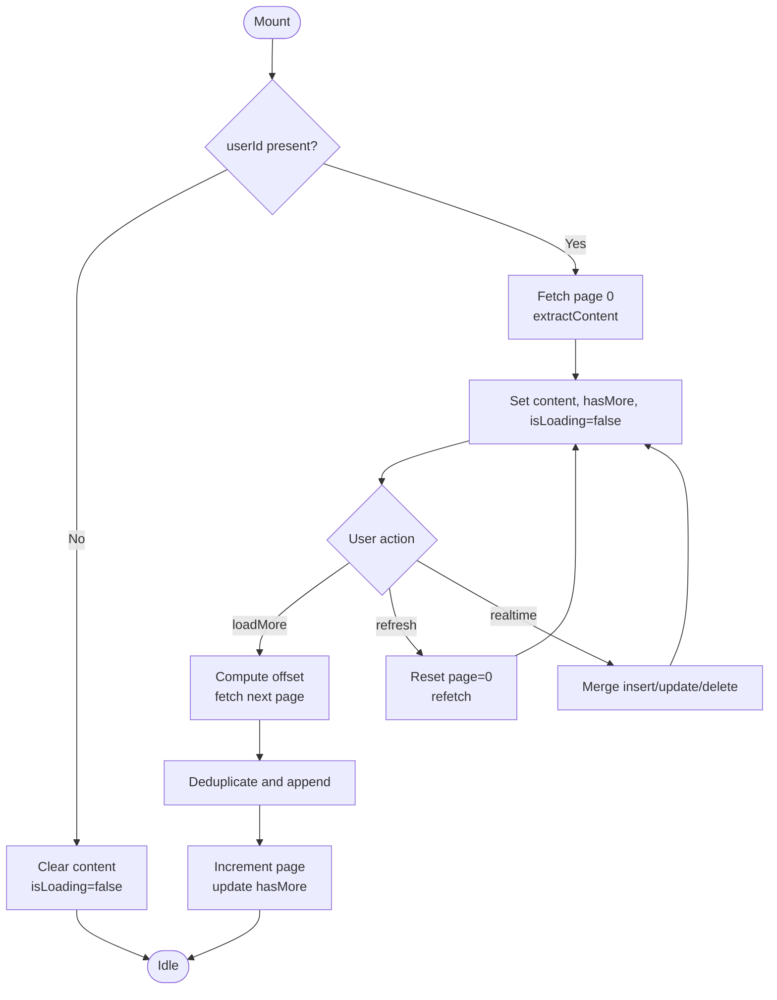
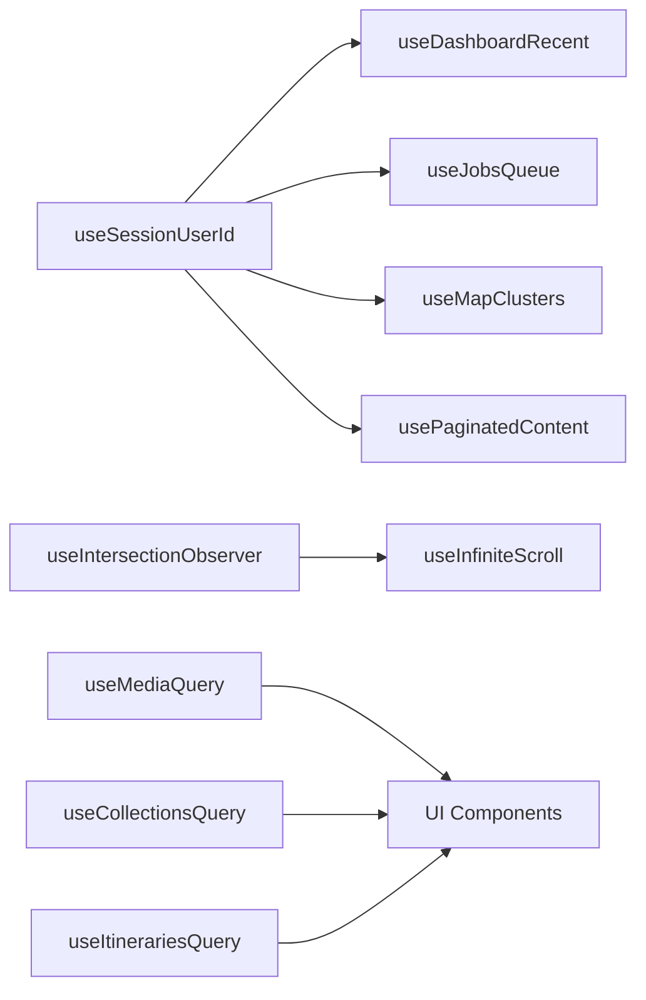

# Custom Hooks Architecture

<cite>
**Referenced Files in This Document**
- [useDashboardRecent.ts](file://src/hooks/useDashboardRecent.ts)
- [useJobsQueue.ts](file://src/hooks/useJobsQueue.ts)
- [useInfiniteScroll.ts](file://src/hooks/useInfiniteScroll.ts)
- [useMapClusters.ts](file://src/hooks/useMapClusters.ts)
- [usePaginatedContent.ts](file://src/hooks/usePaginatedContent.ts)
- [useIntersectionObserver.ts](file://src/hooks/useIntersectionObserver.ts)
- [useMediaQuery.ts](file://src/hooks/useMediaQuery.ts)
- [useHighlightLocation.ts](file://src/hooks/useHighlightLocation.ts)
- [useSessionUserId.ts](file://src/hooks/useSessionUserId.ts)
- [useQuotaGate.ts](file://src/hooks/useQuotaGate.ts)
- [useCollectionsQuery.ts](file://src/hooks/queries/useCollectionsQuery.ts)
- [useItinerariesQuery.ts](file://src/hooks/queries/useItinerariesQuery.ts)
</cite>

## Table of Contents
1. Introduction
2. Project Structure
3. Core Components
4. Architecture Overview
5. Detailed Component Analysis
6. Dependency Analysis
7. Performance Considerations
8. Troubleshooting Guide
9. Conclusion
10. Appendices

## Introduction
This document explains the custom hooks architecture and patterns used across the application. It focuses on how reusable business logic is encapsulated, how stateful logic is extracted into composable hooks, and how data fetching, real-time updates, pagination, and geographic clustering are implemented consistently. It also provides guidelines for creating new hooks, testing them, maintaining dependencies, and optimizing performance through memoization and efficient re-renders.

## Project Structure
Hooks are organized by responsibility:
- Feature-specific hooks (e.g., dashboard recent content, jobs queue, map clusters) live directly under src/hooks.
- Data-fetching hooks that wrap React Query live under src/hooks/queries.
- Utility hooks (media queries, intersection observer, session user id) provide cross-cutting capabilities reused by feature hooks.

**Diagram sources**
- [useDashboardRecent.ts:1-132](file://src/hooks/useDashboardRecent.ts#L1-L132)
- [useJobsQueue.ts:1-296](file://src/hooks/useJobsQueue.ts#L1-L296)
- [useMapClusters.ts:1-61](file://src/hooks/useMapClusters.ts#L1-L61)
- [usePaginatedContent.ts:1-288](file://src/hooks/usePaginatedContent.ts#L1-L288)
- [useInfiniteScroll.ts:1-93](file://src/hooks/useInfiniteScroll.ts#L1-L93)
- [useIntersectionObserver.ts:1-28](file://src/hooks/useIntersectionObserver.ts#L1-L28)
- [useMediaQuery.ts:1-68](file://src/hooks/useMediaQuery.ts#L1-L68)
- [useSessionUserId.ts:1-20](file://src/hooks/useSessionUserId.ts#L1-L20)
- [useCollectionsQuery.ts:1-17](file://src/hooks/queries/useCollectionsQuery.ts#L1-L17)
- [useItinerariesQuery.ts:1-17](file://src/hooks/queries/useItinerariesQuery.ts#L1-L17)

**Section sources**
- [useDashboardRecent.ts:1-132](file://src/hooks/useDashboardRecent.ts#L1-L132)
- [useJobsQueue.ts:1-296](file://src/hooks/useJobsQueue.ts#L1-L296)
- [useMapClusters.ts:1-61](file://src/hooks/useMapClusters.ts#L1-L61)
- [usePaginatedContent.ts:1-288](file://src/hooks/usePaginatedContent.ts#L1-L288)
- [useInfiniteScroll.ts:1-93](file://src/hooks/useInfiniteScroll.ts#L1-L93)
- [useIntersectionObserver.ts:1-28](file://src/hooks/useIntersectionObserver.ts#L1-L28)
- [useMediaQuery.ts:1-68](file://src/hooks/useMediaQuery.ts#L1-L68)
- [useSessionUserId.ts:1-20](file://src/hooks/useSessionUserId.ts#L1-L20)
- [useCollectionsQuery.ts:1-17](file://src/hooks/queries/useCollectionsQuery.ts#L1-L17)
- [useItinerariesQuery.ts:1-17](file://src/hooks/queries/useItinerariesQuery.ts#L1-L17)

## Core Components
- useDashboardRecent: Fetches and paginates recent content with client-side sorting and optimistic UI operations.
- useJobsQueue: Subscribes to job status changes via realtime, reconciles missed updates, and exposes transition callbacks.
- useInfiniteScroll: Triggers loading when a sentinel element enters the viewport or scroll container.
- useMapClusters: Uses React Query to fetch and build locality-based map cluster data for different surfaces.
- usePaginatedContent: Paginates completed content with filtering, sorting, and realtime updates.
- Supporting utilities: useIntersectionObserver, useMediaQuery, useSessionUserId, useHighlightLocation, useQuotaGate.

These hooks demonstrate common patterns:
- Encapsulating async data fetching and caching.
- Managing local state for UI concerns (loading, hasMore).
- Using refs to avoid stale closures in event handlers and observers.
- Composing smaller hooks to build complex behaviors.

**Section sources**
- [useDashboardRecent.ts:1-132](file://src/hooks/useDashboardRecent.ts#L1-L132)
- [useJobsQueue.ts:1-296](file://src/hooks/useJobsQueue.ts#L1-L296)
- [useInfiniteScroll.ts:1-93](file://src/hooks/useInfiniteScroll.ts#L1-L93)
- [useMapClusters.ts:1-61](file://src/hooks/useMapClusters.ts#L1-L61)
- [usePaginatedContent.ts:1-288](file://src/hooks/usePaginatedContent.ts#L1-L288)
- [useIntersectionObserver.ts:1-28](file://src/hooks/useIntersectionObserver.ts#L1-L28)
- [useMediaQuery.ts:1-68](file://src/hooks/useMediaQuery.ts#L1-L68)
- [useSessionUserId.ts:1-20](file://src/hooks/useSessionUserId.ts#L1-L20)
- [useHighlightLocation.ts:1-53](file://src/hooks/useHighlightLocation.ts#L1-L53)
- [useQuotaGate.ts:1-41](file://src/hooks/useQuotaGate.ts#L1-L41)

## Architecture Overview
The hooks layer sits between components and data sources (Supabase, React Query, browser APIs). Feature hooks encapsulate domain logic and expose stable interfaces to components. Utility hooks abstract platform details (media queries, intersection observations). React Query wrappers standardize caching and invalidation.

**Diagram sources**
- [useDashboardRecent.ts:39-130](file://src/hooks/useDashboardRecent.ts#L39-L130)

**Section sources**
- [useDashboardRecent.ts:39-130](file://src/hooks/useDashboardRecent.ts#L39-L130)

## Detailed Component Analysis

### useDashboardRecent
Purpose: Provide a paginated, filterable, sortable list of recent content with optimistic UI actions and refresh capability.

Key behaviors:
- Initial fetch resets on userId or filter changes; uses a cursor based on updated_at for subsequent pages.
- Maintains refs for filter/sortOption to avoid stale closures in loadMore.
- Exposes removeItem, updateItem, prependItem for optimistic updates without full refetch.
- Returns memoized sorted items to prevent unnecessary effect re-runs in consumers.

**Diagram sources**
- [useDashboardRecent.ts:44-130](file://src/hooks/useDashboardRecent.ts#L44-L130)

**Section sources**
- [useDashboardRecent.ts:1-132](file://src/hooks/useDashboardRecent.ts#L1-L132)

### useJobsQueue
Purpose: Track background jobs with realtime updates, reconcile missed transitions, and surface terminal events to consumers.

Key behaviors:
- Subscribes to postgres_changes for the jobs table filtered by user_id.
- Deduplicates channels per hook instance using a unique suffix derived from useId.
- Reconciles running jobs on visibility change or reconnect to ensure progress completion.
- Emits onJobCompleted/onJobFailed/onJobRejected on status transitions.
- Provides upsertJob/removeJob for optimistic UI updates.

**Diagram sources**
- [useJobsQueue.ts:78-267](file://src/hooks/useJobsQueue.ts#L78-L267)

**Section sources**
- [useJobsQueue.ts:1-296](file://src/hooks/useJobsQueue.ts#L1-L296)

### useInfiniteScroll
Purpose: Trigger onLoadMore when a sentinel element enters the viewport or a scroll container.

Key behaviors:
- Finds nearest scrollable ancestor to make rootMargin work inside overflow containers.
- Stores callback in a ref to avoid recreating the observer on handler changes.
- Manages lifecycle via useEffect tied to sentinel node and enabled flag.

**Diagram sources**
- [useInfiniteScroll.ts:29-76](file://src/hooks/useInfiniteScroll.ts#L29-L76)

**Section sources**
- [useInfiniteScroll.ts:1-93](file://src/hooks/useInfiniteScroll.ts#L1-L93)

### useMapClusters
Purpose: Fetch locality-based map cluster data for different surfaces using React Query.

Key behaviors:
- Maps source to query function and variant.
- Builds locality pins from raw locations.
- Caches results with staleTime and placeholderData for smooth UX.

**Diagram sources**
- [useMapClusters.ts:35-60](file://src/hooks/useMapClusters.ts#L35-L60)

**Section sources**
- [useMapClusters.ts:1-61](file://src/hooks/useMapClusters.ts#L1-L61)

### usePaginatedContent
Purpose: Paginate completed content with filtering, sorting, and realtime updates.

Key behaviors:
- Builds server-side queries with filters and sorts; supports favorites and archived views.
- Tracks page index and hasMore to manage pagination.
- Subscribes to realtime changes for completed content and merges updates while respecting current filter.

**Diagram sources**
- [usePaginatedContent.ts:119-286](file://src/hooks/usePaginatedContent.ts#L119-L286)

**Section sources**
- [usePaginatedContent.ts:1-288](file://src/hooks/usePaginatedContent.ts#L1-L288)

### Supporting Utilities
- useIntersectionObserver: Simple one-shot visibility detection for lazy loading or animations.
- useMediaQuery: SSR-safe media query subscription with breakpoint helpers.
- useSessionUserId: Resolves authenticated user id from Supabase session.
- useHighlightLocation: Scrolls to and highlights an element identified by URL parameter.
- useQuotaGate: Centralizes quota-limit messaging and upgrade CTAs.

**Section sources**
- [useIntersectionObserver.ts:1-28](file://src/hooks/useIntersectionObserver.ts#L1-L28)
- [useMediaQuery.ts:1-68](file://src/hooks/useMediaQuery.ts#L1-L68)
- [useSessionUserId.ts:1-20](file://src/hooks/useSessionUserId.ts#L1-L20)
- [useHighlightLocation.ts:1-53](file://src/hooks/useHighlightLocation.ts#L1-L53)
- [useQuotaGate.ts:1-41](file://src/hooks/useQuotaGate.ts#L1-L41)

## Dependency Analysis
- Feature hooks depend on utility hooks and data clients:
  - useDashboardRecent depends on Supabase client and home queries.
  - useJobsQueue depends on Supabase realtime and REST endpoints.
  - useMapClusters depends on React Query and map cluster queries.
  - usePaginatedContent depends on Supabase client and realtime.
- React Query wrappers standardize caching and keys:
  - useCollectionsQuery and useItinerariesQuery encapsulate query keys and functions.

**Diagram sources**
- [useSessionUserId.ts:1-20](file://src/hooks/useSessionUserId.ts#L1-L20)
- [useDashboardRecent.ts:1-132](file://src/hooks/useDashboardRecent.ts#L1-L132)
- [useJobsQueue.ts:1-296](file://src/hooks/useJobsQueue.ts#L1-L296)
- [useMapClusters.ts:1-61](file://src/hooks/useMapClusters.ts#L1-L61)
- [usePaginatedContent.ts:1-288](file://src/hooks/usePaginatedContent.ts#L1-L288)
- [useIntersectionObserver.ts:1-28](file://src/hooks/useIntersectionObserver.ts#L1-L28)
- [useInfiniteScroll.ts:1-93](file://src/hooks/useInfiniteScroll.ts#L1-L93)
- [useMediaQuery.ts:1-68](file://src/hooks/useMediaQuery.ts#L1-L68)
- [useCollectionsQuery.ts:1-17](file://src/hooks/queries/useCollectionsQuery.ts#L1-L17)
- [useItinerariesQuery.ts:1-17](file://src/hooks/queries/useItinerariesQuery.ts#L1-L17)

**Section sources**
- [useSessionUserId.ts:1-20](file://src/hooks/useSessionUserId.ts#L1-L20)
- [useDashboardRecent.ts:1-132](file://src/hooks/useDashboardRecent.ts#L1-L132)
- [useJobsQueue.ts:1-296](file://src/hooks/useJobsQueue.ts#L1-L296)
- [useMapClusters.ts:1-61](file://src/hooks/useMapClusters.ts#L1-L61)
- [usePaginatedContent.ts:1-288](file://src/hooks/usePaginatedContent.ts#L1-L288)
- [useIntersectionObserver.ts:1-28](file://src/hooks/useIntersectionObserver.ts#L1-L28)
- [useInfiniteScroll.ts:1-93](file://src/hooks/useInfiniteScroll.ts#L1-L93)
- [useMediaQuery.ts:1-68](file://src/hooks/useMediaQuery.ts#L1-L68)
- [useCollectionsQuery.ts:1-17](file://src/hooks/queries/useCollectionsQuery.ts#L1-L17)
- [useItinerariesQuery.ts:1-17](file://src/hooks/queries/useItinerariesQuery.ts#L1-L17)

## Performance Considerations
- Memoization:
  - useDashboardRecent returns memoized sorted items to avoid consumer effect thrashing.
  - useMapClusters leverages React Query caching with staleTime and placeholderData.
- Efficient re-renders:
  - Use refs for frequently accessed values (filter, sortOption, callbacks) to prevent unnecessary re-subscriptions or observer recreation.
  - Stable ref callbacks (e.g., sentinelRef) minimize observer churn.
- Realtime reconciliation:
  - useJobsQueue reconciles missed updates on visibility change and reconnect to prevent stuck states.
- Pagination strategies:
  - Cursor-based pagination in useDashboardRecent avoids offset drift.
  - Offset-based pagination in usePaginatedContent deduplicates incoming realtime items.
- Media queries:
  - useMediaQuery is SSR-safe and avoids hydration mismatches.

[No sources needed since this section provides general guidance]

## Troubleshooting Guide
Common issues and resolutions:
- Stale closures in loadMore or observers:
  - Ensure you store dynamic values in refs and read them inside callbacks (see useDashboardRecent and usePaginatedContent).
- Realtime channel conflicts:
  - Multiple hook instances with the same userId can share channels; use a unique suffix (useId) to keep channels independent (see useJobsQueue and usePaginatedContent).
- Missed realtime updates:
  - Implement reconciliation on visibilitychange or reconnect to settle in-flight jobs (see useJobsQueue).
- Hydration mismatches with media queries:
  - Use SSR-safe hooks like useMediaQuery that return consistent server snapshots (see useMediaQuery).
- Quota limit messages:
  - Centralize quota messaging via useQuotaGate to keep copy and CTAs consistent.

**Section sources**
- [useDashboardRecent.ts:49-97](file://src/hooks/useDashboardRecent.ts#L49-L97)
- [useJobsQueue.ts:68-136](file://src/hooks/useJobsQueue.ts#L68-L136)
- [useJobsQueue.ts:167-267](file://src/hooks/useJobsQueue.ts#L167-L267)
- [usePaginatedContent.ts:209-284](file://src/hooks/usePaginatedContent.ts#L209-L284)
- [useMediaQuery.ts:1-31](file://src/hooks/useMediaQuery.ts#L1-L31)
- [useQuotaGate.ts:16-40](file://src/hooks/useQuotaGate.ts#L16-L40)

## Conclusion
The hooks architecture emphasizes composability, clear separation of concerns, and robust handling of async and realtime data. Feature hooks encapsulate domain logic and expose stable interfaces, while utility hooks abstract platform specifics. Consistent patterns—refs for stability, memoization for performance, and reconciliation for reliability—ensure predictable behavior and maintainable code.

[No sources needed since this section summarizes without analyzing specific files]

## Appendices

### Guidelines for Creating New Hooks
- Define a clear contract:
  - Inputs: parameters and options.
  - Outputs: state, methods, and flags (e.g., isLoading, hasMore).
- Manage side effects safely:
  - Use useEffect for subscriptions and observers; clean up in return.
  - Store mutable references in refs to avoid stale closures.
- Handle async and realtime:
  - For pagination, prefer cursor-based where possible; otherwise track offsets carefully.
  - For realtime, implement reconciliation to handle missed updates.
- Optimize renders:
  - Memoize derived data (e.g., sorted lists) and callbacks.
  - Avoid unnecessary re-subscriptions by stabilizing dependencies.
- Integrate with React Query when appropriate:
  - Wrap data fetching in hooks under src/hooks/queries for consistent caching and invalidation.

[No sources needed since this section provides general guidance]

### Testing Hooks
- Unit test pure logic:
  - Extract and test helper functions (sorting, filtering, building queries).
- Render tests:
  - Use a test harness to mount components consuming hooks and assert state changes.
- Realtime and network:
  - Mock Supabase client and realtime channels to simulate inserts/updates/deletes.
  - Verify reconciliation behavior by simulating visibility changes and reconnects.
- Observers:
  - Mock IntersectionObserver to trigger onLoadMore deterministically.

[No sources needed since this section provides general guidance]

### Maintaining Hook Dependencies
- Keep dependencies minimal and explicit:
  - Prefer small, focused hooks that compose larger behaviors.
- Version and deprecate carefully:
  - When changing hook contracts, provide migration paths and deprecation notices.
- Centralize shared types:
  - Define types for payloads and responses in lib directories to avoid duplication.

[No sources needed since this section provides general guidance]