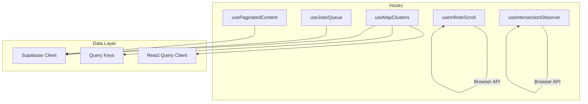
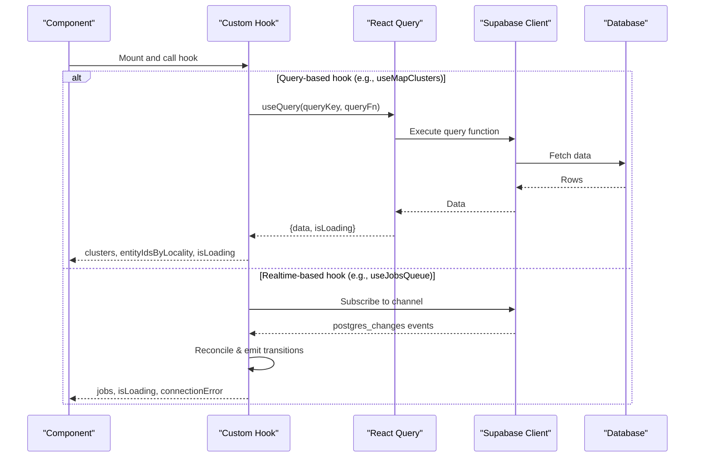
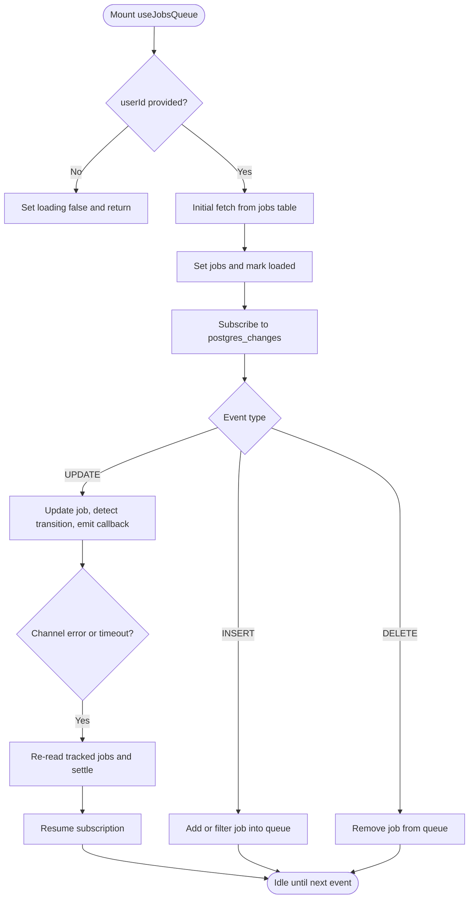
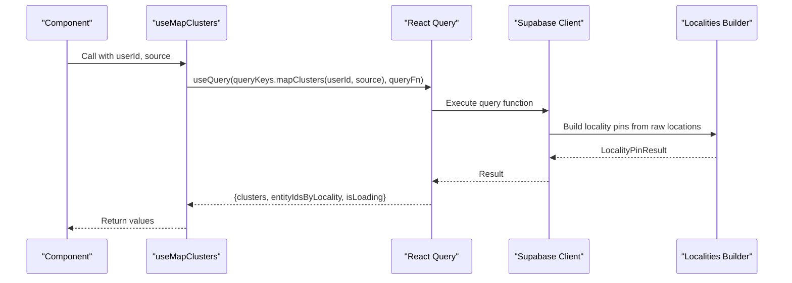
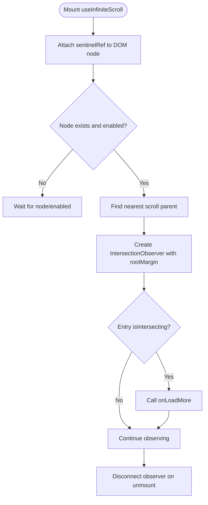
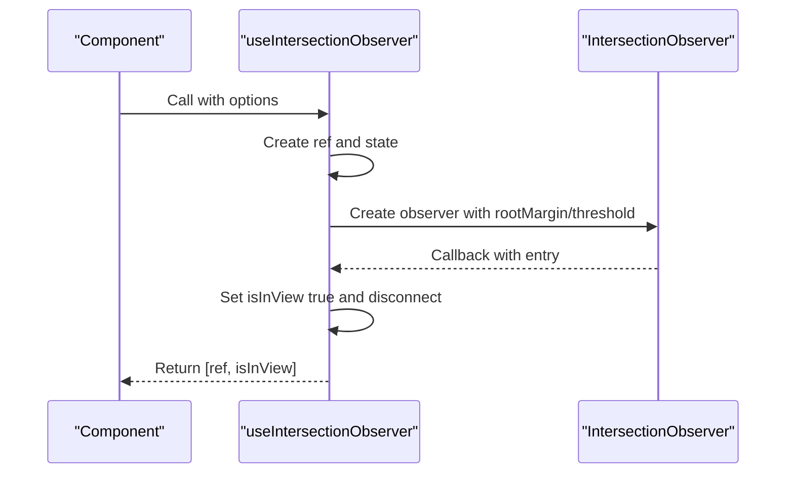
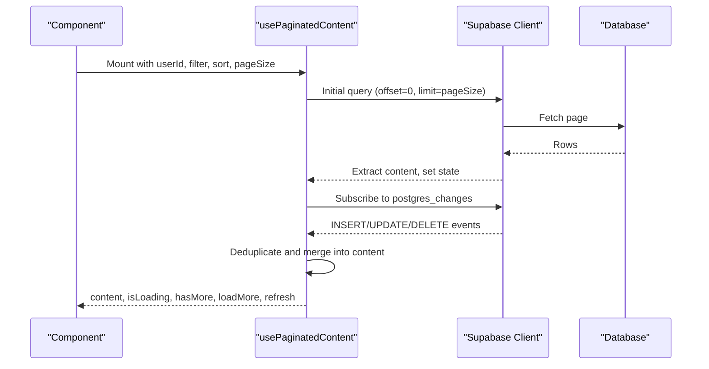
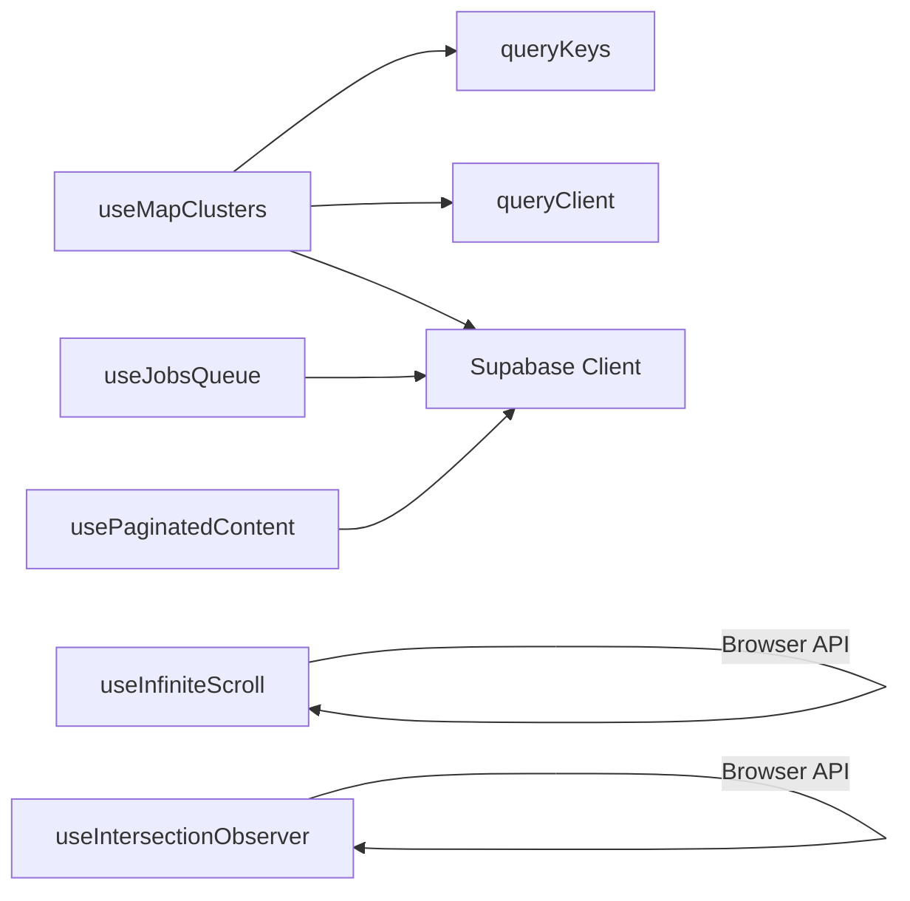

# Custom Hooks Business Logic

<cite>
**Referenced Files in This Document**
- [useJobsQueue.ts](file://src/hooks/useJobsQueue.ts)
- [useMapClusters.ts](file://src/hooks/useMapClusters.ts)
- [useInfiniteScroll.ts](file://src/hooks/useInfiniteScroll.ts)
- [useIntersectionObserver.ts](file://src/hooks/useIntersectionObserver.ts)
- [usePaginatedContent.ts](file://src/hooks/usePaginatedContent.ts)
- [client.ts](file://src/lib/supabase/client.ts)
- [queryKeys.ts](file://src/lib/query/queryKeys.ts)
- [queryClient.ts](file://src/lib/query/queryClient.ts)
</cite>

## Table of Contents
1. Introduction
2. Project Structure
3. Core Components
4. Architecture Overview
5. Detailed Component Analysis
6. Dependency Analysis
7. Performance Considerations
8. Troubleshooting Guide
9. Conclusion
10. Appendices

## Introduction
This document explains Argo’s custom hooks architecture for encapsulating business logic and reusable functionality. It focuses on:
- Background job processing with useJobsQueue
- Map performance optimization with useMapClusters
- Pagination and infinite loading with useInfiniteScroll and usePaginatedContent
- Viewport detection with useIntersectionObserver

It also covers hook composition patterns, dependency management via React Query and Supabase client, testing strategies, side effects handling, complex stateful logic, performance considerations, memory leak prevention, and debugging techniques.

## Project Structure
The hooks live under src/hooks and integrate with:
- Supabase client for data access and realtime subscriptions
- React Query for caching and query key management
- Browser APIs (IntersectionObserver, visibility events) for UI interactions

**Diagram sources**
- [useMapClusters.ts:35-60](file://src/hooks/useMapClusters.ts#L35-L60)
- [useJobsQueue.ts:45-295](file://src/hooks/useJobsQueue.ts#L45-L295)
- [useInfiniteScroll.ts:29-76](file://src/hooks/useInfiniteScroll.ts#L29-L76)
- [useIntersectionObserver.ts:5-27](file://src/hooks/useIntersectionObserver.ts#L5-L27)
- [usePaginatedContent.ts:119-287](file://src/hooks/usePaginatedContent.ts#L119-L287)
- [client.ts:3-8](file://src/lib/supabase/client.ts#L3-L8)
- [queryKeys.ts:1-42](file://src/lib/query/queryKeys.ts#L1-L42)
- [queryClient.ts:1-13](file://src/lib/query/queryClient.ts#L1-L13)

**Section sources**
- [useMapClusters.ts:35-60](file://src/hooks/useMapClusters.ts#L35-L60)
- [useJobsQueue.ts:45-295](file://src/hooks/useJobsQueue.ts#L45-L295)
- [useInfiniteScroll.ts:29-76](file://src/hooks/useInfiniteScroll.ts#L29-L76)
- [useIntersectionObserver.ts:5-27](file://src/hooks/useIntersectionObserver.ts#L5-L27)
- [usePaginatedContent.ts:119-287](file://src/hooks/usePaginatedContent.ts#L119-L287)
- [client.ts:3-8](file://src/lib/supabase/client.ts#L3-L8)
- [queryKeys.ts:1-42](file://src/lib/query/queryKeys.ts#L1-L42)
- [queryClient.ts:1-13](file://src/lib/query/queryClient.ts#L1-L13)

## Core Components
- useJobsQueue: Subscribes to a jobs table via Supabase realtime, tracks transitions, reconciles missed updates, and exposes helpers to update the queue optimistically.
- useMapClusters: Uses React Query to fetch map cluster data per source, builds locality pins, and returns stable structures for rendering.
- useInfiniteScroll: Observes a sentinel element inside a scroll container and triggers onLoadMore when visible.
- useIntersectionObserver: Provides a ref and boolean indicating whether an element is currently intersecting the viewport.
- usePaginatedContent: Paginates content with server-side queries and merges realtime updates while deduplicating items.

**Section sources**
- [useJobsQueue.ts:45-295](file://src/hooks/useJobsQueue.ts#L45-L295)
- [useMapClusters.ts:35-60](file://src/hooks/useMapClusters.ts#L35-L60)
- [useInfiniteScroll.ts:29-76](file://src/hooks/useInfiniteScroll.ts#L29-L76)
- [useIntersectionObserver.ts:5-27](file://src/hooks/useIntersectionObserver.ts#L5-L27)
- [usePaginatedContent.ts:119-287](file://src/hooks/usePaginatedContent.ts#L119-L287)

## Architecture Overview
The hooks form a layered architecture:
- Presentation layer consumes hooks to render UI
- Hooks coordinate browser APIs and third-party services
- Data layer uses Supabase client for queries and realtime
- Caching and keys are managed by React Query

**Diagram sources**
- [useMapClusters.ts:35-60](file://src/hooks/useMapClusters.ts#L35-L60)
- [useJobsQueue.ts:167-266](file://src/hooks/useJobsQueue.ts#L167-L266)
- [client.ts:3-8](file://src/lib/supabase/client.ts#L3-L8)
- [queryKeys.ts:1-42](file://src/lib/query/queryKeys.ts#L1-L42)
- [queryClient.ts:1-13](file://src/lib/query/queryClient.ts#L1-L13)

## Detailed Component Analysis

### useJobsQueue: Background Processing and Realtime Job Queue
Responsibilities:
- Initial fetch of active or recent failed jobs for a user
- Realtime subscription to job changes
- Transition callbacks for completed/failed/rejected jobs
- Reconciliation on reconnect or tab visibility change
- Optimistic upserts and removal helpers

Key implementation details:
- Unique channel names per instance using a sanitized instance id to avoid channel collisions
- Visibilitychange listener triggers reconciliation to recover missed updates
- Status tracking via a ref map prevents duplicate transition emissions
- Sorting prioritizes failed jobs at the top, newest first within groups

Testing strategy:
- Mock Supabase client methods (from, select, eq, or, order, channel, subscribe)
- Assert initial fetch behavior and realtime event handling
- Verify cleanup removes channels and event listeners
- Validate optimistic upsert/remove behaviors

Performance considerations:
- Avoid re-subscribing unnecessarily; rely on unique instance ids
- Use refs for callbacks to prevent effect re-runs
- Limit visible jobs to active or recent failures

Memory leak prevention:
- Remove channel on unmount
- Remove visibilitychange listener
- Guard against updates after unmount with mounted flag

Debugging tips:
- Log channel status transitions
- Inspect reconcile calls and tracked statuses
- Temporarily widen visible failed job window to verify recovery

**Section sources**
- [useJobsQueue.ts:45-295](file://src/hooks/useJobsQueue.ts#L45-L295)

### useMapClusters: Map Performance Optimization
Responsibilities:
- Cache map cluster data per userId and source using React Query
- Transform raw locations into locality pins for efficient rendering
- Provide stable references for clusters and entity-to-locality mapping

Key implementation details:
- Stale time set to reduce network churn
- Placeholder data avoids layout shifts during loading
- Source-specific query functions and variant mapping

Testing strategy:
- Mock React Query’s useQuery to control data and loading states
- Verify correct query key usage and enabled gating based on userId
- Assert transformation results for locality pins

Performance considerations:
- Leverage React Query caching and staleTime
- Avoid unnecessary recomputation by memoizing derived data if needed

Memory leak prevention:
- No long-lived subscriptions; relies on React Query lifecycle

Debugging tips:
- Inspect query keys and cache entries
- Log transform steps if pin grouping seems incorrect

**Section sources**
- [useMapClusters.ts:35-60](file://src/hooks/useMapClusters.ts#L35-L60)
- [queryKeys.ts:1-42](file://src/lib/query/queryKeys.ts#L1-L42)
- [queryClient.ts:1-13](file://src/lib/query/queryClient.ts#L1-L13)
- [client.ts:3-8](file://src/lib/supabase/client.ts#L3-L8)

### useInfiniteScroll: Pagination Trigger via Intersection Observer
Responsibilities:
- Observe a sentinel element within the nearest scrollable ancestor
- Trigger onLoadMore when the sentinel enters the viewport
- Manage observer lifecycle and root margin configuration

Key implementation details:
- State-backed node ref ensures reliable setup/teardown on mount/unmount
- Finds scrollable ancestor so rootMargin works in custom containers
- Keeps callback current via ref to avoid recreating observer

Testing strategy:
- Mock IntersectionObserver and DOM elements
- Assert observer creation, observe calls, and disconnect on unmount
- Verify onLoadMore invocation when intersection occurs

Performance considerations:
- Minimal overhead; single observer per list
- Avoid frequent re-renders by keeping callback stable

Memory leak prevention:
- Disconnect observer in cleanup
- Ensure no lingering references to nodes

Debugging tips:
- Log scroll parent selection and rootMargin
- Confirm that the sentinel is attached correctly

**Section sources**
- [useInfiniteScroll.ts:29-93](file://src/hooks/useInfiniteScroll.ts#L29-L93)

### useIntersectionObserver: Viewport Detection
Responsibilities:
- Provide a ref to an element and a boolean indicating if it is currently intersecting the viewport
- Automatically disconnect observer once intersected (one-shot behavior)

Key implementation details:
- Default rootMargin and threshold can be overridden via options
- One-shot observation reduces overhead after first intersection

Testing strategy:
- Mock IntersectionObserver and simulate intersection events
- Assert isInView toggles and observer disconnect

Performance considerations:
- Lightweight and suitable for lazy-loading media or triggering analytics

Memory leak prevention:
- Always disconnect observer in cleanup

Debugging tips:
- Log observed entries and options used

**Section sources**
- [useIntersectionObserver.ts:5-27](file://src/hooks/useIntersectionObserver.ts#L5-L27)

### usePaginatedContent: Paginated Content with Realtime Merging
Responsibilities:
- Fetch paginated content with filters and sorting
- Merge realtime updates while deduplicating items
- Provide loadMore and refresh capabilities

Key implementation details:
- Instance-specific channel names to avoid collisions
- Reconnection logic with retry on channel errors
- Deduplication by id when merging new pages or realtime updates

Testing strategy:
- Mock Supabase client and simulate realtime events
- Assert pagination increments and hasMore flags
- Verify deduplication and filtering behavior

Performance considerations:
- Server-side pagination reduces payload size
- Realtime merging avoids full re-fetches

Memory leak prevention:
- Clear timers and remove channels on unmount

Debugging tips:
- Log channel status and reconnect attempts
- Inspect merged content arrays for duplicates

**Section sources**
- [usePaginatedContent.ts:119-287](file://src/hooks/usePaginatedContent.ts#L119-L287)
- [client.ts:3-8](file://src/lib/supabase/client.ts#L3-L8)

## Dependency Analysis
- useMapClusters depends on React Query and Supabase client; uses query keys for caching
- useJobsQueue depends on Supabase client for realtime subscriptions and manual reconciliation
- useInfiniteScroll and useIntersectionObserver depend on browser APIs only
- usePaginatedContent depends on Supabase client for both queries and realtime

**Diagram sources**
- [useMapClusters.ts:35-60](file://src/hooks/useMapClusters.ts#L35-L60)
- [queryKeys.ts:1-42](file://src/lib/query/queryKeys.ts#L1-L42)
- [queryClient.ts:1-13](file://src/lib/query/queryClient.ts#L1-L13)
- [useJobsQueue.ts:45-295](file://src/hooks/useJobsQueue.ts#L45-L295)
- [useInfiniteScroll.ts:29-76](file://src/hooks/useInfiniteScroll.ts#L29-L76)
- [useIntersectionObserver.ts:5-27](file://src/hooks/useIntersectionObserver.ts#L5-L27)
- [usePaginatedContent.ts:119-287](file://src/hooks/usePaginatedContent.ts#L119-L287)
- [client.ts:3-8](file://src/lib/supabase/client.ts#L3-L8)

**Section sources**
- [useMapClusters.ts:35-60](file://src/hooks/useMapClusters.ts#L35-L60)
- [useJobsQueue.ts:45-295](file://src/hooks/useJobsQueue.ts#L45-L295)
- [useInfiniteScroll.ts:29-76](file://src/hooks/useInfiniteScroll.ts#L29-L76)
- [useIntersectionObserver.ts:5-27](file://src/hooks/useIntersectionObserver.ts#L5-L27)
- [usePaginatedContent.ts:119-287](file://src/hooks/usePaginatedContent.ts#L119-L287)
- [client.ts:3-8](file://src/lib/supabase/client.ts#L3-L8)
- [queryKeys.ts:1-42](file://src/lib/query/queryKeys.ts#L1-L42)
- [queryClient.ts:1-13](file://src/lib/query/queryClient.ts#L1-L13)

## Performance Considerations
- Prefer server-side pagination and filtering to minimize payload sizes
- Use React Query caching and appropriate staleTime to reduce network requests
- Avoid creating multiple realtime subscriptions for the same resource; use unique channel names per instance
- Keep observers lightweight; disconnect promptly when not needed
- Use refs for callbacks to prevent unnecessary re-renders and effect runs
- Debounce or throttle expensive computations triggered by frequent events (e.g., scroll)

[No sources needed since this section provides general guidance]

## Troubleshooting Guide
Common issues and resolutions:
- Realtime channel errors/timeouts:
  - Reconnect logic should remove old channels and resubscribe
  - Reconcile on visibility change to recover missed updates
- Duplicate items in lists:
  - Ensure deduplication by id when merging new pages or realtime updates
- Memory leaks:
  - Verify all event listeners and observers are removed on unmount
  - Ensure channels are removed in cleanup
- Incorrect pagination state:
  - Check hasMore logic based on returned item count vs pageSize
  - Validate offset calculations and query ranges

**Section sources**
- [useJobsQueue.ts:167-266](file://src/hooks/useJobsQueue.ts#L167-L266)
- [usePaginatedContent.ts:209-284](file://src/hooks/usePaginatedContent.ts#L209-L284)

## Conclusion
Argo’s custom hooks provide robust abstractions for background processing, map performance, pagination, and viewport detection. They combine React Query caching, Supabase realtime, and browser APIs to deliver responsive and maintainable UIs. By following the patterns outlined—unique channel naming, careful cleanup, optimistic updates, and thorough testing—you can extend the architecture safely and scale effectively.

[No sources needed since this section summarizes without analyzing specific files]

## Appendices

### Creating a New Custom Hook: Best Practices
- Define clear inputs and outputs; prefer typed interfaces
- Isolate side effects in useEffect with proper cleanup
- Use refs for mutable values that should not trigger re-renders
- Integrate with React Query for caching where applicable
- Handle realtime subscriptions with unique channel names and reconnection logic
- Provide utilities for optimistic updates and error handling

**Section sources**
- [useJobsQueue.ts:45-295](file://src/hooks/useJobsQueue.ts#L45-L295)
- [usePaginatedContent.ts:119-287](file://src/hooks/usePaginatedContent.ts#L119-L287)

### Testing Strategies for Custom Hooks
- Unit test pure logic extracted from hooks (e.g., sorting, filtering)
- Mock external dependencies (Supabase client, IntersectionObserver)
- Assert lifecycle behaviors: mounting, updating props, unmounting
- Simulate realtime events to validate state transitions and deduplication
- Use React Testing Library to render components consuming hooks and assert UI outcomes

**Section sources**
- [useInfiniteScroll.ts:29-76](file://src/hooks/useInfiniteScroll.ts#L29-L76)
- [useIntersectionObserver.ts:5-27](file://src/hooks/useIntersectionObserver.ts#L5-L27)
- [useJobsQueue.ts:167-266](file://src/hooks/useJobsQueue.ts#L167-L266)
- [usePaginatedContent.ts:209-284](file://src/hooks/usePaginatedContent.ts#L209-L284)