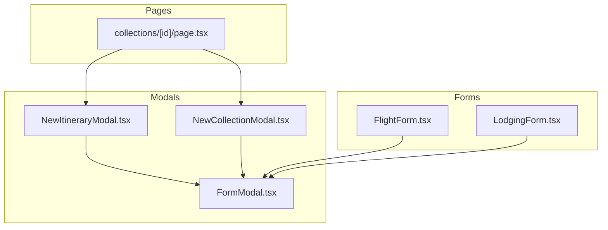
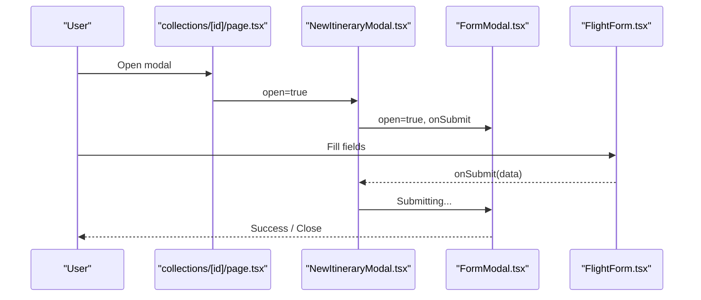
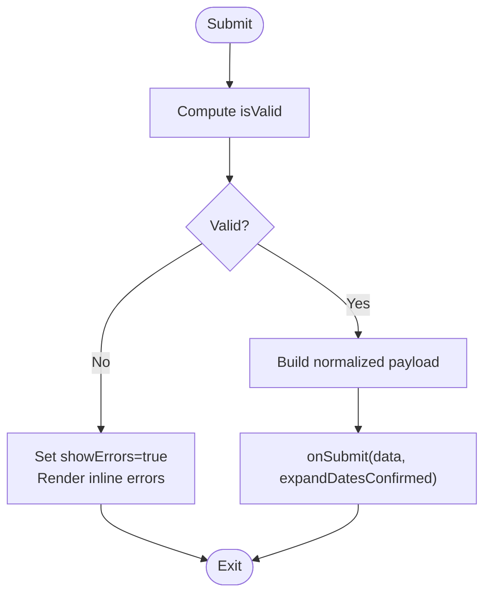
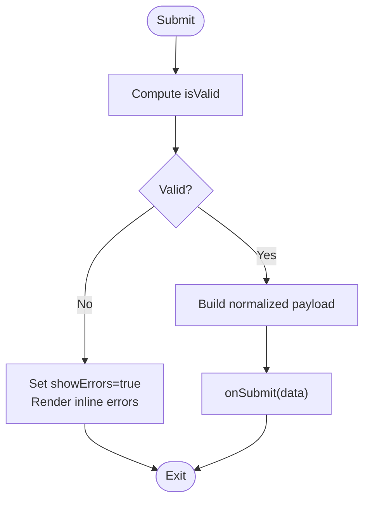
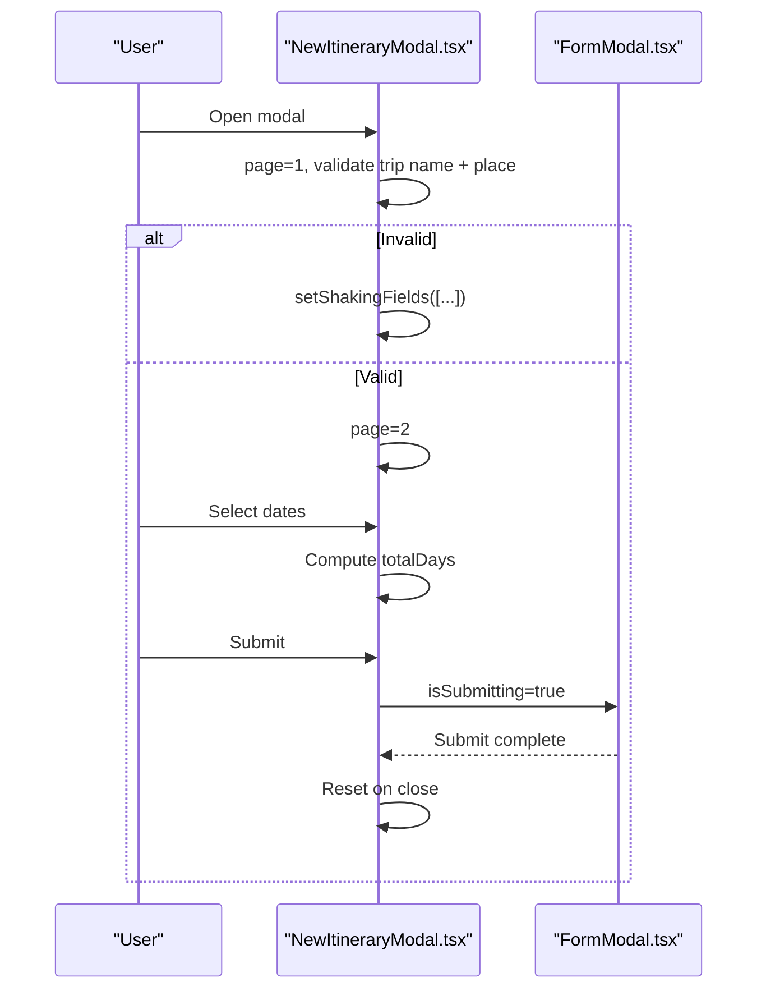
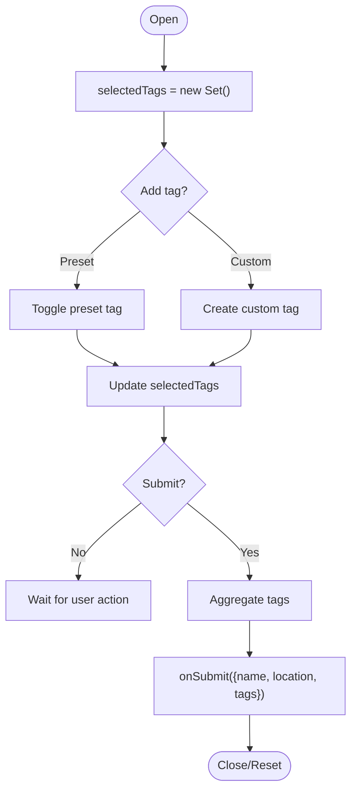
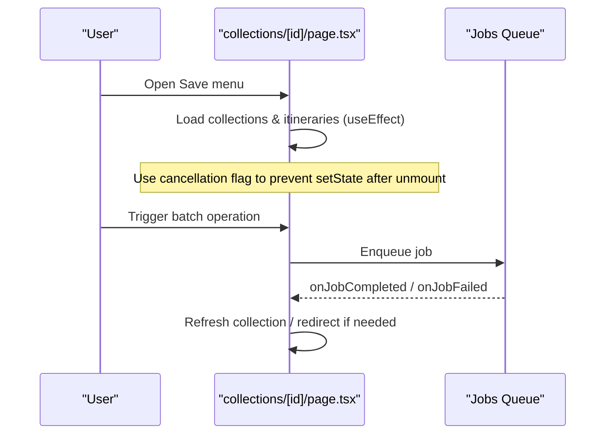
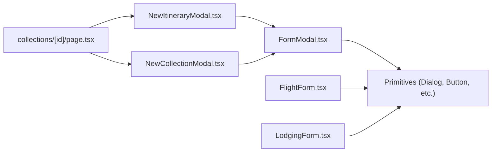

# Local Component State Management

<cite>
**Referenced Files in This Document**
- [FormModal.tsx](file://src/components/ui/modals/FormModal.tsx)
- [FlightForm.tsx](file://src/components/ui/detail-views/FlightForm.tsx)
- [LodgingForm.tsx](file://src/components/ui/detail-views/LodgingForm.tsx)
- [NewItineraryModal.tsx](file://src/components/ui/modals/NewItineraryModal.tsx)
- [NewCollectionModal.tsx](file://src/components/ui/modals/NewCollectionModal.tsx)
- [page.tsx](file://src/app/collections/[id]/page.tsx)
- [useModalAnimation.ts](file://src/hooks/useModalAnimation.ts)
</cite>

## Table of Contents
1. [Introduction](#introduction)
2. [Project Structure](#project-structure)
3. [Core Components](#core-components)
4. [Architecture Overview](#architecture-overview)
5. [Detailed Component Analysis](#detailed-component-analysis)
6. [Dependency Analysis](#dependency-analysis)
7. [Performance Considerations](#performance-considerations)
8. [Troubleshooting Guide](#troubleshooting-guide)
9. [Conclusion](#conclusion)

## Introduction
This document explains local component state management patterns using React useState and useEffect hooks across the application’s forms, modals, and page-level components. It covers form state handling, modal visibility and wizard flows, UI interaction states (e.g., validation feedback, loading), and lifecycle management via effects. It also addresses complex validation, conditional rendering, state transitions, performance considerations for state-heavy components, normalization strategies, and debugging techniques grounded in the codebase.

## Project Structure
The project organizes reusable UI primitives and domain-specific forms under src/components/ui, with page-level state in src/app. Modal shells are centralized to keep consistent open/close behavior, while domain forms encapsulate their own field state and validation logic. Page-level components coordinate multiple pieces of local state (selections, menus, modals) and side effects (data fetching, job tracking).

**Diagram sources**
- [page.tsx:60-259](file://src/app/collections/[id]/page.tsx#L60-L259)
- [FormModal.tsx:50-224](file://src/components/ui/modals/FormModal.tsx#L50-L224)
- [NewItineraryModal.tsx:45-179](file://src/components/ui/modals/NewItineraryModal.tsx#L45-L179)
- [NewCollectionModal.tsx:42-153](file://src/components/ui/modals/NewCollectionModal.tsx#L42-L153)
- [FlightForm.tsx:226-433](file://src/components/ui/detail-views/FlightForm.tsx#L226-L433)
- [LodgingForm.tsx:156-252](file://src/components/ui/detail-views/LodgingForm.tsx#L156-L252)

**Section sources**
- [page.tsx:60-259](file://src/app/collections/[id]/page.tsx#L60-L259)
- [FormModal.tsx:50-224](file://src/components/ui/modals/FormModal.tsx#L50-L224)
- [NewItineraryModal.tsx:45-179](file://src/components/ui/modals/NewItineraryModal.tsx#L45-L179)
- [NewCollectionModal.tsx:42-153](file://src/components/ui/modals/NewCollectionModal.tsx#L42-L153)
- [FlightForm.tsx:226-433](file://src/components/ui/detail-views/FlightForm.tsx#L226-L433)
- [LodgingForm.tsx:156-252](file://src/components/ui/detail-views/LodgingForm.tsx#L156-L252)

## Core Components
- FormModal: A controlled dialog shell that accepts open/onOpenChange, manages submit/disabled states, and renders a consistent layout for forms and actions.
- FlightForm: A multi-field form with local field state, date/time pickers, inline validation, and an out-of-range date confirmation modal.
- LodgingForm: A simpler form with local field state, date/time pickers, and on-submit validation.
- NewItineraryModal: A two-step wizard with step state, selection state, computed values, and submission flow.
- NewCollectionModal: A single-step modal with tag set state, custom tag creation, and submission flow.
- collections/[id]/page: Orchestrates multiple local states (loading, error, selections, menu toggles, modals) and uses useEffect for data fetching and cleanup.

Key patterns observed:
- Controlled open/close via props and onOpenChange.
- Local field state per input with derived validity flags.
- Conditional rendering based on step or validation state.
- Side effects for data fetching and cleanup.
- Refs to track transient interactions (e.g., submitted flag, refs for focus).

**Section sources**
- [FormModal.tsx:50-224](file://src/components/ui/modals/FormModal.tsx#L50-L224)
- [FlightForm.tsx:226-433](file://src/components/ui/detail-views/FlightForm.tsx#L226-L433)
- [LodgingForm.tsx:156-252](file://src/components/ui/detail-views/LodgingForm.tsx#L156-L252)
- [NewItineraryModal.tsx:45-179](file://src/components/ui/modals/NewItineraryModal.tsx#L45-L179)
- [NewCollectionModal.tsx:42-153](file://src/components/ui/modals/NewCollectionModal.tsx#L42-L153)
- [page.tsx:60-259](file://src/app/collections/[id]/page.tsx#L60-L259)

## Architecture Overview
Local state is typically co-located with the component that owns the UI behavior. Forms encapsulate their field state and validation; modals encapsulate open/close and wizard steps; pages coordinate multiple concerns and side effects.

**Diagram sources**
- [page.tsx:60-259](file://src/app/collections/[id]/page.tsx#L60-L259)
- [NewItineraryModal.tsx:118-179](file://src/components/ui/modals/NewItineraryModal.tsx#L118-L179)
- [FormModal.tsx:100-216](file://src/components/ui/modals/FormModal.tsx#L100-L216)
- [FlightForm.tsx:300-433](file://src/components/ui/detail-views/FlightForm.tsx#L300-L433)

## Detailed Component Analysis

### FlightForm: Complex form validation and conditional UX
- Field state: Each input has its own useState for value.
- Validation: Derived isValid flag; showErrors toggled on invalid submit.
- Date range guard: If selected date falls outside itinerary bounds, a confirmation dialog appears before applying the change.
- Submission: Builds normalized payload and calls parent callback with optional expandDates flag.

**Diagram sources**
- [FlightForm.tsx:250-304](file://src/components/ui/detail-views/FlightForm.tsx#L250-L304)
- [FlightForm.tsx:394-429](file://src/components/ui/detail-views/FlightForm.tsx#L394-L429)

**Section sources**
- [FlightForm.tsx:226-433](file://src/components/ui/detail-views/FlightForm.tsx#L226-L433)

### LodgingForm: Simplified form with date/time inputs
- Field state: useState per field.
- Validation: Derived isValid; showErrors toggled on invalid submit.
- Submission: Normalizes payload and calls parent callback.

**Diagram sources**
- [LodgingForm.tsx:168-185](file://src/components/ui/detail-views/LodgingForm.tsx#L168-L185)

**Section sources**
- [LodgingForm.tsx:156-252](file://src/components/ui/detail-views/LodgingForm.tsx#L156-L252)

### NewItineraryModal: Two-step wizard with state transitions
- Step state: page controls which section is visible.
- Selection state: place, dateRange, aiRecommendations.
- Computed values: totalDays, dateDisplayValue via useMemo.
- Validation: Shaking animation for invalid fields; step gating.
- Submission: Sets submitting state, calls parent, resets on close.

**Diagram sources**
- [NewItineraryModal.tsx:59-179](file://src/components/ui/modals/NewItineraryModal.tsx#L59-L179)
- [FormModal.tsx:100-216](file://src/components/ui/modals/FormModal.tsx#L100-L216)

**Section sources**
- [NewItineraryModal.tsx:45-179](file://src/components/ui/modals/NewItineraryModal.tsx#L45-L179)

### NewCollectionModal: Tag set management and submission
- Tag state: Set-based selectedTags plus customTags array.
- Input mode: Toggle to add custom tags with keyboard support.
- Submission: Aggregates tags and calls parent with normalized payload.

**Diagram sources**
- [NewCollectionModal.tsx:54-135](file://src/components/ui/modals/NewCollectionModal.tsx#L54-L135)

**Section sources**
- [NewCollectionModal.tsx:42-153](file://src/components/ui/modals/NewCollectionModal.tsx#L42-L153)

### collections/[id]/page: Multi-state orchestration and lifecycle
- Local states: collection, isLoading, error, selection, menu toggles, modals, generation status.
- Effects: Fetch lists for save targets; record view; job queue integration.
- Cleanup: Cancellation flags in effect returns to avoid stale updates.

**Diagram sources**
- [page.tsx:60-259](file://src/app/collections/[id]/page.tsx#L60-L259)

**Section sources**
- [page.tsx:60-259](file://src/app/collections/[id]/page.tsx#L60-L259)

## Dependency Analysis
- FormModal depends on Base UI Dialog and responsive breakpoint hook; it centralizes modal UX and submit states.
- Domain forms depend on shared primitives (Input, Calendar, Popover, Menu) and utilities.
- NewItineraryModal and NewCollectionModal compose FormModal and manage their own local state.
- The page coordinates multiple local states and integrates with jobs and selection hooks.

**Diagram sources**
- [FormModal.tsx:50-224](file://src/components/ui/modals/FormModal.tsx#L50-L224)
- [FlightForm.tsx:226-433](file://src/components/ui/detail-views/FlightForm.tsx#L226-L433)
- [LodgingForm.tsx:156-252](file://src/components/ui/detail-views/LodgingForm.tsx#L156-L252)
- [NewItineraryModal.tsx:45-179](file://src/components/ui/modals/NewItineraryModal.tsx#L45-L179)
- [NewCollectionModal.tsx:42-153](file://src/components/ui/modals/NewCollectionModal.tsx#L42-L153)
- [page.tsx:60-259](file://src/app/collections/[id]/page.tsx#L60-L259)

**Section sources**
- [FormModal.tsx:50-224](file://src/components/ui/modals/FormModal.tsx#L50-L224)
- [FlightForm.tsx:226-433](file://src/components/ui/detail-views/FlightForm.tsx#L226-L433)
- [LodgingForm.tsx:156-252](file://src/components/ui/detail-views/LodgingForm.tsx#L156-L252)
- [NewItineraryModal.tsx:45-179](file://src/components/ui/modals/NewItineraryModal.tsx#L45-L179)
- [NewCollectionModal.tsx:42-153](file://src/components/ui/modals/NewCollectionModal.tsx#L42-L153)
- [page.tsx:60-259](file://src/app/collections/[id]/page.tsx#L60-L259)

## Performance Considerations
- Memoization: Use useMemo for derived values like display strings and totals to avoid recomputation on every render.
- Stable callbacks: Wrap handlers with useCallback when passed to child components to prevent unnecessary re-renders.
- Avoid heavy work in render: Keep expensive computations inside useMemo or useReducer where appropriate.
- Minimize re-renders: Split large components into smaller ones; lift only necessary state up.
- Debounce/throttle: For search or autosuggest inputs, debounce changes to reduce state churn.
- Batched updates: Group related state updates to minimize renders.
- Early exits: Guard expensive effects with early returns when dependencies are not ready.

[No sources needed since this section provides general guidance]

## Troubleshooting Guide
- Stale closures: Ensure event handlers capture current state by including dependencies or using functional updates.
- Effect cleanup: Always return cleanup functions from useEffect to cancel in-flight requests or remove listeners.
- Unmounted updates: Use cancellation flags or guards to prevent setState after unmount.
- Validation feedback: Toggle showErrors only on submit attempts to avoid premature error messages.
- Modal state leaks: Reset all local state in onOpenChange when closing to prevent carryover between sessions.
- Job lifecycle: Handle both completion and failure paths to reset loading states and refresh data.

**Section sources**
- [page.tsx:200-235](file://src/app/collections/[id]/page.tsx#L200-L235)
- [NewItineraryModal.tsx:104-116](file://src/components/ui/modals/NewItineraryModal.tsx#L104-L116)
- [FlightForm.tsx:300-304](file://src/components/ui/detail-views/FlightForm.tsx#L300-L304)
- [LodgingForm.tsx:170-185](file://src/components/ui/detail-views/LodgingForm.tsx#L170-L185)

## Conclusion
The codebase demonstrates robust local state management patterns:
- Co-locate state with the component that needs it.
- Use controlled modals with explicit open/onOpenChange.
- Derive UI state from field values for validation and conditional rendering.
- Manage side effects with useEffect and proper cleanup.
- Optimize performance with memoization and stable references.
These practices yield predictable, maintainable, and performant UI behaviors across forms, modals, and pages.