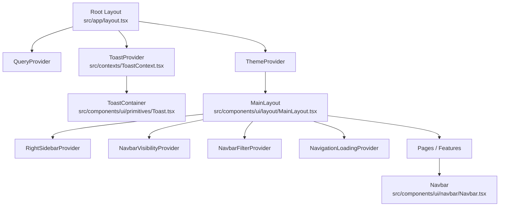
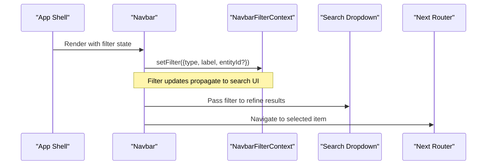
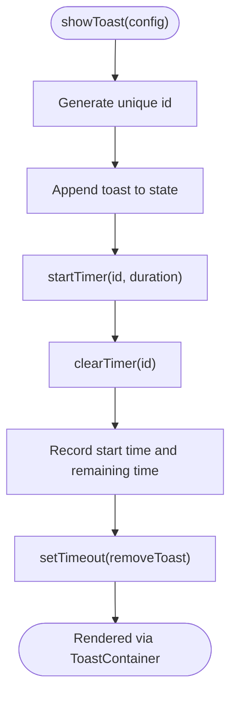
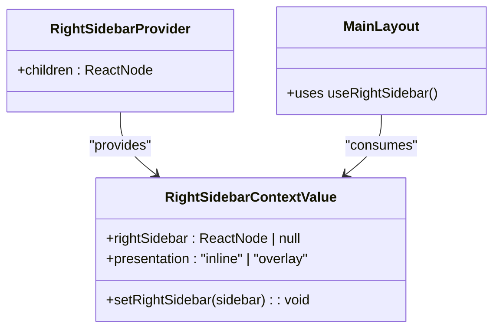
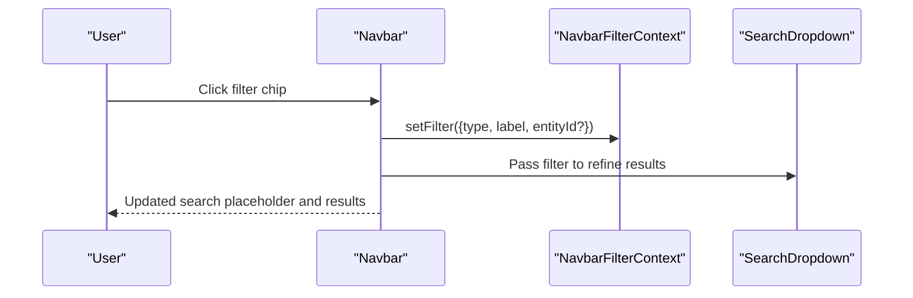
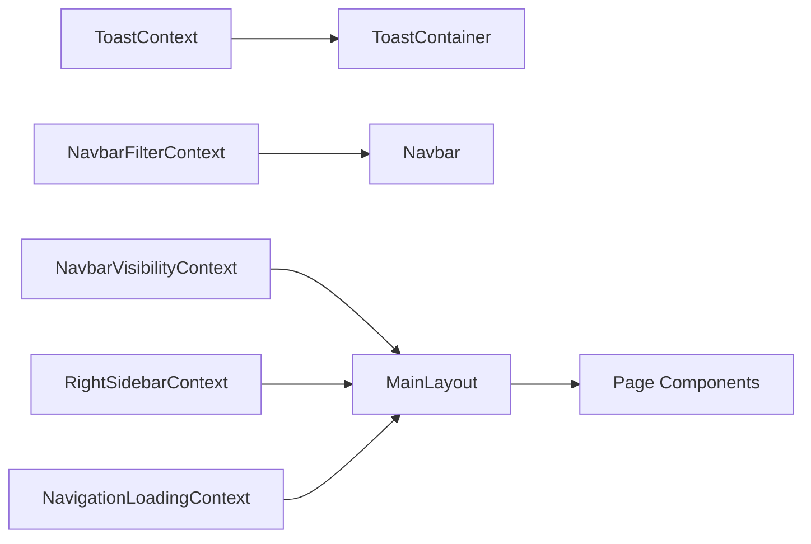

# React Context for Global Client State

<cite>
**Referenced Files in This Document**
- [ToastContext.tsx](file://src/contexts/ToastContext.tsx)
- [Toast.tsx](file://src/components/ui/primitives/Toast.tsx)
- [NavbarFilterContext.tsx](file://src/contexts/NavbarFilterContext.tsx)
- [NavbarVisibilityContext.tsx](file://src/contexts/NavbarVisibilityContext.tsx)
- [NavigationLoadingContext.tsx](file://src/contexts/NavigationLoadingContext.tsx)
- [RightSidebarContext.tsx](file://src/contexts/RightSidebarContext.tsx)
- [MainLayout.tsx](file://src/components/ui/layout/MainLayout.tsx)
- [Navbar.tsx](file://src/components/ui/navbar/Navbar.tsx)
- [layout.tsx](file://src/app/layout.tsx)
</cite>

## Table of Contents
1. Introduction
2. Project Structure
3. Core Components
4. Architecture Overview
5. Detailed Component Analysis
6. Dependency Analysis
7. Performance Considerations
8. Troubleshooting Guide
9. Conclusion

## Introduction
This document explains how the application uses React Context to manage global client state across components. It covers the provider pattern, state synchronization between UI areas (toasts, sidebar, navbar filters, navigation loading), and performance considerations such as avoiding unnecessary re-renders. It also documents composition patterns for combining multiple contexts and best practices for scaling in large applications.

## Project Structure
The app composes several context providers at or near the root to share global state:
- Root layout wraps the app with query and toast providers.
- Main layout composes right sidebar, navbar visibility, navbar filter, and navigation loading contexts around page content.
- Feature-specific components consume these contexts via custom hooks.

**Diagram sources**
- [layout.tsx:62-79](file://src/app/layout.tsx#L62-L79)
- [MainLayout.tsx:12-20](file://src/components/ui/layout/MainLayout.tsx#L12-L20)
- [ToastContext.tsx:42-147](file://src/contexts/ToastContext.tsx#L42-L147)
- [Toast.tsx:47-173](file://src/components/ui/primitives/Toast.tsx#L47-L173)
- [Navbar.tsx:10-18](file://src/components/ui/navbar/Navbar.tsx#L10-L18)

**Section sources**
- [layout.tsx:62-79](file://src/app/layout.tsx#L62-L79)
- [MainLayout.tsx:12-20](file://src/components/ui/layout/MainLayout.tsx#L12-L20)

## Core Components
- Toast system: Provides a global notification queue with timers, pause/resume on hover, and animated rendering.
- Navbar filters: Holds the active search filter type and optional entity scope; consumed by the navbar to tailor search behavior.
- Navbar visibility: Allows child components to hide/show the navbar based on scroll or other interactions.
- Right sidebar: Manages dynamic side panel content and presentation mode (inline vs overlay).
- Navigation loading: Controls a global loading banner/state during navigation or long-running operations.

**Section sources**
- [ToastContext.tsx:28-36](file://src/contexts/ToastContext.tsx#L28-L36)
- [NavbarFilterContext.tsx:7-18](file://src/contexts/NavbarFilterContext.tsx#L7-L18)
- [NavbarVisibilityContext.tsx:5-7](file://src/contexts/NavbarVisibilityContext.tsx#L5-L7)
- [RightSidebarContext.tsx:6-11](file://src/contexts/RightSidebarContext.tsx#L6-L11)
- [NavigationLoadingContext.tsx:10-16](file://src/contexts/NavigationLoadingContext.tsx#L10-L16)

## Architecture Overview
The architecture centers on small, focused contexts that each own a slice of global state. Providers are composed in two layers:
- Root layer: Query and Toast providers wrap the entire app.
- Page shell layer: MainLayout composes RightSidebar, NavbarVisibility, NavbarFilter, and NavigationLoading around page content.

Components consume state through typed custom hooks, keeping UI logic decoupled from state management.

**Diagram sources**
- [Navbar.tsx:140-184](file://src/components/ui/navbar/Navbar.tsx#L140-L184)
- [NavbarFilterContext.tsx:35-43](file://src/contexts/NavbarFilterContext.tsx#L35-L43)

## Detailed Component Analysis

### Toast System
The toast system provides a global notification queue with:
- Add/remove/pause/resume notifications
- Per-toast timers stored outside React state using refs to avoid re-renders
- Hover-to-pause behavior with progress bar animation
- Portal rendering to ensure consistent stacking

**Diagram sources**
- [ToastContext.tsx:90-98](file://src/contexts/ToastContext.tsx#L90-L98)
- [ToastContext.tsx:79-88](file://src/contexts/ToastContext.tsx#L79-L88)
- [ToastContext.tsx:64-77](file://src/contexts/ToastContext.tsx#L64-L77)

Key behaviors:
- Pause/resume: On mouse enter/leave, the toast timer is paused and resumed while preserving remaining time.
- Progress bar: The UI component computes elapsed time and animates a drain indicator; it respects reduced motion preferences.
- Accessibility: Uses aria-live regions and roles appropriate to variant.

**Section sources**
- [ToastContext.tsx:42-147](file://src/contexts/ToastContext.tsx#L42-L147)
- [Toast.tsx:47-173](file://src/components/ui/primitives/Toast.tsx#L47-L173)

### Sidebar State Management
The right sidebar context manages:
- Dynamic content injection via a ReactNode slot
- Presentation mode computed from breakpoint hook: inline column on desktop, overlay sheet on smaller screens
- Safe no-op fallback when used outside provider

**Diagram sources**
- [RightSidebarContext.tsx:6-11](file://src/contexts/RightSidebarContext.tsx#L6-L11)
- [RightSidebarContext.tsx:34-46](file://src/contexts/RightSidebarContext.tsx#L34-L46)
- [MainLayout.tsx:300-343](file://src/components/ui/layout/MainLayout.tsx#L300-L343)

**Section sources**
- [RightSidebarContext.tsx:17-46](file://src/contexts/RightSidebarContext.tsx#L17-L46)
- [MainLayout.tsx:300-343](file://src/components/ui/layout/MainLayout.tsx#L300-L343)

### Navbar Filters
The navbar filter context holds the current search filter (type, label, optional thumbnail, and optional entity/locality scope). The navbar consumes this to:
- Adjust placeholder text
- Scope search queries to a specific entity or locality
- Render a removable filter pill

**Diagram sources**
- [Navbar.tsx:140-160](file://src/components/ui/navbar/Navbar.tsx#L140-L160)
- [NavbarFilterContext.tsx:35-43](file://src/contexts/NavbarFilterContext.tsx#L35-L43)

**Section sources**
- [NavbarFilterContext.tsx:7-46](file://src/contexts/NavbarFilterContext.tsx#L7-L46)
- [Navbar.tsx:74-116](file://src/components/ui/navbar/Navbar.tsx#L74-L116)

### Navigation Loading States
A lightweight context exposes:
- isLoading flag
- Optional title/subtitle for richer feedback
- startLoading(stopLoading) API to control global loading banners

Used within the main layout to coordinate user-facing loading states during actions like creating resources or navigating.

**Section sources**
- [NavigationLoadingContext.tsx:10-48](file://src/contexts/NavigationLoadingContext.tsx#L10-L48)
- [MainLayout.tsx:33-40](file://src/components/ui/layout/MainLayout.tsx#L33-L40)

### Navbar Visibility
Provides a setter to hide/show the navbar. In the main layout, scroll-based hysteresis calls this setter to toggle visibility based on scroll position thresholds, preventing flicker during programmatic scrolls.

**Section sources**
- [NavbarVisibilityContext.tsx:5-27](file://src/contexts/NavbarVisibilityContext.tsx#L5-L27)
- [MainLayout.tsx:61-91](file://src/components/ui/layout/MainLayout.tsx#L61-L91)

## Dependency Analysis
Contexts are intentionally small and cohesive:
- ToastContext depends only on React primitives and DOM APIs.
- NavbarFilterContext is state-only and consumed by Navbar.
- RightSidebarContext depends on a breakpoint hook to compute presentation.
- NavigationLoadingContext is minimal state with callbacks.
- MainLayout composes multiple contexts and orchestrates their usage.

**Diagram sources**
- [ToastContext.tsx:42-147](file://src/contexts/ToastContext.tsx#L42-L147)
- [Toast.tsx:47-173](file://src/components/ui/primitives/Toast.tsx#L47-L173)
- [NavbarFilterContext.tsx:35-43](file://src/contexts/NavbarFilterContext.tsx#L35-L43)
- [Navbar.tsx:10-18](file://src/components/ui/navbar/Navbar.tsx#L10-L18)
- [NavbarVisibilityContext.tsx:11-27](file://src/contexts/NavbarVisibilityContext.tsx#L11-L27)
- [RightSidebarContext.tsx:34-46](file://src/contexts/RightSidebarContext.tsx#L34-L46)
- [NavigationLoadingContext.tsx:20-41](file://src/contexts/NavigationLoadingContext.tsx#L20-L41)
- [MainLayout.tsx:12-20](file://src/components/ui/layout/MainLayout.tsx#L12-L20)

**Section sources**
- [MainLayout.tsx:12-20](file://src/components/ui/layout/MainLayout.tsx#L12-L20)

## Performance Considerations
- Avoid unnecessary re-renders:
  - Use memoization for stable callbacks in context values where appropriate.
  - Prefer refs for non-UI timing data (e.g., timers, start times, remaining durations) to prevent re-renders on every tick.
  - Split contexts by concern so consumers only subscribe to relevant slices.
- Optimize toast rendering:
  - Portals isolate rendering from parent stacking contexts.
  - AnimatePresence handles enter/exit animations efficiently.
  - Respect reduced motion preferences to minimize layout thrashing.
- Sidebar presentation:
  - Compute presentation mode once per breakpoint change to avoid frequent recalculations.
- Navbar filtering:
  - Keep filter state minimal; pass derived values down to reduce prop drilling.
  - Debounce or throttle search input if needed beyond what’s implemented.
- Global loading:
  - Keep loading state coarse-grained to avoid excessive UI churn.

[No sources needed since this section provides general guidance]

## Troubleshooting Guide
- Toast not appearing:
  - Ensure ToastProvider wraps the app and ToastContainer is rendered (root layout does this).
  - Verify showToast is called with required fields and that the toast list is not being cleared unexpectedly.
- Toast not auto-dismissing:
  - Check that timers are not being cleared prematurely and that pause/resume flows update remaining time correctly.
- Sidebar not showing:
  - Confirm RightSidebarProvider is present and setRightSidebar is called with a valid ReactNode.
  - On mobile, verify presentation resolves to overlay and Sheet opens accordingly.
- Navbar filter not applied:
  - Ensure setFilter is called with correct type and optional entityId/localityEntityIds.
  - Confirm Navbar passes filter to search dropdown and that queries respect the filter.
- Navbar visibility issues:
  - Scroll thresholds and event listeners must be attached to the correct scroll container.
  - Hysteresis prevents flicker but may require tuning thresholds for specific pages.

**Section sources**
- [layout.tsx:62-79](file://src/app/layout.tsx#L62-L79)
- [ToastContext.tsx:42-147](file://src/contexts/ToastContext.tsx#L42-L147)
- [Toast.tsx:47-173](file://src/components/ui/primitives/Toast.tsx#L47-L173)
- [RightSidebarContext.tsx:17-46](file://src/contexts/RightSidebarContext.tsx#L17-L46)
- [NavbarFilterContext.tsx:35-43](file://src/contexts/NavbarFilterContext.tsx#L35-L43)
- [Navbar.tsx:140-184](file://src/components/ui/navbar/Navbar.tsx#L140-L184)
- [MainLayout.tsx:61-91](file://src/components/ui/layout/MainLayout.tsx#L61-L91)

## Conclusion
The application adopts a pragmatic, composable approach to global client state using small, focused React Contexts. Each context owns a clear responsibility—notifications, sidebar, navbar filters, visibility, and navigation loading—and exposes typed hooks for consumption. This design keeps components decoupled, simplifies testing, and scales well as features grow. By leveraging refs for non-UI timing, portals for overlays, and careful provider composition, the app maintains responsiveness and clarity even as complexity increases.