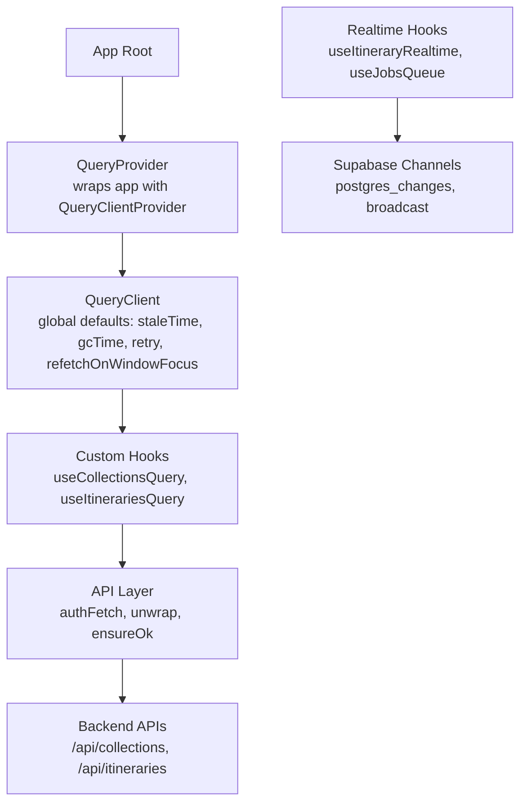
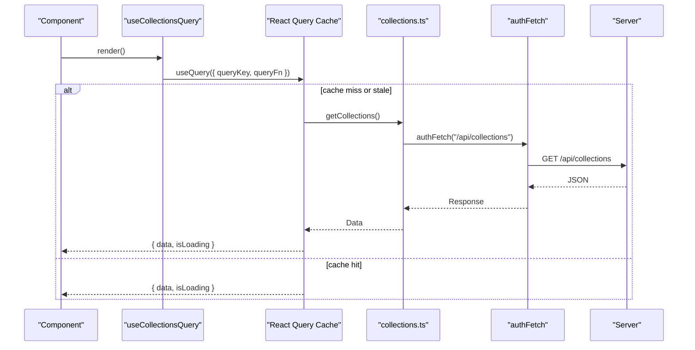
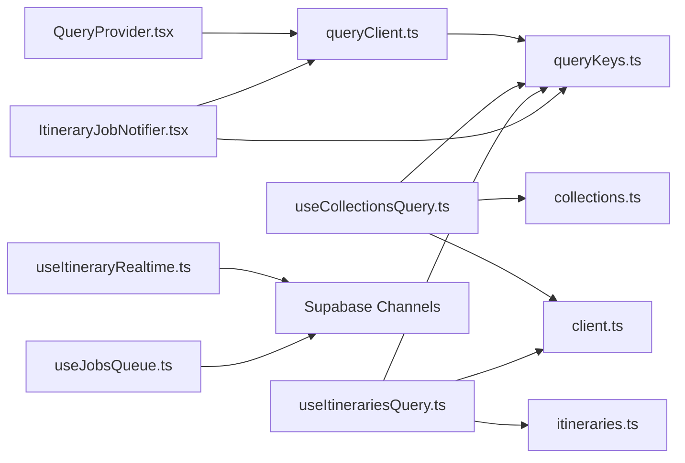

# React Query Server State Management

<cite>
**Referenced Files in This Document**
- [QueryProvider.tsx](file://src/components/QueryProvider.tsx)
- [queryClient.ts](file://src/lib/query/queryClient.ts)
- [queryKeys.ts](file://src/lib/query/queryKeys.ts)
- [useCollectionsQuery.ts](file://src/hooks/queries/useCollectionsQuery.ts)
- [useItinerariesQuery.ts](file://src/hooks/queries/useItinerariesQuery.ts)
- [collections.ts](file://src/lib/api/collections.ts)
- [itineraries.ts](file://src/lib/api/itineraries.ts)
- [client.ts](file://src/lib/api/client.ts)
- [useDashboardRecent.ts](file://src/hooks/useDashboardRecent.ts)
- [useItineraryRealtime.ts](file://src/hooks/useItineraryRealtime.ts)
- [useJobsQueue.ts](file://src/hooks/useJobsQueue.ts)
- [ItineraryJobNotifier.tsx](file://src/components/notifications/ItineraryJobNotifier.tsx)
- [page.tsx](file://src/app/itineraries/[id]/page.tsx)
</cite>

## Table of Contents
1. [Introduction](#introduction)
2. [Project Structure](#project-structure)
3. [Core Components](#core-components)
4. [Architecture Overview](#architecture-overview)
5. [Detailed Component Analysis](#detailed-component-analysis)
6. [Dependency Analysis](#dependency-analysis)
7. [Performance Considerations](#performance-considerations)
8. [Troubleshooting Guide](#troubleshooting-guide)
9. [Conclusion](#conclusion)
10. [Appendices](#appendices)

## Introduction
This document explains how Argo manages server state using React Query (TanStack Query). It covers the query client configuration, cache strategies, data fetching patterns via custom hooks, optimistic updates, error handling, background refetching strategies, and real-time synchronization with Supabase subscriptions. It also provides guidance for implementing new queries and mutations while optimizing performance through caching and invalidation.

## Project Structure
Argo’s server state is centered around a shared QueryClient instance provided at the app root. Feature-specific data is fetched by small, focused hooks that wrap TanStack Query’s useQuery. API calls are centralized under src/lib/api, with typed responses and consistent error handling utilities. Real-time features are implemented via Supabase channels in dedicated hooks and components.

**Diagram sources**
- [QueryProvider.tsx:7-12](file://src/components/QueryProvider.tsx#L7-L12)
- [queryClient.ts:3-12](file://src/lib/query/queryClient.ts#L3-L12)
- [useCollectionsQuery.ts:10-16](file://src/hooks/queries/useCollectionsQuery.ts#L10-L16)
- [useItinerariesQuery.ts:10-16](file://src/hooks/queries/useItinerariesQuery.ts#L10-L16)
- [client.ts:59-94](file://src/lib/api/client.ts#L59-L94)
- [useItineraryRealtime.ts:89-333](file://src/hooks/useItineraryRealtime.ts#L89-L333)

**Section sources**
- [QueryProvider.tsx:7-12](file://src/components/QueryProvider.tsx#L7-L12)
- [queryClient.ts:3-12](file://src/lib/query/queryClient.ts#L3-L12)

## Core Components
- QueryClient configuration: global defaults for caching and network behavior.
- Query keys: centralized factory functions to build stable, serializable keys per resource.
- Custom hooks: thin wrappers around useQuery that encapsulate fetch logic and caching options.
- API layer: authenticated fetch wrapper with unified error unwrapping.

Key responsibilities:
- Provide a single QueryClient instance to all components.
- Define query keys to enable precise invalidation and deduplication.
- Encapsulate data fetching in hooks so UI stays declarative.
- Centralize authentication and error handling in the API layer.

**Section sources**
- [queryClient.ts:3-12](file://src/lib/query/queryClient.ts#L3-L12)
- [queryKeys.ts:1-42](file://src/lib/query/queryKeys.ts#L1-L42)
- [useCollectionsQuery.ts:10-16](file://src/hooks/queries/useCollectionsQuery.ts#L10-L16)
- [useItinerariesQuery.ts:10-16](file://src/hooks/queries/useItinerariesQuery.ts#L10-L16)
- [client.ts:59-94](file://src/lib/api/client.ts#L59-L94)

## Architecture Overview
The application uses a layered architecture:
- Presentation: React components consume data via hooks.
- Data access: Custom hooks call useQuery with typed query keys and functions.
- Network: API layer performs authenticated requests and normalizes errors.
- Real-time: Supabase channels push updates directly into local component state or invalidate queries.

**Diagram sources**
- [useCollectionsQuery.ts:10-16](file://src/hooks/queries/useCollectionsQuery.ts#L10-L16)
- [collections.ts:65-69](file://src/lib/api/collections.ts#L65-L69)
- [client.ts:59-94](file://src/lib/api/client.ts#L59-L94)

## Detailed Component Analysis

### Query Client Configuration
- Global defaults:
  - staleTime: 5 minutes
  - gcTime: 10 minutes
  - retry: 1
  - refetchOnWindowFocus: false
- These settings reduce unnecessary network traffic and keep data fresh without aggressive polling.

Practical implications:
- Queries remain valid for 5 minutes after fetch; subsequent reads return cached data immediately.
- Garbage collection removes unused entries after 10 minutes.
- Single retry on transient failures improves resilience without excessive retries.
- Window focus does not trigger refetches; rely on explicit invalidation or intervals where needed.

**Section sources**
- [queryClient.ts:3-12](file://src/lib/query/queryClient.ts#L3-L12)

### Query Keys Strategy
- Centralized key factories ensure consistent, serializable keys across the app.
- Examples include collections, itineraries, profile, search, and more.
- Benefits:
  - Precise invalidation by key parts (e.g., invalidate all itineraries but not collections).
  - Deduplication of identical queries.
  - Predictable cache behavior for tests and debugging.

Usage pattern:
- Each hook imports queryKeys and passes a key function result to useQuery.

**Section sources**
- [queryKeys.ts:1-42](file://src/lib/query/queryKeys.ts#L1-L42)
- [useCollectionsQuery.ts:10-16](file://src/hooks/queries/useCollectionsQuery.ts#L10-L16)
- [useItinerariesQuery.ts:10-16](file://src/hooks/queries/useItinerariesQuery.ts#L10-L16)

### Data Fetching Patterns: useCollectionsQuery and useItinerariesQuery
- Both hooks:
  - Use useQuery with a stable query key from queryKeys.
  - Wrap API functions that perform authenticated requests.
  - Set staleTime to 60 seconds to balance freshness and performance.
- Collections:
  - Returns a list of collections with roles and metadata.
- Itineraries:
  - Returns a list of itineraries with roles and summary fields.

Benefits:
- Declarative data loading in components.
- Automatic caching, deduplication, and background updates based on staleTime.
- Easy integration with invalidation triggers elsewhere in the app.

**Section sources**
- [useCollectionsQuery.ts:10-16](file://src/hooks/queries/useCollectionsQuery.ts#L10-L16)
- [useItinerariesQuery.ts:10-16](file://src/hooks/queries/useItinerariesQuery.ts#L10-L16)
- [collections.ts:65-69](file://src/lib/api/collections.ts#L65-L69)
- [itineraries.ts:54-57](file://src/lib/api/itineraries.ts#L54-L57)

### API Layer and Error Handling
- authFetch:
  - Retrieves the current session token and attaches Authorization header.
  - Throws a typed error when unauthenticated.
  - Normalizes transport errors with status 0.
- unwrap and ensureOk:
  - Ensure responses are ok; otherwise throw an ApiError with status.
  - Parse JSON bodies consistently.

Error strategy:
- Consistent error shape enables uniform handling in hooks and UI.
- Quota and domain-specific errors are surfaced via custom error types in feature APIs.

**Section sources**
- [client.ts:59-94](file://src/lib/api/client.ts#L59-L94)
- [itineraries.ts:101-120](file://src/lib/api/itineraries.ts#L101-L120)

### Optimistic Updates and Background Refetching
- Optimistic UI:
  - The itinerary detail page applies provisional changes immediately (e.g., drag-and-drop reordering), then reconciles with server cascade results.
  - Pending time recomputation is tracked to avoid inconsistent states during transitions.
- Background refetching:
  - StaleTime-based refetch ensures data refreshes in the background without user interaction.
  - For long-running jobs, polling via refetchInterval can replace realtime subscriptions where appropriate.

Examples:
- Drag-and-drop cascades update times and legs optimistically before server confirmation.
- Job queue supports optimistic upserts to reflect status changes instantly.

**Section sources**
- [page.tsx:2074-2290](file://src/app/itineraries/[id]/page.tsx#L2074-L2290)
- [useJobsQueue.ts:269-295](file://src/hooks/useJobsQueue.ts#L269-L295)

### Real-Time Data Synchronization with Supabase
- useItineraryRealtime:
  - Subscribes to postgres_changes for activities, days, itineraries, collaborators, flights, and lodgings.
  - Mirrors updates into both calendar view state and itinerary model state to keep multiple views consistent.
  - Hydrates location details asynchronously when needed.
- useJobsQueue:
  - Subscribes to job updates and handles connection errors and visibility changes.
  - Supports optimistic merges to keep the UI responsive.
- ItineraryJobNotifier:
  - Manages notifications and integrates with React Query keys to invalidate relevant caches when jobs complete.

Patterns:
- Channel lifecycle management with cleanup on unmount.
- Idempotent updates to prevent duplicate entries.
- Graceful fallbacks when realtime events are delayed or dropped.

**Section sources**
- [useItineraryRealtime.ts:89-333](file://src/hooks/useItineraryRealtime.ts#L89-L333)
- [useItineraryRealtime.ts:335-440](file://src/hooks/useItineraryRealtime.ts#L335-L440)
- [useItineraryRealtime.ts:442-530](file://src/hooks/useItineraryRealtime.ts#L442-L530)
- [useJobsQueue.ts:244-295](file://src/hooks/useJobsQueue.ts#L244-L295)
- [ItineraryJobNotifier.tsx:1-33](file://src/components/notifications/ItineraryJobNotifier.tsx#L1-L33)

### Custom Hook: useDashboardRecent
- Purpose:
  - Loads recent content with pagination and sorting, independent of React Query.
  - Maintains local state for items, loading indicators, and cursor-based pagination.
- Behavior:
  - Initial fetch resets on userId or filter changes.
  - loadMore uses refs to avoid stale closures and deduplicates items by id.
  - Provides removeItem, updateItem, prependItem, and refresh helpers for immediate UI feedback.
- Integration note:
  - While not using React Query, it demonstrates common patterns (cursor pagination, optimistic updates) applicable to query-based implementations.

**Section sources**
- [useDashboardRecent.ts:39-131](file://src/hooks/useDashboardRecent.ts#L39-L131)

## Dependency Analysis

**Diagram sources**
- [QueryProvider.tsx:7-12](file://src/components/QueryProvider.tsx#L7-L12)
- [queryClient.ts:3-12](file://src/lib/query/queryClient.ts#L3-L12)
- [queryKeys.ts:1-42](file://src/lib/query/queryKeys.ts#L1-L42)
- [useCollectionsQuery.ts:10-16](file://src/hooks/queries/useCollectionsQuery.ts#L10-L16)
- [collections.ts:65-69](file://src/lib/api/collections.ts#L65-L69)
- [client.ts:59-94](file://src/lib/api/client.ts#L59-L94)
- [useItinerariesQuery.ts:10-16](file://src/hooks/queries/useItinerariesQuery.ts#L10-L16)
- [itineraries.ts:54-57](file://src/lib/api/itineraries.ts#L54-L57)
- [useItineraryRealtime.ts:89-333](file://src/hooks/useItineraryRealtime.ts#L89-L333)
- [useJobsQueue.ts:244-295](file://src/hooks/useJobsQueue.ts#L244-L295)
- [ItineraryJobNotifier.tsx:1-33](file://src/components/notifications/ItineraryJobNotifier.tsx#L1-L33)

**Section sources**
- [queryKeys.ts:1-42](file://src/lib/query/queryKeys.ts#L1-L42)
- [client.ts:59-94](file://src/lib/api/client.ts#L59-L94)

## Performance Considerations
- Cache tuning:
  - Use staleTime to reduce network calls; adjust per resource volatility.
  - Leverage gcTime to free memory for inactive queries.
- Invalidation strategy:
  - Invalidate specific keys after mutations to keep UI consistent.
  - Combine with optimistic updates for perceived responsiveness.
- Pagination:
  - Prefer cursor-based pagination for large datasets; deduplicate by id to avoid duplicates.
- Real-time vs polling:
  - Use Supabase channels for collaborative editing and live dashboards.
  - Consider polling with refetchInterval for long-running jobs to simplify state sync.
- Memoization:
  - Memoize derived lists and callbacks to minimize re-renders and effect thrashing.

[No sources needed since this section provides general guidance]

## Troubleshooting Guide
Common issues and resolutions:
- Not authenticated:
  - authFetch throws when no session exists; ensure login flow completes before data requests.
- Network unreachable:
  - Transport errors surface with status 0; handle offline states and show retry prompts.
- Realtime channel errors:
  - useJobsQueue sets connectionError on CHANNEL_ERROR or TIMED_OUT; reconcile on reconnect.
- Duplicate entries:
  - Ensure idempotent inserts in realtime handlers; check for existing ids before appending.
- Stale UI after mutation:
  - Invalidate affected query keys post-mutation; combine with optimistic updates for smooth UX.

**Section sources**
- [client.ts:59-94](file://src/lib/api/client.ts#L59-L94)
- [useJobsQueue.ts:244-295](file://src/hooks/useJobsQueue.ts#L244-L295)

## Conclusion
Argo’s React Query implementation provides a robust foundation for server state management:
- Centralized QueryClient configuration ensures predictable caching and network behavior.
- Stable query keys enable precise invalidation and deduplication.
- Custom hooks encapsulate data fetching, keeping UI declarative and maintainable.
- Real-time features complement caching with live updates for collaborative scenarios.
- Optimistic updates and careful invalidation deliver responsive experiences even under latency.

Adopt these patterns when adding new queries and mutations to maintain consistency, performance, and reliability.

[No sources needed since this section summarizes without analyzing specific files]

## Appendices

### Implementing a New Query
Steps:
- Define or extend query keys in queryKeys.ts for the new resource.
- Create a custom hook that calls useQuery with the key and a query function from the API layer.
- Set appropriate staleTime based on data volatility.
- Invalidate related keys after mutations to keep the cache consistent.

Example references:
- Key definitions: [queryKeys.ts:1-42](file://src/lib/query/queryKeys.ts#L1-L42)
- Hook pattern: [useCollectionsQuery.ts:10-16](file://src/hooks/queries/useCollectionsQuery.ts#L10-L16)

**Section sources**
- [queryKeys.ts:1-42](file://src/lib/query/queryKeys.ts#L1-L42)
- [useCollectionsQuery.ts:10-16](file://src/hooks/queries/useCollectionsQuery.ts#L10-L16)

### Handling Mutations and Invalidation
Guidelines:
- Use the API layer to perform mutations; centralize error handling with unwrap/ensureOk.
- After successful mutations, invalidate affected query keys to refresh data.
- For complex operations (e.g., drag-and-drop), apply optimistic updates and reconcile with server responses.

References:
- Mutation endpoints and error handling: [itineraries.ts:230-291](file://src/lib/api/itineraries.ts#L230-L291)
- Optimistic updates in UI: [page.tsx:2074-2290](file://src/app/itineraries/[id]/page.tsx#L2074-L2290)

**Section sources**
- [itineraries.ts:230-291](file://src/lib/api/itineraries.ts#L230-L291)
- [page.tsx:2074-2290](file://src/app/itineraries/[id]/page.tsx#L2074-L2290)

### Optimizing Performance with Caching and Invalidation
Recommendations:
- Tune staleTime per resource; longer for static data, shorter for frequently changing data.
- Use query keys to scope invalidation precisely.
- Avoid unnecessary refetches by disabling refetchOnWindowFocus unless required.
- Combine background refetching with optimistic updates for high interactivity.

References:
- Global defaults: [queryClient.ts:3-12](file://src/lib/query/queryClient.ts#L3-L12)
- Hook-level staleTime: [useCollectionsQuery.ts:10-16](file://src/hooks/queries/useCollectionsQuery.ts#L10-L16)

**Section sources**
- [queryClient.ts:3-12](file://src/lib/query/queryClient.ts#L3-L12)
- [useCollectionsQuery.ts:10-16](file://src/hooks/queries/useCollectionsQuery.ts#L10-L16)

### Real-Time Data Synchronization Patterns
Best practices:
- Subscribe only when necessary (e.g., open sidebar for flights/lodgings).
- Handle channel lifecycle and errors; reconcile state on reconnect.
- Use optimistic merges to improve perceived latency.
- Integrate with React Query invalidation to keep cached data in sync.

References:
- Realtime subscriptions: [useItineraryRealtime.ts:89-333](file://src/hooks/useItineraryRealtime.ts#L89-L333)
- Job queue realtime: [useJobsQueue.ts:244-295](file://src/hooks/useJobsQueue.ts#L244-L295)
- Notification and invalidation: [ItineraryJobNotifier.tsx:1-33](file://src/components/notifications/ItineraryJobNotifier.tsx#L1-L33)

**Section sources**
- [useItineraryRealtime.ts:89-333](file://src/hooks/useItineraryRealtime.ts#L89-L333)
- [useJobsQueue.ts:244-295](file://src/hooks/useJobsQueue.ts#L244-L295)
- [ItineraryJobNotifier.tsx:1-33](file://src/components/notifications/ItineraryJobNotifier.tsx#L1-L33)