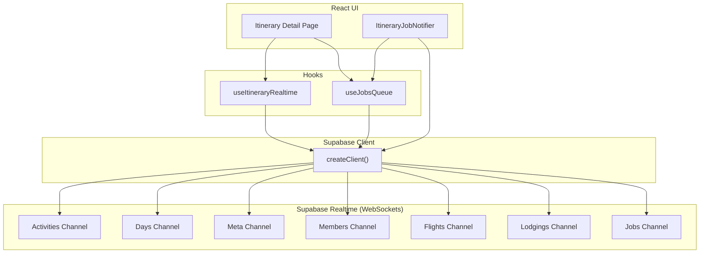
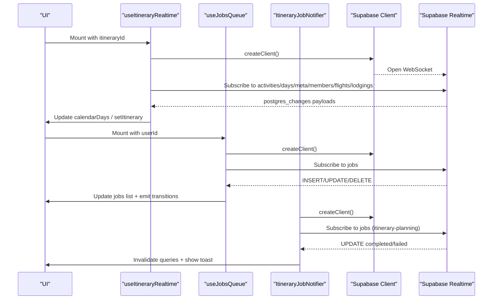
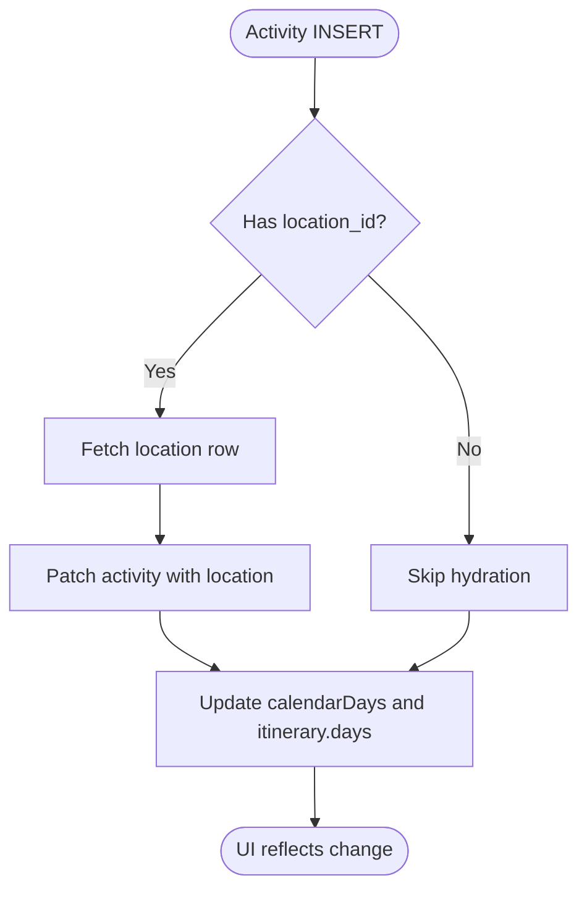
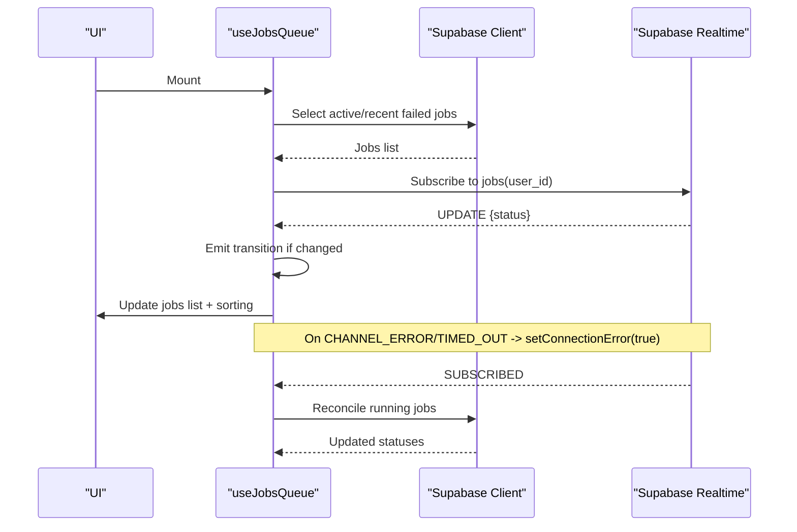
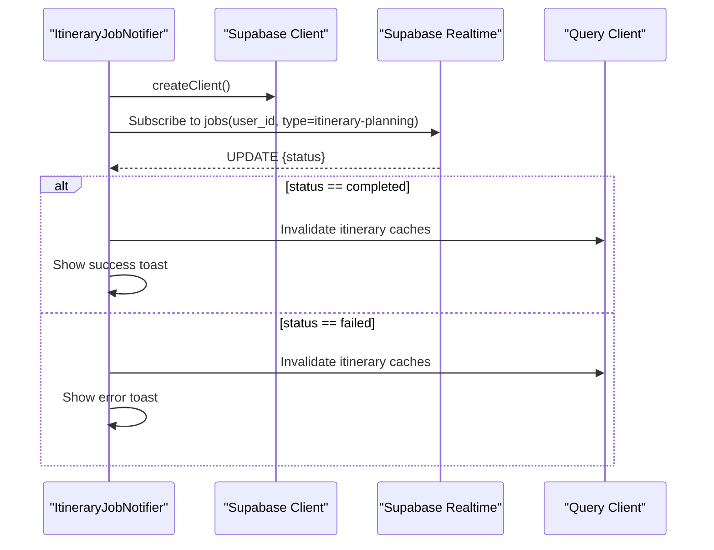
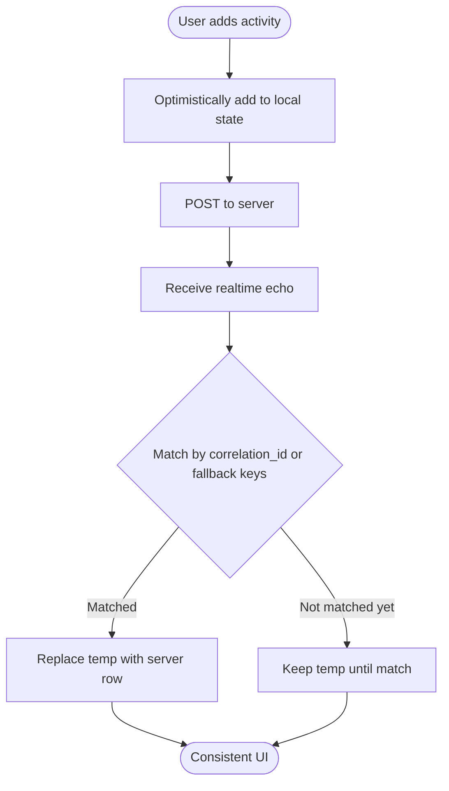
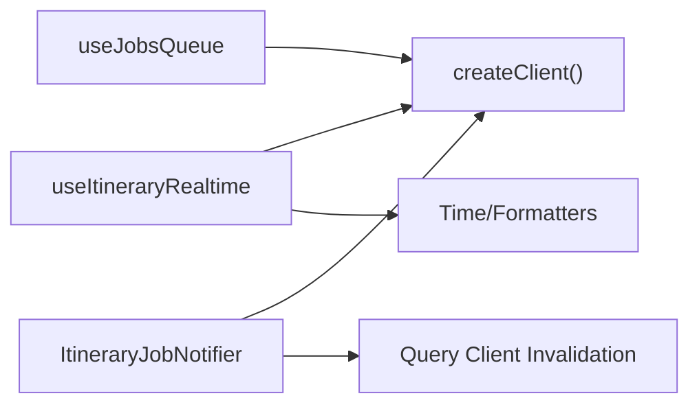

# Real-time State Synchronization

<cite>
**Referenced Files in This Document**
- [useItineraryRealtime.ts](file://src/hooks/useItineraryRealtime.ts)
- [useJobsQueue.ts](file://src/hooks/useJobsQueue.ts)
- [ItineraryJobNotifier.tsx](file://src/components/notifications/ItineraryJobNotifier.tsx)
- [client.ts](file://src/lib/supabase/client.ts)
- [page.tsx](file://src/app/itineraries/[id]/page.tsx)
- [personalization-pipeline.md](file://docs/personalization-pipeline.md)
</cite>

## Table of Contents
1. Introduction
2. Project Structure
3. Core Components
4. Architecture Overview
5. Detailed Component Analysis
6. Dependency Analysis
7. Performance Considerations
8. Troubleshooting Guide
9. Conclusion

## Introduction
This document explains how Argo synchronizes real-time state using Supabase subscriptions and WebSocket connections. It focuses on:
- The useItineraryRealtime hook for live collaboration across itinerary activities, days, flights, lodgings, and collaborators.
- Job queue notifications via useJobsQueue and ItineraryJobNotifier for background processing updates.
- Connection management, event handling, conflict resolution strategies, and performance considerations for high-frequency updates, offline support, and multi-user consistency.

## Project Structure
The real-time system is implemented primarily through React hooks that subscribe to Supabase Postgres change events over WebSockets. A small client wrapper creates the Supabase browser client used by all subscribers. Notifications are surfaced to users via a dedicated notifier component.

**Diagram sources**
- [useItineraryRealtime.ts:89-332](file://src/hooks/useItineraryRealtime.ts#L89-L332)
- [useJobsQueue.ts:167-260](file://src/hooks/useJobsQueue.ts#L167-L260)
- [ItineraryJobNotifier.tsx:45-85](file://src/components/notifications/ItineraryJobNotifier.tsx#L45-L85)
- [client.ts:3-8](file://src/lib/supabase/client.ts#L3-L8)

**Section sources**
- [client.ts:3-8](file://src/lib/supabase/client.ts#L3-L8)
- [useItineraryRealtime.ts:89-532](file://src/hooks/useItineraryRealtime.ts#L89-L532)
- [useJobsQueue.ts:78-267](file://src/hooks/useJobsQueue.ts#L78-L267)
- [ItineraryJobNotifier.tsx:18-88](file://src/components/notifications/ItineraryJobNotifier.tsx#L18-L88)

## Core Components
- useItineraryRealtime: Subscribes to multiple Postgres channels for activities, days, itinerary metadata, collaborators, flights, and lodgings. Updates both calendar view state and the main itinerary state to keep UI consistent.
- useJobsQueue: Subscribes to job status changes, reconciles missed updates after reconnect or visibility changes, and exposes helpers to optimistically update local state.
- ItineraryJobNotifier: Listens for completed or failed planning jobs and invalidates relevant caches while showing user-facing toasts.

Key responsibilities:
- Connection lifecycle: create channel per feature, subscribe, remove on unmount.
- Event handling: INSERT/UPDATE/DELETE mapped to local state updates with deduplication and ordering guarantees.
- Conflict resolution: optimistic merges, correlation IDs, and server-authoritative fields ensure consistency across clients.

**Section sources**
- [useItineraryRealtime.ts:16-532](file://src/hooks/useItineraryRealtime.ts#L16-L532)
- [useJobsQueue.ts:6-295](file://src/hooks/useJobsQueue.ts#L6-L295)
- [ItineraryJobNotifier.tsx:10-91](file://src/components/notifications/ItineraryJobNotifier.tsx#L10-L91)

## Architecture Overview
The architecture centers around Supabase Realtime channels over WebSockets. Each hook creates one or more channels scoped to an itinerary or user. Events from Postgres trigger local state updates. For long-running jobs, reconciliation ensures no missed transitions.

**Diagram sources**
- [useItineraryRealtime.ts:89-532](file://src/hooks/useItineraryRealtime.ts#L89-L532)
- [useJobsQueue.ts:167-260](file://src/hooks/useJobsQueue.ts#L167-L260)
- [ItineraryJobNotifier.tsx:45-85](file://src/components/notifications/ItineraryJobNotifier.tsx#L45-L85)
- [client.ts:3-8](file://src/lib/supabase/client.ts#L3-L8)

## Detailed Component Analysis

### useItineraryRealtime: Live Collaboration
Subscriptions:
- Activities: INSERT/UPDATE/DELETE on itinerary_activities filtered by itinerary_id. Updates both calendar view and itinerary model; hydrates location data when available.
- Days: INSERT/DELETE on itinerary_days to expand or shrink date ranges collaboratively.
- Meta: UPDATE on itineraries to reflect name/country/spot count changes.
- Members: INSERT/DELETE on user_itinerary to track collaborators joining/leaving.
- Flights/Lodgings: Conditional subscriptions only when sidebars are open to reduce overhead.

Conflict resolution highlights:
- Activity inserts include asynchronous hydration of location details to avoid missing thumbnails/addresses.
- Cross-day moves preserve array order semantics by updating position explicitly to prevent re-sorting conflicts.
- Deduplication checks prevent duplicate activities when echoes arrive.

Connection management:
- Channels are created per itineraryId and removed on cleanup.
- No explicit reconnection logic here; relies on Supabase client behavior.

Performance notes:
- Conditional subscriptions for flights and lodgings minimize unnecessary traffic.
- Efficient in-place updates for same-day activity changes to avoid map key churn.

**Diagram sources**
- [useItineraryRealtime.ts:40-168](file://src/hooks/useItineraryRealtime.ts#L40-L168)

**Section sources**
- [useItineraryRealtime.ts:40-532](file://src/hooks/useItineraryRealtime.ts#L40-L532)

### useJobsQueue: Job Queue Notifications
Responsibilities:
- Initial fetch of active and recent failed jobs.
- Realtime subscription to jobs table for the current user.
- Reconciliation after reconnect or tab visibility change to settle missed transitions.
- Optimistic upserts to immediately reflect retry or status changes before realtime arrives.

Event handling:
- INSERT: Add visible jobs (active or recent failures).
- UPDATE: Merge new fields, sort failed jobs to front, emit completion/failure/rejection callbacks.
- DELETE: Remove job from local list.

Connection management:
- Tracks connection errors and triggers reconcile on SUBSCRIBED to recover state.
- Uses unique instanceId to avoid channel dedup collisions when multiple instances exist.

Offline support:
- Visibilitychange listener triggers reconcile to catch missed updates.
- Reconcile reads running jobs directly from DB to ensure correctness.

**Diagram sources**
- [useJobsQueue.ts:138-260](file://src/hooks/useJobsQueue.ts#L138-L260)

**Section sources**
- [useJobsQueue.ts:78-295](file://src/hooks/useJobsQueue.ts#L78-L295)

### ItineraryJobNotifier: User-Facing Notifications
Responsibilities:
- Listen for completed or failed itinerary-planning jobs.
- Invalidate relevant query caches so UI refreshes accurately.
- Show success/error toasts with optional action links.

Connection management:
- Creates a dedicated channel scoped to user and instanceId to avoid dedup issues.
- Cleans up channel on unmount.

**Diagram sources**
- [ItineraryJobNotifier.tsx:45-85](file://src/components/notifications/ItineraryJobNotifier.tsx#L45-L85)

**Section sources**
- [ItineraryJobNotifier.tsx:18-88](file://src/components/notifications/ItineraryJobNotifier.tsx#L18-L88)

### Itinerary Page: Optimistic Updates and Server Resolution
The itinerary page implements optimistic merging for pending activities and resolves them against server rows using deterministic keys such as correlation_id, location_id, place_id, or name/time equality. This ensures UI responsiveness while maintaining consistency with the backend.

**Diagram sources**
- [page.tsx:133-154](file://src/app/itineraries/[id]/page.tsx#L133-L154)

**Section sources**
- [page.tsx:133-154](file://src/app/itineraries/[id]/page.tsx#L133-L154)

## Dependency Analysis
- All real-time components depend on the Supabase browser client factory to obtain authenticated clients and manage WebSocket channels.
- useItineraryRealtime depends on utility functions for time parsing and formatting to compute display times and maintain correct ordering.
- useJobsQueue and ItineraryJobNotifier coordinate with TanStack Query cache invalidation to keep other parts of the app consistent.

**Diagram sources**
- [useItineraryRealtime.ts:1-14](file://src/hooks/useItineraryRealtime.ts#L1-L14)
- [useJobsQueue.ts:1-5](file://src/hooks/useJobsQueue.ts#L1-L5)
- [ItineraryJobNotifier.tsx:1-8](file://src/components/notifications/ItineraryJobNotifier.tsx#L1-L8)
- [client.ts:3-8](file://src/lib/supabase/client.ts#L3-L8)

**Section sources**
- [useItineraryRealtime.ts:1-14](file://src/hooks/useItineraryRealtime.ts#L1-L14)
- [useJobsQueue.ts:1-5](file://src/hooks/useJobsQueue.ts#L1-L5)
- [ItineraryJobNotifier.tsx:1-8](file://src/components/notifications/ItineraryJobNotifier.tsx#L1-L8)
- [client.ts:3-8](file://src/lib/supabase/client.ts#L3-L8)

## Performance Considerations
- High-frequency updates:
  - Use conditional subscriptions for features not currently visible (e.g., flights/lodgings sidebars) to reduce message volume.
  - Prefer in-place updates for same-day activity changes to avoid unnecessary re-renders.
  - Maintain stable identifiers and rely on id-based mapping to minimize diff work.
- Offline support:
  - Reconcile running jobs on reconnect or visibility change to ensure no missed transitions.
  - Use optimistic UI with deterministic matching keys to handle temporary disconnects gracefully.
- Multi-user consistency:
  - Rely on server-authoritative fields (e.g., position, correlation_id) to resolve conflicts during collaborative edits.
  - Avoid relying solely on array placement for ordering; use explicit ordinal fields where applicable.
- Migration note:
  - Documentation indicates plans to replace some realtime consumers with polling or simplified flows for v1 to reduce complexity.

[No sources needed since this section provides general guidance]

## Troubleshooting Guide
Common issues and remedies:
- Channel deduplication errors:
  - Symptom: Multiple mounts with the same userId throw when adding handlers to an already-subscribed channel.
  - Fix: Use a unique instance suffix derived from useId to make each channel topic distinct.
- Missed updates after reconnect:
  - Symptom: Jobs stuck mid-progress or stale lists after brief disconnections.
  - Fix: Trigger reconciliation on SUBSCRIBED or visibility change to read authoritative state from the database.
- Missing location data on activity inserts:
  - Symptom: New activities render without thumbnail/address initially.
  - Fix: Asynchronously hydrate location details and patch the activity once available; failures are best-effort and do not block UI.
- Excessive updates:
  - Symptom: UI jank due to frequent updates.
  - Fix: Ensure filters are applied at the channel level and only subscribe to necessary tables/columns; leverage conditional subscriptions for non-visible sections.

**Section sources**
- [useJobsQueue.ts:70-76](file://src/hooks/useJobsQueue.ts#L70-L76)
- [useJobsQueue.ts:161-165](file://src/hooks/useJobsQueue.ts#L161-L165)
- [useJobsQueue.ts:250-260](file://src/hooks/useJobsQueue.ts#L250-L260)
- [useItineraryRealtime.ts:44-87](file://src/hooks/useItineraryRealtime.ts#L44-L87)
- [ItineraryJobNotifier.tsx:13-16](file://src/components/notifications/ItineraryJobNotifier.tsx#L13-L16)

## Conclusion
Argo’s real-time synchronization leverages Supabase Realtime channels to deliver live collaboration and job notifications with robust connection management and conflict resolution. The useItineraryRealtime hook enables multi-user editing of itineraries, while useJobsQueue and ItineraryJobNotifier provide reliable feedback for background tasks. By combining optimistic UI, deterministic matching keys, and reconciliation strategies, the system maintains consistency and responsiveness even under high-frequency updates and intermittent connectivity. Future iterations may simplify certain realtime consumers to balance complexity and performance.