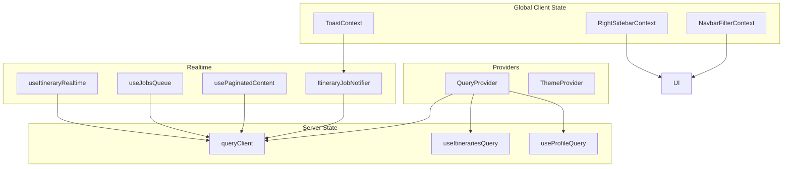
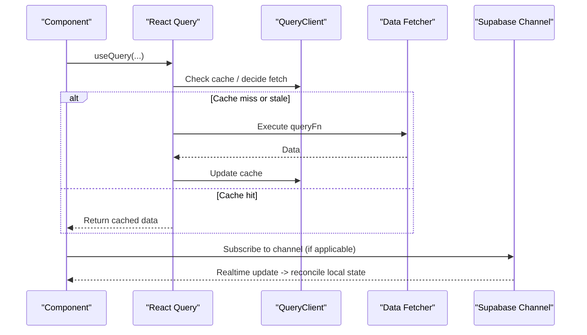
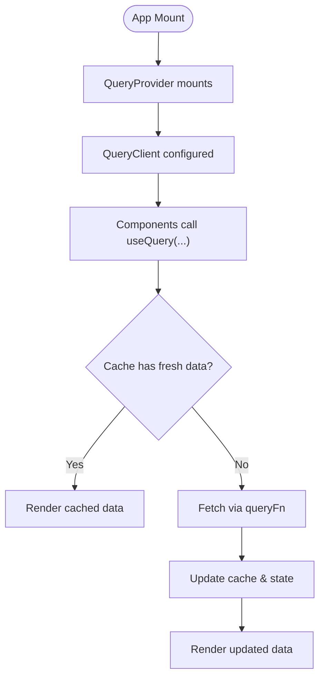
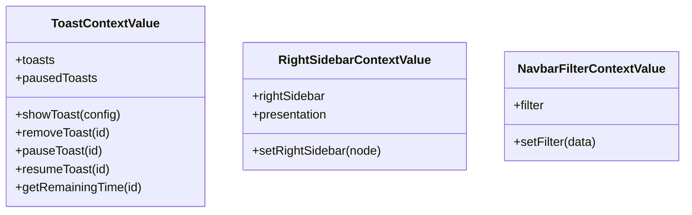
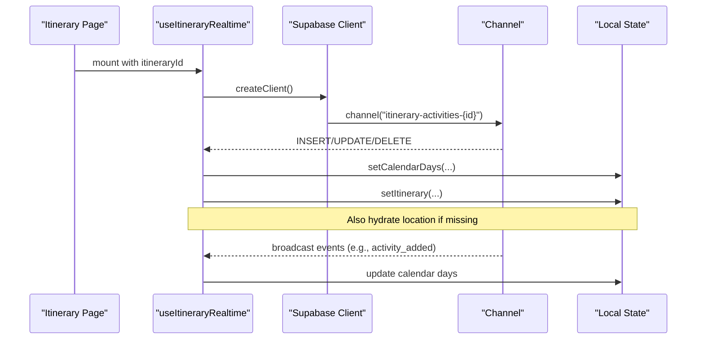
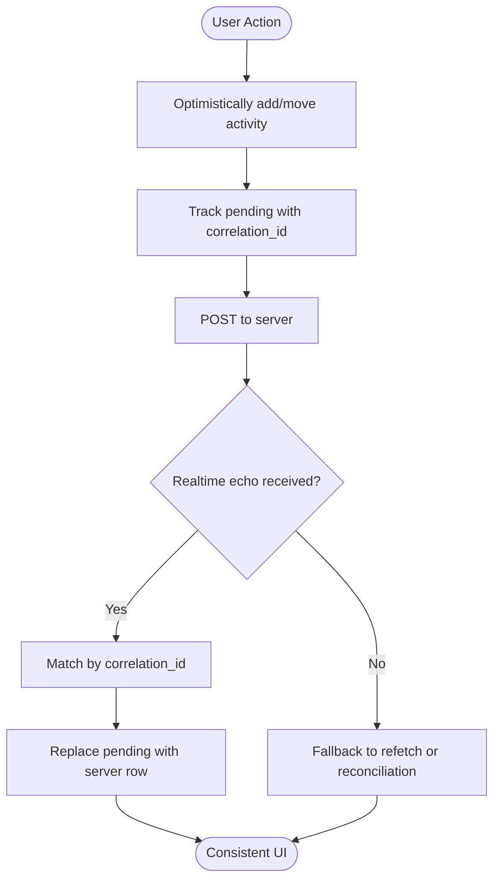
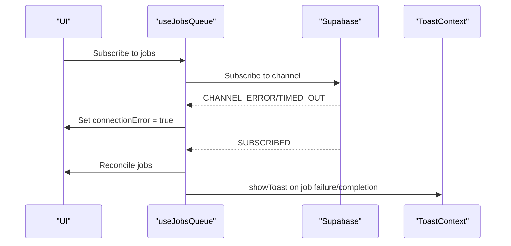
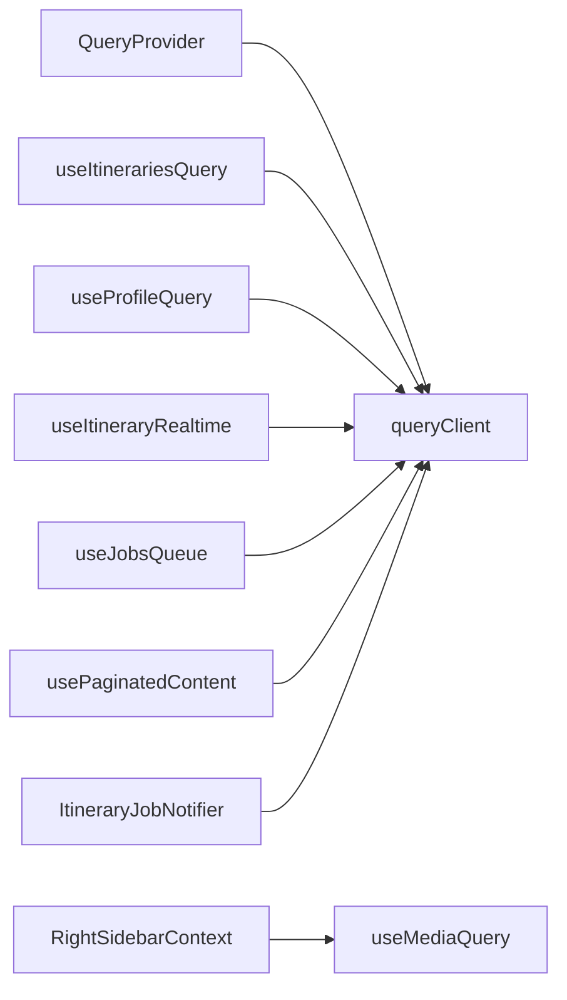

# State Management

<cite>
**Referenced Files in This Document**
- [QueryProvider.tsx](file://src/components/QueryProvider.tsx)
- [queryClient.ts](file://src/lib/query/queryClient.ts)
- [useItinerariesQuery.ts](file://src/hooks/queries/useItinerariesQuery.ts)
- [useProfileQuery.ts](file://src/hooks/queries/useProfileQuery.ts)
- [ToastContext.tsx](file://src/contexts/ToastContext.tsx)
- [RightSidebarContext.tsx](file://src/contexts/RightSidebarContext.tsx)
- [NavbarFilterContext.tsx](file://src/contexts/NavbarFilterContext.tsx)
- [useItineraryRealtime.ts](file://src/hooks/useItineraryRealtime.ts)
- [useJobsQueue.ts](file://src/hooks/useJobsQueue.ts)
- [usePaginatedContent.ts](file://src/hooks/usePaginatedContent.ts)
- [ItineraryJobNotifier.tsx](file://src/components/notifications/ItineraryJobNotifier.tsx)
- [page.tsx](file://src/app/itineraries/[id]/page.tsx)
</cite>

## Table of Contents
1. Introduction
2. Project Structure
3. Core Components
4. Architecture Overview
5. Detailed Component Analysis
6. Dependency Analysis
7. Performance Considerations
8. Troubleshooting Guide
9. Conclusion

## Introduction
This document explains Argo’s state management architecture, focusing on a multi-layered approach that combines:
- Server state with React Query (TanStack Query) for caching and background updates
- Global client state via React Context for UI-wide concerns like toasts and sidebars
- Local component state for transient UI interactions
- Custom hooks that encapsulate business logic, data fetching, and real-time synchronization
- Real-time collaboration using Supabase Postgres changes and broadcast channels
- Caching strategies, error handling patterns, optimistic updates, and performance optimizations

The goal is to provide both a conceptual overview and code-level guidance for implementing new stateful features, managing complex data relationships, and optimizing re-renders.

## Project Structure
Argo organizes state-related code into clear layers:
- Providers at the app root configure global services (React Query client, theme)
- Contexts expose global client state (toasts, sidebar visibility, filters)
- Hooks under src/hooks implement reusable logic:
  - queries/: React Query hooks for server state
  - Realtime hooks for live updates (e.g., itinerary activities, jobs queue)
  - Utility hooks for pagination, media queries, animations, etc.
- Pages and components consume providers, contexts, and hooks to render UI

**Diagram sources**
- [QueryProvider.tsx:7-12](file://src/components/QueryProvider.tsx#L7-L12)
- [queryClient.ts:3-12](file://src/lib/query/queryClient.ts#L3-L12)
- [useItinerariesQuery.ts:10-16](file://src/hooks/queries/useItinerariesQuery.ts#L10-L16)
- [useProfileQuery.ts:8-19](file://src/hooks/queries/useProfileQuery.ts#L8-L19)
- [useItineraryRealtime.ts:27-36](file://src/hooks/useItineraryRealtime.ts#L27-L36)
- [useJobsQueue.ts:45-76](file://src/hooks/useJobsQueue.ts#L45-L76)
- [usePaginatedContent.ts:131-139](file://src/hooks/usePaginatedContent.ts#L131-L139)
- [ItineraryJobNotifier.tsx:10-17](file://src/components/notifications/ItineraryJobNotifier.tsx#L10-L17)

**Section sources**
- [QueryProvider.tsx:7-12](file://src/components/QueryProvider.tsx#L7-L12)
- [queryClient.ts:3-12](file://src/lib/query/queryClient.ts#L3-L12)

## Core Components
- React Query integration:
  - A single QueryClient instance configures default caching behavior (staleTime, gcTime, retry, refetchOnWindowFocus).
  - QueryProvider wraps the app to supply the client globally.
- Global client state:
  - ToastContext manages notification lifecycle (show, pause, resume, remove) with timers and remaining time tracking.
  - RightSidebarContext controls a responsive right-side panel (inline vs overlay) based on breakpoints.
  - NavbarFilterContext holds current filter selection across navigation.
- Custom hooks:
  - Server state hooks wrap useQuery with typed query keys and functions.
  - Realtime hooks subscribe to Supabase channels and reconcile local state with server echoes.
  - Pagination hook merges realtime updates with paginated fetches while deduplicating items.

**Section sources**
- [queryClient.ts:3-12](file://src/lib/query/queryClient.ts#L3-L12)
- [QueryProvider.tsx:7-12](file://src/components/QueryProvider.tsx#L7-L12)
- [ToastContext.tsx:42-147](file://src/contexts/ToastContext.tsx#L42-L147)
- [RightSidebarContext.tsx:34-46](file://src/contexts/RightSidebarContext.tsx#L34-L46)
- [NavbarFilterContext.tsx:35-43](file://src/contexts/NavbarFilterContext.tsx#L35-L43)
- [useItinerariesQuery.ts:10-16](file://src/hooks/queries/useItinerariesQuery.ts#L10-L16)
- [useProfileQuery.ts:8-19](file://src/hooks/queries/useProfileQuery.ts#L8-L19)

## Architecture Overview
Argo uses a layered state model:
- Server state: React Query caches responses, handles retries, and provides stale-while-revalidate semantics.
- Global client state: Contexts expose UI-wide state without prop drilling.
- Local state: Components manage ephemeral UI state (modals, form inputs, drag states).
- Realtime: Supabase channels keep multiple clients synchronized; hooks reconcile local state with server echoes and handle reconnects.

**Diagram sources**
- [useItinerariesQuery.ts:10-16](file://src/hooks/queries/useItinerariesQuery.ts#L10-L16)
- [useProfileQuery.ts:8-19](file://src/hooks/queries/useProfileQuery.ts#L8-L19)
- [useItineraryRealtime.ts:89-333](file://src/hooks/useItineraryRealtime.ts#L89-L333)
- [useJobsQueue.ts:167-267](file://src/hooks/useJobsQueue.ts#L167-L267)

## Detailed Component Analysis

### React Query Integration
- QueryClient configuration sets sensible defaults for caching and network behavior.
- QueryProvider injects the client into the component tree.
- Typed hooks encapsulate query keys and fetch functions, enabling consistent caching and invalidation.

**Diagram sources**
- [QueryProvider.tsx:7-12](file://src/components/QueryProvider.tsx#L7-L12)
- [queryClient.ts:3-12](file://src/lib/query/queryClient.ts#L3-L12)
- [useItinerariesQuery.ts:10-16](file://src/hooks/queries/useItinerariesQuery.ts#L10-L16)
- [useProfileQuery.ts:8-19](file://src/hooks/queries/useProfileQuery.ts#L8-L19)

**Section sources**
- [queryClient.ts:3-12](file://src/lib/query/queryClient.ts#L3-L12)
- [QueryProvider.tsx:7-12](file://src/components/QueryProvider.tsx#L7-L12)
- [useItinerariesQuery.ts:10-16](file://src/hooks/queries/useItinerariesQuery.ts#L10-L16)
- [useProfileQuery.ts:8-19](file://src/hooks/queries/useProfileQuery.ts#L8-L19)

### Global Client State with Context
- ToastContext:
  - Manages a list of toasts with unique IDs, durations, pause/resume, and cleanup on unmount.
  - Provides helpers to compute remaining time and control toast lifecycle.
- RightSidebarContext:
  - Holds the current sidebar content and presentation mode (inline vs overlay), adapting to viewport size.
- NavbarFilterContext:
  - Stores the active filter type and metadata for UI consistency across navigation.

**Diagram sources**
- [ToastContext.tsx:28-36](file://src/contexts/ToastContext.tsx#L28-L36)
- [RightSidebarContext.tsx:6-11](file://src/contexts/RightSidebarContext.tsx#L6-L11)
- [NavbarFilterContext.tsx:15-18](file://src/contexts/NavbarFilterContext.tsx#L15-L18)

**Section sources**
- [ToastContext.tsx:42-147](file://src/contexts/ToastContext.tsx#L42-L147)
- [RightSidebarContext.tsx:34-46](file://src/contexts/RightSidebarContext.tsx#L34-L46)
- [NavbarFilterContext.tsx:35-43](file://src/contexts/NavbarFilterContext.tsx#L35-L43)

### Realtime Synchronization with Supabase
- Itinerary Realtime:
  - Subscribes to Postgres changes for activities, days, itineraries, collaborators, flights, and lodgings.
  - Mirrors updates into both calendar view state and itinerary detail state to keep different views consistent.
  - Hydrates activity locations asynchronously when needed after inserts.
- Jobs Queue:
  - Subscribes to job status changes, reconciles missed updates on reconnect or visibility change, and emits terminal callbacks for completed/failed/rejected jobs.
  - Maintains per-instance channels to avoid conflicts when multiple instances exist.
- Paginated Content:
  - Combines initial fetches with realtime updates, deduplicating items to prevent duplicates during load-more operations.

**Diagram sources**
- [useItineraryRealtime.ts:89-333](file://src/hooks/useItineraryRealtime.ts#L89-L333)
- [useItineraryRealtime.ts:335-386](file://src/hooks/useItineraryRealtime.ts#L335-L386)
- [useItineraryRealtime.ts:388-440](file://src/hooks/useItineraryRealtime.ts#L388-L440)
- [useItineraryRealtime.ts:442-530](file://src/hooks/useItineraryRealtime.ts#L442-L530)

**Section sources**
- [useItineraryRealtime.ts:27-36](file://src/hooks/useItineraryRealtime.ts#L27-L36)
- [useJobsQueue.ts:45-76](file://src/hooks/useJobsQueue.ts#L45-L76)
- [useJobsQueue.ts:167-267](file://src/hooks/useJobsQueue.ts#L167-L267)
- [usePaginatedContent.ts:181-220](file://src/hooks/usePaginatedContent.ts#L181-L220)

### Optimistic Updates and Conflict Resolution
- The itinerary page implements optimistic updates for adding and moving activities:
  - Immediately applies provisional changes locally.
  - Uses correlation identifiers to match server echoes and replace pending entries deterministically.
  - Clears stale legs and recomputes times via cascade logic to maintain consistency.

**Diagram sources**
- [page.tsx:133-154](file://src/app/itineraries/[id]/page.tsx#L133-L154)
- [page.tsx:2074-2092](file://src/app/itineraries/[id]/page.tsx#L2074-L2092)

**Section sources**
- [page.tsx:133-154](file://src/app/itineraries/[id]/page.tsx#L133-L154)
- [page.tsx:2074-2092](file://src/app/itineraries/[id]/page.tsx#L2074-L2092)

### Error Handling Patterns
- Toast notifications are used to inform users of job outcomes and errors.
- Realtime hooks track connection status and reconcile state on reconnect or visibility changes to avoid stuck states.
- Job queue exposes connectionError flags and terminal callbacks for failed/rejected jobs.

**Diagram sources**
- [useJobsQueue.ts:244-272](file://src/hooks/useJobsQueue.ts#L244-L272)
- [ItineraryJobNotifier.tsx:10-17](file://src/components/notifications/ItineraryJobNotifier.tsx#L10-L17)
- [ToastContext.tsx:90-98](file://src/contexts/ToastContext.tsx#L90-L98)

**Section sources**
- [useJobsQueue.ts:244-272](file://src/hooks/useJobsQueue.ts#L244-L272)
- [ItineraryJobNotifier.tsx:10-17](file://src/components/notifications/ItineraryJobNotifier.tsx#L10-L17)
- [ToastContext.tsx:90-98](file://src/contexts/ToastContext.tsx#L90-L98)

## Dependency Analysis
- Providers depend on external libraries (React Query, next-themes).
- Hooks depend on:
  - React Query for server state
  - Supabase client for realtime subscriptions
  - Utilities for formatting and domain-specific transformations
- Contexts depend on hooks for responsive behavior (e.g., breakpoint detection).

**Diagram sources**
- [QueryProvider.tsx:7-12](file://src/components/QueryProvider.tsx#L7-L12)
- [queryClient.ts:3-12](file://src/lib/query/queryClient.ts#L3-L12)
- [useItinerariesQuery.ts:10-16](file://src/hooks/queries/useItinerariesQuery.ts#L10-L16)
- [useProfileQuery.ts:8-19](file://src/hooks/queries/useProfileQuery.ts#L8-L19)
- [useItineraryRealtime.ts:27-36](file://src/hooks/useItineraryRealtime.ts#L27-L36)
- [useJobsQueue.ts:45-76](file://src/hooks/useJobsQueue.ts#L45-L76)
- [usePaginatedContent.ts:131-139](file://src/hooks/usePaginatedContent.ts#L131-L139)
- [RightSidebarContext.tsx:34-46](file://src/contexts/RightSidebarContext.tsx#L34-L46)

**Section sources**
- [queryClient.ts:3-12](file://src/lib/query/queryClient.ts#L3-L12)
- [useItineraryRealtime.ts:27-36](file://src/hooks/useItineraryRealtime.ts#L27-L36)
- [useJobsQueue.ts:45-76](file://src/hooks/useJobsQueue.ts#L45-L76)
- [usePaginatedContent.ts:131-139](file://src/hooks/usePaginatedContent.ts#L131-L139)

## Performance Considerations
- Caching strategy:
  - React Query default options balance freshness and memory usage; tune staleTime/gcTime per feature needs.
  - Profile queries may use infinite TTL where appropriate to avoid unnecessary refetches.
- Realtime efficiency:
  - Use specific table filters and narrow projections to reduce payload sizes.
  - Deduplicate incoming items during load-more to prevent duplicate renders.
  - Reconcile state on reconnect or visibility change to avoid drift.
- Re-render optimization:
  - Prefer stable references (useCallback/useMemo) for handlers and derived values.
  - Keep context state minimal; split large contexts into focused ones (e.g., separate toasts from sidebar).
  - Avoid deep object mutations; use immutable updates to minimize subtree re-renders.
- Memory management:
  - Clean up timers and channels in effect teardowns.
  - Track mounted state to prevent setState after unmount.
  - Limit concurrent subscriptions; reuse channels where possible.

[No sources needed since this section provides general guidance]

## Troubleshooting Guide
- Realtime issues:
  - If a tab goes background or loses connectivity, rely on reconciliation to catch up missed updates.
  - Watch for CHANNEL_ERROR/TIMED_OUT statuses and trigger refetches or user feedback.
- Duplicate items:
  - Ensure deduplication logic runs before appending new pages.
  - Verify that realtime updates do not insert duplicates already present in local state.
- Stale UI:
  - Confirm that optimistic updates include correlation identifiers to match server echoes.
  - Validate that cascading time computations clear stale legs and recompute dependencies.
- Debugging tips:
  - Log channel subscription statuses and payloads during development.
  - Inspect React Query cache keys and stale times to ensure correct invalidation.
  - Use toast notifications to surface job failures and connection errors to users.

**Section sources**
- [useJobsQueue.ts:244-272](file://src/hooks/useJobsQueue.ts#L244-L272)
- [usePaginatedContent.ts:181-220](file://src/hooks/usePaginatedContent.ts#L181-L220)
- [page.tsx:133-154](file://src/app/itineraries/[id]/page.tsx#L133-L154)

## Conclusion
Argo’s state management combines React Query for robust server state, Contexts for global client concerns, and custom hooks for real-time collaboration and complex workflows. By leveraging optimistic updates, careful caching, and disciplined cleanup, the application maintains responsiveness and consistency across collaborative scenarios. Following these patterns will help you implement new features efficiently, manage intricate data relationships, and optimize performance while keeping debugging straightforward.

[No sources needed since this section summarizes without analyzing specific files]