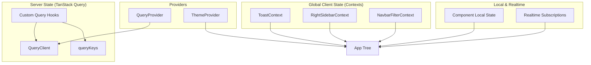
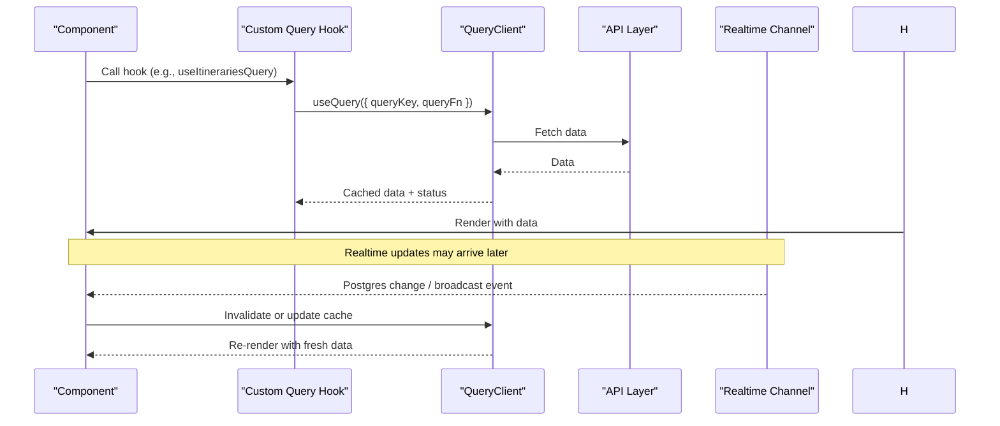
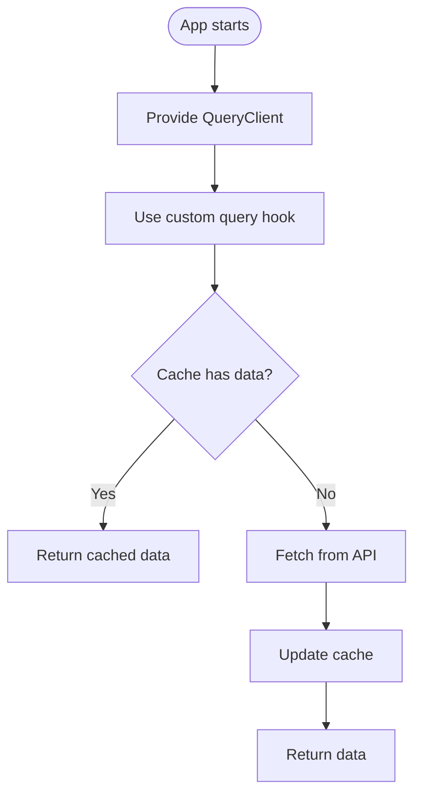
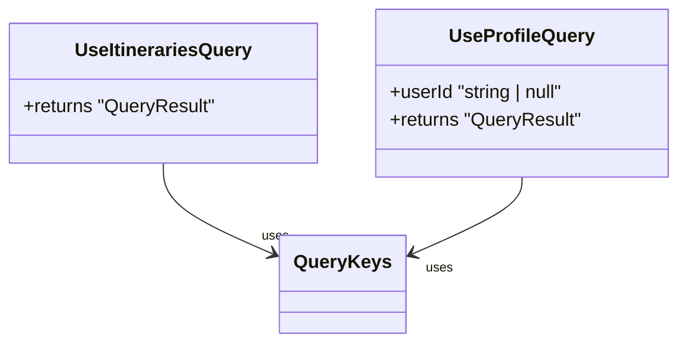
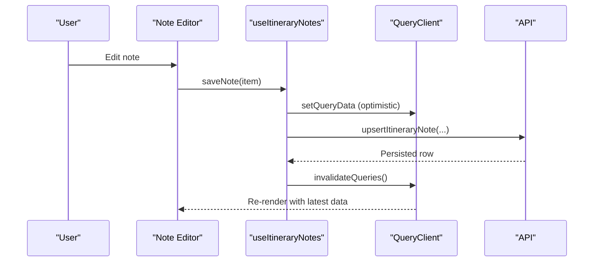
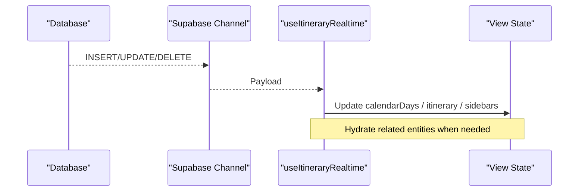
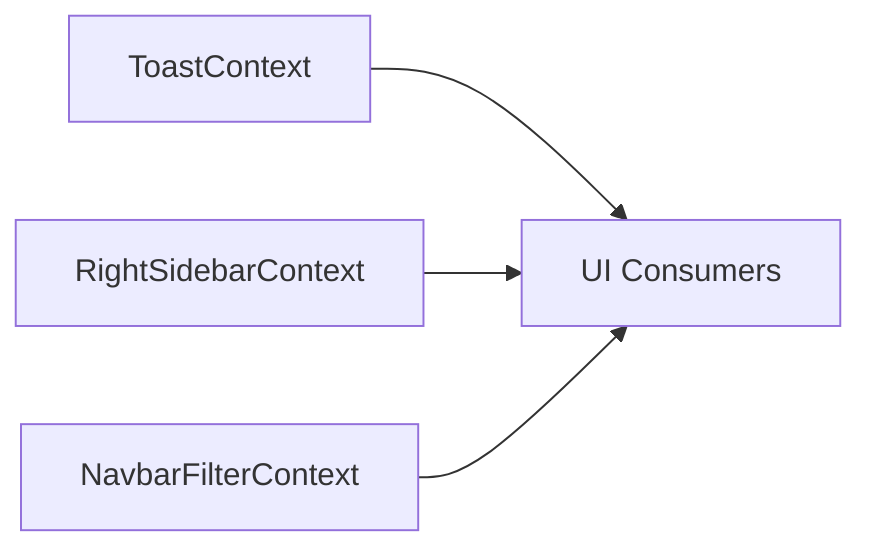
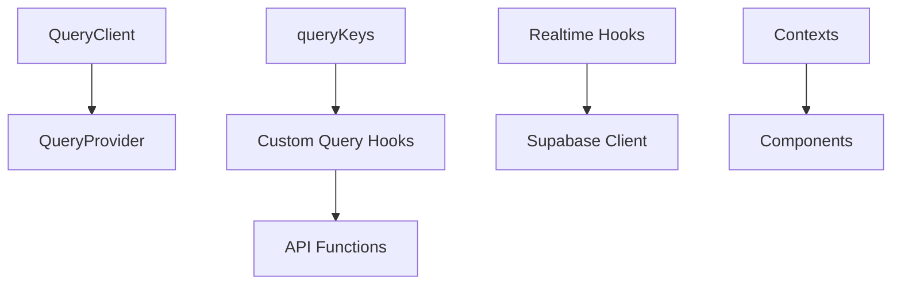

# State Management

<cite>
**Referenced Files in This Document**
- [QueryProvider.tsx](file://src/components/QueryProvider.tsx)
- [queryClient.ts](file://src/lib/query/queryClient.ts)
- [queryKeys.ts](file://src/lib/query/queryKeys.ts)
- [useItinerariesQuery.ts](file://src/hooks/queries/useItinerariesQuery.ts)
- [useProfileQuery.ts](file://src/hooks/queries/useProfileQuery.ts)
- [useItineraryNotes.ts](file://src/hooks/useItineraryNotes.ts)
- [useJobsQueue.ts](file://src/hooks/useJobsQueue.ts)
- [useItineraryRealtime.ts](file://src/hooks/useItineraryRealtime.ts)
- [useSessionUserId.ts](file://src/hooks/useSessionUserId.ts)
- [ToastContext.tsx](file://src/contexts/ToastContext.tsx)
- [RightSidebarContext.tsx](file://src/contexts/RightSidebarContext.tsx)
- [NavbarFilterContext.tsx](file://src/contexts/NavbarFilterContext.tsx)
</cite>

## Table of Contents
1. Introduction
2. Project Structure
3. Core Components
4. Architecture Overview
5. Detailed Component Analysis
6. Dependency Analysis
7. Performance Considerations
8. Troubleshooting Guide
9. Conclusion

## Introduction
This document explains the application’s hybrid state management strategy:
- Server state is managed with TanStack Query for caching, background updates, and optimistic UI.
- Global client state uses React Context for cross-cutting concerns (toasts, navigation filters, sidebar presentation).
- Local component state handles ephemeral UI concerns within components.

The approach emphasizes predictable data flows, minimal re-renders, and resilient real-time synchronization via Supabase channels. It also covers custom hooks architecture, query key design, form state patterns, optimistic updates, error handling strategies, performance techniques, and debugging approaches.

## Project Structure
State-related code is organized into clear layers:
- Providers at the app root wrap the tree with global services (TanStack Query client, theme, contexts).
- Custom hooks encapsulate server interactions, real-time subscriptions, and complex client logic.
- Contexts provide lightweight global state for UI orchestration.
- Query keys centralize cache key definitions to ensure consistency across reads and writes.

**Diagram sources**
- [QueryProvider.tsx:7-13](file://src/components/QueryProvider.tsx#L7-L13)
- [queryClient.ts:3-12](file://src/lib/query/queryClient.ts#L3-L12)
- [queryKeys.ts:1-42](file://src/lib/query/queryKeys.ts#L1-L42)
- [ToastContext.tsx:42-147](file://src/contexts/ToastContext.tsx#L42-L147)
- [RightSidebarContext.tsx:34-46](file://src/contexts/RightSidebarContext.tsx#L34-L46)
- [NavbarFilterContext.tsx:35-43](file://src/contexts/NavbarFilterContext.tsx#L35-L43)

**Section sources**
- [QueryProvider.tsx:7-13](file://src/components/QueryProvider.tsx#L7-L13)
- [queryClient.ts:3-12](file://src/lib/query/queryClient.ts#L3-L12)
- [queryKeys.ts:1-42](file://src/lib/query/queryKeys.ts#L1-L42)
- [ToastContext.tsx:42-147](file://src/contexts/ToastContext.tsx#L42-L147)
- [RightSidebarContext.tsx:34-46](file://src/contexts/RightSidebarContext.tsx#L34-L46)
- [NavbarFilterContext.tsx:35-43](file://src/contexts/NavbarFilterContext.tsx#L35-L43)

## Core Components
- TanStack Query setup: A single QueryClient instance configures default behaviors such as stale time, garbage collection time, retry policy, and refetch behavior. The provider injects this client into the React tree.
- Centralized query keys: A typed key factory ensures consistent cache keys across queries and mutations, enabling precise invalidation and updates.
- Custom query hooks: Thin wrappers around useQuery that encapsulate fetching logic, enable/disable conditions, and per-query tuning like staleTime or gcTime.
- Global client state via Context: Lightweight providers manage transient UI state (e.g., toast notifications, right sidebar content/presentation, navbar filter selection).
- Realtime synchronization: Custom hooks subscribe to database changes and broadcast events to keep multiple views in sync without polling.
- Job queue management: A dedicated hook manages long-running jobs with optimistic merges, reconciliation on reconnect, and visibility-based recovery.

**Section sources**
- [queryClient.ts:3-12](file://src/lib/query/queryClient.ts#L3-L12)
- [queryKeys.ts:1-42](file://src/lib/query/queryKeys.ts#L1-L42)
- [useItinerariesQuery.ts:10-16](file://src/hooks/queries/useItinerariesQuery.ts#L10-L16)
- [useProfileQuery.ts:8-19](file://src/hooks/queries/useProfileQuery.ts#L8-L19)
- [ToastContext.tsx:42-147](file://src/contexts/ToastContext.tsx#L42-L147)
- [RightSidebarContext.tsx:34-46](file://src/contexts/RightSidebarContext.tsx#L34-L46)
- [NavbarFilterContext.tsx:35-43](file://src/contexts/NavbarFilterContext.tsx#L35-L43)
- [useJobsQueue.ts:45-295](file://src/hooks/useJobsQueue.ts#L45-L295)
- [useItineraryRealtime.ts:27-533](file://src/hooks/useItineraryRealtime.ts#L27-L533)

## Architecture Overview
The system separates concerns by state type:
- Server state: TanStack Query owns caching, deduplication, background refetching, and optimistic updates.
- Global client state: Contexts expose small slices of UI state consumed across the tree.
- Local state: Components manage ephemeral UI state (e.g., open modals, temporary inputs).
- Realtime: Supabase channels push updates directly to local state or invalidate queries to reflect changes.

**Diagram sources**
- [useItinerariesQuery.ts:10-16](file://src/hooks/queries/useItinerariesQuery.ts#L10-L16)
- [queryClient.ts:3-12](file://src/lib/query/queryClient.ts#L3-L12)
- [useItineraryRealtime.ts:89-333](file://src/hooks/useItineraryRealtime.ts#L89-L333)

## Detailed Component Analysis

### TanStack Query Integration
- Provider: Wraps the app with a configured QueryClient to enable caching and background updates globally.
- Defaults: Stale time, garbage collection time, retry count, and focus refetch behavior are set centrally to reduce network churn and improve perceived performance.
- Key strategy: All query keys are centralized to avoid drift between reads and invalidations.

**Diagram sources**
- [QueryProvider.tsx:7-13](file://src/components/QueryProvider.tsx#L7-L13)
- [queryClient.ts:3-12](file://src/lib/query/queryClient.ts#L3-L12)
- [useItinerariesQuery.ts:10-16](file://src/hooks/queries/useItinerariesQuery.ts#L10-L16)

**Section sources**
- [QueryProvider.tsx:7-13](file://src/components/QueryProvider.tsx#L7-L13)
- [queryClient.ts:3-12](file://src/lib/query/queryClient.ts#L3-L12)
- [queryKeys.ts:1-42](file://src/lib/query/queryKeys.ts#L1-L42)
- [useItinerariesQuery.ts:10-16](file://src/hooks/queries/useItinerariesQuery.ts#L10-L16)
- [useProfileQuery.ts:8-19](file://src/hooks/queries/useProfileQuery.ts#L8-L19)

### Custom Query Hooks
- List itineraries: Encapsulates fetching with a stable query key and tuned staleness for better UX.
- Profile query: Conditionally enabled based on user id; uses infinite staleness/gcTime for persistent profile data.

**Diagram sources**
- [useItinerariesQuery.ts:10-16](file://src/hooks/queries/useItinerariesQuery.ts#L10-L16)
- [useProfileQuery.ts:8-19](file://src/hooks/queries/useProfileQuery.ts#L8-L19)
- [queryKeys.ts:1-42](file://src/lib/query/queryKeys.ts#L1-L42)

**Section sources**
- [useItinerariesQuery.ts:10-16](file://src/hooks/queries/useItinerariesQuery.ts#L10-L16)
- [useProfileQuery.ts:8-19](file://src/hooks/queries/useProfileQuery.ts#L8-L19)

### Form State and Optimistic Updates (Itinerary Notes)
- Reads notes via a query keyed by itinerary id.
- Mutations optimistically update the cache before server confirmation, then invalidate to reconcile.
- Converts between editor-friendly content format and server schema at the boundary.

**Diagram sources**
- [useItineraryNotes.ts:39-134](file://src/hooks/useItineraryNotes.ts#L39-L134)

**Section sources**
- [useItineraryNotes.ts:39-134](file://src/hooks/useItineraryNotes.ts#L39-L134)

### Real-Time Subscriptions and Synchronization
- Itinerary realtime: Subscribes to Postgres changes for activities, days, metadata, collaborators, flights, and lodgings. Mirrors updates into both calendar and view-mode states to keep all surfaces consistent.
- Jobs queue: Subscribes to job changes, reconciles missed updates on reconnect or visibility change, and supports optimistic merges for immediate feedback.

**Diagram sources**
- [useItineraryRealtime.ts:89-333](file://src/hooks/useItineraryRealtime.ts#L89-L333)
- [useItineraryRealtime.ts:335-440](file://src/hooks/useItineraryRealtime.ts#L335-L440)
- [useItineraryRealtime.ts:442-530](file://src/hooks/useItineraryRealtime.ts#L442-L530)

**Section sources**
- [useItineraryRealtime.ts:27-533](file://src/hooks/useItineraryRealtime.ts#L27-L533)
- [useJobsQueue.ts:78-267](file://src/hooks/useJobsQueue.ts#L78-L267)

### Global Client State with Contexts
- Toast context: Manages lifecycle of notifications with pause/resume, duration tracking, and cleanup.
- Right sidebar context: Controls dynamic sidebar content and responsive presentation mode.
- Navbar filter context: Holds current filter selection used across navigation components.

**Diagram sources**
- [ToastContext.tsx:42-147](file://src/contexts/ToastContext.tsx#L42-L147)
- [RightSidebarContext.tsx:34-46](file://src/contexts/RightSidebarContext.tsx#L34-L46)
- [NavbarFilterContext.tsx:35-43](file://src/contexts/NavbarFilterContext.tsx#L35-L43)

**Section sources**
- [ToastContext.tsx:42-147](file://src/contexts/ToastContext.tsx#L42-L147)
- [RightSidebarContext.tsx:34-46](file://src/contexts/RightSidebarContext.tsx#L34-L46)
- [NavbarFilterContext.tsx:35-43](file://src/contexts/NavbarFilterContext.tsx#L35-L43)

### Session User Resolution
- Resolves the authenticated user id once at mount, returning null until available. Used to gate queries and realtime subscriptions.

**Section sources**
- [useSessionUserId.ts:8-19](file://src/hooks/useSessionUserId.ts#L8-L19)

## Dependency Analysis
- QueryClient depends on TanStack Query and is provided once at the app root.
- Custom query hooks depend on centralized query keys and API functions.
- Realtime hooks depend on Supabase client and maintain independent channels per feature area.
- Contexts are independent and composable; they do not depend on server state but can be combined with query results in components.

**Diagram sources**
- [QueryProvider.tsx:7-13](file://src/components/QueryProvider.tsx#L7-L13)
- [queryClient.ts:3-12](file://src/lib/query/queryClient.ts#L3-L12)
- [queryKeys.ts:1-42](file://src/lib/query/queryKeys.ts#L1-L42)
- [useItinerariesQuery.ts:10-16](file://src/hooks/queries/useItinerariesQuery.ts#L10-L16)
- [useItineraryRealtime.ts:27-533](file://src/hooks/useItineraryRealtime.ts#L27-L533)
- [ToastContext.tsx:42-147](file://src/contexts/ToastContext.tsx#L42-L147)

**Section sources**
- [queryClient.ts:3-12](file://src/lib/query/queryClient.ts#L3-L12)
- [queryKeys.ts:1-42](file://src/lib/query/queryKeys.ts#L1-L42)
- [useItinerariesQuery.ts:10-16](file://src/hooks/queries/useItinerariesQuery.ts#L10-L16)
- [useItineraryRealtime.ts:27-533](file://src/hooks/useItineraryRealtime.ts#L27-L533)
- [ToastContext.tsx:42-147](file://src/contexts/ToastContext.tsx#L42-L147)

## Performance Considerations
- Cache defaults: Configure staleTime and gcTime to balance freshness and network usage.
- Conditional fetching: Enable queries only when required identifiers exist to avoid unnecessary requests.
- Stable keys: Centralized query keys prevent accidental cache misses and enable targeted invalidation.
- Realtime efficiency: Subscribe only when needed (e.g., conditional channels for sidebars) and unsubscribe on unmount.
- Optimistic updates: Update cache immediately for faster perceived performance; reconcile via invalidation or direct cache updates.
- Reconciliation: For realtime-dependent features, reconcile missed updates on reconnect or visibility change to avoid stale UI.
- Memoization: Derive derived data with useMemo to minimize recomputation.

[No sources needed since this section provides general guidance]

## Troubleshooting Guide
- Missing user id: Gate queries and realtime subscriptions behind resolved user id checks to prevent errors.
- Realtime channel conflicts: Ensure unique channel topics per hook instance to avoid shared-channel collisions.
- Missed updates: Implement reconciliation on visibility change or reconnect to settle jobs and other realtime-driven state.
- Cache inconsistencies: Use explicit invalidation after mutations and prefer centralized query keys to keep reads/writes aligned.
- Toast lifecycle: Ensure timers are cleared on unmount to prevent memory leaks and unexpected behavior.

**Section sources**
- [useSessionUserId.ts:8-19](file://src/hooks/useSessionUserId.ts#L8-L19)
- [useJobsQueue.ts:78-267](file://src/hooks/useJobsQueue.ts#L78-L267)
- [useItineraryRealtime.ts:89-333](file://src/hooks/useItineraryRealtime.ts#L89-L333)
- [ToastContext.tsx:49-54](file://src/contexts/ToastContext.tsx#L49-L54)

## Conclusion
The application employs a pragmatic hybrid state management strategy:
- TanStack Query for robust server state caching and updates.
- React Context for lightweight global client state.
- Local component state for ephemeral UI concerns.
- Realtime subscriptions for live collaboration and responsiveness.
- Careful attention to performance through caching, conditional fetching, optimistic updates, and reconciliation.

This combination yields a responsive, scalable, and maintainable architecture suitable for collaborative, data-rich experiences.

[No sources needed since this section summarizes without analyzing specific files]