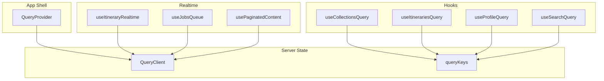
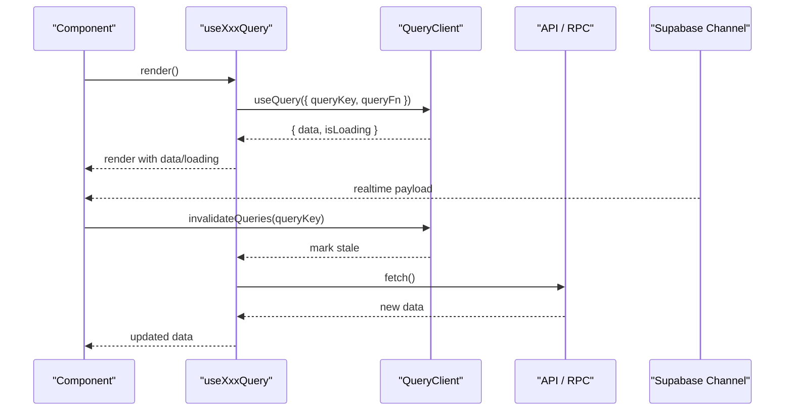
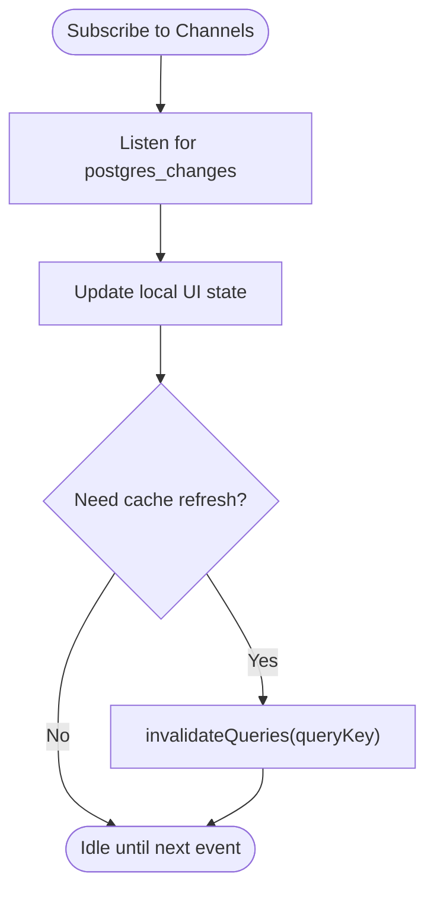
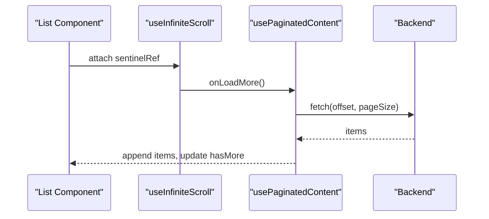
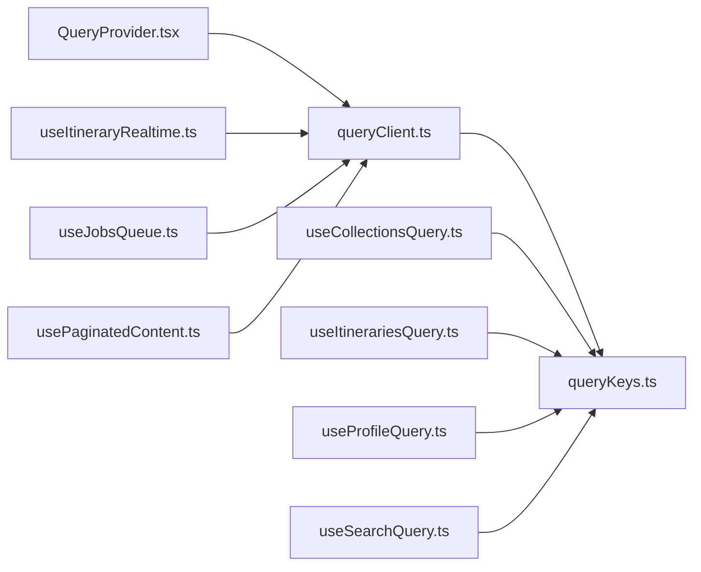

# TanStack Query for Server State

<cite>
**Referenced Files in This Document**
- [QueryProvider.tsx](file://src/components/QueryProvider.tsx)
- [queryClient.ts](file://src/lib/query/queryClient.ts)
- [queryKeys.ts](file://src/lib/query/queryKeys.ts)
- [useCollectionsQuery.ts](file://src/hooks/queries/useCollectionsQuery.ts)
- [useItinerariesQuery.ts](file://src/hooks/queries/useItinerariesQuery.ts)
- [useProfileQuery.ts](file://src/hooks/queries/useProfileQuery.ts)
- [useSearchQuery.ts](file://src/hooks/queries/useSearchQuery.ts)
- [ItineraryJobNotifier.tsx](file://src/components/notifications/ItineraryJobNotifier.tsx)
- [useJobsQueue.ts](file://src/hooks/useJobsQueue.ts)
- [usePaginatedContent.ts](file://src/hooks/usePaginatedContent.ts)
- [useInfiniteScroll.ts](file://src/hooks/useInfiniteScroll.ts)
- [useItineraryRealtime.ts](file://src/hooks/useItineraryRealtime.ts)
</cite>

## Table of Contents
1. Introduction
2. Project Structure
3. Core Components
4. Architecture Overview
5. Detailed Component Analysis
6. Dependency Analysis
7. Performance Considerations
8. Troubleshooting Guide
9. Conclusion

## Introduction
This document explains how the application manages server state with TanStack Query (React Query). It covers QueryClient configuration, caching strategies, query key management patterns, custom hooks for data fetching, optimistic updates, error handling, and real-time subscriptions. It also documents query invalidation, background refetching, performance optimizations, and common patterns such as pagination, infinite scrolling, and concurrent queries.

## Project Structure
The server state layer is organized around a shared QueryClient instance, centralized query keys, and feature-specific React Query hooks. Real-time updates are handled via Supabase channels and integrated with UI state and cache invalidation.

**Diagram sources**
- [QueryProvider.tsx:7-12](file://src/components/QueryProvider.tsx#L7-L12)
- [queryClient.ts:3-12](file://src/lib/query/queryClient.ts#L3-L12)
- [queryKeys.ts:1-42](file://src/lib/query/queryKeys.ts#L1-L42)
- [useCollectionsQuery.ts:10-16](file://src/hooks/queries/useCollectionsQuery.ts#L10-L16)
- [useItinerariesQuery.ts:10-16](file://src/hooks/queries/useItinerariesQuery.ts#L10-L16)
- [useProfileQuery.ts:8-19](file://src/hooks/queries/useProfileQuery.ts#L8-L19)
- [useSearchQuery.ts:8-23](file://src/hooks/queries/useSearchQuery.ts#L8-L23)
- [useItineraryRealtime.ts:27-333](file://src/hooks/useItineraryRealtime.ts#L27-L333)
- [useJobsQueue.ts:45-76](file://src/hooks/useJobsQueue.ts#L45-L76)
- [usePaginatedContent.ts:119-287](file://src/hooks/usePaginatedContent.ts#L119-L287)

**Section sources**
- [QueryProvider.tsx:1-13](file://src/components/QueryProvider.tsx#L1-L13)
- [queryClient.ts:1-12](file://src/lib/query/queryClient.ts#L1-L12)
- [queryKeys.ts:1-42](file://src/lib/query/queryKeys.ts#L1-L42)

## Core Components
- QueryClient configuration defines default caching behavior: stale time, garbage collection time, retry policy, and focus-based refetch control.
- Centralized query keys provide consistent, serializable identifiers for all cached queries.
- Feature-specific hooks encapsulate data fetching logic and apply per-query options like staleTime or enabled conditions.

Key implementation references:
- QueryClient defaults and provider setup
- Query key factory functions
- Custom hooks using useQuery with typed data and query keys

**Section sources**
- [queryClient.ts:3-12](file://src/lib/query/queryClient.ts#L3-L12)
- [queryKeys.ts:1-42](file://src/lib/query/queryKeys.ts#L1-L42)
- [useCollectionsQuery.ts:10-16](file://src/hooks/queries/useCollectionsQuery.ts#L10-L16)
- [useItinerariesQuery.ts:10-16](file://src/hooks/queries/useItinerariesQuery.ts#L10-L16)
- [useProfileQuery.ts:8-19](file://src/hooks/queries/useProfileQuery.ts#L8-L19)
- [useSearchQuery.ts:8-23](file://src/hooks/queries/useSearchQuery.ts#L8-L23)

## Architecture Overview
The app wraps components with QueryProvider to supply a single QueryClient instance. Feature hooks call useQuery with stable query keys derived from queryKeys. Real-time channels update local UI state and trigger cache invalidation to keep the UI consistent with the server.

**Diagram sources**
- [QueryProvider.tsx:7-12](file://src/components/QueryProvider.tsx#L7-L12)
- [queryClient.ts:3-12](file://src/lib/query/queryClient.ts#L3-L12)
- [useItinerariesQuery.ts:10-16](file://src/hooks/queries/useItinerariesQuery.ts#L10-L16)
- [ItineraryJobNotifier.tsx:57-61](file://src/components/notifications/ItineraryJobNotifier.tsx#L57-L61)
- [useItineraryRealtime.ts:89-333](file://src/hooks/useItineraryRealtime.ts#L89-L333)

## Detailed Component Analysis

### QueryClient Configuration and Caching Strategy
- Default staleTime sets how long data is considered fresh before becoming stale.
- gcTime controls how long unused entries remain in memory.
- retry limits network request retries.
- refetchOnWindowFocus is disabled to avoid unnecessary refetches on focus.

These defaults can be overridden per-query in individual hooks when needed.

**Section sources**
- [queryClient.ts:3-12](file://src/lib/query/queryClient.ts#L3-L12)

### Query Key Management Patterns
- Keys are created by factory functions that return tuples including domain identifiers and parameters.
- Examples include user-scoped keys (profile, subscription), resource lists (collections, itineraries), detail views (itineraryDetail), and parameterized queries (search with query, filterType, offset).
- Using const tuples ensures type safety and stable serialization.

Practical usage:
- Each hook composes its queryKey via queryKeys.<resource>(...params).
- Invalidation targets specific keys to refresh related data.

**Section sources**
- [queryKeys.ts:1-42](file://src/lib/query/queryKeys.ts#L1-L42)
- [useCollectionsQuery.ts:10-16](file://src/hooks/queries/useCollectionsQuery.ts#L10-L16)
- [useItinerariesQuery.ts:10-16](file://src/hooks/queries/useItinerariesQuery.ts#L10-L16)
- [useProfileQuery.ts:8-19](file://src/hooks/queries/useProfileQuery.ts#L8-L19)
- [useSearchQuery.ts:8-23](file://src/hooks/queries/useSearchQuery.ts#L8-L23)

### Custom Hooks for Data Fetching
- useCollectionsQuery and useItinerariesQuery wrap useQuery with appropriate query keys and per-hook staleTime.
- useProfileQuery demonstrates conditional fetching via enabled and long-lived caching via Infinity staleTime/gcTime for identity data.
- useSearchQuery shows dynamic query keys based on search inputs and enables fetching only when valid.

Patterns:
- Encapsulate queryFn calls inside hooks.
- Use queryKeys factories for consistent key composition.
- Apply per-hook options to tailor caching and lifecycle behavior.

**Section sources**
- [useCollectionsQuery.ts:10-16](file://src/hooks/queries/useCollectionsQuery.ts#L10-L16)
- [useItinerariesQuery.ts:10-16](file://src/hooks/queries/useItinerariesQuery.ts#L10-L16)
- [useProfileQuery.ts:8-19](file://src/hooks/queries/useProfileQuery.ts#L8-L19)
- [useSearchQuery.ts:8-23](file://src/hooks/queries/useSearchQuery.ts#L8-L23)

### Optimistic Updates
- The jobs queue hook merges incoming job updates into local state immediately to reflect progress without waiting for realtime events.
- This approach improves perceived responsiveness while eventual consistency is achieved via realtime updates.

Implementation highlights:
- Maintain a status map to detect transitions.
- Upsert jobs locally with latest fields and sort order.

**Section sources**
- [useJobsQueue.ts:269-295](file://src/hooks/useJobsQueue.ts#L269-L295)

### Error Boundaries and User-Friendly Errors
- While not implemented as React error boundaries here, the codebase centralizes friendly error messages for auth and API errors.
- This pattern surfaces safe messages to users while logging technical details elsewhere.

Best practice alignment:
- Wrap critical UI sections with error boundaries at the component level if needed.
- Use friendly message utilities to present actionable feedback.

**Section sources**
- [userMessages.ts:1-106](file://src/lib/errors/userMessages.ts#L1-L106)

### Real-Time Subscriptions
- A dedicated hook subscribes to multiple Supabase channels for itinerary activities, days, metadata, collaborators, flights, and lodgings.
- Handlers update both calendar view state and the main itinerary state to keep different UI surfaces in sync.
- Channels are cleaned up on unmount to prevent leaks.

Additional real-time integration:
- Paginated content hook subscribes to content changes and reconnects on channel errors or timeouts.
- Job notifier listens to job updates and invalidates relevant query caches to reflect backend changes.

**Diagram sources**
- [useItineraryRealtime.ts:89-333](file://src/hooks/useItineraryRealtime.ts#L89-L333)
- [usePaginatedContent.ts:209-287](file://src/hooks/usePaginatedContent.ts#L209-L287)
- [ItineraryJobNotifier.tsx:57-61](file://src/components/notifications/ItineraryJobNotifier.tsx#L57-L61)

**Section sources**
- [useItineraryRealtime.ts:27-534](file://src/hooks/useItineraryRealtime.ts#L27-L534)
- [usePaginatedContent.ts:209-287](file://src/hooks/usePaginatedContent.ts#L209-L287)
- [ItineraryJobNotifier.tsx:29-61](file://src/components/notifications/ItineraryJobNotifier.tsx#L29-L61)

### Query Invalidation and Background Refetching
- After job completion or other mutations, the notifier invalidates query keys for itineraries and usage metrics, causing affected queries to refetch in the background.
- Combined with staleTime settings, this keeps data fresh without explicit user actions.

Common triggers:
- Realtime events indicating server-side changes.
- Successful mutations that affect listed resources.

**Section sources**
- [ItineraryJobNotifier.tsx:57-61](file://src/components/notifications/ItineraryJobNotifier.tsx#L57-L61)
- [queryClient.ts:3-12](file://src/lib/query/queryClient.ts#L3-L12)

### Pagination and Infinite Scrolling
- Pagination is implemented with an offset-based approach; loadMore increments page and fetches the next slice, deduplicating against existing items.
- Infinite scroll uses IntersectionObserver to trigger loading when a sentinel enters the viewport, supporting custom scroll containers.

Integration points:
- usePaginatedContent provides content state and loadMore.
- useInfiniteScroll provides the sentinel ref and observer lifecycle.

**Diagram sources**
- [usePaginatedContent.ts:181-207](file://src/hooks/usePaginatedContent.ts#L181-L207)
- [useInfiniteScroll.ts:29-76](file://src/hooks/useInfiniteScroll.ts#L29-L76)

**Section sources**
- [usePaginatedContent.ts:119-287](file://src/hooks/usePaginatedContent.ts#L119-L287)
- [useInfiniteScroll.ts:1-92](file://src/hooks/useInfiniteScroll.ts#L1-L92)

### Concurrent Queries
- Multiple independent queries can run concurrently by invoking multiple hooks within the same component tree.
- TanStack Query coordinates requests and caching automatically, minimizing duplicate network calls through shared query keys.

Example patterns:
- Fetching collections and itineraries simultaneously.
- Fetching profile and usage metrics together.

**Section sources**
- [useCollectionsQuery.ts:10-16](file://src/hooks/queries/useCollectionsQuery.ts#L10-L16)
- [useItinerariesQuery.ts:10-16](file://src/hooks/queries/useItinerariesQuery.ts#L10-L16)
- [useProfileQuery.ts:8-19](file://src/hooks/queries/useProfileQuery.ts#L8-L19)

## Dependency Analysis
The following diagram maps core dependencies between providers, client configuration, query keys, and hooks.

**Diagram sources**
- [QueryProvider.tsx:7-12](file://src/components/QueryProvider.tsx#L7-L12)
- [queryClient.ts:3-12](file://src/lib/query/queryClient.ts#L3-L12)
- [queryKeys.ts:1-42](file://src/lib/query/queryKeys.ts#L1-L42)
- [useCollectionsQuery.ts:10-16](file://src/hooks/queries/useCollectionsQuery.ts#L10-L16)
- [useItinerariesQuery.ts:10-16](file://src/hooks/queries/useItinerariesQuery.ts#L10-L16)
- [useProfileQuery.ts:8-19](file://src/hooks/queries/useProfileQuery.ts#L8-L19)
- [useSearchQuery.ts:8-23](file://src/hooks/queries/useSearchQuery.ts#L8-L23)
- [useItineraryRealtime.ts:27-333](file://src/hooks/useItineraryRealtime.ts#L27-L333)
- [useJobsQueue.ts:45-76](file://src/hooks/useJobsQueue.ts#L45-L76)
- [usePaginatedContent.ts:119-287](file://src/hooks/usePaginatedContent.ts#L119-L287)

**Section sources**
- [queryClient.ts:3-12](file://src/lib/query/queryClient.ts#L3-L12)
- [queryKeys.ts:1-42](file://src/lib/query/queryKeys.ts#L1-L42)

## Performance Considerations
- Stale times:
  - Global defaults balance freshness and network usage.
  - Per-query overrides (e.g., longer staleTime for profile) reduce refetch frequency for stable data.
- Garbage collection:
  - gcTime prevents indefinite memory growth for unused queries.
- Focus refetch:
  - Disabled globally to avoid unnecessary refetches; rely on explicit invalidation and realtime updates.
- Deduplication:
  - Realtime handlers deduplicate items to avoid duplicates when both initial fetch and realtime events deliver data.
- Efficient rendering:
  - Stable query keys ensure minimal re-renders and optimal cache reuse.

[No sources needed since this section provides general guidance]

## Troubleshooting Guide
- Realtime connection issues:
  - Reconnect logic handles channel errors/timeouts by removing the channel and resubscribing after a delay.
- Cache staleness:
  - If data appears outdated, verify staleTime settings and ensure invalidation is triggered after mutations or realtime updates.
- Duplicate items:
  - Ensure deduplication logic runs when merging realtime payloads with paginated results.
- Friendly errors:
  - Use error message utilities to surface safe messages to users while preserving technical details for debugging.

**Section sources**
- [usePaginatedContent.ts:209-287](file://src/hooks/usePaginatedContent.ts#L209-L287)
- [ItineraryJobNotifier.tsx:57-61](file://src/components/notifications/ItineraryJobNotifier.tsx#L57-L61)
- [userMessages.ts:1-106](file://src/lib/errors/userMessages.ts#L1-L106)

## Conclusion
The application leverages TanStack Query to manage server state with a clear separation of concerns: a shared QueryClient, centralized query keys, and feature-specific hooks. Real-time subscriptions complement caching by keeping UI state synchronized with the server and triggering targeted cache invalidations. Pagination and infinite scrolling are implemented with robust, reusable hooks. Together, these patterns provide a scalable, performant foundation for server state management.

[No sources needed since this section summarizes without analyzing specific files]