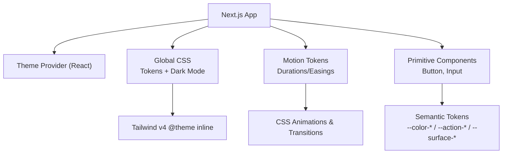
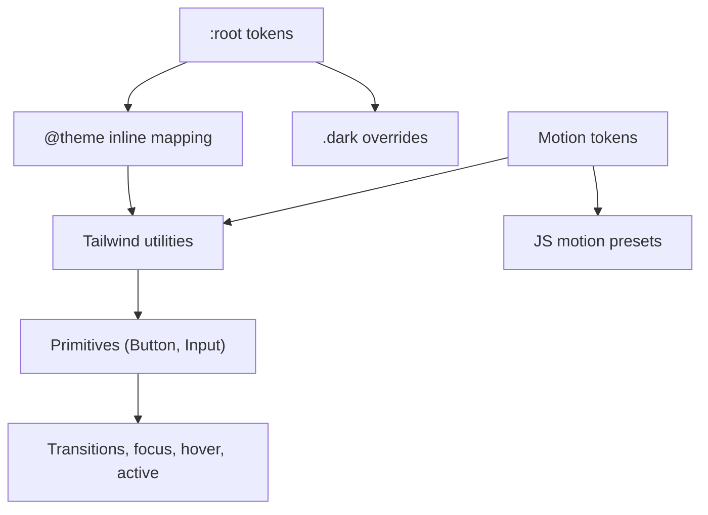
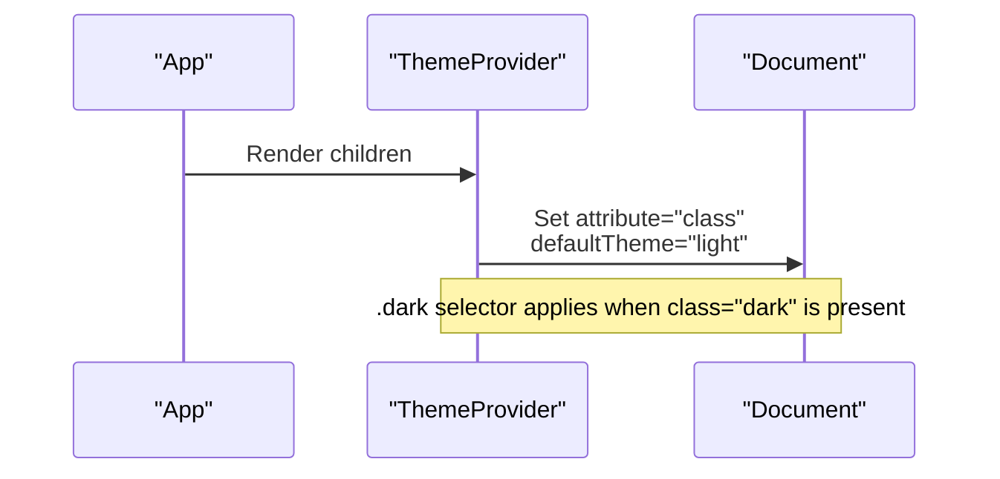
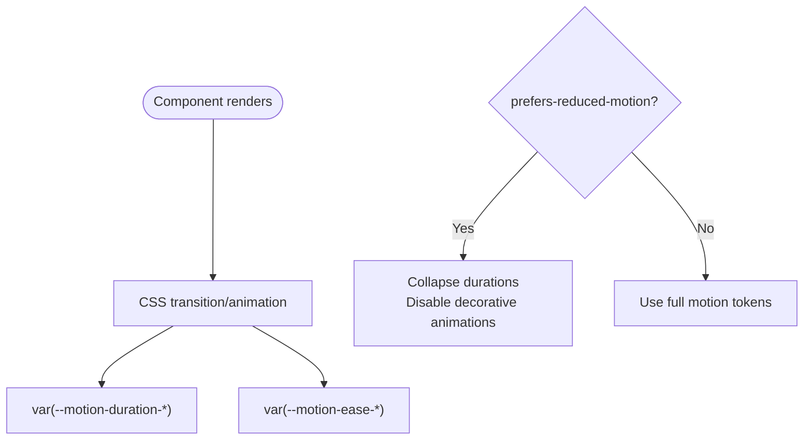
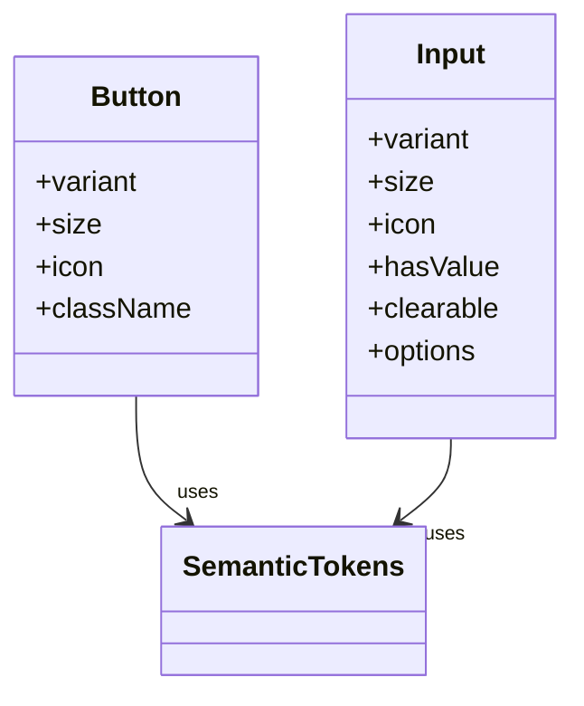
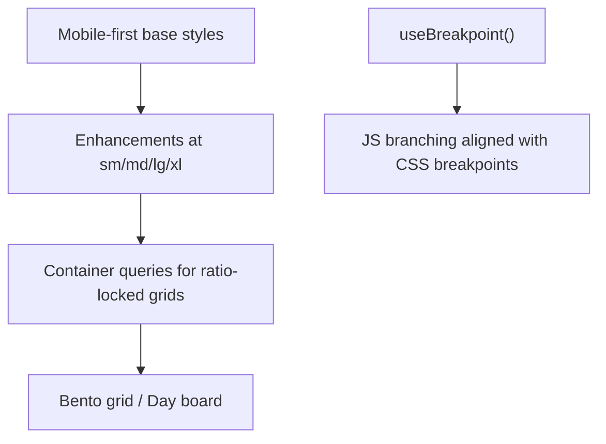
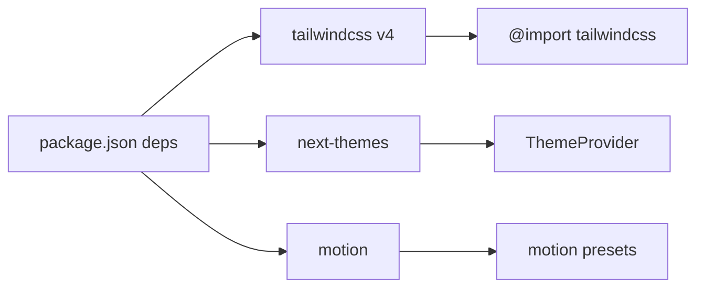

# Styling & Theming

<cite>
**Referenced Files in This Document**
- [globals.css](file://src/app/globals.css)
- [motion.css](file://src/styles/tokens/motion.css)
- [ThemeProvider.tsx](file://src/components/ThemeProvider.tsx)
- [Button.tsx](file://src/components/ui/primitives/Button.tsx)
- [Input.tsx](file://src/components/ui/primitives/Input.tsx)
- [postcss.config.js](file://postcss.config.js)
- [next.config.js](file://next.config.js)
- [package.json](file://package.json)
- [useMediaQuery.ts](file://src/hooks/useMediaQuery.ts)
- [presets.ts](file://src/lib/motion/presets.ts)
</cite>

## Table of Contents
1. Introduction
2. Project Structure
3. Core Components
4. Architecture Overview
5. Detailed Component Analysis
6. Dependency Analysis
7. Performance Considerations
8. Troubleshooting Guide
9. Conclusion
10. Appendices

## Introduction
This document explains Argo’s styling and theming system built on Tailwind CSS v4, semantic design tokens, CSS custom properties, and a motion system. It covers:
- Tailwind configuration and theme token registration
- Semantic color tokens for light/dark themes
- Theme provider setup for dynamic theme switching and dark mode support
- Motion tokens, transitions, loading states, and micro-interactions
- Responsive design patterns and breakpoint strategies
- Guidelines for consistent styles, accessible UI components, and customization workflows

## Project Structure
The styling system is centered around:
- Global CSS that defines semantic tokens, theme variables, typography, utilities, animations, and responsive grids
- A dedicated motion tokens file defining durations, easings, distances, and reduced-motion behavior
- A React theme provider wrapping the app to manage theme context
- Primitive UI components that consume tokens via Tailwind classes and CSS variables
- Build-time configuration for Tailwind and Next.js

**Diagram sources**
- [globals.css:12-784](file://src/app/globals.css#L12-L784)
- [motion.css:7-55](file://src/styles/tokens/motion.css#L7-L55)
- [ThemeProvider.tsx:5-15](file://src/components/ThemeProvider.tsx#L5-L15)
- [Button.tsx:9-42](file://src/components/ui/primitives/Button.tsx#L9-L42)
- [Input.tsx:11-70](file://src/components/ui/primitives/Input.tsx#L11-L70)

**Section sources**
- [globals.css:1-120](file://src/app/globals.css#L1-L120)
- [motion.css:1-55](file://src/styles/tokens/motion.css#L1-L55)
- [ThemeProvider.tsx:1-17](file://src/components/ThemeProvider.tsx#L1-L17)
- [postcss.config.js:1-6](file://postcss.config.js#L1-L6)
- [next.config.js:1-18](file://next.config.js#L1-L18)
- [package.json:12-43](file://package.json#L12-L43)

## Core Components
- Theme Provider: Wraps the application with next-themes to control theme attribute and default behavior.
- Global CSS: Declares semantic tokens for surfaces, content, glyphs, edges, actions, categories, charts, sidebar, calendar colors, typography scales, and exposes them to Tailwind via @theme inline. Also defines dark mode overrides and utility animations.
- Motion Tokens: Centralizes durations, easings, distances, stagger values, and reduced-motion rules; provides modal/shell transitions and validation animations.
- Primitive Components: Button and Input demonstrate how to compose variants, sizes, and state-driven styles using class-variance-authority and semantic tokens.

Key responsibilities:
- Tokenization: All visual decisions flow through CSS variables so themes can be swapped consistently.
- Accessibility: Focus rings, reduced motion, and aria attributes are integrated into primitives.
- Responsiveness: Mobile-first utilities and container-based grid systems ensure layout consistency across breakpoints.

**Section sources**
- [ThemeProvider.tsx:5-15](file://src/components/ThemeProvider.tsx#L5-L15)
- [globals.css:12-784](file://src/app/globals.css#L12-L784)
- [motion.css:7-55](file://src/styles/tokens/motion.css#L7-L55)
- [Button.tsx:9-42](file://src/components/ui/primitives/Button.tsx#L9-L42)
- [Input.tsx:11-70](file://src/components/ui/primitives/Input.tsx#L11-L70)

## Architecture Overview
The styling architecture layers tokens, utilities, and component styles:
- Design tokens live as CSS custom properties under :root and .dark
- Tokens are exposed to Tailwind via @theme inline for use in utility classes
- Components build on top of these utilities and tokens
- Motion tokens unify timing and easing across CSS and JS motion presets

**Diagram sources**
- [globals.css:12-784](file://src/app/globals.css#L12-L784)
- [motion.css:7-55](file://src/styles/tokens/motion.css#L7-L55)
- [presets.ts:8-45](file://src/lib/motion/presets.ts#L8-L45)

## Detailed Component Analysis

### Theme Provider and Dark Mode
- The provider uses next-themes with attribute "class", default "light", and forced "light" to avoid runtime toggles unless explicitly enabled elsewhere.
- Dark mode is implemented by a .dark scope that redefines semantic tokens, ensuring consistent appearance across all components.

**Diagram sources**
- [ThemeProvider.tsx:5-15](file://src/components/ThemeProvider.tsx#L5-L15)
- [globals.css:256-492](file://src/app/globals.css#L256-L492)

**Section sources**
- [ThemeProvider.tsx:5-15](file://src/components/ThemeProvider.tsx#L5-L15)
- [globals.css:256-492](file://src/app/globals.css#L256-L492)

### Semantic Tokens and Color System
- Surface, Content, Glyph, Edge, Action, Category, Chart, Sidebar, Calendar, and Typography tokens are defined as CSS variables.
- Light theme tokens are set in :root; dark theme tokens are overridden under .dark.
- Tokens are mapped to Tailwind’s color namespace via @theme inline so they can be used as utilities (e.g., bg-action-brand, text-content).

Guidelines:
- Prefer semantic tokens over raw colors to maintain contrast and accessibility.
- Use category tokens for consistent meaning across badges and icons.
- Calendar tokens provide per-day palettes that adapt to dark mode automatically.

**Section sources**
- [globals.css:12-254](file://src/app/globals.css#L12-L254)
- [globals.css:256-492](file://src/app/globals.css#L256-L492)
- [globals.css:494-784](file://src/app/globals.css#L494-L784)

### Motion and Animation System
- Motion tokens define a duration scale, easing curves, spatial distances, and stagger offsets.
- Default transition duration and easing are set so Tailwind utilities without explicit timing inherit consistent behavior.
- Reduced motion is respected by collapsing durations and disabling decorative animations.
- Modal and sheet transitions use CSS transitions keyed by tokens; JS motion presets mirror the same timings for stateful choreography.

**Diagram sources**
- [motion.css:7-55](file://src/styles/tokens/motion.css#L7-L55)
- [motion.css:57-94](file://src/styles/tokens/motion.css#L57-L94)
- [motion.css:100-218](file://src/styles/tokens/motion.css#L100-L218)
- [presets.ts:8-45](file://src/lib/motion/presets.ts#L8-L45)

**Section sources**
- [motion.css:7-55](file://src/styles/tokens/motion.css#L7-L55)
- [motion.css:57-94](file://src/styles/tokens/motion.css#L57-L94)
- [motion.css:100-218](file://src/styles/tokens/motion.css#L100-L218)
- [presets.ts:8-45](file://src/lib/motion/presets.ts#L8-L45)

### Primitive Components: Button and Input
- Button uses class-variance-authority to define variants (primary, secondary, ghost, outline, dark), sizes, and icon placement. It composes semantic tokens for fills, borders, highlights, and shadows.
- Input supports variants (default, underline), sizes, icon slots, and hasValue state. It applies focus rings, invalid states, and inner shadows using semantic tokens.

**Diagram sources**
- [Button.tsx:9-42](file://src/components/ui/primitives/Button.tsx#L9-L42)
- [Button.tsx:48-67](file://src/components/ui/primitives/Button.tsx#L48-L67)
- [Input.tsx:11-70](file://src/components/ui/primitives/Input.tsx#L11-L70)

**Section sources**
- [Button.tsx:9-42](file://src/components/ui/primitives/Button.tsx#L9-L42)
- [Button.tsx:48-67](file://src/components/ui/primitives/Button.tsx#L48-L67)
- [Input.tsx:11-70](file://src/components/ui/primitives/Input.tsx#L11-L70)

### Responsive Design Patterns and Breakpoints
- Mobile-first approach: base styles target small screens; larger screens enhance via utilities and container queries.
- Custom height breakpoint variant short optimizes compact layouts on shorter viewports.
- useBreakpoint hook mirrors Tailwind’s default breakpoints for JS logic, keeping CSS and JS in sync.
- Container-based grids (bento-grid, day-board) derive column widths from container width to preserve aspect ratios and alignment.

**Diagram sources**
- [globals.css:7-11](file://src/app/globals.css#L7-L11)
- [globals.css:1089-1133](file://src/app/globals.css#L1089-L1133)
- [useMediaQuery.ts:53-67](file://src/hooks/useMediaQuery.ts#L53-L67)

**Section sources**
- [globals.css:7-11](file://src/app/globals.css#L7-L11)
- [globals.css:1089-1133](file://src/app/globals.css#L1089-L1133)
- [useMediaQuery.ts:53-67](file://src/hooks/useMediaQuery.ts#L53-L67)

### Accessibility and Consistent Styles
- Focus management: Buttons include focus-visible ring and border; Inputs apply focus-within states and error outlines.
- Reduced motion: Global media query collapses durations and disables non-essential animations.
- Contrast and semantics: Use semantic tokens to ensure sufficient contrast across themes; rely on aria attributes for state signaling.
- Typography: Type scales are centralized in tokens and applied via utility classes for consistency.

**Section sources**
- [Button.tsx:9-42](file://src/components/ui/primitives/Button.tsx#L9-L42)
- [Input.tsx:11-70](file://src/components/ui/primitives/Input.tsx#L11-L70)
- [motion.css:57-94](file://src/styles/tokens/motion.css#L57-L94)
- [globals.css:745-854](file://src/app/globals.css#L745-L854)

## Dependency Analysis
- Tailwind v4 is configured via PostCSS plugin and imported in global CSS.
- next-themes wraps the app to manage theme attribute and defaults.
- Motion library (motion/react) is used alongside CSS motion tokens; JS presets mirror CSS timing/easing.
- Base UI primitives provide accessible foundations for buttons and fields.

**Diagram sources**
- [package.json:12-43](file://package.json#L12-L43)
- [postcss.config.js:1-6](file://postcss.config.js#L1-L6)
- [ThemeProvider.tsx:5-15](file://src/components/ThemeProvider.tsx#L5-L15)
- [presets.ts:8-45](file://src/lib/motion/presets.ts#L8-L45)

**Section sources**
- [package.json:12-43](file://package.json#L12-L43)
- [postcss.config.js:1-6](file://postcss.config.js#L1-L6)
- [next.config.js:1-18](file://next.config.js#L1-L18)

## Performance Considerations
- Prefer CSS transitions/animations driven by tokens for performance; reserve JS motion for complex choreography.
- Avoid heavy animations on low-power devices; rely on prefers-reduced-motion to minimize work.
- Use container queries to compute layout dimensions rather than recalculating in JS.
- Keep token changes minimal; swapping themes updates variables once at root level.

## Troubleshooting Guide
- Theme not applying: Ensure the provider is mounted and the correct attribute is set; verify .dark overrides exist for needed tokens.
- Inconsistent colors: Confirm components use semantic tokens instead of hardcoded colors; check @theme inline mappings.
- Animations too fast/slow: Adjust motion tokens or use provided semantic aliases; verify reduced-motion settings if users report jarring effects.
- Focus issues: Check focus-visible and outline styles in primitives; ensure inputs have proper aria-invalid handling.

**Section sources**
- [ThemeProvider.tsx:5-15](file://src/components/ThemeProvider.tsx#L5-L15)
- [globals.css:256-492](file://src/app/globals.css#L256-L492)
- [motion.css:57-94](file://src/styles/tokens/motion.css#L57-L94)
- [Button.tsx:9-42](file://src/components/ui/primitives/Button.tsx#L9-L42)
- [Input.tsx:11-70](file://src/components/ui/primitives/Input.tsx#L11-L70)

## Conclusion
Argo’s styling system centers on semantic tokens, robust dark mode support, and a unified motion model. By composing primitives from tokens and utilities, the application maintains visual consistency, accessibility, and responsiveness. Customize themes by updating semantic tokens and their @theme mappings; extend motion by adding tokens and leveraging existing utilities.

## Appendices

### Tailwind Configuration
- PostCSS plugin enables Tailwind v4 processing.
- Global CSS imports Tailwind and motion tokens, then defines theme variables and utilities.

**Section sources**
- [postcss.config.js:1-6](file://postcss.config.js#L1-L6)
- [globals.css:1-6](file://src/app/globals.css#L1-L6)

### Adding New Design Tokens
- Define new CSS variables under :root and .dark for light/dark variants.
- Map them to Tailwind via @theme inline to expose as utilities.
- Reference tokens in components using semantic naming conventions.

**Section sources**
- [globals.css:12-254](file://src/app/globals.css#L12-L254)
- [globals.css:256-492](file://src/app/globals.css#L256-L492)
- [globals.css:494-784](file://src/app/globals.css#L494-L784)

### Customizing Themes
- To switch themes dynamically, adjust the ThemeProvider configuration or enable user-controlled toggles while preserving forcedTheme behavior as needed.
- Update semantic tokens to align with brand guidelines; ensure contrast and accessibility checks pass.

**Section sources**
- [ThemeProvider.tsx:5-15](file://src/components/ThemeProvider.tsx#L5-L15)
- [globals.css:12-254](file://src/app/globals.css#L12-L254)
- [globals.css:256-492](file://src/app/globals.css#L256-L492)

### Maintaining Visual Consistency
- Use class-variance-authority to standardize component variants and sizes.
- Apply semantic tokens for colors, spacing, and motion to keep UI cohesive.
- Leverage container-based grids for predictable layouts across breakpoints.

**Section sources**
- [Button.tsx:9-42](file://src/components/ui/primitives/Button.tsx#L9-L42)
- [Input.tsx:11-70](file://src/components/ui/primitives/Input.tsx#L11-L70)
- [globals.css:1089-1133](file://src/app/globals.css#L1089-L1133)