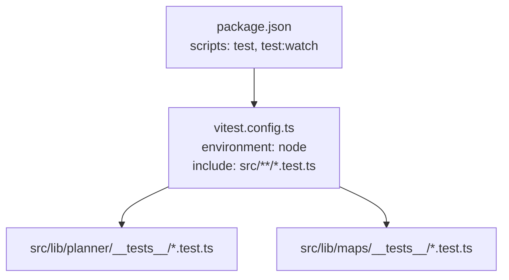
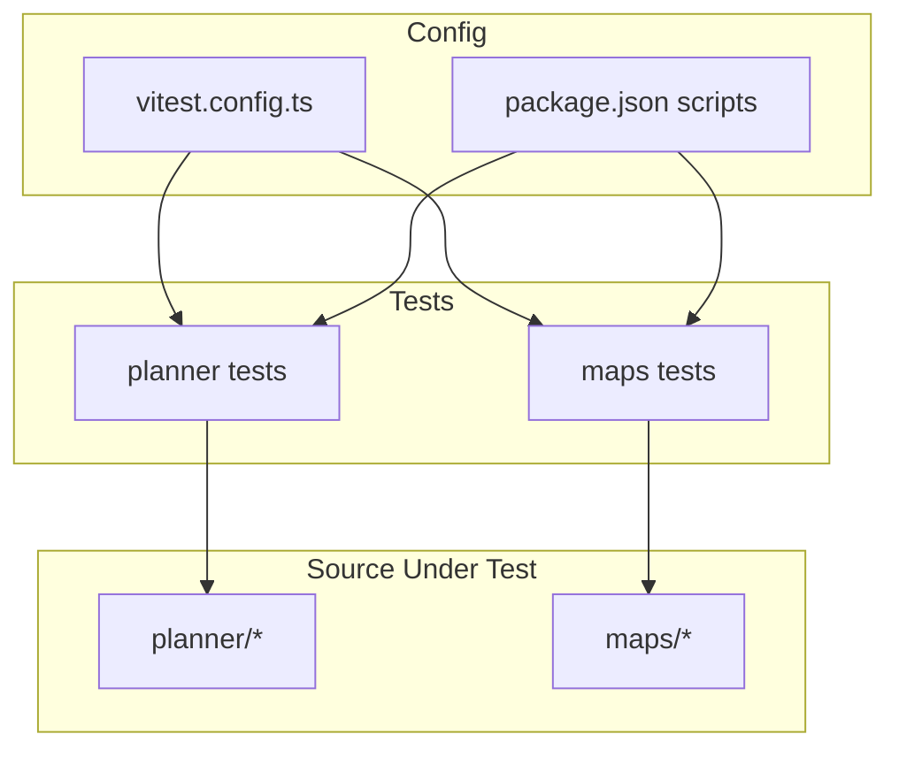
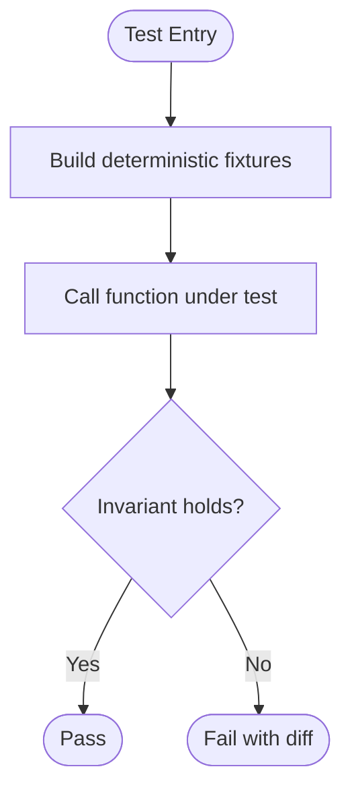
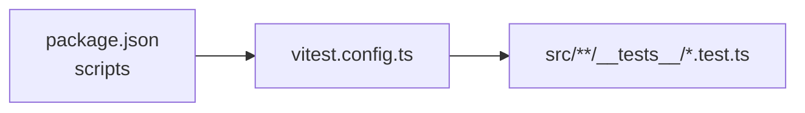

# Testing Strategy

<cite>
**Referenced Files in This Document**
- [package.json](file://package.json)
- [vitest.config.ts](file://vitest.config.ts)
- [place-search.test.ts](file://src/lib/maps/__tests__/place-search.test.ts)
- [cluster.test.ts](file://src/lib/planner/__tests__/cluster.test.ts)
- [duration.test.ts](file://src/lib/planner/__tests__/duration.test.ts)
- [score.test.ts](file://src/lib/planner/__tests__/score.test.ts)
- [taxonomy.test.ts](file://src/lib/planner/__tests__/taxonomy.test.ts)
- [useSessionUserId.ts](file://src/hooks/useSessionUserId.ts)
- [client.ts](file://src/lib/supabase/client.ts)
- [NavbarSearchBar.tsx](file://src/components/ui/navbar/NavbarSearchBar.tsx)
</cite>

## Table of Contents
1. Introduction
2. Project Structure
3. Core Components
4. Architecture Overview
5. Detailed Component Analysis
6. Dependency Analysis
7. Performance Considerations
8. Troubleshooting Guide
9. Conclusion
10. Appendices

## Introduction
This document defines the testing strategy for the application, focusing on unit tests with Vitest and providing guidance for component, integration, and end-to-end testing. It documents existing test organization patterns, utilities, and mock strategies used across the codebase, and outlines best practices for coverage and continuous integration.

## Project Structure
The project uses Vitest as the primary test runner with a Node environment and TypeScript path aliases via vite-tsconfig-paths. Tests are colocated next to their source modules under dedicated __tests__ directories within feature folders. The configuration includes:
- A Node-based test environment
- Glob pattern discovery for .test.ts files
- Pass-with-no-tests enabled to avoid CI failures when no tests exist

**Diagram sources**
- [package.json:5-12](file://package.json#L5-L12)
- [vitest.config.ts:4-10](file://vitest.config.ts#L4-L10)

**Section sources**
- [package.json:5-12](file://package.json#L5-L12)
- [vitest.config.ts:4-10](file://vitest.config.ts#L4-L10)

## Core Components
The current test suite focuses on pure logic and domain functions in the planner and maps domains:
- Place normalization and payload mapping
- Clustering algorithms with deterministic PRNG injection
- Visit duration resolution with type heuristics and pace multipliers
- Scoring pipeline including quality, affinity, price fit, hard filters, and reasons
- Taxonomy bridges and query generation

These tests demonstrate:
- Deterministic fixtures and helpers
- Property-style assertions over outputs
- Edge-case guards (empty inputs, unknown types, clamping behavior)
- Invariants (no empty clusters, non-empty reasons after filtering)

**Section sources**
- [place-search.test.ts:1-69](file://src/lib/maps/__tests__/place-search.test.ts#L1-L69)
- [cluster.test.ts:1-163](file://src/lib/planner/__tests__/cluster.test.ts#L1-L163)
- [duration.test.ts:1-121](file://src/lib/planner/__tests__/duration.test.ts#L1-L121)
- [score.test.ts:1-172](file://src/lib/planner/__tests__/score.test.ts#L1-L172)
- [taxonomy.test.ts:1-80](file://src/lib/planner/__tests__/taxonomy.test.ts#L1-L80)

## Architecture Overview
At a high level, the testing architecture separates concerns by layer:
- Unit tests validate pure functions and business rules
- Helpers and fixtures encapsulate reusable data and utilities
- Configuration centralizes test discovery and environment settings
- Scripts expose consistent commands for local and CI execution

[No sources needed since this diagram shows conceptual workflow, not actual code structure]

## Detailed Component Analysis

### Unit Testing Patterns in Planner and Maps
- Deterministic randomness: Injected PRNG ensures stable clustering results across runs.
- Fixtures: Small helper functions construct minimal valid objects to reduce duplication.
- Assertions: Grouping and canonicalization techniques assert order-independent outcomes.
- Guardrails: Tests enforce invariants such as “never an empty cluster” and “reasons never empty after filtering.”

**Section sources**
- [cluster.test.ts:6-17](file://src/lib/planner/__tests__/cluster.test.ts#L6-L17)
- [cluster.test.ts:52-82](file://src/lib/planner/__tests__/cluster.test.ts#L52-L82)
- [score.test.ts:95-141](file://src/lib/planner/__tests__/score.test.ts#L95-L141)
- [duration.test.ts:24-48](file://src/lib/planner/__tests__/duration.test.ts#L24-L48)

### Testing Utilities and Mock Implementations
- Local mocks: Inline fake objects and deterministic PRNG replace external dependencies without global mocks.
- Type safety: Tests import shared types to ensure fixtures match expected shapes.
- Minimal surface area: Only the fields required by the function under test are provided.

Examples:
- Fake place construction for normalization tests
- Deterministic RNG for clustering stability
- Compact fixture builders for scoring and duration resolution

**Section sources**
- [place-search.test.ts:10-21](file://src/lib/maps/__tests__/place-search.test.ts#L10-L21)
- [cluster.test.ts:6-25](file://src/lib/planner/__tests__/cluster.test.ts#L6-L25)
- [duration.test.ts:11-22](file://src/lib/planner/__tests__/duration.test.ts#L11-L22)
- [score.test.ts:16-32](file://src/lib/planner/__tests__/score.test.ts#L16-L32)

### Testing Custom Hooks
For hooks that depend on external services (e.g., Supabase), adopt these strategies:
- Isolate side effects: Wrap client creation so it can be replaced in tests.
- Provide controlled state: Seed session or user id via a test-only client or context.
- Assert lifecycle: Verify initial null state and resolved value after async setup.

Example hook under test:
- useSessionUserId resolves the authenticated user id from Supabase and returns null until loaded.

Recommended approach:
- Create a test-specific client that returns a known session
- Render the hook in a minimal React tree
- Assert the returned id transitions from null to the expected value

**Section sources**
- [useSessionUserId.ts:1-19](file://src/hooks/useSessionUserId.ts#L1-L19)
- [client.ts:1-8](file://src/lib/supabase/client.ts#L1-L8)

### Testing React Components
For UI components like NavbarSearchBar:
- Use a component testing library compatible with Vitest (e.g., @testing-library/react)
- Simulate user interactions (input, focus, keyboard events)
- Assert rendered output and callback invocations
- Stub third-party integrations (motion, analytics) if necessary

Current status:
- No component tests exist yet; add them alongside components using a consistent naming convention (e.g., NavbarSearchBar.test.tsx)

**Section sources**
- [NavbarSearchBar.tsx:26-66](file://src/components/ui/navbar/NavbarSearchBar.tsx#L26-L66)

### Integration Testing Strategies
Focus on boundaries between layers:
- Query layer: Validate that hooks compose queries correctly and handle loading/error states
- API boundary: Mock network responses and assert transformed data
- Context providers: Ensure providers initialize and propagate state as expected

Guidance:
- Keep integration tests fast by mocking I/O
- Use realistic but small datasets
- Assert both success and failure paths

[No sources needed since this section provides general guidance]

### End-to-End Testing Considerations
- Choose a browser automation tool (e.g., Playwright) aligned with Next.js
- Target critical user journeys (auth flow, itinerary creation, search)
- Seed test data in a disposable environment
- Avoid flakiness by stabilizing selectors and mocking time-sensitive features

[No sources needed since this section provides general guidance]

## Dependency Analysis
Vitest is configured to run in a Node environment and discovers tests matching a specific glob. Scripts provide consistent entry points for local development and CI.

**Diagram sources**
- [package.json:5-12](file://package.json#L5-L12)
- [vitest.config.ts:4-10](file://vitest.config.ts#L4-L10)

**Section sources**
- [package.json:5-12](file://package.json#L5-L12)
- [vitest.config.ts:4-10](file://vitest.config.ts#L4-L10)

## Performance Considerations
- Prefer unit tests for algorithmic logic to keep suites fast and deterministic
- Use deterministic seeds for randomized algorithms to avoid flaky performance regressions
- Minimize DOM interactions in unit tests; reserve them for component/integration tests
- Parallelize test suites where possible; Vitest supports concurrent execution by default

[No sources needed since this section provides general guidance]

## Troubleshooting Guide
Common issues and resolutions:
- Missing test discovery: Ensure tests match the include pattern in vitest config
- Path alias errors: Confirm vite-tsconfig-paths plugin is active
- Flaky tests: Replace Math.random with injected PRNG for determinism
- Async hook timing: Wait for state updates before asserting in component/hook tests

Relevant references:
- Test discovery and environment configuration
- Deterministic clustering tests demonstrating PRNG injection
- Hook that performs async session retrieval

**Section sources**
- [vitest.config.ts:4-10](file://vitest.config.ts#L4-L10)
- [cluster.test.ts:6-17](file://src/lib/planner/__tests__/cluster.test.ts#L6-L17)
- [useSessionUserId.ts:1-19](file://src/hooks/useSessionUserId.ts#L1-L19)

## Conclusion
The repository currently emphasizes robust unit testing for core logic with clear patterns for fixtures, deterministic randomness, and strong invariants. To evolve the testing strategy:
- Add component tests for interactive UI pieces
- Introduce integration tests around query and API boundaries
- Establish end-to-end tests for critical user flows
- Define coverage thresholds and integrate automated testing into CI

[No sources needed since this section summarizes without analyzing specific files]

## Appendices

### Existing Test Coverage Map
- Planner domain: clustering, duration, scoring, taxonomy
- Maps domain: place normalization and payload mapping

**Section sources**
- [cluster.test.ts:1-163](file://src/lib/planner/__tests__/cluster.test.ts#L1-L163)
- [duration.test.ts:1-121](file://src/lib/planner/__tests__/duration.test.ts#L1-L121)
- [score.test.ts:1-172](file://src/lib/planner/__tests__/score.test.ts#L1-L172)
- [taxonomy.test.ts:1-80](file://src/lib/planner/__tests__/taxonomy.test.ts#L1-L80)
- [place-search.test.ts:1-69](file://src/lib/maps/__tests__/place-search.test.ts#L1-L69)

### Recommended Next Steps
- Add component tests for key UI components (e.g., NavbarSearchBar)
- Create integration tests for hooks interacting with Supabase
- Configure coverage reporting and thresholds in vitest config
- Add CI steps to run tests and report coverage

[No sources needed since this section provides general guidance]