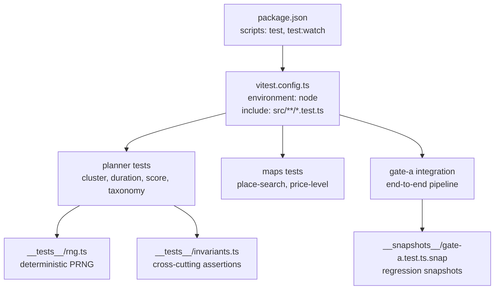
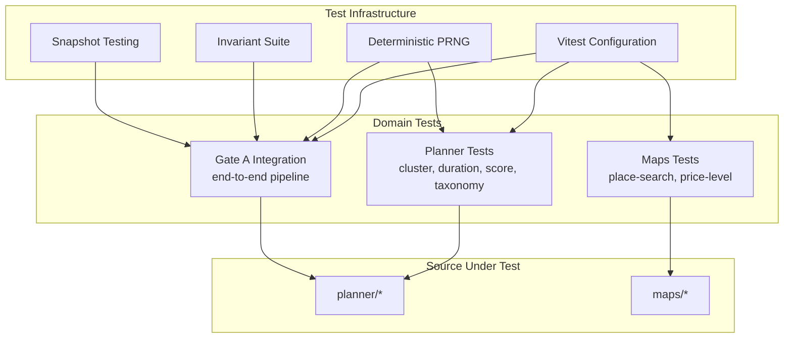
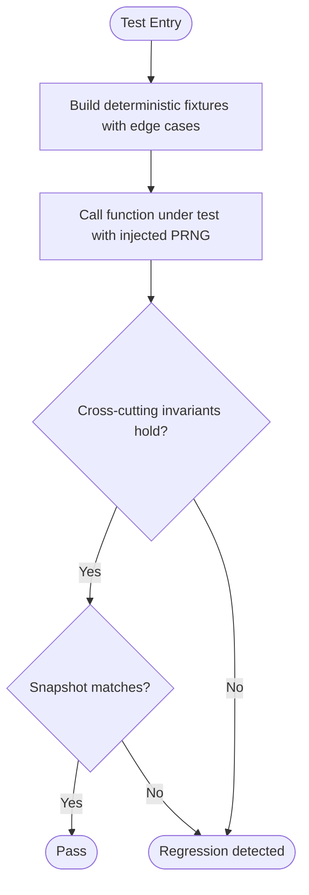
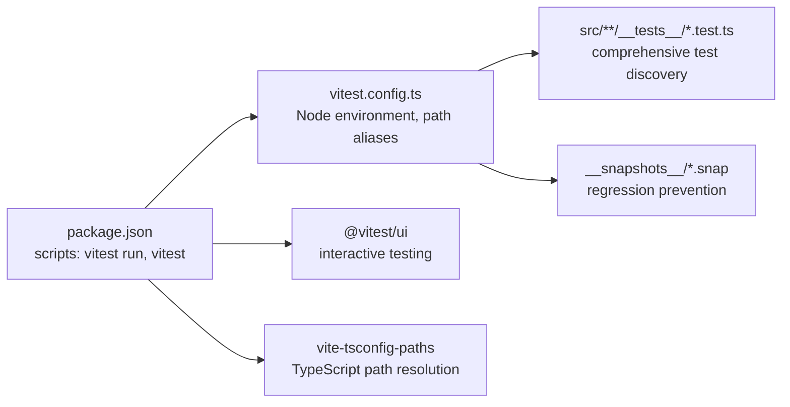

# Testing Strategy

<cite>
**Referenced Files in This Document**
- [package.json](file://package.json)
- [vitest.config.ts](file://vitest.config.ts)
- [place-search.test.ts](file://src/lib/maps/place-search.test.ts)
- [cluster.test.ts](file://src/lib/planner/cluster.test.ts)
- [duration.test.ts](file://src/lib/planner/duration.test.ts)
- [score.test.ts](file://src/lib/planner/score.test.ts)
- [taxonomy.test.ts](file://src/lib/planner/taxonomy.test.ts)
- [gate-a.test.ts](file://src/lib/planner/__tests__/gate-a.test.ts)
- [rng.ts](file://src/lib/planner/__tests__/rng.ts)
- [invariants.ts](file://src/lib/planner/__tests__/invariants.ts)
- [useSessionUserId.ts](file://src/hooks/useSessionUserId.ts)
- [client.ts](file://src/lib/supabase/client.ts)
- [NavbarSearchBar.tsx](file://src/components/ui/navbar/NavbarSearchBar.tsx)
</cite>

## Update Summary
**Changes Made**
- Added comprehensive testing infrastructure documentation including Vitest configuration and setup
- Updated unit testing patterns to reflect extensive planner module tests with deterministic PRNG injection
- Added snapshot testing coverage for gate A runs with detailed fixture analysis
- Enhanced mock implementation documentation for random number generation and time injection
- Expanded testing utilities section with invariant suite and cross-cutting concerns
- Updated architecture overview to include the complete testing pipeline from fixtures to assertions

## Table of Contents
1. Introduction
2. Project Structure
3. Core Components
4. Architecture Overview
5. Detailed Component Analysis
6. Dependency Analysis
7. Performance Considerations
8. Troubleshooting Guide
9. Conclusion
10. Appendices

## Introduction
This document defines the comprehensive testing strategy for the application, focusing on unit tests with Vitest and providing guidance for component, integration, and end-to-end testing. It documents the extensive test organization patterns, utilities, and mock strategies used across the codebase, with particular emphasis on deterministic testing for algorithmic components. The testing infrastructure includes robust snapshot testing, invariant suites, and cross-cutting validation that ensures core business logic remains stable across refactors.

## Project Structure
The project uses Vitest as the primary test runner with a Node environment and TypeScript path aliases via vite-tsconfig-paths. Tests are organized in dedicated directories within feature modules, with comprehensive coverage of planner algorithms and maps functionality. The configuration includes:
- A Node-based test environment for algorithmic testing
- Glob pattern discovery for .test.ts files across the source tree
- Pass-with-no-tests enabled to avoid CI failures when no tests exist
- Snapshot testing support for regression prevention

**Diagram sources**
- [package.json:5-12](file://package.json#L5-L12)
- [vitest.config.ts:4-10](file://vitest.config.ts#L4-L10)
- [gate-a.test.ts:1-216](file://src/lib/planner/__tests__/gate-a.test.ts#L1-L216)

**Section sources**
- [package.json:5-12](file://package.json#L5-L12)
- [vitest.config.ts:4-10](file://vitest.config.ts#L4-L10)

## Core Components
The current test suite provides comprehensive coverage of pure logic and domain functions across planner and maps domains:
- Place normalization and payload mapping with field mask validation
- Clustering algorithms with deterministic PRNG injection ensuring reproducible results
- Visit duration resolution with type heuristics, enrichment data, and pace multipliers
- Scoring pipeline including quality scoring, affinity calculation, price fit, hard filters, and match reasons
- Taxonomy bridges and query generation with exhaustive interest coverage
- End-to-end Gate A pipeline testing with realistic Kyoto candidate data

These tests demonstrate advanced testing patterns:
- Deterministic fixtures with adversarial edge cases (closed places, missing coordinates, extreme price levels)
- Property-style assertions over outputs with order-independent grouping
- Comprehensive guardrails enforcing invariants (no empty clusters, non-empty reasons after filtering)
- Cross-cutting invariant suites that validate pipeline guarantees regardless of implementation changes
- Snapshot testing for regression prevention in complex algorithmic outputs

**Section sources**
- [place-search.test.ts:1-69](file://src/lib/maps/place-search.test.ts#L1-L69)
- [cluster.test.ts:1-153](file://src/lib/planner/cluster.test.ts#L1-L153)
- [duration.test.ts:1-121](file://src/lib/planner/duration.test.ts#L1-L121)
- [score.test.ts:1-180](file://src/lib/planner/score.test.ts#L1-L180)
- [taxonomy.test.ts:1-80](file://src/lib/planner/taxonomy.test.ts#L1-L80)
- [gate-a.test.ts:1-216](file://src/lib/planner/__tests__/gate-a.test.ts#L1-L216)

## Architecture Overview
At a high level, the testing architecture separates concerns by layer with sophisticated cross-cutting validation:
- Unit tests validate pure functions and business rules with deterministic inputs
- Helper modules encapsulate reusable data, utilities, and cross-cutting concerns
- Invariant suites provide contract testing that survives implementation refactors
- Configuration centralizes test discovery and environment settings
- Scripts expose consistent commands for local development and CI execution
- Snapshot testing prevents unintended changes to algorithmic outputs

**Diagram sources**
- [vitest.config.ts:4-10](file://vitest.config.ts#L4-L10)
- [rng.ts:1-16](file://src/lib/planner/__tests__/rng.ts#L1-L16)
- [invariants.ts:1-132](file://src/lib/planner/__tests__/invariants.ts#L1-L132)
- [gate-a.test.ts:1-216](file://src/lib/planner/__tests__/gate-a.test.ts#L1-L216)

## Detailed Component Analysis

### Unit Testing Patterns in Planner and Maps
The testing approach emphasizes determinism and comprehensive coverage:
- **Deterministic randomness**: Injected PRNG (mulberry32) ensures stable clustering results across runs, eliminating flaky tests
- **Adversarial fixtures**: Realistic edge cases including permanently closed places, missing coordinates, extreme price levels, and mixed dietary requirements
- **Property-based assertions**: Grouping and canonicalization techniques assert order-independent outcomes for clustering results
- **Cross-cutting invariants**: Comprehensive validation suite that enforces pipeline guarantees regardless of implementation changes
- **Snapshot testing**: Regression prevention for complex algorithmic outputs through recorded plan snapshots

**Section sources**
- [cluster.test.ts:6-17](file://src/lib/planner/cluster.test.ts#L6-L17)
- [cluster.test.ts:52-82](file://src/lib/planner/cluster.test.ts#L52-L82)
- [score.test.ts:95-141](file://src/lib/planner/score.test.ts#L95-L141)
- [duration.test.ts:24-48](file://src/lib/planner/duration.test.ts#L24-L48)
- [gate-a.test.ts:58-72](file://src/lib/planner/__tests__/gate-a.test.ts#L58-L72)

### Testing Utilities and Mock Implementations
The testing infrastructure provides sophisticated utilities for deterministic testing:
- **Deterministic PRNG**: Mulberry32 implementation replaces Math.random for reproducible k-means clustering
- **Cross-cutting invariants**: Comprehensive assertion suite validating pipeline guarantees across all test levels
- **Minimal surface area mocks**: Only required fields provided for place construction and fixture building
- **Type safety**: Shared types ensure fixtures match expected shapes across test modules
- **Fixture builders**: Compact helper functions construct minimal valid objects to reduce duplication

Examples of utility usage:
- Fake place construction for normalization tests with controlled field sets
- Deterministic RNG injection for clustering stability across multiple seeds
- Compact fixture builders for scoring, duration resolution, and funnel operations
- Adversarial candidate datasets with realistic edge cases for end-to-end testing

**Section sources**
- [place-search.test.ts:10-21](file://src/lib/maps/place-search.test.ts#L10-L21)
- [rng.ts:1-16](file://src/lib/planner/__tests__/rng.ts#L1-L16)
- [invariants.ts:37-89](file://src/lib/planner/__tests__/invariants.ts#L37-L89)
- [duration.test.ts:11-22](file://src/lib/planner/duration.test.ts#L11-L22)
- [score.test.ts:16-32](file://src/lib/planner/score.test.ts#L16-L32)

### Testing Custom Hooks
For hooks that depend on external services (e.g., Supabase), adopt these strategies:
- **Isolate side effects**: Wrap client creation so it can be replaced in tests
- **Provide controlled state**: Seed session or user id via a test-only client or context
- **Assert lifecycle**: Verify initial null state and resolved value after async setup

Example hook under test:
- useSessionUserId resolves the authenticated user id from Supabase and returns null until loaded

Recommended approach:
- Create a test-specific client that returns a known session
- Render the hook in a minimal React tree
- Assert the returned id transitions from null to the expected value

**Section sources**
- [useSessionUserId.ts:1-19](file://src/hooks/useSessionUserId.ts#L1-L19)
- [client.ts:1-8](file://src/lib/supabase/client.ts#L1-L8)

### Testing React Components
For UI components like NavbarSearchBar:
- Use a component testing library compatible with Vitest (e.g., @testing-library/react)
- Simulate user interactions (input, focus, keyboard events)
- Assert rendered output and callback invocations
- Stub third-party integrations (motion, analytics) if necessary

Current status:
- No component tests exist yet; add them alongside components using a consistent naming convention (e.g., NavbarSearchBar.test.tsx)

**Section sources**
- [NavbarSearchBar.tsx:26-66](file://src/components/ui/navbar/NavbarSearchBar.tsx#L26-L66)

### Integration Testing Strategies
The Gate A test demonstrates comprehensive integration testing:
- **End-to-end pipeline**: Complete flow from cluster → funnel → meal ladder → duration validation
- **Realistic fixtures**: 86 Kyoto places with adversarial edge cases (closed venues, missing data, extreme budgets)
- **Cross-cutting validation**: Invariant suite ensures pipeline guarantees regardless of implementation changes
- **Reproducibility**: Same seed produces identical results, enabling reliable regression detection

Focus areas for additional integration tests:
- Query layer: Validate that hooks compose queries correctly and handle loading/error states
- API boundary: Mock network responses and assert transformed data
- Context providers: Ensure providers initialize and propagate state as expected

Guidance:
- Keep integration tests fast by mocking I/O
- Use realistic but small datasets
- Assert both success and failure paths
- Leverage snapshot testing for complex outputs

**Section sources**
- [gate-a.test.ts:1-216](file://src/lib/planner/__tests__/gate-a.test.ts#L1-L216)
- [invariants.ts:1-132](file://src/lib/planner/__tests__/invariants.ts#L1-L132)

### End-to-End Testing Considerations
- Choose a browser automation tool (e.g., Playwright) aligned with Next.js
- Target critical user journeys (auth flow, itinerary creation, search)
- Seed test data in a disposable environment
- Avoid flakiness by stabilizing selectors and mocking time-sensitive features
- Leverage existing deterministic patterns from unit tests for consistency

[No sources needed since this section provides general guidance]

## Dependency Analysis
Vitest is configured to run in a Node environment and discovers tests matching a specific glob pattern. The testing infrastructure includes sophisticated dependencies for deterministic testing and comprehensive validation.

**Diagram sources**
- [package.json:5-12](file://package.json#L5-L12)
- [vitest.config.ts:4-10](file://vitest.config.ts#L4-L10)
- [gate-a.test.ts:203-215](file://src/lib/planner/__tests__/gate-a.test.ts#L203-L215)

**Section sources**
- [package.json:5-12](file://package.json#L5-L12)
- [vitest.config.ts:4-10](file://vitest.config.ts#L4-L10)

## Performance Considerations
- Prefer unit tests for algorithmic logic to keep suites fast and deterministic
- Use deterministic seeds for randomized algorithms to avoid flaky performance regressions
- Minimize DOM interactions in unit tests; reserve them for component/integration tests
- Parallelize test suites where possible; Vitest supports concurrent execution by default
- Leverage snapshot testing for expensive algorithmic outputs to avoid recomputation
- Use minimal fixtures that exercise only the required functionality

Performance optimizations implemented:
- Deterministic PRNG eliminates randomness overhead in clustering tests
- Minimal fixture construction reduces memory allocation
- Cross-cutting invariants provide fast validation without deep inspection
- Snapshot testing captures expensive computation results for comparison

[No sources needed since this section provides general guidance]

## Troubleshooting Guide
Common issues and resolutions:
- **Missing test discovery**: Ensure tests match the include pattern in vitest config (*.test.ts)
- **Path alias errors**: Confirm vite-tsconfig-paths plugin is active in vitest configuration
- **Flaky tests**: Replace Math.random with injected PRNG for determinism (see rng.ts)
- **Async hook timing**: Wait for state updates before asserting in component/hook tests
- **Snapshot mismatches**: Review algorithmic changes carefully; update snapshots only when intentional
- **Invariant failures**: Investigate pipeline violations; these indicate fundamental logic issues

Relevant references:
- Test discovery and environment configuration in vitest.config.ts
- Deterministic clustering tests demonstrating PRNG injection in cluster.test.ts
- Hook that performs async session retrieval in useSessionUserId.ts
- Cross-cutting invariants that catch pipeline violations in invariants.ts

**Section sources**
- [vitest.config.ts:4-10](file://vitest.config.ts#L4-L10)
- [cluster.test.ts:6-17](file://src/lib/planner/cluster.test.ts#L6-L17)
- [useSessionUserId.ts:1-19](file://src/hooks/useSessionUserId.ts#L1-L19)
- [invariants.ts:1-132](file://src/lib/planner/__tests__/invariants.ts#L1-L132)

## Conclusion
The repository now features a comprehensive testing infrastructure that emphasizes robust unit testing for core logic with clear patterns for fixtures, deterministic randomness, and strong invariants. The addition of Gate A integration testing provides end-to-end confidence in the planning pipeline, while snapshot testing prevents unintended regressions in algorithmic outputs. To evolve the testing strategy further:
- Add component tests for interactive UI pieces using @testing-library/react
- Introduce integration tests around query and API boundaries with realistic mocking
- Establish end-to-end tests for critical user flows using browser automation
- Define coverage thresholds and integrate automated testing into CI pipelines
- Expand snapshot testing to cover more algorithmic outputs for regression prevention

## Appendices

### Existing Test Coverage Map
- **Planner domain**: clustering algorithms, visit duration resolution, scoring pipeline, taxonomy bridges
- **Maps domain**: place normalization, price level mapping, field mask validation
- **Integration testing**: Gate A end-to-end pipeline with realistic Kyoto candidate data
- **Cross-cutting concerns**: invariant suite validating pipeline guarantees across all test levels
- **Deterministic testing**: PRNG injection ensuring reproducible algorithmic results

**Section sources**
- [cluster.test.ts:1-153](file://src/lib/planner/cluster.test.ts#L1-L153)
- [duration.test.ts:1-121](file://src/lib/planner/duration.test.ts#L1-L121)
- [score.test.ts:1-180](file://src/lib/planner/score.test.ts#L1-L180)
- [taxonomy.test.ts:1-80](file://src/lib/planner/taxonomy.test.ts#L1-L80)
- [place-search.test.ts:1-69](file://src/lib/maps/place-search.test.ts#L1-L69)
- [gate-a.test.ts:1-216](file://src/lib/planner/__tests__/gate-a.test.ts#L1-L216)
- [invariants.ts:1-132](file://src/lib/planner/__tests__/invariants.ts#L1-L132)

### Recommended Next Steps
- Add component tests for key UI components (e.g., NavbarSearchBar) using @testing-library/react
- Create integration tests for hooks interacting with Supabase with proper mocking
- Configure coverage reporting and thresholds in vitest configuration
- Add CI steps to run tests and report coverage automatically
- Expand snapshot testing to cover additional algorithmic outputs
- Implement property-based testing for complex business logic validation

[No sources needed since this section provides general guidance]