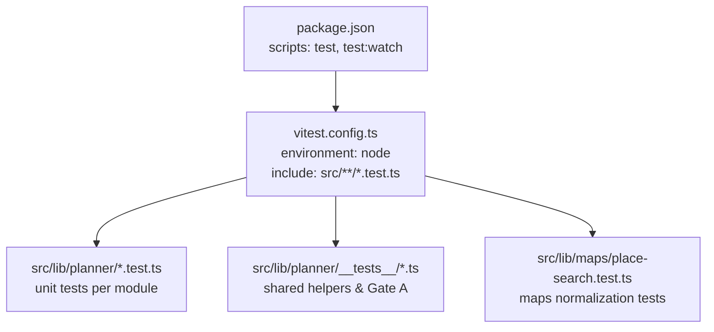
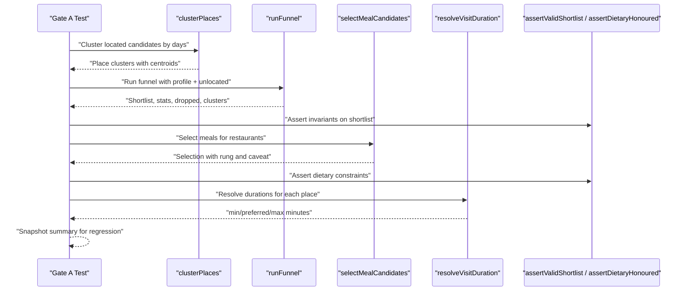
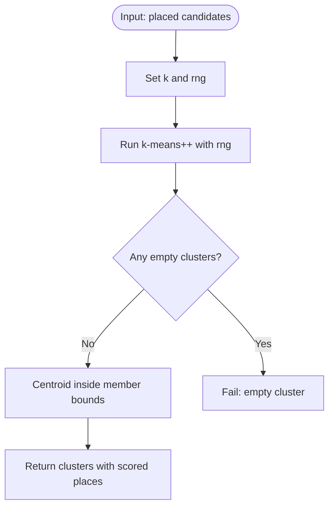
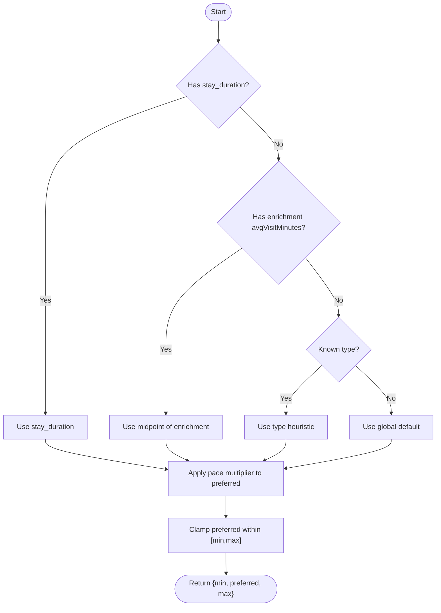
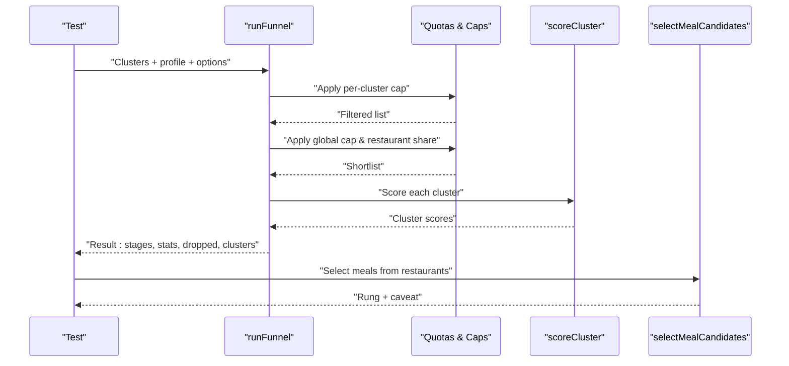
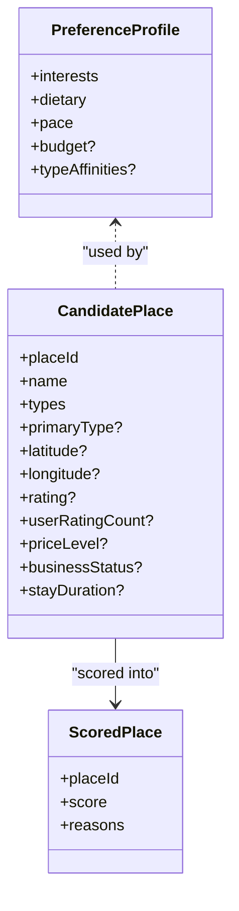
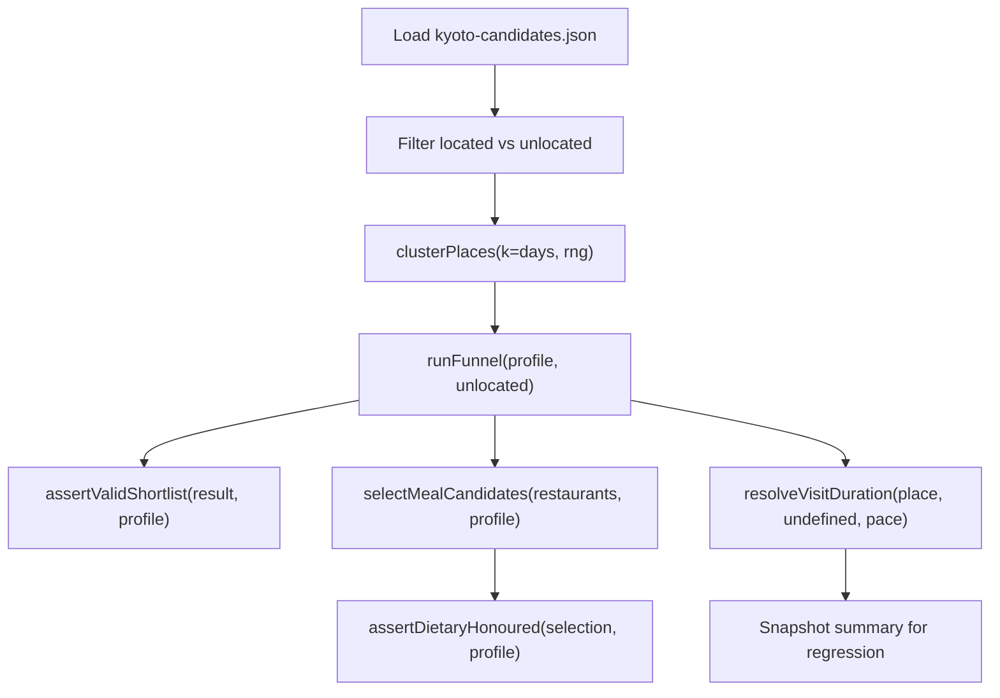
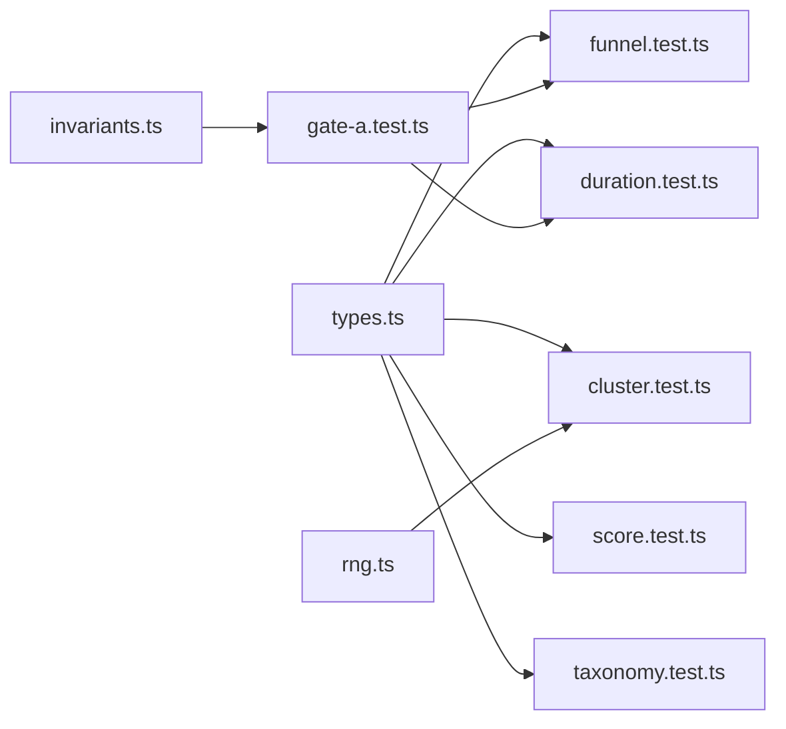

# Planner Testing Infrastructure

<cite>
**Referenced Files in This Document**
- [package.json](file://package.json)
- [vitest.config.ts](file://vitest.config.ts)
- [types.ts](file://src/lib/planner/types.ts)
- [cluster.test.ts](file://src/lib/planner/cluster.test.ts)
- [duration.test.ts](file://src/lib/planner/duration.test.ts)
- [funnel.test.ts](file://src/lib/planner/funnel.test.ts)
- [score.test.ts](file://src/lib/planner/score.test.ts)
- [taxonomy.test.ts](file://src/lib/planner/taxonomy.test.ts)
- [gate-a.test.ts](file://src/lib/planner/__tests__/gate-a.test.ts)
- [invariants.ts](file://src/lib/planner/__tests__/invariants.ts)
- [rng.ts](file://src/lib/planner/__tests__/rng.ts)
- [place-search.test.ts](file://src/lib/maps/place-search.test.ts)
</cite>

## Table of Contents
1. Introduction
2. Project Structure
3. Core Components
4. Architecture Overview
5. Detailed Component Analysis
6. Dependency Analysis
7. Performance Considerations
8. Troubleshooting Guide
9. Conclusion

## Introduction
This document describes the testing infrastructure for the planner subsystem that personalizes travel itineraries. It focuses on how tests validate clustering, scoring, funneling, dietary and budget constraints, visit duration resolution, taxonomy bridging, and end-to-end deterministic runs over a realistic candidate set. The goal is to make the system’s guarantees explicit, reproducible, and easy to extend as new pipeline stages are added.

## Project Structure
The planner tests live under src/lib/planner and are executed by Vitest with Node environment. A small configuration file wires path aliases via vite-tsconfig-paths and restricts test discovery to .test.ts files. The package scripts expose test commands for running and watching tests.

**Diagram sources**
- [package.json:5-12](file://package.json#L5-L12)
- [vitest.config.ts:1-10](file://vitest.config.ts#L1-L10)

**Section sources**
- [package.json:5-12](file://package.json#L5-L12)
- [vitest.config.ts:1-10](file://vitest.config.ts#L1-L10)

## Core Components
- Deterministic PRNG: A seeded random number generator ensures k-means clustering and other randomized steps are reproducible across runs and snapshots.
- Invariant suite: Cross-cutting assertions enforce system-wide guarantees (e.g., no overlaps, every dropped place has a reason, dietary constraints honored).
- Module-level tests: Each planner component has focused tests covering its contract, edge cases, and invariants.
- End-to-end Gate A: A full offline run over a realistic fixture validates clustering, funneling, meal selection, and durations together.

Key responsibilities:
- types.ts defines shared domain shapes used by tests and implementations (PreferenceProfile, CandidatePlace, SchedulerOptions, PlaceEnrichment).
- rng.ts provides mulberry32 for deterministic randomness.
- invariants.ts centralizes cross-cutting checks reused by Gate A and other suites.

**Section sources**
- [rng.ts:1-16](file://src/lib/planner/__tests__/rng.ts#L1-L16)
- [invariants.ts:1-132](file://src/lib/planner/__tests__/invariants.ts#L1-L132)
- [types.ts:1-93](file://src/lib/planner/types.ts#L1-L93)

## Architecture Overview
The planner pipeline tested here consists of:
- Clustering: Group nearby candidates into day-sized clusters using k-means with an injected RNG.
- Funnel: Apply filters, quotas, and scoring to produce a shortlist grouped by cluster.
- Meal selection: Resolve dietary needs through a degradation ladder with caveats when necessary.
- Duration resolution: Infer visit durations from enrichment, type heuristics, and pace multipliers.
- Gate A: Orchestrates the above stages over a realistic fixture and asserts invariants and snapshot stability.

**Diagram sources**
- [gate-a.test.ts:47-52](file://src/lib/planner/__tests__/gate-a.test.ts#L47-L52)
- [gate-a.test.ts:74-155](file://src/lib/planner/__tests__/gate-a.test.ts#L74-L155)
- [gate-a.test.ts:157-215](file://src/lib/planner/__tests__/gate-a.test.ts#L157-L215)
- [invariants.ts:37-111](file://src/lib/planner/__tests__/invariants.ts#L37-L111)

## Detailed Component Analysis

### Cluster Tests
Focus:
- Correctly separates geographic blobs into distinct clusters.
- Determinism given a fixed seed.
- Robustness for k > n, empty inputs, missing coordinates, low iteration caps.
- Centroid within bounding box and label slot presence.

**Diagram sources**
- [cluster.test.ts:49-152](file://src/lib/planner/cluster.test.ts#L49-L152)

**Section sources**
- [cluster.test.ts:1-153](file://src/lib/planner/cluster.test.ts#L1-L153)

### Duration Resolution Tests
Focus:
- Ladder precedence: stay_duration > enrichment > type heuristic > default.
- Pace multipliers apply only to preferred; min/max remain stable.
- Clamping preferred within enrichment range.
- Fallback behavior for unknown or empty types.

**Diagram sources**
- [duration.test.ts:24-120](file://src/lib/planner/duration.test.ts#L24-L120)

**Section sources**
- [duration.test.ts:1-121](file://src/lib/planner/duration.test.ts#L1-L121)

### Funnel Tests
Focus:
- Per-cluster cap prevents dominance by dense districts.
- Global cap and restaurant share quotas.
- Cuisine duplication limits.
- Stats consistency with stage lengths.
- Cluster grouping integrity and ordering.
- Serendipity slot selection rules.
- Dietary degradation ladder and budget widening.

**Diagram sources**
- [funnel.test.ts:51-175](file://src/lib/planner/funnel.test.ts#L51-L175)
- [funnel.test.ts:177-272](file://src/lib/planner/funnel.test.ts#L177-L272)
- [funnel.test.ts:380-509](file://src/lib/planner/funnel.test.ts#L380-L509)

**Section sources**
- [funnel.test.ts:1-510](file://src/lib/planner/funnel.test.ts#L1-L510)

### Scoring Tests
Focus:
- Bayesian quality score balances rating and review count.
- Affinity reflects interest overlap without zeroing out non-matches.
- Price fit treats unknown priceLevel neutrally and penalizes over-budget symmetrically.
- Hard filters remove closed places, enforce dietary constraints for meals, and respect budget.
- Match reasons always present for survivors.

**Diagram sources**
- [types.ts:27-73](file://src/lib/planner/types.ts#L27-L73)
- [score.test.ts:1-180](file://src/lib/planner/score.test.ts#L1-L180)

**Section sources**
- [score.test.ts:1-180](file://src/lib/planner/score.test.ts#L1-L180)

### Taxonomy Bridge Tests
Focus:
- Every Interest maps to at least one Google type and query string.
- Query interpolation replaces city placeholder.
- Deduplication of overlapping types across interests.
- Dietary bridge maps known diets to relevant restaurant types.

**Section sources**
- [taxonomy.test.ts:1-80](file://src/lib/planner/taxonomy.test.ts#L1-L80)

### Maps Normalization Tests
Focus:
- Mapping Google priceLevel strings to numeric ordinals.
- Ensuring field masks include needed fields.
- Persisted payload preserves priceLevel semantics.

**Section sources**
- [place-search.test.ts:1-69](file://src/lib/maps/place-search.test.ts#L1-L69)

### Gate A — End-to-End Pipeline
Focus:
- Runs clustering, funneling, meal selection, and duration resolution over a realistic Kyoto candidate set.
- Asserts monotonic narrowing, correct drop reasons, geographic coherence, reproducibility, and profile sensitivity.
- Validates dietary ladder outcomes and duration sanity.
- Snapshot-based regression guard for the overall plan shape.

**Diagram sources**
- [gate-a.test.ts:47-52](file://src/lib/planner/__tests__/gate-a.test.ts#L47-L52)
- [gate-a.test.ts:74-155](file://src/lib/planner/__tests__/gate-a.test.ts#L74-L155)
- [gate-a.test.ts:157-215](file://src/lib/planner/__tests__/gate-a.test.ts#L157-L215)

**Section sources**
- [gate-a.test.ts:1-216](file://src/lib/planner/__tests__/gate-a.test.ts#L1-L216)

## Dependency Analysis
- Tests depend on shared types from types.ts to construct fixtures and assert shapes.
- Gate A composes cluster, funnel, duration, and invariant utilities.
- rng.ts is injected into clustering to ensure determinism.
- invariants.ts is consumed by Gate A to enforce cross-cutting guarantees.

**Diagram sources**
- [types.ts:1-93](file://src/lib/planner/types.ts#L1-L93)
- [rng.ts:1-16](file://src/lib/planner/__tests__/rng.ts#L1-L16)
- [invariants.ts:1-132](file://src/lib/planner/__tests__/invariants.ts#L1-L132)
- [gate-a.test.ts:1-216](file://src/lib/planner/__tests__/gate-a.test.ts#L1-L216)

**Section sources**
- [types.ts:1-93](file://src/lib/planner/types.ts#L1-L93)
- [gate-a.test.ts:1-216](file://src/lib/planner/__tests__/gate-a.test.ts#L1-L216)

## Performance Considerations
- Deterministic PRNG avoids nondeterministic flakiness and enables fast, repeatable snapshot comparisons.
- Unit tests target small, isolated behaviors to keep feedback loops tight.
- Gate A exercises the full pipeline but uses a fixed, modest fixture size to keep runtime low while still validating interactions.
- Quota and cap logic in funnel tests ensures scalability concerns (e.g., dominant clusters) are caught early.

[No sources needed since this section provides general guidance]

## Troubleshooting Guide
Common issues and where to look:
- Non-deterministic failures: Ensure clustering calls use an injected rng with a fixed seed; verify rng usage in cluster tests and Gate A.
- Missing drop reasons: Confirm every non-surviving candidate appears in dropped with a non-empty reason; see funnel and Gate A assertions.
- Dietary violations: Verify rung selection and caveat flags; check selectMealCandidates behavior and assertDietaryHonoured.
- Budget mismatches: Validate hard filters and widenBudget behavior; confirm priceLevel handling and neutral unknown pricing.
- Snapshot drift: If Gate A snapshot fails, inspect changes to scoring, quotas, or clustering; update only after verifying correctness.

**Section sources**
- [funnel.test.ts:322-378](file://src/lib/planner/funnel.test.ts#L322-L378)
- [gate-a.test.ts:91-101](file://src/lib/planner/__tests__/gate-a.test.ts#L91-L101)
- [invariants.ts:96-111](file://src/lib/planner/__tests__/invariants.ts#L96-L111)
- [score.test.ts:103-149](file://src/lib/planner/score.test.ts#L103-L149)

## Conclusion
The planner testing infrastructure combines deterministic unit tests, cross-cutting invariants, and a compact end-to-end Gate A run to provide strong confidence in the personalization pipeline. By enforcing clear contracts around clustering, scoring, quotas, dietary constraints, and duration resolution, the suite supports safe refactoring and steady growth as new stages are introduced.

[No sources needed since this section summarizes without analyzing specific files]