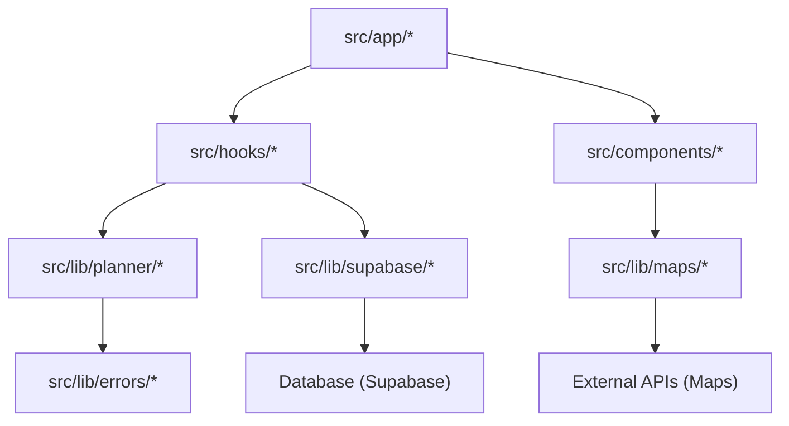
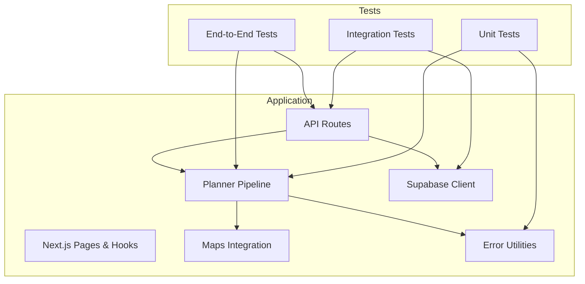
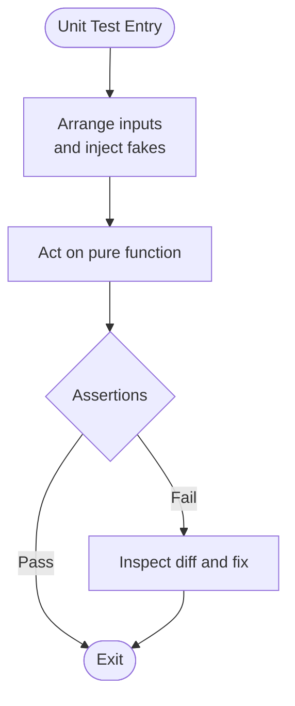
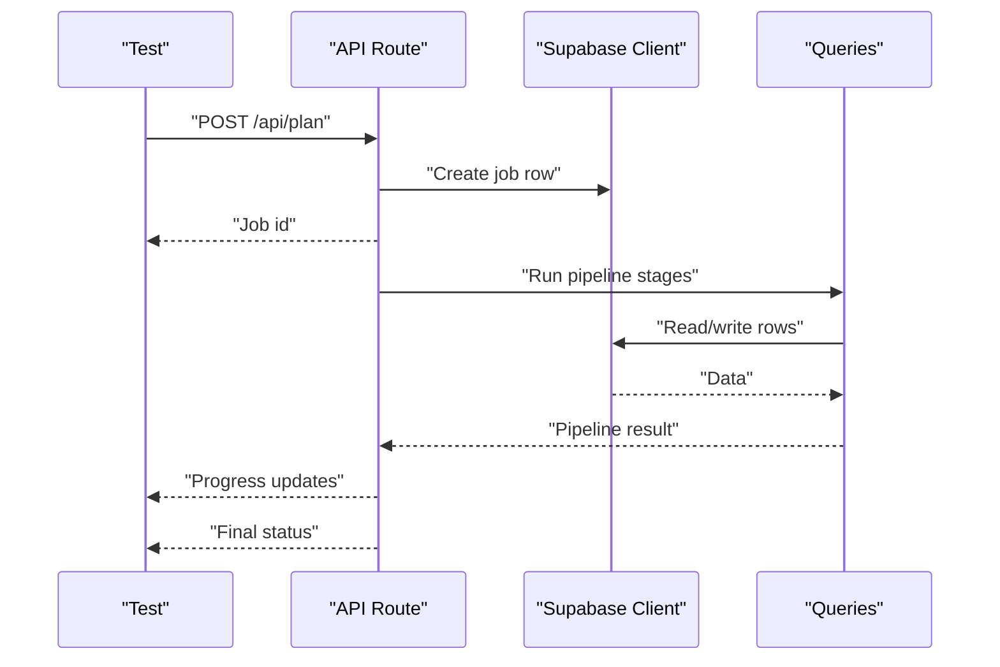
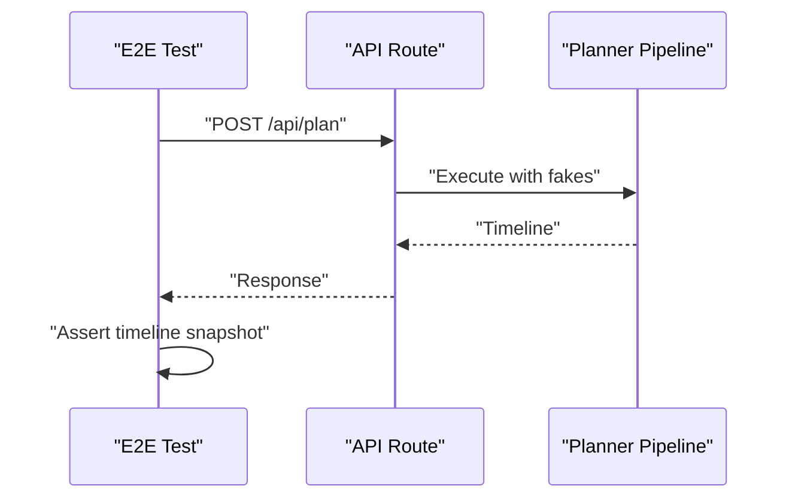
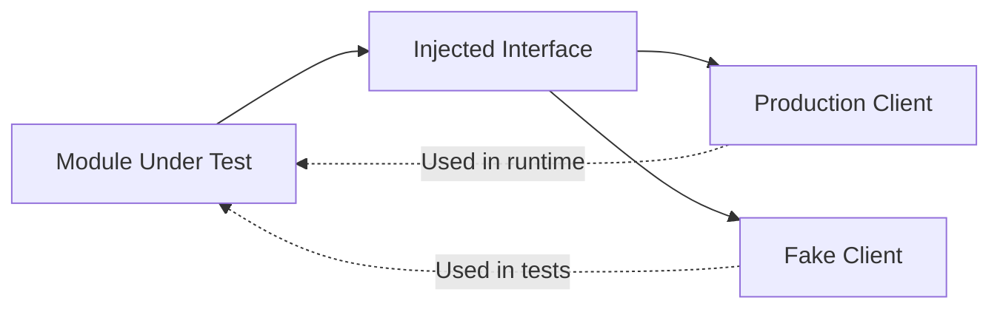
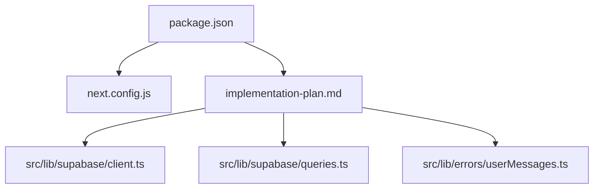

# Testing Strategy

<cite>
**Referenced Files in This Document**
- [package.json](file://package.json)
- [next.config.js](file://next.config.js)
- [implementation-plan.md](file://docs/implementation-plan.md)
- [client.ts](file://src/lib/supabase/client.ts)
- [queries.ts](file://src/lib/supabase/queries.ts)
- [userMessages.ts](file://src/lib/errors/userMessages.ts)
</cite>

## Table of Contents
1. Introduction
2. Project Structure
3. Core Components
4. Architecture Overview
5. Detailed Component Analysis
6. Dependency Analysis
7. Performance Considerations
8. Troubleshooting Guide
9. Conclusion
10. Appendices

## Introduction
This document defines Argo’s testing strategy and implementation plan for the Next.js application. It covers unit, integration, and end-to-end testing approaches; mocking strategies for external dependencies; test data management; continuous integration setup; and guidance for performance, accessibility, and cross-browser testing. The plan is designed to be practical for a fast-moving project while ensuring reliability across pure logic, API boundaries, and user workflows.

The repository currently has no test runner configured. The recommended approach is to adopt Vitest with TypeScript path aliases, organize tests next to their modules, and use fixtures for shared test data. External services (Google Maps, Anthropic, Supabase) are tested via injected clients or fakes rather than live calls.

**Section sources**
- [implementation-plan.md:67-105](file://docs/implementation-plan.md#L67-L105)

## Project Structure
Argo is a Next.js app with feature-oriented directories under src/. The testing strategy aligns with this structure:
- Unit tests sit beside source files using the .test.ts suffix.
- Fixtures live in __fixtures__ folders adjacent to the module they support.
- Integration tests target database and API layers with environment-based gating.
- End-to-end tests exercise full pipelines with recorded responses and stubbed LLMs.

[No sources needed since this diagram shows conceptual workflow, not actual code structure]

**Section sources**
- [package.json:1-45](file://package.json#L1-L45)
- [next.config.js:1-18](file://next.config.js#L1-L18)

## Core Components
This section outlines the core testing components and how they fit into Argo’s architecture.

- Test runner and configuration
  - Use Vitest with Node environment and Vite path alias resolution.
  - Include pattern targets all .test.ts files under src/.
  - Provide scripts for running tests and watch mode.

- Unit testing focus
  - Pure functions in planner logic (scoring, clustering, funneling, packing).
  - Utility helpers and error mappers.
  - Deterministic behavior by injecting randomness and time.

- Integration testing focus
  - Database schema and queries against a real or ephemeral database.
  - API route handlers that orchestrate pipeline stages with injected fakes.

- End-to-end testing focus
  - Golden snapshot tests over recorded provider responses and fixed LLM outputs.
  - Zero-network assertions to ensure determinism.

**Section sources**
- [implementation-plan.md:67-105](file://docs/implementation-plan.md#L67-L105)
- [implementation-plan.md:389-403](file://docs/implementation-plan.md#L389-L403)
- [implementation-plan.md:629-645](file://docs/implementation-plan.md#L629-L645)

## Architecture Overview
The testing architecture mirrors the runtime architecture: pure logic is isolated from I/O through dependency injection. Tests assert on contracts and side effects without depending on external systems.

[No sources needed since this diagram shows conceptual workflow, not actual code structure]

## Detailed Component Analysis

### Unit Testing Strategy
- Scope
  - Planner algorithms: scoring, clustering, funneling, duration resolution, packing, validation.
  - Utilities: error message mapping, map normalization helpers.
- Principles
  - Inject randomness and time to avoid flakiness.
  - Keep tests deterministic and fast.
  - Prefer comparisons over magic numbers where possible.
- Examples
  - Price level normalization and field mask integrity.
  - Score monotonicity and hard filter guarantees.
  - Cluster stability with seeded RNG.
  - Duration ladder precedence and pace multipliers.
  - Packer constraints: anchors, travel mode thresholds, budget degradation order.
  - Error mapper friendly messages for auth errors.

[No sources needed since this diagram shows conceptual workflow, not actual code structure]

**Section sources**
- [implementation-plan.md:106-138](file://docs/implementation-plan.md#L106-L138)
- [implementation-plan.md:140-165](file://docs/implementation-plan.md#L140-L165)
- [implementation-plan.md:168-219](file://docs/implementation-plan.md#L168-L219)
- [implementation-plan.md:222-244](file://docs/implementation-plan.md#L222-L244)
- [implementation-plan.md:247-292](file://docs/implementation-plan.md#L247-L292)
- [implementation-plan.md:295-311](file://docs/implementation-plan.md#L295-L311)
- [implementation-plan.md:314-365](file://docs/implementation-plan.md#L314-L365)
- [implementation-plan.md:368-386](file://docs/implementation-plan.md#L368-L386)
- [userMessages.ts:1-11](file://src/lib/errors/userMessages.ts#L1-L11)

### Integration Testing Strategy
- Scope
  - Database schema and migrations.
  - Query layer interactions with Supabase client.
  - API route handlers orchestrating the planner pipeline with injected fakes.
- Principles
  - Gate integration tests behind environment variables.
  - Use ephemeral databases for migration and round-trip checks.
  - Validate response shapes consumed by hooks and UI.

**Diagram sources**
- [client.ts:1-8](file://src/lib/supabase/client.ts#L1-L8)
- [queries.ts:1-46](file://src/lib/supabase/queries.ts#L1-L46)

**Section sources**
- [implementation-plan.md:405-433](file://docs/implementation-plan.md#L405-L433)
- [implementation-plan.md:582-606](file://docs/implementation-plan.md#L582-L606)
- [client.ts:1-8](file://src/lib/supabase/client.ts#L1-L8)
- [queries.ts:1-46](file://src/lib/supabase/queries.ts#L1-L46)

### End-to-End Testing Strategy
- Scope
  - Full pipeline run with recorded Google responses and a stubbed LLM.
  - Snapshot the resulting timeline to detect regressions.
- Principles
  - Zero network calls during the run.
  - Deterministic output given fixed inputs.
  - Reuse invariant suite to validate structural correctness.

**Section sources**
- [implementation-plan.md:629-645](file://docs/implementation-plan.md#L629-L645)
- [implementation-plan.md:648-666](file://docs/implementation-plan.md#L648-L666)

### Mocking Strategies for External Dependencies
- External clients are injected as parameters with production defaults.
- Tests pass fakes for:
  - Google Maps client and fetch.
  - Anthropic SDK client.
  - Database client and query functions.
- Assertions cover request payloads, caching decisions, and response handling without relying on service quality.

[No sources needed since this diagram shows conceptual workflow, not actual code structure]

**Section sources**
- [implementation-plan.md:35-63](file://docs/implementation-plan.md#L35-L63)
- [implementation-plan.md:436-476](file://docs/implementation-plan.md#L436-L476)
- [implementation-plan.md:496-523](file://docs/implementation-plan.md#L496-L523)
- [implementation-plan.md:526-553](file://docs/implementation-plan.md#L526-L553)
- [implementation-plan.md:556-579](file://docs/implementation-plan.md#L556-L579)

### Test Data Management
- Place fixtures in __fixtures__ folders next to the module they support.
- Use golden snapshots for full pipeline runs.
- Maintain small, focused fixtures for unit tests (e.g., candidate sets, enriched places).
- Avoid large JSON blobs in unit tests; prefer minimal inputs that trigger specific behaviors.

**Section sources**
- [implementation-plan.md:101-103](file://docs/implementation-plan.md#L101-L103)
- [implementation-plan.md:389-403](file://docs/implementation-plan.md#L389-L403)
- [implementation-plan.md:629-645](file://docs/implementation-plan.md#L629-L645)

### Continuous Integration Setup
- Add scripts to package.json for running tests and type checking.
- Configure CI to:
  - Install dependencies.
  - Run type-check first.
  - Run unit tests.
  - Run integration tests only when required environment variables are set.
  - Fail on any test failure or type error.

**Section sources**
- [package.json:1-45](file://package.json#L1-L45)
- [implementation-plan.md:67-105](file://docs/implementation-plan.md#L67-L105)

### Writing Effective Tests
- Name tests as specifications that read like requirements.
- Group related assertions logically within each file.
- Prefer comparisons and invariants over absolute values.
- Ensure every stage produces stats or artifacts that can be asserted.
- Keep tests independent and deterministic.

**Section sources**
- [implementation-plan.md:12-26](file://docs/implementation-plan.md#L12-L26)
- [implementation-plan.md:168-219](file://docs/implementation-plan.md#L168-L219)
- [implementation-plan.md:247-292](file://docs/implementation-plan.md#L247-L292)
- [implementation-plan.md:314-365](file://docs/implementation-plan.md#L314-L365)

### Debugging Test Failures
- Use readable diffs provided by the test runner.
- Isolate failures by running targeted subsets of tests.
- For integration tests, verify environment variables and database state.
- For e2e tests, confirm zero network calls and stable snapshots.

**Section sources**
- [implementation-plan.md:67-105](file://docs/implementation-plan.md#L67-L105)
- [implementation-plan.md:629-645](file://docs/implementation-plan.md#L629-L645)

### Maintaining Test Coverage
- Focus coverage on high-value areas: scoring, funneling, packing, retrieval, enrichment, assignment, narration, and API routes.
- Use invariant suites to enforce cross-cutting guarantees.
- Treat skipped integration tests as nightly checks unless required.

**Section sources**
- [implementation-plan.md:648-666](file://docs/implementation-plan.md#L648-L666)
- [implementation-plan.md:405-433](file://docs/implementation-plan.md#L405-L433)

### Performance Testing
- Measure planner algorithm performance with synthetic datasets.
- Validate caching effectiveness (zero fetches on cache hits).
- Ensure packer respects budgets and does not spin indefinitely.

**Section sources**
- [implementation-plan.md:436-476](file://docs/implementation-plan.md#L436-L476)
- [implementation-plan.md:314-365](file://docs/implementation-plan.md#L314-L365)

### Accessibility Testing
- Introduce basic accessibility checks for critical UI flows.
- Validate keyboard navigation and screen reader labels for key components.
- Use automated tools in CI to catch regressions early.

[No sources needed since this section provides general guidance]

### Cross-Browser Testing
- Verify core flows in supported browsers.
- Focus on maps rendering and form interactions.
- Use headless browsers in CI for consistent results.

[No sources needed since this section provides general guidance]

## Dependency Analysis
The following diagram highlights key runtime and test-time dependencies relevant to testing.

**Diagram sources**
- [package.json:1-45](file://package.json#L1-L45)
- [next.config.js:1-18](file://next.config.js#L1-L18)
- [implementation-plan.md:67-105](file://docs/implementation-plan.md#L67-L105)
- [client.ts:1-8](file://src/lib/supabase/client.ts#L1-L8)
- [queries.ts:1-46](file://src/lib/supabase/queries.ts#L1-L46)
- [userMessages.ts:1-11](file://src/lib/errors/userMessages.ts#L1-L11)

**Section sources**
- [package.json:1-45](file://package.json#L1-L45)
- [next.config.js:1-18](file://next.config.js#L1-L18)
- [implementation-plan.md:67-105](file://docs/implementation-plan.md#L67-L105)
- [client.ts:1-8](file://src/lib/supabase/client.ts#L1-L8)
- [queries.ts:1-46](file://src/lib/supabase/queries.ts#L1-L46)
- [userMessages.ts:1-11](file://src/lib/errors/userMessages.ts#L1-L11)

## Performance Considerations
- Keep unit tests fast and deterministic; avoid network and heavy computations.
- Use seeded RNG and injected clocks to stabilize clustering and scheduling tests.
- Validate caching behavior rigorously to prevent unnecessary API calls.
- Profile packer and funnel stages with realistic datasets to ensure responsiveness.

[No sources needed since this section provides general guidance]

## Troubleshooting Guide
Common issues and resolutions:
- Missing test script: add test commands to package.json and configure Vitest.
- Flaky tests due to randomness/time: inject rng and now parameters.
- Integration tests failing due to missing env vars: gate them behind DATABASE_URL checks.
- E2E snapshot mismatches: update snapshots intentionally after verifying changes.

**Section sources**
- [implementation-plan.md:67-105](file://docs/implementation-plan.md#L67-L105)
- [implementation-plan.md:405-433](file://docs/implementation-plan.md#L405-L433)
- [implementation-plan.md:629-645](file://docs/implementation-plan.md#L629-L645)

## Conclusion
Argo’s testing strategy centers on deterministic unit tests for pure logic, robust integration tests for API and database boundaries, and golden end-to-end tests for full pipeline stability. By injecting external dependencies, organizing tests alongside modules, and enforcing invariants, the team can maintain confidence as the system evolves. Adopting the recommended setup will enable rapid iteration while preventing regressions in critical planning and user-facing features.

[No sources needed since this section summarizes without analyzing specific files]

## Appendices

### Appendix A: Recommended Scripts and Configuration
- Add test scripts to package.json for running tests and watch mode.
- Create vitest.config.ts with Node environment and path alias support.
- Include include patterns for .test.ts files under src/.

**Section sources**
- [package.json:1-45](file://package.json#L1-L45)
- [implementation-plan.md:67-105](file://docs/implementation-plan.md#L67-L105)

### Appendix B: Invariant Suite Highlights
- No overlapping segments per day; contiguous timelines.
- Meal slots hold restaurant types.
- Places open during assigned windows.
- Day budgets respected.
- Output place_ids belong to retrieved candidates.
- Dietary guarantees enforced; caveats present when applicable.
- Non-empty match reasons for activities.
- Dropped candidates carry reasons.

**Section sources**
- [implementation-plan.md:648-666](file://docs/implementation-plan.md#L648-L666)